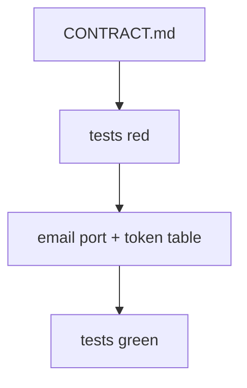

# Month 13 · Week 2 · Day 6
# Independent: Reset and Verify in Your App or a Lab Mini

**Program:** Full-Stack Mastery · 18 months  
**Phase:** 4 — Full-stack application engineering  
**Month index:** [../../README.md](../../README.md)  
**Week 2:** [1](day-01.md) · [2](day-02.md) · [3](day-03.md) · [4](day-04.md) · [5](day-05.md) · Day 6 (today) · [7](day-07.md)  
**Week rhythm today:** Independent implementation  
**Student state:** You can design hashed expiring tokens and test expiry. Today you **wire** reset + verify into **Project 7** or a **complete lab mini**. This textbook will **not** paste the product.  
**Study time:** 3–4 focused hours

Labs: `~\fullstack-lab\month-13\week-02\day-06\`. Product work stays in **your** repos.

---

## How to use this textbook

1. CONTRACT first (paths, statuses, generic messages, TTLs).  
2. Fake email port in tests.  
3. AI may review; it may not ship tokens for you.

---

## How to read this chapter

Week 2’s skill is **account recovery and inbox proof**, not a social-login clone.



**Wrong belief:** “I’ll skip verify and only do reset.”  
**Correct:** reset **is** sending a secret to an email. Verification is how that email became yours. If you skip verify, say so in AUTH.md as a **known gap**.

**Wrong belief:** “Independent day means clone Django allauth.”  
**Correct:** a small FastAPI slice you can explain.

---

## Today's contract

By the end of this day you will be able to:

1. Specify request/confirm verify and request/confirm reset.  
2. Implement them with hashed tokens and expiry.  
3. Cover unknown email generic success on **request**.  
4. Cover expired refuse on **confirm**.  
5. Keep tokens out of logs and Out models.

**Today's gate.** Closed-book:

> I have verify + reset (in product or mini) with hashed tokens, expiry tests, and a fake mail port. I did not paste Project 7 from a tutorial.

---

## Time box

| Block | Minutes | Work |
|---|---|---|
| A | 25 | CONTRACT.md |
| B | 40 | Red tests |
| C | 90 | Implement |
| D | 30 | curl.exe optional + docs |
| E | 15 | Recall |

---

# Block A — CONTRACT.md must include

1. Endpoints table.  
2. Generic strings (copy them into tests).  
3. TTLs: verify 24h, reset 30 min — or your numbers.  
4. Email port: “tests use a list; production env var for provider later.”  
5. Password policy on new password.  
6. Session revoke on successful reset: yes/no.  
7. Persistence: Postgres vs memory for the mini.

**Allowed mini noun:** **marina slips** users (email/password only).

**Forbidden:** implementing Google OAuth from a blog as today’s “verify.”

---

# Complete explanation (recap; other days closed)

Random `secrets.token_urlsafe`. Store hash. `purpose`. `expires_at`. `used_at`. argon2 for **passwords**. Generic request 200. Confirm fail generic. Dummy work optional on request for missing users (even a cheap hash) so timing is less chatty. Rate limit later.

```python
# email port in tests
mailbox: list[dict[str, str]] = []

def send_email(to: str, subject: str, body: str) -> None:
    mailbox.append({"to": to, "subject": subject, "body": body})
```

Do not put raw tokens in `body` in **production logs**. Tests may parse a dedicated `token` field on the fake, not by scraping a sentence.

Uvicorn: `uv run uvicorn main:app --reload --host 127.0.0.1 --port 8000`.  
`curl.exe` + JSON files.

---

# Block B — Tests first

Minimum:

- register → request verify → confirm verify → flag set  
- request verify unknown email: 200 generic, no throw  
- expired verify token refused  
- reset request generic  
- reset confirm changes password  
- expired reset refused, old password still works  
- UserOut has no hashes/tokens  

`RED.txt` from first pytest.

---

# Block C — Implement

Product **or** `day-06/mini`. Depth beats OAuth.

If Postgres: Alembic migration for token table. If memory: dicts, honest `RAM.txt`.

```powershell
cd ~\fullstack-lab
mkdir month-13\week-02\day-06\mini -Force
```

---

# Block D — Manual

If HTTP is up:

```powershell
curl.exe -s -D - -X POST http://127.0.0.1:8000/reset/request -H "Content-Type: application/json" --data-binary @req.json
```

Expect 200 even for a random email. Write `CURL.txt`. Do not spam a real SMTP.

README: how to test without sending mail.

---

# Block E — Recall

1. Why two purposes.  
2. Where raw token exists (mail port once).  
3. What AUTH.md still needs.

---

## Quality bar

CONTRACT that a classmate could implement. Tests that fail if expiry is removed. No tokens in git.

**Stretch:** revoke sessions on reset. **Stretch:** resend verify invalidates old token.

```powershell
cd ~\fullstack-lab
git add month-13
git commit -m "Month 13 Day 6: verify and reset independent slice."
```

Commit product repo separately if you touched it.

---

## Definition of done

- [ ] CONTRACT.md  
- [ ] pytest: verify + reset + expiry  
- [ ] fake mail port  
- [ ] AUTH.md updated with reset/verify  
- [ ] Commit exists  

---

## Optional review links

- [OWASP Forgot Password](https://cheatsheetseries.owasp.org/cheatsheets/Forgot_Password_Cheat_Sheet.html)  
- [OWASP: Authentication](https://cheatsheetseries.owasp.org/cheatsheets/Authentication_Cheat_Sheet.html)

---

## Tomorrow

**Week review** including **2FA as a second factor concept** (TOTP idea, not a full product dump).

---

# Closing lecture — inbox proof and recovery

Verify proves the inbox. Reset uses the inbox.
Both use hashed expiring tokens. Both are generic on request.
Both refuse expiry in tests you own.

Product or marina mini. Not a Google clone.
Not a dump of the product into the textbook.

Email port is a function. Tests append. Production later.
Never log the token. Never store it raw.

If you only built reset, write the verify gap in AUTH.md
and still finish expiry tests for reset.

curl.exe for 200 on unknown email. That 200 is a feature.

---

## Recite-back checklist (close the editor, then tick)

Write `RECITE.txt` with one honest sentence per line.

- [ ] CONTRACT first  
- [ ] hashed tokens  
- [ ] two purposes  
- [ ] expiry tests  
- [ ] generic request  
- [ ] fake mailbox  
- [ ] AUTH.md updated  
- [ ] not OAuth paste  

If a line is mush, re-read this file only.

---

# Extra lecture — inbox proof and recovery

Verify proves the inbox. Reset uses the inbox. Both use hashed expiring tokens. Both are generic on **request**. Both refuse expiry in tests you own.

Product or marina mini. Not a Google clone. Not a dump of the product into the textbook.

Email port is a function. Tests append. Production later. Never log the token. Never store it raw.

If you only built reset, write the verify gap in AUTH.md and still finish expiry tests for reset.

```powershell
curl.exe -s -D - -X POST http://127.0.0.1:8000/reset/request -H "Content-Type: application/json" --data-binary @req.json
```

Expect **200** even for a random email. That 200 is a feature.

CONTRACT first. Red tests. Implement. `uv run pytest -q`. Bind `127.0.0.1`.

Stretch: revoke sessions on reset. Stretch: resend verify invalidates old token.

Lab: `~\fullstack-lab\month-13\week-02\day-06\`.

---

# CONTRACT.md must still include

1. Endpoint table.  
2. Generic strings copied into tests.  
3. TTLs: verify 24h, reset 30 min — or your numbers.  
4. Email port: tests use a list; production env later.  
5. Password policy on new password.  
6. Session revoke on successful reset: yes/no.  
7. Persistence: Postgres vs memory for the mini.

**Allowed mini noun:** marina slips. **Forbidden:** Google OAuth from a blog as today’s “verify.”

Minimum tests: register → verify → flag set; unknown email 200 generic; expired verify refused; reset request generic; reset confirm changes password; expired reset leaves old password; Out has no hashes/tokens.

`RED.txt` from first pytest if you wrote tests first.

If HTTP is up, `curl.exe` reset request for a random email → 200. README: how to test without sending mail.

Commit AUTH.md in Project 7 with reset/verify. Commit lab separately.

If verify is missing, AUTH.md says **gap**. Reset expiry tests still ship. Depth beats a social-login clone.

`CONTRACT.md` empty is a fail even if pytest is green on a gist you pasted. Specify first.

`~\fullstack-lab\month-13\week-02\day-06\mini` if not the product. Marina slips, not CRM.

Fake mailbox. Never log tokens. Never store raw. AUTH.md updated the same day.

`uv run pytest -q`. Bind `127.0.0.1` if you demo HTTP. `curl.exe` for generic 200 on unknown email.

CONTRACT first. Tests red. Implement. AUTH.md in the product repo the same day. That order is the independent-day bar.

If you pasted a gist, delete it and type the token consume yourself. Independent day is specification plus your code.

No OAuth clone. No product dump. Verify + reset + expiry tests.


