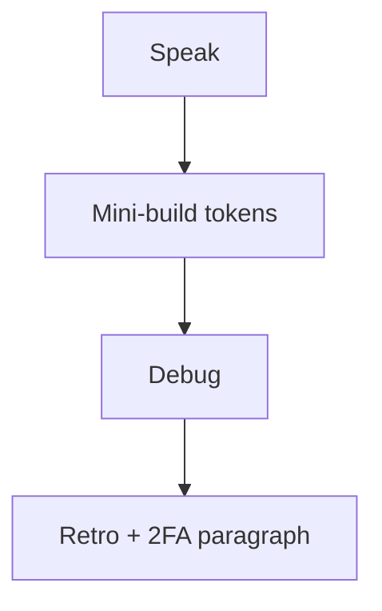

# Month 13 · Week 2 · Day 7
# Week Review — OAuth Concepts, Reset, Verify, and 2FA as an Idea

**Program:** Full-Stack Mastery · 18 months  
**Phase:** 4 — Full-stack application engineering  
**Month index:** [../../README.md](../../README.md)  
**Week 2:** [1](day-01.md) · [2](day-02.md) · [3](day-03.md) · [4](day-04.md) · [5](day-05.md) · [6](day-06.md) · Day 7 (today)  
**Week rhythm today:** Review, repair, plan Week 3  
**Student state:** You can explain OAuth roles, linking risks, hashed tokens, expiry tests. Today those ideas must still live in your head — from **this file**. **2FA** appears as a **concept**, not a dumped TOTP product.  
**Study time:** 3–4 focused hours

Do not start Week 3 because the calendar moved. XSS lessons on an app that emails plaintext reset tokens is two problems.

Work in `~\fullstack-lab\month-13\week-02\day-07\`. Mini-build is **not** Project 7’s domain.

---

## How to read this chapter

This is a **closed-book teaching day**. The synthesis **is** the Week 2 lesson.



Days 1–6 closed during mini-build. Repair from **this** recap.

---

## Week synthesis (the lesson, in this book)

**OAuth 2** delegates **authorization**. Roles: **resource owner**, **client**, **authorization server**, **resource server**. **OIDC** adds **authentication** (ID token / UserInfo). Authorization **code** is exchanged **on the server**. **Client secrets** are not `VITE_`. **state** and **PKCE** are defenses for the **flow**. You did **not** paste a Google quickstart as the week’s proof.

**Access vs refresh vs ID token:** API access; mint new access; identity for the client. Do not use an ID token as your FastAPI session substitute without a design. After OIDC, issue **your** Week 1 session.

**Linking:** do **not** auto-link local users because emails match. Store provider **`sub`**. Verification proves **inbox control**, not moral worth. Session ≠ verified.

**Reset / verify tokens:** `secrets.token_urlsafe`, **hash at rest**, **purpose**, **expires_at**, **used_at**, email **port** (fake list in tests). Request endpoints **generic**. Confirm refuses expiry (tests inject time). New password **argon2/bcrypt**. Never email the old password. Never log tokens.

**2FA (concept today):** a **second factor** is something besides the password — typically **TOTP** (an app generates a rotating code from a **shared secret**) or a WebAuthn key (later). Password stolen from a dump is not enough if 2FA is required. **Recovery codes** are secrets. Do **not** implement a full TOTP product dump today; write six honest sentences. SMS 2FA is weaker (SIM risks) — know the name, prefer TOTP/WebAuthn when you implement later.

**Wrong belief:** “OAuth replaces password hashing.”  
**Correct:** local passwords still hash. OAuth is another way to **start a session**.

**Wrong belief:** “2FA means I can store passwords in plaintext.”  
**Correct:** you still hash. Factors **stack**.

---

## Today's contract

**Today's gate.** Closed-book:

> I can teach OAuth roles, why auto-link is dangerous, hashed expiring tokens, and 2FA as a second factor idea. I built a token mini from this spec.

---

## Time box

| Block | Minutes | Work |
|---|---|---|
| 1 | 40 | Speak synthesis + 2FA |
| 2 | 55 | Mini-build |
| 3 | 30 | Debug |
| 4 | 20 | Review AUTH.md reset/verify |
| 5 | 20 | pytest; break expiry test; restore |
| 6 | 20 | Design: no auto-link |
| 7 | 20 | Retro + Week 3 plan |

---

# Complete explanation — account security you must still own

## 1. OAuth picture

Human → provider login → code → **your API** exchanges → **your session cookie**. Scopes least privilege. Redirect URI allowlist.

## 2. Tokens of **yours**

Verify and reset rows. Hash. TTL. UTC. Fake mailbox.

## 3. 2FA idea (TOTP)

TOTP: server stores a **secret** (protected like a password, often encrypted at rest later). User’s app and server compute the same time-based code. On login, after password verify, ask for the code. Backup codes hashed like passwords. **Do not** log codes. **Do not** paste a pyotp tutorial as the mini-build — a **paragraph** in `exam-01.md` is the 2FA proof unless you already had 2FA.

Enrollment is a **sensitive** moment: session must already be authenticated. An unauthorized person might **try** to add **their** TOTP to a victim. **Prevent:** only enable 2FA while logged in; confirm password again.

---

# Block 1 — Speak

Cover: four OAuth roles; ID vs access; auto-link; verify purpose; reset hash+expiry; TOTP in two sentences.

`exam-01.md` 20–30 lines including **2FA**.

---

# Block 2 — Mini-build

```powershell
cd ~\fullstack-lab
mkdir month-13\week-02\day-07\mini -Force
cd ~\fullstack-lab\month-13\week-02\day-07\mini
uv init --name lab-beacon-tokens
uv add fastapi uvicorn passlib argon2-cffi
uv add --dev pytest httpx
```

**Beacon keepers** — not Project 7.

| Method | Path | Rules |
|---|---|---|
| POST | `/register` | 201; create verify token; mailbox |
| POST | `/verify` | token; set verified; expiry fail |
| POST | `/reset/request` | generic 200 |
| POST | `/reset/confirm` | new password; expiry fail |

Tests: generic unknown reset request; expired verify; hashed storage (raw not in store values); no OAuth.

No TOTP implementation required in the mini.

---

# Block 3 — Debug

`exam-03-debug.md`:

**A.** Reset request returns 404 for unknown email.  
**B.** Verify token stored plaintext in the dict.  
**C.** Auto-link “because OIDC email matched.” What policy instead?  
**D.** SPA contains `VITE_GOOGLE_CLIENT_SECRET`.  
**E.** 2FA codes printed in application logs.

---

# Block 4 — AUTH.md

Reset/verify section present? 2FA “later” sentence? Gap in `GAP.txt`.

---

# Block 5 — Tests

Break expiry assert; fail; restore. `exam-05-fail.txt`.

---

# Block 6 — Design

`design.md`: why email match is not link. Ten lines.

---

# Block 7 — Retro

Weakest: OAuth vocab vs tokens vs 2FA idea. Week 3 is XSS/CSRF/injection **defense**.

## Debug keys

**A.** Enumeration. Generic 200.  
**B.** Hash at rest.  
**C.** No auto-link; explicit connect; store `sub`.  
**D.** Secret on server only.  
**E.** Never log factors.

---

```powershell
cd ~\fullstack-lab
git add month-13
git commit -m "Month 13 Week 2 review: beacon tokens mini and 2FA notes."
```

---

# Lecture: 2FA is a second lock, not a product dump

Students download a complete TOTP sample and cannot explain enrollment. This week’s bar is **tokens you wrote** plus **sentences** about a second factor.

SMS is a factor with known telecom risks. TOTP apps are the concept to name. WebAuthn is the stronger later path.

Recovery codes: hashed, one-time, shown **once**.

---

## Definition of done

- [ ] exam-01 includes 2FA concept  
- [ ] Mini pytest green  
- [ ] Debug A–E  
- [ ] AUTH.md gaps listed  
- [ ] No Google gist as the mini  

---

## Optional review links

- [oauth.net](https://oauth.net/2/)  
- [OWASP Forgot Password](https://cheatsheetseries.owasp.org/cheatsheets/Forgot_Password_Cheat_Sheet.html)  
- [OWASP: Multifactor](https://cheatsheetseries.owasp.org/cheatsheets/Multifactor_Authentication_Cheat_Sheet.html)

---

## Next week

[Week 3 Day 1 — XSS as a class of bug](../week-03/day-01.md). Encoding, CSP concept, no payloads.

---

# Closing lecture — delegation, inbox, second factor

OAuth roles. Server-side code exchange. No VITE secrets.
No auto-link. Verify inbox. Reset hashed tokens. Expiry tests.

2FA: another factor after the password. TOTP is the idea.
Do not dump a TOTP app in place of token tests.

Beacon mini. curl.exe optional. Bind 127.0.0.1.

If debug A still wants 404 for unknown email, rewrite A.
Week 3 is output encoding and CSRF — defense only.

---

## Recite-back checklist (close the editor, then tick)

Write `RECITE.txt` with one honest sentence per line.

- [ ] four OAuth roles  
- [ ] no auto-link  
- [ ] hashed expiring tokens  
- [ ] generic request  
- [ ] 2FA is a second factor  
- [ ] TOTP named not dumped  
- [ ] no client secret in Vite  
- [ ] mini not the product  

If a line is mush, re-read this file only.
