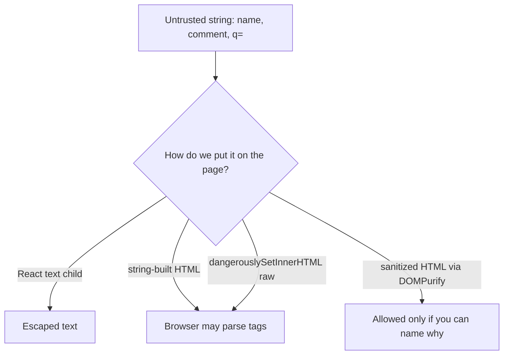
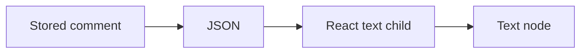

# Month 13 · Week 3 · Day 1
# XSS as a Class of Bug — Encode, CSP, Avoid Unsafe HTML

**Program:** Full-Stack Mastery · 18 months  
**Phase:** 4 — Full-stack application engineering  
**Month index:** [../../README.md](../../README.md)  
**Week 3:** Day 1 (today) · [2](day-02.md) · [3](day-03.md) · [4](day-04.md) · [5](day-05.md) · [6](day-06.md) · [7](day-07.md)  
**Week 2 review:** [../week-02/day-07.md](../week-02/day-07.md)  
**Week rhythm today:** Learn + type-along  
**Student state:** Week 2 gate passed. AUTH.md has hashing and tokens. Today: **cross-site scripting** as a **class of bug** and the **mitigations** you use. This book will **not** give you payloads to paste into a site.  
**Study time:** 3–4 focused hours

Labs: `~\fullstack-lab\month-13\week-03\day-01\`. Work on **your** Project 7 as **notes** about rendering — never paste the product.

---

## How to use this textbook

1. Read what XSS **is** (untrusted text treated as **code** in a page).  
2. Practice **safe React children** and **output encoding** in a tiny lab.  
3. Do **not** search for “XSS payloads” or paste event-handler strings into production fields.  
4. Optional review links are for later rechecking.

Defense only: we say what an unauthorized person might **try** so you can **stop it**.

---

## How to read this chapter

**XSS (cross-site scripting)** is a class of bug where **text from outside your trust boundary** is inserted into a page in a way the browser **interprets as HTML or JavaScript**. If that happens, their script runs **as the user** in **your origin**. They might **try** to act as the user (click UI, call your API from that page). **What prevents it:**

1. **Encode on output** (HTML entities) when you build HTML strings.  
2. Prefer **safe UI libraries**: **React text children are escaped** — `{userName}` is not HTML.  
3. **Avoid `dangerouslySetInnerHTML`** unless a **named sanitizer library** (for this course: **DOMPurify**) has cleaned HTML you **must** render.  
4. **Content Security Policy (CSP)** as a **backup net** (concept today).  
5. **HttpOnly** session cookies (Week 1) so `document.cookie` cannot read the session — **not** a complete XSS fix.



**Wrong belief:** “React is immune to XSS, so I never think about it.”  
**Correct:** React **escapes text children**. It does **not** save you if you assemble HTML strings, poke `innerHTML`, skip escaping in Markdown-to-HTML, or use `dangerouslySetInnerHTML` with unsanitized data.

**Wrong belief:** “I’ll test XSS by pasting a script tag from a cheat sheet into my live site.”  
**Correct:** you will prove **encoding** with **benign** strings like `<b>hello</b>` and assert the **page shows the characters**, not a bold word — or assert React state holds the string as text. No exploit payloads.

---

## Today's contract

By the end of this day you will be able to:

1. Define XSS in one sentence without a payload.  
2. Explain **output encoding** vs **input validation** (you need both; encoding is the last gate for HTML).  
3. Show that **React children** escape.  
4. Name **`dangerouslySetInnerHTML`** as something to **avoid** unless **DOMPurify** (or equivalent you can name) sanitized.  
5. Explain **CSP** as a policy of **which scripts may run** (concept).  
6. List where Project 7 renders user text (notes, not a dump).

**Today's gate.** Closed-book:

> Untrusted text must not become HTML/JS. React text is escaped. I do not use dangerouslySetInnerHTML for user content. CSP is a backup. I did not collect payloads.

---

## Time box

| Block | Minutes | Work |
|---|---|---|
| A | 50 | Theory |
| B | 55 | React or Python encode lab |
| C | 70 | Project 7 render audit notes |
| D | 20 | Git |
| E | 15 | Recall |

---

# Block A — Theory

## 1. Trust boundary

Anything a user, a query string, a webhook, or another team’s API can supply is **untrusted** until you **encode** it for the **context** you enter (HTML body, HTML attribute, URL, JS string — different contexts). This course’s default: **do not enter HTML/JS contexts with string concatenation**. Use React/text or a template that escapes.

**Stored XSS (class):** untrusted data saved in the DB, then shown to **other** users.  
**Reflected XSS (class):** untrusted data echoed from the request into the response HTML.  
**DOM XSS (class):** client-side script writes untrusted data into the DOM unsafely.

You need the **names**. You do not need a kit for each.

---

## 2. Output encoding

For HTML **text** context, encoding means the characters that **start tags** are stored/shown as **text**. Libraries do this. In Python you might use markup-safe / Jinja autoescape (if you ever emit HTML from FastAPI templates). In React, **default children** do it.

**Input validation** (Pydantic, Zod) still matters: length, type, charset. Validation is **not** a substitute for encoding. Someone will put punctuation in a **display name**.

**Wrong belief:** “I’ll strip all punctuation at register and XSS is gone.”  
**Correct:** you will punish real names and still miss a channel (Markdown, filenames, admin HTML).

---

## 3. React: the safe default and the trap

Safe:

```tsx
<p>{comment.body}</p>
```

Unsafe **class** (do not “try it” with a payload): taking a string from the API and assigning it as HTML.

```tsx
// AVOID for untrusted strings
<div dangerouslySetInnerHTML={{ __html: comment.body }} />
```

If you truly need rich text: store a **restricted** format you parse yourself, or sanitize with **DOMPurify** in a **single** helper you can grep, and still CSP.

`innerHTML` in vanilla JS is the same trap. Month 2 habits: `textContent` for untrusted text.

---

## 4. Markdown and “helpful” HTML

Markdown libraries often emit HTML. An unauthorized person might **try** to put HTML through Markdown. **Prevent:** a sanitizer after convert, or a library in **safe mode**, or **no raw HTML** in Markdown. Name the choice in notes.

---

## 5. CSP concept

**Content Security Policy** is an HTTP header (and/or meta) that tells the browser **which origins may run script**, whether **inline** script is allowed, etc. A strict CSP **reduces** what a successful injection can **do**. It does **not** replace encoding.

Course-honest:

- `default-src 'self'` is a starting idea.  
- Inline scripts and `eval` fight CSP — Vite/React need a **real** CSP design later (nonces). Do not cargo-cult a header that **breaks** the SPA today without reading.  
- Write `CSP-INTENT.md`: “I understand CSP as a backup; I will not enable a lying policy that allows everything.”

**Wrong belief:** “CSP means I can skip encoding.”  
**Correct:** defense in depth. Encoding first.

---

## 6. Cookies and XSS

HttpOnly: script cannot read the session cookie via `document.cookie`. Script can still **make requests** as the user from that page (the browser attaches cookies). So XSS remains **serious**. Week 1 flags help **theft of the cookie string**. They do not make XSS “fine.”

---

## 7. What you will not do today

- No alert popups as a “test.”  
- No cookie-stealing snippets.  
- No payload lists.  
- No attacking sites you do not own.

**Allowed proof:** render the six characters `<b>x</b>` as **visible text** (the angle brackets show). Screenshot or a test that `getByText` includes the brackets.

---

## 8. FastAPI JSON is not HTML

Returning JSON `{ "name": "<b>x</b>" }` is **not** XSS by itself. XSS happens when a **consumer** treats it as HTML. Your React must not. Your `/docs` is another HTML consumer — do not put untrusted HTML in OpenAPI descriptions.

---

# Block B — Type-along

Pick **one** track (both if early).

**Track React** (if Node is ready):

```powershell
cd ~\fullstack-lab
mkdir month-13\week-03\day-01\react-escape -Force
cd ~\fullstack-lab\month-13\week-03\day-01\react-escape
```

A tiny Vite React app **or** a single test file with `@testing-library/react` if you already have that habit. Render `{label}` where `label` is `"<b>safe</b>"`. Assert the **text** includes `<b>` and there is **no** bold element from that string.

If scaffolding Vite would eat the hour, **Track Python** is enough:

```powershell
cd ~\fullstack-lab
mkdir month-13\week-03\day-01 -Force
cd ~\fullstack-lab\month-13\week-03\day-01
uv init --name lab-html-escape
uv add --dev pytest
```

```python
import html

def page(name: str) -> str:
    return f"<p>Hello {html.escape(name)}</p>"
```

Test: `html.escape` turns `<` into an entity; the function output does **not** contain a raw `<b` tag from the user. Use input `"<b>x</b>"` **only** as a **harmless encoding check**, not as an exploit.

Write `ENCODE.txt`: encoding vs React children vs dangerouslySetInnerHTML.

Do **not** write a string that is a working script. The **benign tag-looking text** is enough.

---

# Block C — Independent

`PROJECT7-XSS.md`:

- List screens that show **user-typed** fields.  
- Confirm each is React text (or name the exception).  
- Grep plan: `dangerouslySetInnerHTML`, `innerHTML`, `eval(`. Record hits.  
- CSP intent: later / now / not yet — honest.

If you find `dangerouslySetInnerHTML` on user data, **remove** it or sanitize with **DOMPurify** and write why HTML is required.

```powershell
cd ~\fullstack-lab
git add month-13
git commit -m "Month 13 Day 1: XSS class encoding lab no payloads."
```

---

# Block E — Recall

1. XSS in one sentence.  
2. Why React `{x}` is usually safe.  
3. What `dangerouslySetInnerHTML` means.  
4. CSP as backup.  
5. Why HttpOnly is not enough.

---

## Office hours

**Encoded input in the database.** You can store raw Unicode; **encode at the HTML boundary**. Double-encoding makes ugly text.  
**Sanitized with a regex you wrote.** Do not. Use a library or do not render HTML.  
**Markdown with HTML on.** Turn HTML off or sanitize.



---

# Lecture: the lab is encoding, not a CTF

A university course that pastes exploit strings trains muscle memory to **attack**. This course trains **escape**, **safe children**, **grep for innerHTML**.

If a classmate asks for “just one payload to see it,” refuse and show the `<b>` **text** test instead.

---

## Definition of done

- [ ] Encoding or React test proves brackets stay text  
- [ ] `ENCODE.txt` / `PROJECT7-XSS.md`  
- [ ] No payload list in the repo  
- [ ] Commit exists  

---

## Optional review links

- [OWASP: XSS Prevention](https://cheatsheetseries.owasp.org/cheatsheets/Cross_Site_Scripting_Prevention_Cheat_Sheet.html)  
- [MDN: CSP](https://developer.mozilla.org/en-US/docs/Web/HTTP/Guides/CSP)  
- [React DOM: dangerouslySetInnerHTML](https://react.dev/reference/react-dom/components/common#dangerously-setting-the-inner-html)

---

## Tomorrow

**CSRF** as a class of bug — SameSite + CSRF **token concept** for unsafe methods if cookies authenticate. No attack walkthrough.

---

# Closing lecture — text is not HTML

XSS is untrusted text running as script in your origin.
React children escape. Templates must escape.
dangerouslySetInnerHTML is a named footgun.
DOMPurify if you truly need HTML. CSP is a net.

HttpOnly helps cookie theft, not XSS in full.
JSON APIs are safe until an HTML consumer lies.

Prove encoding with visible brackets, not with exploits.
Grep Project 7. Notes, not a product dump.

Lab: `~\fullstack-lab\month-13\week-03\day-01\`.
If ENCODE.txt contains a script sample, delete the sample.

---

## Recite-back checklist (close the editor, then tick)

Write `RECITE.txt` with one honest sentence per line.

- [ ] XSS defined without a payload  
- [ ] encode on output  
- [ ] React text escaped  
- [ ] avoid unsafe HTML  
- [ ] DOMPurify named if HTML needed  
- [ ] CSP concept  
- [ ] HttpOnly insufficient  
- [ ] Project 7 grep notes  

If a line is mush, re-read this file only.
