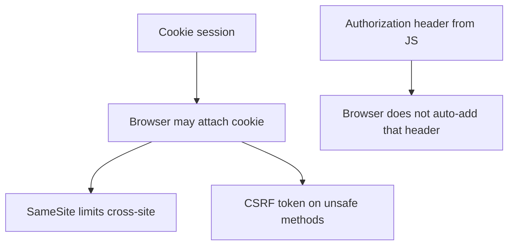
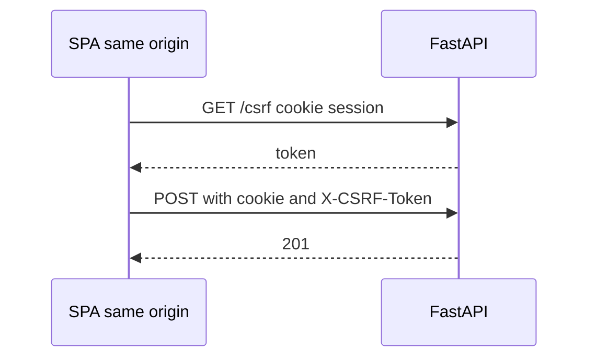

# Month 13 · Week 3 · Day 2
# CSRF as a Class of Bug — SameSite and the CSRF Token Concept

**Program:** Full-Stack Mastery · 18 months  
**Phase:** 4 — Full-stack application engineering  
**Month index:** [../../README.md](../../README.md)  
**Week 3:** [1](day-01.md) · Day 2 (today) · [3](day-03.md) · [4](day-04.md) · [5](day-05.md) · [6](day-06.md) · [7](day-07.md)  
**Week rhythm today:** Exercises + debugging  
**Student state:** You can explain XSS as a class. Today: **cross-site request forgery** — another class — and **cookie** defenses. No attack walkthrough. No foreign HTML form for you to host against a victim.  
**Study time:** 3–4 focused hours

Labs: `~\fullstack-lab\month-13\week-03\day-02\`.

---

## How to use this textbook

1. Read **why cookies are special** (the browser **attaches** them).  
2. Write policy for Project 7: SameSite + when a **CSRF token** is required.  
3. Do not build a “click this to transfer money” demo aimed at a real user.

---

## How to read this chapter

If your session proof is a **cookie**, the browser will **send it** on requests that match the cookie’s rules — including some requests **started by another site**. **CSRF** is the class of bug where an unauthorized **other origin** might **try** to make the victim’s browser send a **state-changing** request (POST/PUT/PATCH/DELETE) **with the victim’s cookies attached**. **What prevents it:**

1. **SameSite=Lax or Strict** on the session cookie (Week 1 Day 4) — blocks many **cross-site** POSTs from attaching the cookie.  
2. **CSRF token:** a secret the **real app** can send (header or form field) that a **foreign** page should **not** be able to read (same-origin policy). The API **requires** that token on **unsafe** methods.  
3. **Prefer JSON APIs** with a custom header your SPA always sets (`X-Requested-With` or the CSRF header) — still combine with SameSite.  
4. **Re-auth** for extremely sensitive actions (change email, disable 2FA).  
5. If you use **Bearer tokens in a header** (not cookies), classic CSRF is **weaker** because the browser does **not** auto-attach `Authorization`. XSS then becomes the bigger theft story.



**Wrong belief:** “HttpOnly prevents CSRF.”  
**Correct:** HttpOnly prevents **JavaScript reading** the cookie. CSRF does not need to **read** it; it needs the browser to **send** it.

**Wrong belief:** “I’ll understand CSRF by performing it on a classmate.”  
**Correct:** you will write **mitigations** and a **policy**. You will not walk through an exploit.

---

## Today's contract

By the end of this day you will be able to:

1. Define CSRF in one paragraph **without** a recipe.  
2. Explain why **cookie** auth needs extra CSRF thought.  
3. Name **SameSite** as the first cookie control.  
4. Explain a **CSRF token** conceptually (unpredictable, session-bound or double-submit, checked on POST).  
5. Say **GET must stay safe** (no state change).  
6. Write Project 7’s CSRF plan in notes.

**Today's gate.** Closed-book:

> Cookie-authenticated unsafe methods need SameSite and usually a CSRF token (or a carefully designed same-origin SPA). GET does not mutate. I did not practice forging requests against a victim.

---

## Time box

| Block | Minutes | Work |
|---|---|---|
| A | 50 | Theory |
| B | 50 | Policy + optional FastAPI CSRF header sketch |
| C | 70 | Project 7 notes + debug beliefs |
| D | 20 | Git |
| E | 15 | Recall |

---

# Block A — Theory

## 1. Cookies vs headers

| Proof | Auto-sent by browser on cross-site request? |
|---|---|
| Session cookie (old default SameSite) | That was the historical CSRF story |
| Session cookie SameSite=Lax | Many cross-site POSTs **omit** the cookie |
| `Authorization: Bearer` set by **your JS** | Not auto-sent from a foreign form |

**Wrong belief:** “SameSite=Lax means I can forget CSRF tokens forever.”  
**Correct:** Lax is **strong** and **required**. Tokens still matter for **SameSite=None** (cross-site cookies), older browsers, and **defense in depth**. This course: **Lax + CSRF token on cookie-auth unsafe methods** is the default to beat. If you use a **Vite proxy** and **same origin**, you still should not mutate on GET.

---

## 2. CSRF token concept (no recipe for stealing one)

The **real** frontend can read a token **because it is same-origin** (meta tag, cookie **without** HttpOnly used only as the CSRF cookie in **double-submit**, or a JSON `/csrf` endpoint). The API checks: header `X-CSRF-Token` matches server-side value (or matches the non-HttpOnly CSRF cookie in double-submit).

A **foreign** origin’s page cannot read your origin’s DOM or (usually) your CSRF cookie values, thanks to the **same-origin policy**. That is the idea. You will **not** implement a bypass.

**Synchronizer token:** server stores the token in the **session**; SPA sends it in a header.  
**Double-submit cookie:** CSRF cookie (readable by JS) copied into a header; server checks they match. Must be **Secure** / carefully scoped; still use SameSite.

Pick one in notes. Do not invent a third from a meme.

---

## 3. Unsafe methods

RFC: GET, HEAD, OPTIONS should not change server state. If `GET /delete?id=1` deletes, CSRF and caches become nightmares. **Prevent:** only POST/PATCH/DELETE/PUT mutate; FastAPI routes already do if you designed Week 9 well.

---

## 4. CORS preview (Day 4)

CORS does **not** stop `curl.exe`. CORS is a **browser** gate for **JS** on other origins. A CSRF **form** submit is a **navigation/form** story historically, not the same as `fetch` CORS. Do not say “I set CORS so CSRF is impossible.” Day 4.

---

## 5. What someone might try — one conceptual sentence each

- They might **try** to include your delete URL in a page they control so the victim’s browser requests it **while logged in**. **Prevent:** no state change on GET; SameSite; CSRF token on POST.  
- They might **try** `fetch` from their origin with `credentials: 'include'`. **Prevent:** CORS **allowlist** (not `*`) and **no** credentials for unknown origins; SameSite.

No HTML form for you to copy.

---

## 6. FastAPI

If you use **Starlette/FastAPI CSRF middleware** later, read **its** docs. Today a **manual check sketch** is enough:

```python
# concept — require header on POST when using cookie auth
csrf = request.headers.get("x-csrf-token")
if not csrf or not matches_session(session, csrf):
    raise HTTPException(status_code=403, detail="CSRF")
```

`matches_session` is **your** compare (`hmac.compare_digest`). Tests send the header. Tests **without** the header expect 403 on POST.

GET `/health` does not need it.

---

# Block B — Type-along

```powershell
cd ~\fullstack-lab
mkdir month-13\week-03\day-02 -Force
cd ~\fullstack-lab\month-13\week-03\day-02
uv init --name lab-csrf-concept
uv add fastapi uvicorn
uv add --dev pytest httpx
```

Tiny app:

- In-memory session cookie (placeholder value OK).  
- `GET /csrf` returns `{ "token": "..." }` **for the lab** (store server-side).  
- `POST /note` requires matching `X-CSRF-Token` **and** cookie; creates a note.  
- Test: POST without token → 403. POST with token → 201.  

This is **defense**. Do not add a second HTML origin that “attacks.”

Write `SAMESITE.txt`: how Lax interacts with this.

---

# Block C — Independent

`PROJECT7-CSRF.md`:

- Cookie auth? yes/no  
- SameSite value  
- CSRF token: yes/no/when  
- GET is safe: confirm no mutating GET  
- If Bearer-only: state why CSRF is lower risk and XSS is the focus  

`DEBUG-BELIEFS.md`:

**A.** HttpOnly will stop CSRF.  
**B.** CORS `*` with credentials.  
**C.** Mutating GET.  
**D.** CSRF token in query string (lands in logs).

```powershell
cd ~\fullstack-lab
git add month-13
git commit -m "Month 13 Day 2: CSRF concept SameSite and token checks."
```

---

# Block E — Recall

1. CSRF vs XSS in one line each.  
2. Why cookies need CSRF thought.  
3. SameSite job.  
4. Token concept.  
5. Why GET must not delete.

---

## Office hours

**403 on every POST from TestClient.** You forgot to fetch `/csrf` in the test.  
**Put CSRF token in localStorage only.** Then XSS reads it — still better than no CSRF for cookie POSTs, but HttpOnly session + header from memory is a design you should draw.  
**SameSite=None to “make mobile work.”** Then you **must** take tokens seriously and Secure.



---

# Lecture: two bugs, two families

XSS: untrusted **content** runs in your origin.  
CSRF: untrusted **origin** uses the victim’s **browser** as a confused deputy with **cookies**.

Mitigations differ. Mixing them up produces “I set HttpOnly” as a CSRF answer — a Week 7 exam fail.

No walkthrough of building the deputy page.

---

## Definition of done

- [ ] POST without token 403 in lab  
- [ ] PROJECT7-CSRF.md  
- [ ] No exploit page  
- [ ] Commit exists  

---

## Optional review links

- [OWASP: CSRF Prevention](https://cheatsheetseries.owasp.org/cheatsheets/Cross-Site_Request_Forgery_Prevention_Cheat_Sheet.html)  
- [MDN: SameSite](https://developer.mozilla.org/en-US/docs/Web/HTTP/Reference/Headers/Set-Cookie#samesitesamesite-value)

---

## Tomorrow

**From memory:** parameterized SQL / ORM binds. Never f-string SQL. No injection payload.

---

# Closing lecture — cookies ride along

CSRF is a confused-deputy class for cookie auth.
SameSite Lax is the first control.
CSRF tokens on unsafe methods are defense in depth.
GET does not mutate. HttpOnly is not CSRF.

Bearer headers are not auto-attached — different story.
CORS is tomorrow’s cousin, not a CSRF synonym.

Lab checks 403 without a token. That is enough.
Do not host a foreign form.

Project 7 notes. Bind 127.0.0.1. curl.exe is not a browser.

---

## Recite-back checklist (close the editor, then tick)

Write `RECITE.txt` with one honest sentence per line.

- [ ] CSRF defined without a recipe  
- [ ] cookies auto-send  
- [ ] SameSite  
- [ ] token concept  
- [ ] GET safe  
- [ ] HttpOnly ≠ CSRF  
- [ ] Project 7 policy  
- [ ] no attack page  

If a line is mush, re-read this file only.
