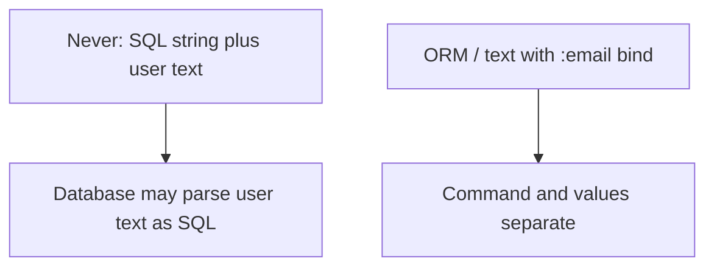

# Month 13 · Week 3 · Day 3
# From Memory: Parameterized SQL and ORM Binds — Never Concatenate

**Program:** Full-Stack Mastery · 18 months  
**Phase:** 4 — Full-stack application engineering  
**Month index:** [../../README.md](../../README.md)  
**Week 3:** [1](day-01.md) · [2](day-02.md) · Day 3 (today) · [4](day-04.md) · [5](day-05.md) · [6](day-06.md) · [7](day-07.md)  
**Week rhythm today:** Implement from memory  
**Student state:** You can name XSS and CSRF as classes. Today: **SQL injection** as a class, and the **habit** that stops it. You will **not** write a working injection payload.  
**Study time:** 3–4 focused hours  
**Prereq:** Day 2 gate passed.

Labs: `~\fullstack-lab\month-13\week-03\day-03\`. Noun: **harbor buoys**. Not Project 7. Days 1–2 closed except this recap.

---

## How Day 3 works

Allowed: this recap, SQLAlchemy/FastAPI you already know, pytest.  
Not allowed: payloads, “try this in the `q` box,” concatenating user text into SQL “to see it break.”

If you need syntax, open **Month 10** textbook **parameter** sections after 25 minutes. Record lookups. Do not open exploit blogs.

---

## How to read this chapter

**SQL injection** is the class of bug where **untrusted text is mixed into a SQL string** so the database **parses it as SQL** instead of as a **value**. An unauthorized person might **try** to change the meaning of a query. **What prevents it:** you **never concatenate** user text into SQL. You pass values as **parameters** / **ORM binds**. The database driver **sends the command and the data separately**.



**Wrong belief:** “I’ll show a famous injection string so students remember.”  
**Correct:** students remember the **habit**: `where(User.email == email)` or `text("... WHERE email = :email")` with `{"email": email}`. The famous string does **not** appear in this book.

**Wrong belief:** “SQLAlchemy means I cannot inject.”  
**Correct:** `text(f"SELECT ... {user_input}")` is still concatenation. The ORM **helps** when you use **expressions**, not f-strings.

---

## Complete explanation (SQL you must still own)

**Parameterized (bound) query:**

```python
from sqlalchemy import select, text
from sqlalchemy.orm import Session

def get_user_by_email(db: Session, email: str) -> User | None:
    stmt = select(User).where(User.email == email)
    return db.scalars(stmt).first()
```

The `email` value is a **bind**. You did not glue it into a command string.

Raw SQL **only** with placeholders:

```python
db.execute(text("SELECT id FROM users WHERE email = :email"), {"email": email})
```

**Never:**

```python
# NEVER — concatenation of user text into SQL
# db.execute(text("SELECT id FROM users WHERE email = '" + email + "'"))
# db.execute(text(f"SELECT id FROM users WHERE email = '{email}'"))
```

Those commented lines are the **shape of the bug**. They are **not** completed with a payload. You will **not** uncomment them in a shared database.

**NoSQL injection (awareness):** concatenating user text into a Mongo query document or eval-like API is the same **class**. Use driver parameterization / typed filters. Project 7 is PostgreSQL.

**ORM:** filter expressions, `where`, `and_`. Sort: **whitelist** column names (Month 9). Never `order_by(text(user_sort))` without a map from allowed strings to columns.

**LIKE / search:** still bind the value. You may add `%` **in Python** to the **value**, not by letting the user supply SQL.

**Identifiers** (table/column names) cannot always be bound as values. **Whitelist** identifiers. Never put a user string in a table name.

**Defense in depth:** least privilege DB user (Week 4 Day 5) so even a mistake has a smaller blast radius. Not a substitute for binds.

**SSRF awareness (one paragraph, not an exploit):** if you `httpx.get(user_supplied_url)` to fetch a webhook or image, an unauthorized person might **try** to make your **server** request **internal** URLs. **Prevent:** do not fetch arbitrary URLs from user input; **allowlist** hosts/schemes. No lab to hit metadata endpoints.

---

## Today's contract

**Today's gate.** Closed-book:

> I look up rows with ORM binds or `:name` parameters. I never f-string user text into SQL. Sort fields are whitelisted. I did not write an injection payload.

---

## Time box

| Block | Minutes | Work |
|---|---|---|
| A | 20 | Speak |
| B | 35 | Paper drills |
| C | 95 | Harbor buoys API with search |
| D | 30 | Grep for f-string SQL |
| E | 15 | Lookups |

---

# Block A — Speak

1. What SQL injection is **as a class**.  
2. What a bind parameter does.  
3. Why ORM is not automatic safety.  
4. How sort whitelist works.  
5. SSRF one sentence.

---

# Block B — Paper

1. Write `select(Buoy).where(Buoy.code == code)` from memory.  
2. Write `text` + dict bind for the same.  
3. Write a **forbidden** f-string **without** a payload — just `{email}` in the SQL — then cross it out and write NEVER.  
4. List three allowed sort keys.

---

# Block C — Spec

```powershell
cd ~\fullstack-lab
mkdir month-13\week-03\day-03 -Force
cd ~\fullstack-lab\month-13\week-03\day-03
uv init --name lab-harbor-buoys
uv add fastapi uvicorn sqlalchemy
uv add --dev pytest httpx
```

**SQLite in-memory** is enough (or Postgres if your habit is already there). Resource **buoys**: `id`, `code`, `label`.

| Method | Path | Rules |
|---|---|---|
| POST | `/buoys` | 201 |
| GET | `/buoys` | query `q` optional search on `label` **bound**; `sort` whitelist `code`/`id` |

Tests: create two; search substring; sort. **No** test that “injects.”

If SQLAlchemy 2.0 style from Month 10 is foggy, recap in this file is enough: `select`, `where`, `==`.

```powershell
uv run pytest -q
```

Optional uvicorn:

```powershell
uv run uvicorn main:app --reload --host 127.0.0.1 --port 8000
```

`curl.exe` with a `q` that contains punctuation — the app still **200**, treats it as **text**.

---

# Block D — Grep

In **this lab** and, if you have time, **Project 7**:

Search for `text(f`, `execute(f`, `"SELECT" +`, `'SELECT' +`. Record in `GREP.txt`. Fix any hits by converting to binds.

Do not add a hit “for demo.”

---

# Block E

`lookups.txt`. Commit:

```powershell
cd ~\fullstack-lab
git add month-13
git commit -m "Month 13 Day 3: parameterized SQL buoy lab."
```

---

# Lecture: the payload-free memory

If you cannot remember a famous injection string, **good**. Remember `==` and `:email`.

Pydantic validates **types**. It does not bind SQL. You can have a valid string that is still concatenated. Binds are the SQL habit.

**LIMIT/OFFSET:** integers from `Query(ge=0)` — still bind or use typed SQLAlchemy `limit()`.

---

## Definition of done

- [ ] Search uses a bind  
- [ ] Sort whitelist  
- [ ] GREP.txt  
- [ ] No payload in the repo  
- [ ] Commit exists  

---

## Optional review links

- [SQLAlchemy 2.0 SELECT](https://docs.sqlalchemy.org/en/20/tutorial/data_select.html)  
- [OWASP: Query Parameterization](https://cheatsheetseries.owasp.org/cheatsheets/Query_Parameterization_Cheat_Sheet.html)

---

## Tomorrow

**Lab:** CORS is **not** authentication; tight origin list.

---

# Closing lecture — data is not the command

Never concatenate user text into SQL.
ORM expressions and :binds keep values separate.
f-string SQL is the bug shape. Do not complete it.

Whitelist sort identifiers. Do not bind table names from users.
SSRF: do not fetch arbitrary URLs.

Harbor buoys. pytest. curl.exe punctuation as text.
Grep Project 7 for f-string SQL. Fix, do not demo.

If GREP.txt is empty, say so. If not, bind the values.

---

## Recite-back checklist (close the editor, then tick)

Write `RECITE.txt` with one honest sentence per line.

- [ ] injection is concatenation  
- [ ] binds separate data  
- [ ] ORM can still be wrong  
- [ ] sort whitelist  
- [ ] no payload  
- [ ] SSRF allowlist  
- [ ] GREP done  
- [ ] not the product dump  

If a line is mush, re-read this file only.

---

# Extra lecture — data is not the command

Never concatenate user text into SQL. ORM expressions and `:binds` keep values separate. f-string SQL is the bug shape. Do not complete it with a payload.

Whitelist sort identifiers. Do not bind table names from users. SSRF: do not fetch arbitrary URLs.

Harbor buoys. pytest. `curl.exe` punctuation as **text**. Grep Project 7 for `text(f`, `execute(f`, `"SELECT" +`. Fix, do not demo.

If GREP.txt is empty, say so. If not, bind the values.

Pydantic validates **types**. It does not bind SQL. A valid string can still be concatenated. Binds are the SQL habit.

`LIKE`: add `%` in Python to the **value**, still bind. `limit()` typed, not string-glued.

NoSQL concat into a query document is the same **class**. Project 7 is PostgreSQL.

Lab: `~\fullstack-lab\month-13\week-03\day-03\`. SQLite in-memory is enough.

```powershell
uv run pytest -q
```

If you “escape quotes yourself” instead of binding, rewrite. Escaping SQL by hand is how you lose.

---

# Paper drills you should still have

1. `select(Buoy).where(Buoy.code == code)`  
2. `text("SELECT id FROM buoys WHERE code = :code")` with `{"code": code}`  
3. A **forbidden** f-string **without** a payload — `{email}` in the SQL — crossed out NEVER  
4. Three allowed sort keys  

Identifiers (table names) cannot always be bound. **Whitelist**. Never put a user string in a table name.

LIMIT/OFFSET: integers from `Query(ge=0)` or SQLAlchemy `limit()`.

Defense in depth: least privilege DB user (Week 4 Day 5) is **not** a substitute for binds.

Lab noun: harbor buoys. Not Project 7. `~\fullstack-lab\month-13\week-03\day-03\`.

---

# Independent grep (required)

In this lab and Project 7 if time:

Search `text(f`, `execute(f`, `"SELECT" +`, `'SELECT' +`. Record in `GREP.txt`. Convert hits to binds.

Do not add a concatenation “for demo.”

`GET /buoys?q=` with punctuation still **200**, treated as **text**.

```powershell
uv run uvicorn main:app --reload --host 127.0.0.1 --port 8000
curl.exe -s "http://127.0.0.1:8000/buoys?q=hello"
```

Sort whitelist: unknown sort → 422, not a raw column name in SQL.

SSRF one sentence in `SSRF.txt`: do not fetch arbitrary user URLs; allowlist hosts/schemes. No lab hitting metadata endpoints.


