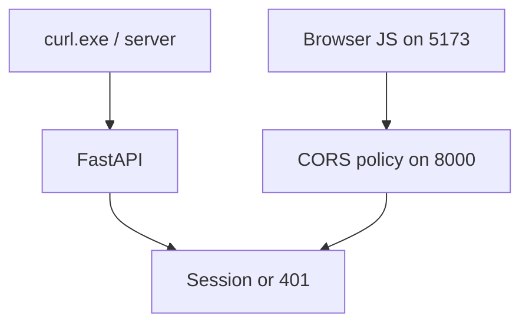
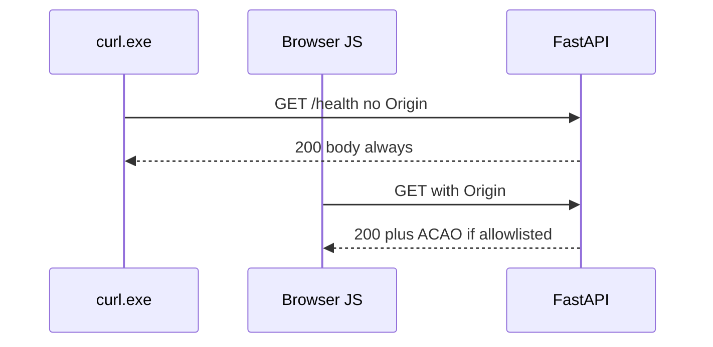

# Month 13 · Week 3 · Day 4
# Lab: CORS Is Not Authentication — Tight Origin List

**Program:** Full-Stack Mastery · 18 months  
**Phase:** 4 — Full-stack application engineering  
**Month index:** [../../README.md](../../README.md)  
**Week 3:** [1](day-01.md) · [2](day-02.md) · [3](day-03.md) · Day 4 (today) · [5](day-05.md) · [6](day-06.md) · [7](day-07.md)  
**Week rhythm today:** Learn + type-along (lab)  
**Student state:** You bind SQL. Today you unlearn a popular myth: **CORS is not a login system**.  
**Study time:** 3–4 focused hours

Labs: `~\fullstack-lab\month-13\week-03\day-04\`. Month 9/12 already forbade `allow_origins=["*"]`. Today you **prove** why with **headers**, not with an attack on a stranger.

---

## How to use this textbook

1. Read what CORS is **for** (browsers, **JavaScript**, other **origins**).  
2. Send `curl.exe` **without** Origin — it still works. That is the lesson.  
3. Tight list: `http://127.0.0.1:5173` (and localhost if you truly use it).

---

## How to read this chapter

**CORS (Cross-Origin Resource Sharing)** is a **browser** mechanism. A page on origin A’s JavaScript may **not** read origin B’s responses unless B **opt-in** via headers (`Access-Control-Allow-Origin`, etc.).

**Authentication** is **your** session/token check. An unauthorized person might **try** your API with `curl.exe`, Postman, or a script **from a server**. **CORS does not run there.** **What prevents** those calls from succeeding is **authn/authz**, not CORS.



**Wrong belief:** “I set CORS to my SPA origin, so only my SPA can call the API.”  
**Correct:** only **browsers** obey CORS. `curl.exe` still gets **200** on `/health` and will get **401/403** on protected routes based on **cookies/tokens**, not based on Origin.

**Wrong belief:** “`allow_origins=['*']` with `allow_credentials=True` is convenient.”  
**Correct:** browsers **reject** that combination. Even without credentials, `*` trains you to skip an allowlist. This course: **explicit origins**.

---

## Today's contract

By the end of this day you will be able to:

1. Define CORS in one sentence as a **browser** rule.  
2. List allowed origins for Project 7 (dev + later prod).  
3. Show `curl.exe` ignores CORS.  
4. Show TestClient can still assert CORS **headers** when `Origin` is sent.  
5. Refuse `*`.  
6. Combine with credentials: `allow_credentials=True` **only** with a **specific** origin.

**Today's gate.** Closed-book:

> CORS is not authentication. curl still works. I allow a tight origin list. I do not use `*`. Protected routes still check sessions.

---

## Time box

| Block | Minutes | Work |
|---|---|---|
| A | 45 | Theory |
| B | 65 | FastAPI CORSMiddleware lab |
| C | 70 | Project 7 audit |
| D | 20 | Git |
| E | 15 | Recall |

---

# Block A — Theory

## 1. Origin

**Origin** = scheme + host + port. `http://127.0.0.1:5173` ≠ `http://localhost:5173` ≠ `http://127.0.0.1:8000`.

Vite on 5173 + API on 8000 is **cross-origin** unless you **proxy**.

## 2. Simple vs preflight (honest, short)

Some requests trigger an OPTIONS **preflight**. FastAPI `CORSMiddleware` answers OPTIONS if configured. You still **must not** treat OPTIONS success as “user is logged in.”

## 3. Headers you will see

| Header | Role |
|---|---|
| `Access-Control-Allow-Origin` | Which origin may **read** the response in JS |
| `Access-Control-Allow-Credentials` | Cookies on cross-origin `fetch` |
| `Access-Control-Allow-Methods` | Methods for preflight |
| `Access-Control-Allow-Headers` | Extra headers (CSRF header, Authorization) |

Reflecting **any** `Origin` you receive is **almost `*`**. Allowlist **compare**.

## 4. What someone might try

They might **try** to call your API from **their** website’s JS. **Prevent:** their origin is **not** on the list; the **browser** hides the response. They might **try** `curl.exe` instead. **Prevent:** **401** without a session — **authorization** on the route.

## 5. SSRF vs CORS

CORS is browser. SSRF is **your server fetching URLs**. Different. Do not mix the words.

---

# Block B — Type-along

```powershell
cd ~\fullstack-lab
mkdir month-13\week-03\day-04 -Force
cd ~\fullstack-lab\month-13\week-03\day-04
uv init --name lab-cors-not-auth
uv add fastapi uvicorn
uv add --dev pytest httpx
```

```python
from fastapi import FastAPI
from fastapi.middleware.cors import CORSMiddleware

app = FastAPI()
app.add_middleware(
    CORSMiddleware,
    allow_origins=["http://127.0.0.1:5173"],
    allow_credentials=True,
    allow_methods=["GET", "POST", "PUT", "PATCH", "DELETE", "OPTIONS"],
    allow_headers=["*"],  # tighten later to Content-Type, X-CSRF-Token
)

@app.get("/health")
def health() -> dict[str, str]:
    return {"status": "ok"}
```

```powershell
uv run uvicorn main:app --reload --host 127.0.0.1 --port 8000
```

```powershell
curl.exe -s -D - http://127.0.0.1:8000/health -o NUL
curl.exe -s -D - http://127.0.0.1:8000/health -H "Origin: http://127.0.0.1:5173" -o NUL
curl.exe -s -D - http://127.0.0.1:8000/health -H "Origin: http://evil.example" -o NUL
```

Write `HEADERS.txt`: which `Access-Control-Allow-Origin` appeared. `curl.exe` **body** is still `{"status":"ok"}` in **all** three — **that** is “CORS is not auth.”

TestClient: request with `headers={"Origin": "http://127.0.0.1:5173"}` and assert allow-origin. Request with a **not-listed** origin: allow-origin **absent** or not that origin — still **200** on `/health`.

Add `GET /secret` that returns 401 without a cookie — CORS header does not change 401.

---

# Block C — Independent

1. `PROJECT7-CORS.md`: exact origin strings, credentials yes/no, proxy or not.  
2. Grep `allow_origins` in the product. If `*`, fix.  
3. `MYTHS.md`: three myths in your words.

```powershell
cd ~\fullstack-lab
git add month-13
git commit -m "Month 13 Day 4: CORS is not authentication lab."
```

---

# Block E — Recall

1. Who obeys CORS.  
2. Who does not.  
3. Why `*` + credentials fails.  
4. 5173 vs 8000.  
5. What actually protects `/me`.

---

## Office hours

**TestClient always 200 without CORS headers.** You must send `Origin`.  
**Allowed localhost but Vite is 127.0.0.1.** Mismatch. Pick one and document.  
**Production origin leftover `*` “just for now.”** Now is how `*` ships.



---

# Lecture: Month 9 was right

You already forbade `*`. Today you can **teach why**. Auth still sits on the route. CORS sits on the **browser**.

Tighten `allow_headers` when you know CSRF and Content-Type.

---

## Definition of done

- [ ] curl without Origin still 200 `/health`  
- [ ] allowlist proven in headers.txt  
- [ ] PROJECT7-CORS.md  
- [ ] no `*`  
- [ ] Commit exists  

---

## Optional review links

- [MDN: CORS](https://developer.mozilla.org/en-US/docs/Web/HTTP/Guides/CORS)  
- [FastAPI: CORS](https://fastapi.tiangolo.com/tutorial/cors/)

---

## Tomorrow

**Secrets:** `.env`, gitignore, no private keys in `VITE_`.

---

# Closing lecture — browsers only

CORS is a browser reading gate.
curl.exe is not a browser.
Authentication is a session check.
Tight origins. No star. Credentials need a specific origin.

Project 7: 5173 and later HTTPS origin.
Proxy makes one origin and calms cookies.

Lab: `~\fullstack-lab\month-13\week-03\day-04\`.
If HEADERS.txt shows star you failed the lab.

---

## Recite-back checklist (close the editor, then tick)

Write `RECITE.txt` with one honest sentence per line.

- [ ] CORS is browser-only  
- [ ] curl still works  
- [ ] tight allowlist  
- [ ] no star  
- [ ] credentials need explicit origin  
- [ ] /me still 401 without session  
- [ ] 5173 ≠ 8000  
- [ ] Project 7 audited  

If a line is mush, re-read this file only.

---

# Extra lecture — browsers only, again, because the myth is sticky

CORS is a **browser reading gate**. `curl.exe` is not a browser. Authentication is a **session check**. Tight origins. No star. Credentials need a **specific** origin.

Project 7: `http://127.0.0.1:5173` and later the HTTPS origin. `localhost` is a **different** origin. Pick one Vite URL and document it.

Proxy makes **one** origin and calms cookies. If you proxy, CORS on 8000 may matter less for the SPA — still do not use `*`.

OPTIONS success is not “logged in.”

Reflecting **any** Origin header you receive is almost `*`. Compare to an allowlist.

`GET /secret` 401 without a cookie — CORS headers do not change that.

```powershell
curl.exe -s -D - http://127.0.0.1:8000/health -o NUL
curl.exe -s -D - http://127.0.0.1:8000/health -H "Origin: http://127.0.0.1:5173" -o NUL
```

Body is 200 either way for `/health`. That is the lesson.

Lab: `~\fullstack-lab\month-13\week-03\day-04\`. Bind `127.0.0.1`.

If HEADERS.txt shows a star, you failed the lab. Fix `allow_origins`.

SSRF is **your server fetching URLs**. CORS is not SSRF. Do not mix the words.

Month 9 already forbade `*`. Today you can **teach why**.

---

# Worked session — three curls, one lesson

```powershell
uv run uvicorn main:app --reload --host 127.0.0.1 --port 8000
```

1. No Origin: 200 body, likely **no** ACAO.  
2. Origin 5173: 200 body **plus** `Access-Control-Allow-Origin: http://127.0.0.1:5173`.  
3. Origin a not-listed host: 200 body, ACAO **not** that host.

Write `HEADERS.txt`. Write `MYTHS.md`: three myths in your words.

TestClient: send `Origin` or you will not see CORS headers. `/secret` 401 without cookie — CORS did not log anyone in.

`allow_headers`: tighten later to `Content-Type`, `X-CSRF-Token`, `Authorization`. `"*"` for headers is sloppy; origins must not be `"*"`.

`allow_credentials=True` **requires** a specific origin. Browsers reject `*` plus credentials.

Grep Project 7 `allow_origins`. If star, fix today.

Lab: `~\fullstack-lab\month-13\week-03\day-04\`. `uv add fastapi uvicorn` and `pytest httpx`.

Preflight OPTIONS is not AuthN. Simple vs preflight: know the words; middleware handles OPTIONS if configured.

---

# Origin arithmetic

**Origin** = scheme + host + port. `http://127.0.0.1:5173` ≠ `http://localhost:5173` ≠ `http://127.0.0.1:8000`.

Vite on 5173 + API on 8000 is **cross-origin** unless you **proxy**.

They might **try** to call your API from **their** website’s JS. **Prevent:** origin not on the list; the **browser** hides the response. They might **try** `curl.exe` instead. **Prevent:** **401** without a session.

`PROJECT7-CORS.md`: exact origin strings, credentials yes/no, proxy or not.

Office hours: TestClient without Origin shows no ACAO. Allowed localhost but Vite is 127.0.0.1 — mismatch. Production leftover `*` “just for now” is how `*` ships.

Lab `CORSMiddleware` `allow_origins=["http://127.0.0.1:5173"]`, `allow_credentials=True`, methods including OPTIONS.

`~\fullstack-lab\month-13\week-03\day-04\`.

If you still believe “only my SPA can call the API because of CORS,” re-read Block A of this file. curl.exe is the counterexample.

Add `GET /secret` 401 without a cookie so students cannot claim CORS “protected” it. TestClient still 401. curl.exe still 401. Origin headers did not log anyone in.

`HEADERS.txt` plus `MYTHS.md` plus `PROJECT7-CORS.md` are the three artifacts. Commit without secrets.

`allow_origins` is a **list of strings you typed**, not `os.environ.get("ORIGIN", "*")` with a star default.

Vite proxy: the browser may see one origin. Still do not use `*` on the API “just in case.” Tight list. Later production origin is HTTPS, not 5173.

`curl.exe -H "Origin: ..."` is how you inspect ACAO on Windows. PowerShell `curl` is the wrong program.

`GET /health` remaining 200 without Origin is **success** for the lesson, not a security hole. `/me` remaining 401 without a session is the actual lock.

If `allow_credentials=True` and you still want a second SPA origin, list **both** explicitly. Do not widen to `*`.

Lab: `~\fullstack-lab\month-13\week-03\day-04\`. `uv run pytest -q`.

CORS is not a firewall. AuthN/AuthZ is. Tight origins are politeness to browsers. curl.exe remains your honesty check.

`allow_headers=["*"]` in the type-along is a known sloppiness — tighten to Content-Type and CSRF/Authorization names in Project 7 notes.

`http://127.0.0.1:5173` is the course origin unless you proxy. Document whichever you actually run. Mismatch is a day of CORS tickets.

OPTIONS is not login. ACAO is not a session. `/me` is 401 without a cookie even when Origin is perfect.

`~\fullstack-lab\month-13\week-03\day-04\`. Three curls. HEADERS.txt. No star. Commit.

curl.exe without Origin still 200 on `/health`. That is the myth-killer. Write it in MYTHS.md.

Protected routes still check sessions. CORS never logged anyone in. That sentence is the day.

Tight list. No star. Credentials need a specific origin. curl.exe is not a browser.


