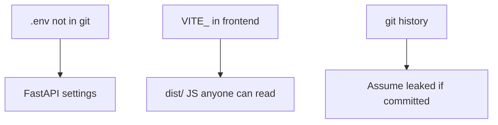
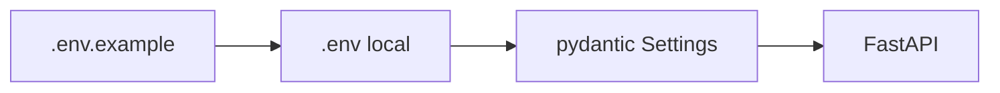

# Month 13 · Week 3 · Day 5
# Secrets: .env, gitignore, and Never VITE_ for Private Keys

**Program:** Full-Stack Mastery · 18 months  
**Phase:** 4 — Full-stack application engineering  
**Month index:** [../../README.md](../../README.md)  
**Week 3:** [1](day-01.md) · [2](day-02.md) · [3](day-03.md) · [4](day-04.md) · Day 5 (today) · [6](day-06.md) · [7](day-07.md)  
**Week rhythm today:** Tests + refactor + documentation  
**Student state:** CORS is not auth. Today: **where secrets live**, and the Month 5 lesson that **`VITE_` is public**.  
**Study time:** 3–4 focused hours

Labs: `~\fullstack-lab\month-13\week-03\day-05\`. Audit **your** Project 7 — do not paste secrets into the textbook lab.

---

## How to use this textbook

1. Prove a `VITE_` string appears in a build **or** recite Month 5’s proof.  
2. Check `.gitignore` for `.env`.  
3. Never commit tokens. If you already did, **rotate** (treat as leaked).

---

## How to read this chapter

A **secret** is a value that **authorizes**: database password, cookie signing key, SMTP key, OAuth **client secret**, AWS keys later. **Public** config is: API **base URL**, “environment name,” feature flags that are not keys.



**Wrong belief:** “`.env` is a vault because Git ignores it.”  
**Correct:** gitignore hides it from **GitHub**. `VITE_*` is **inlined into client JS**. Anyone can read it in DevTools. Month 5 said this; Month 13 stakes are **session keys**.

**Wrong belief:** “I’ll put `VITE_JWT_SECRET` so the SPA can decode tokens.”  
**Correct:** the SPA should **not** verify your HMAC secret. `/me` returns public claims. Secrets stay on the **server**.

---

## Today's contract

By the end of this day you will be able to:

1. Name three secrets that must **never** be `VITE_`.  
2. Show `.env` is gitignored; `.env.example` has **empty or fake** values.  
3. Load server settings via pydantic-settings / `os.environ`.  
4. Explain **rotation** if a secret hit git.  
5. Confirm frontend env is only public (`VITE_API_BASE`).

**Today's gate.** Closed-book:

> Private keys are server env, not Vite. .env is gitignored. I never log secrets. Committed secrets are leaked.

---

## Time box

| Block | Minutes | Work |
|---|---|---|
| A | 40 | Theory |
| B | 60 | Lab: settings + gitignore proof |
| C | 70 | Project 7 audit + grep |
| D | 20 | Git |
| E | 15 | Recall |

---

# Block A — Theory

## 1. Classes of config

| Kind | Example | Where |
|---|---|---|
| Public | `VITE_API_BASE=http://127.0.0.1:8000` | Frontend env |
| Secret | `DATABASE_URL`, `SESSION_SECRET`, `SMTP_PASSWORD` | Server `.env` |
| Not config | User password | Never stored; hashed |

**SESSION_SECRET** (if you sign cookies) must be **long random**. Generate with `secrets.token_urlsafe(32)`. Do not use `"changeme"`.

## 2. gitignore

```
.env
.env.local
*.pem
```

`.env.example`:

```
DATABASE_URL=
SESSION_SECRET=
SMTP_PASSWORD=
```

No real values. README says copy to `.env`.

## 3. Logging

Never log `DATABASE_URL` with password. Never log `Authorization` headers. Never log `Set-Cookie` values. Month 9 process-time header is fine.

## 4. What someone might try

They might **try** to read your GitHub repo for `.env`. **Prevent:** gitignore + **never** force-add. They might **try** the JS bundle for `VITE_`. **Prevent:** no secrets there. They might **try** old git history. **Prevent:** rotation; history rewrite is messy — **rotate first**.

## 5. Frontend vs backend repos

If `ops-web` and `ops-api` are two repos, **each** has its own env. Do not copy the API secret into the web repo “to share.”

## 6. Docker later (Month 15)

Same rule: secrets at **runtime**, not in the image layers as `ENV JWT=...` in a Dockerfile you commit.

---

# Block B — Type-along

```powershell
cd ~\fullstack-lab
mkdir month-13\week-03\day-05 -Force
cd ~\fullstack-lab\month-13\week-03\day-05
uv init --name lab-settings
uv add pydantic-settings
uv add --dev pytest
```

Tiny `Settings` with `session_secret: str` from env. Test: missing secret fails fast (or your documented default **only** in `ENV=test`).

Write `GITIGNORE-PROOF.txt`: command you ran (`git check-ignore -v .env` if git exists) and result.

Create `.env.example` **without** a real secret. Ensure `.env` is ignored if you create one.

**Do not** commit a real `SESSION_SECRET`.

---

# Block C — Independent

Grep Project 7 (and labs) for:

- `VITE_` that is not a public URL/flag  
- `sk-` / `ghp_` / `BEGIN PRIVATE` (if any: rotate, do not paste into notes)  
- `allow_origins=["*"]` leftover  

`AUDIT.md`: table of env vars, public vs secret.

If Vite project exists, optional: `npm run build` and search `dist` for a **deliberate** `VITE_APP_TITLE` (public) — and confirm a fake secret you **did not** prefix with VITE_ is **absent**. Do not put a real secret in the frontend folder to “test.”

```powershell
cd ~\fullstack-lab
git add month-13
git commit -m "Month 13 Day 5: secrets hygiene lab and audit notes."
```

Double-check `git status` does not include `.env`.

---

# Block E — Recall

1. Why VITE_ is public.  
2. What `.env.example` contains.  
3. First step if a secret was committed.  
4. SESSION_SECRET generation.  
5. Logging rule.

---

## Office hours

**Committed `.env` “because teammates need it.”** Use a password manager / shared secret store; not git.  
**Default secret in code `= "dev"`.** Tests may use a test secret via env in CI. Production must refuse to boot without a real one.  
**Printed settings at startup including password.** Redact.



---

# Lecture: Month 5 returns with teeth

You already searched `dist/` for `VITE_`. Today the forbidden list includes **signing keys**. A JWT secret in the SPA is how “I decoded it in the client” becomes “everyone is admin.”

Never put private keys in GitHub gists to “ask the AI.”

---

## Definition of done

- [ ] AUDIT.md  
- [ ] .env gitignored  
- [ ] no VITE_ secrets  
- [ ] .env.example empty placeholders  
- [ ] Commit exists without secrets  

---

## Optional review links

- [12-factor config](https://12factor.net/config)  
- [Vite: env variables](https://vitejs.dev/guide/env-and-mode.html)  
- [pydantic-settings](https://docs.pydantic.dev/latest/concepts/pydantic_settings/)

---

## Tomorrow

**Independent:** threat notes for **your** endpoints (assets, what we prevent).

---

# Closing lecture — public is public

VITE_ ships to every browser.
.env is local and gitignored.
.env.example is empty names.
Rotate if git ever saw a secret.

Session secrets are random and long.
Logs do not print tokens.
Two repos do not share the API secret via zip.

Lab: `~\fullstack-lab\month-13\week-03\day-05\`.
If git add .env, undo before you push. Rotate.

---

## Recite-back checklist (close the editor, then tick)

Write `RECITE.txt` with one honest sentence per line.

- [ ] VITE_ is public  
- [ ] secrets on server  
- [ ] gitignore .env  
- [ ] example has no values  
- [ ] rotate on leak  
- [ ] do not log secrets  
- [ ] AUDIT.md  
- [ ] no secret in the commit  

If a line is mush, re-read this file only.
