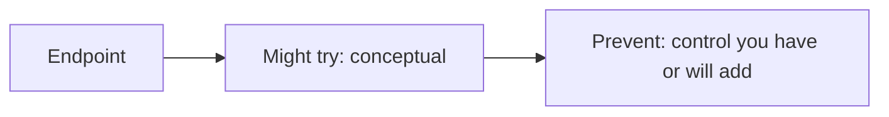

# Month 13 · Week 3 · Day 6
# Independent: Threat Notes for Your Endpoints

**Program:** Full-Stack Mastery · 18 months  
**Phase:** 4 — Full-stack application engineering  
**Month index:** [../../README.md](../../README.md)  
**Week 3:** [1](day-01.md) · [2](day-02.md) · [3](day-03.md) · [4](day-04.md) · [5](day-05.md) · Day 6 (today) · [7](day-07.md)  
**Week rhythm today:** Independent implementation  
**Student state:** You can encode, CSRF-think, bind SQL, CORS-myth, and hide secrets. Today you write **threat notes** for **your** Project 7 endpoints: **assets** and **what prevents** misuse. Week 4 Day 6 is the full one-pager threat model; today is the **endpoint table**.  
**Study time:** 3–4 focused hours

Work in the **product repo** (`docs/THREATS.md` or similar) **and** keep a copy under `~\fullstack-lab\month-13\week-03\day-06\` if you like. This textbook will **not** invent your resources.

---

## How to use this textbook

1. List **real** routes from **your** OpenAPI or CONTRACT.  
2. For each mutating or sensitive GET: what someone might **try**, **what prevents it**.  
3. No payloads. No “how I would hack.” Gate language only.

---

## How to read this chapter

The Month 13 gate says: *explain how an unauthorized user might try each major endpoint and what prevents it.*



**Wrong belief:** “I’ll copy a generic OWASP list and not look at my routes.”  
**Correct:** **your** `POST /…`, **your** owner fields, **your** cookie flags.

**Wrong belief:** “Threat notes need exploit steps to be serious.”  
**Correct:** serious is **specific assets** + **specific controls**.

---

## Today's contract

By the end of this day you will be able to:

1. Name **assets** (passwords hashes, session rows, PII, business objects).  
2. Fill a table of **major endpoints**.  
3. Mark gaps honestly (`CSRF token: not yet`).  
4. Include at least one **IDOR-shaped** thought (Week 4 will implement): accessing another user’s id.  
5. Include rate limiting as a **named gap or control**.

**Today's gate.** Closed-book:

> I have a threat table for my real endpoints in defense language. Gaps are visible. I did not paste a payload.

---

## Time box

| Block | Minutes | Work |
|---|---|---|
| A | 25 | Asset list |
| B | 40 | Inventory endpoints |
| C | 90 | Fill prevent columns; fix one easy gap if safe |
| D | 30 | Review with AUTH.md |
| E | 15 | Recall |

---

# Block A — Assets

Write `ASSETS.md`:

- Password hashes  
- Session ids / tokens  
- Email tokens  
- User PII (email)  
- Primary business entity (name it)  
- Secondary entity  
- Secrets in env  
- The machine’s ability to send mail (abuse as spam)

You cannot protect what you do not name.

---

# Complete explanation (keep open; other days closed)

**Hashing, sessions, HttpOnly, SameSite, generic 401, parameterized SQL, React escape, CSRF plan, CORS not auth, no VITE secrets.** Rate limiting: cap login and reset **request** per IP. Dependency pinning: lockfiles (uv.lock, package-lock) — Week 7 names it; today mention “we install from lockfile.”

**IDOR class:** an unauthorized person might **try** `PATCH /items/{someone_elses_id}`. **Prevent:** load the row and check **owner** or **org role** (Week 4). If you have no check, write **GAP**.

**SSRF:** if any endpoint accepts a URL to fetch, allowlist or remove.

---

# Block B — Table template (fill with YOUR paths)

| Method | Path | Who may call | Might try (one sentence) | Prevents it |
|---|---|---|---|---|
| POST | `/login` | anyone | Guess passwords / enumerate emails | Generic 401, hash, rate limit (gap?) |
| POST | `/register` | anyone | Flood / weak passwords | Validation, rate limit, hash |
| GET | `/me` | session | Call without cookie | 401 |
| PATCH | `/items/{id}` | ? | Another user’s id | **owner check** or GAP |
| GET | `/items` | ? | See all tenants | filter by org/owner or GAP |

Add **your** rows until the table is boringly complete for **major** routes (not every OPTIONS).

---

# Block C — One improvement

Pick **one** gap you can close **today** without a product dump from AI:

- Add generic 401 test  
- Remove a `dangerouslySetInnerHTML`  
- Bind a leftover query  
- Gitignore `.env`  
- Rate limit **stub**: document FastAPI SlowAPI / middleware as Week 3 debt if you cannot implement well  

Do **not** implement a WAF. Do **not** start attacking a deployed URL.

---

# Block D — Cross-read AUTH.md

Mismatch: cookie flags in AUTH.md vs threat table. Fix the doc.

---

# Block E — Recall

1. Asset vs endpoint.  
2. Why IDOR is Week 4.  
3. Rate limit on which routes first.

---

## Quality bar

Too thin: “SQL injection — use best practices.”  
Enough: “`GET /buoys?q=` uses `where(Buoy.label.ilike(pattern))` with bound pattern; sort whitelist.”

Too thin: “hackers might hack login.”  
Enough: “They might try many passwords; we hash, generic 401, and will rate-limit.”

```powershell
cd ~\fullstack-lab
mkdir month-13\week-03\day-06 -Force
```

Copy THREATS.md into lab as backup **without** secrets.

```powershell
cd ~\fullstack-lab
git add month-13
git commit -m "Month 13 Day 6: endpoint threat notes."
```

Also commit in Project 7.

---

## Definition of done

- [ ] ASSETS.md  
- [ ] Endpoint table with prevent column  
- [ ] Gaps marked  
- [ ] One improvement or explicit defer  
- [ ] No payloads  

---

## Optional review links

- [OWASP: Threat modeling](https://owasp.org/www-community/Threat_Modeling)  
- [OWASP API Top 10](https://owasp.org/API-Security/) (read as **names**, not as exploits)

---

## Tomorrow

**Week review:** injection, XSS, CSRF, CORS myths, **rate limiting**, **dependency pinning**.

---

# Closing lecture — name the door and the lock

Every major endpoint is a door.
Write who may open it and what you do if they should not.
Assets are why you care.

Gaps are honest. Silent gaps are how Week 4 is skipped.
IDOR is the preview. Owner_id is next week.

Your routes, not a template product.
Defense sentences. No recipes.

If the table lists only /health, you did not inventory.

---

## Recite-back checklist (close the editor, then tick)

Write `RECITE.txt` with one honest sentence per line.

- [ ] assets named  
- [ ] real paths  
- [ ] try + prevent  
- [ ] IDOR gap or check  
- [ ] rate limit named  
- [ ] AUTH.md consistent  
- [ ] no payload  
- [ ] committed in Project 7  

If a line is mush, re-read this file only.
