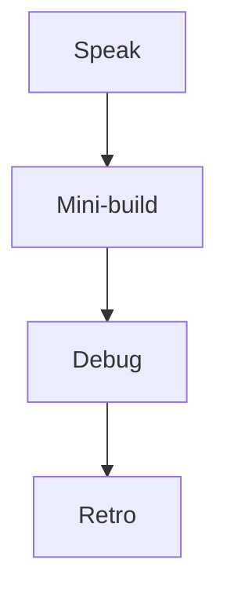

# Month 13 · Week 3 · Day 7
# Week Review — Injection, XSS, CSRF, CORS Myths, Rate Limits, Pinning

**Program:** Full-Stack Mastery · 18 months  
**Phase:** 4 — Full-stack application engineering  
**Month index:** [../../README.md](../../README.md)  
**Week 3:** [1](day-01.md) · [2](day-02.md) · [3](day-03.md) · [4](day-04.md) · [5](day-05.md) · [6](day-06.md) · Day 7 (today)  
**Week rhythm today:** Review, repair, plan Week 4  
**Student state:** You wrote defenses for XSS, CSRF, SQL, CORS, secrets, and a threat table. Today those ideas must still live in your head — from **this file**.  
**Study time:** 3–4 focused hours

Do not start Week 4 because the calendar moved. Owner checks on an API that concatenates SQL is two problems.

Work in `~\fullstack-lab\month-13\week-03\day-07\`. Mini is **not** Project 7.

---

## How to read this chapter

This is a **closed-book teaching day**. The synthesis **is** the Week 3 lesson.



Days 1–6 closed during mini-build.

---

## Week synthesis (the lesson, in this book)

**XSS:** untrusted text must not become HTML/JS. **Encode** on HTML output. **React children escape.** Avoid `dangerouslySetInnerHTML` unless **DOMPurify** (named) sanitized. **CSP** is a backup net. HttpOnly is not a full XSS fix. No payloads in this course.

**CSRF:** other origin might **try** to use the victim’s **cookie-authenticated** browser for **unsafe** methods. **Prevent:** SameSite Lax/Strict, **CSRF token** concept on POST, GET does not mutate. HttpOnly ≠ CSRF. Bearer headers are not auto-attached.

**SQL injection:** never concatenate user text into SQL. **ORM binds** / `:params`. f-string SQL is the bug **shape** — do not complete it with a payload. Sort **whitelist**. **NoSQL** concat is the same class. **SSRF:** do not fetch arbitrary user URLs; allowlist.

**CORS:** **browser** JS reading gate. **Not authentication.** `curl.exe` still works. Tight origin list. No `*`. Credentials need a **specific** origin. `/me` still 401 without a session.

**Secrets:** `.env` gitignored; `.env.example` empty; **no private keys in `VITE_`**. Rotate if committed. Do not log tokens.

**Rate limiting (defense):** an unauthorized person might **try** many logins or reset requests. **Prevent:** cap by IP (and identifier) on `/login` and `/reset/request`. Fail closed with 429. Do not need Redis today if an in-memory counter is enough for a mini; production can use a real limiter later. Rate limits are **not** a substitute for hashing.

**Dependency pinning (awareness):** install from **lockfiles** (`uv.lock`, `package-lock.json` / `pnpm-lock.yaml`). An unauthorized supply-chain event might **try** to slide a new malicious version into a loose `*`. **Prevent:** commit lockfiles; review updates; do not `latest` in production. You will not audit every package today; you **will** know why the lockfile is sacred.

**Threat table:** assets, endpoints, try/prevent, gaps.

**Wrong belief:** “CORS is my firewall.”  
**Correct:** authz is your firewall. CORS is a browser courtesy.

**Wrong belief:** “I need payloads to prove I learned XSS.”  
**Correct:** you need encoding tests and greps.

---

## Today's contract

**Today's gate.** Closed-book:

> I can teach XSS, CSRF, binds, CORS myths, secrets, rate limiting, and lockfiles. I built a mini that binds SQL, sets CORS tightly, and 429s on too many logins.

---

## Time box

| Block | Minutes | Work |
|---|---|---|
| 1 | 40 | Speak |
| 2 | 55 | Mini-build |
| 3 | 30 | Debug |
| 4 | 20 | Review THREATS.md |
| 5 | 20 | pytest; break bind into f-string in a **throwaway** branch of thought — do **not** leave f-string in git; restore |
| 6 | 20 | Design: rate limit vs hash |
| 7 | 20 | Retro + Week 4 |

---

# Complete explanation — web defenses you must still own

## 1. XSS / CSRF

Content vs confused deputy. Encode vs SameSite+token.

## 2. Binds

`where(Model.field == value)`. Never f-string SQL.

## 3. CORS

Allow `http://127.0.0.1:5173`. curl without Origin still 200 on public routes.

## 4. Rate limit sketch

A dict `ip -> [timestamps]` prune older than 1 minute; if count > N: 429. Lab only. Production: a real library. Do not build a scanner to “test the limit from 1000 IPs.”

## 5. Lockfile

`uv lock` committed. `npm ci` later uses the lock. One sentence in `PINNING.md`.

---

# Block 1 — Speak

XSS, CSRF, binds, CORS, VITE_, 429, lockfile. `exam-01.md`.

---

# Block 2 — Mini-build

```powershell
cd ~\fullstack-lab
mkdir month-13\week-03\day-07\mini -Force
cd ~\fullstack-lab\month-13\week-03\day-07\mini
uv init --name lab-quay-security
uv add fastapi uvicorn sqlalchemy passlib argon2-cffi
uv add --dev pytest httpx
```

**Quay notes** — `POST /notes` with `body` string stored; `GET /notes` search `q` **bound**. Cookie-less for speed **or** tiny login with **429** after 5 failures from the same test client (use a header `X-Forwarded-For` fake **only in lab** if you key by IP — or key by a test `client_id` field you document so you are not teaching IP spoofing as an attack).

Simpler 429: in-memory counter on `POST /login` **per email key** with a **dummy** constant for missing users too (enumeration). After 5, 429. Tests reset the counter in a fixture.

CORS middleware 5173. Test Origin header.

No XSS payload tests. Optional: HTML-escape if you add a tiny HTML route — prefer JSON only.

`uv.lock` must exist (uv creates it). Write `PINNING.md`: we commit this file.

---

# Block 3 — Debug

**A.** `allow_origins=["*"]` and cookies planned.  
**B.** `select` built with f-string of `q`.  
**C.** SPA has `VITE_SESSION_SECRET`.  
**D.** “CORS will stop curl.”  
**E.** Rate limit only on successful login.

---

# Block 4 — THREATS.md

One gap still open: write `GAP.txt`.

---

# Block 5 — Tests

`uv run pytest -q`. Break 429 threshold; show fail; restore.

---

# Block 6 — Design

`design.md`: why 429 does not replace argon2. Ten lines.

---

# Block 7 — Retro

Week 4 is **authorization**. Hiding buttons is not enough.

## Debug keys

**A.** No star; explicit origin.  
**B.** Bind `q`.  
**C.** Secret on server.  
**D.** curl ignores CORS.  
**E.** Limit **attempts**, not successes.

---

```powershell
cd ~\fullstack-lab
git add month-13
git commit -m "Month 13 Week 3 review: quay mini CORS binds rate-limit."
```

---

# Lecture: rate limits are polite walls

They slow guessing. They do not hash. They do not encode. They do not check `owner_id`.

Lockfiles are how you **repeat** installs. `*` version ranges are how surprises enter.

Mini is quay notes. JSON. Bound search. 5173 CORS. 429 on login attempts.

Do not add a payload fixture “to be thorough.”

---

## Definition of done

- [ ] exam-01.md  
- [ ] Mini pytest green  
- [ ] PINNING.md  
- [ ] Debug A–E  
- [ ] No f-string SQL in git  

---

## Optional review links

- [OWASP ASVS](https://owasp.org/www-project-application-security-verification-standard/) (awareness)  
- [FastAPI CORS](https://fastapi.tiangolo.com/tutorial/cors/)  
- [uv lock](https://docs.astral.sh/uv/)

---

## Next week

[Week 4 Day 1 — AuthN vs AuthZ](../week-04/day-01.md). Hiding a button is not authorization.

---

# Closing lecture — classes of bugs, habits of defense

XSS: encode, React text, no unsafe HTML.
CSRF: SameSite, token on unsafe cookie POSTs.
SQL: binds, never concatenate.
CORS: browser only, tight list.
Secrets: not VITE_, not git.
429: slow the guessing.
Lockfile: pin what you run.

Threat table is yours. Week 4 is owner_id.
Quay mini. curl.exe. Bind 127.0.0.1.

If debug B still likes f-strings “with escaping,”
rewrite B. Escaping SQL yourself is how you lose.

---

## Recite-back checklist (close the editor, then tick)

Write `RECITE.txt` with one honest sentence per line.

- [ ] XSS class + encode  
- [ ] CSRF class + SameSite  
- [ ] SQL binds  
- [ ] CORS ≠ auth  
- [ ] no VITE_ secrets  
- [ ] 429 on attempts  
- [ ] lockfile  
- [ ] mini not product  

If a line is mush, re-read this file only.

---

# Extra lecture — rate limits are polite walls

They slow guessing. They do not hash. They do not encode. They do not check `owner_id`.

Lockfiles are how you **repeat** installs. Loose `*` ranges are how surprises enter. Commit `uv.lock`. Write `PINNING.md`.

Mini is quay notes. JSON. Bound search. CORS 5173. 429 on **login attempts**, not only successes. Fixture resets the counter.

Do not add a payload fixture “to be thorough.”

Debug B: f-string `q` → bind.  
Debug D: “CORS will stop curl” → false.  
Debug E: rate limit only on success → limit **attempts**.

Lab: `~\fullstack-lab\month-13\week-03\day-07\mini`. `uv run pytest -q`. Bind `127.0.0.1`.

Week 4 is **authorization**. Hiding buttons is not enough. Do not start it if the mini is red.

If debug B still likes f-strings “with escaping,” rewrite B.

---

# Mini reminder (quay notes)

`POST /notes` stores `body`. `GET /notes` search `q` **bound**. CORS 5173. 429 after N login failures keyed by a documented lab key (email or test client id — not a lecture on spoofing IPs).

`uv.lock` exists. `PINNING.md`: we commit this file.

Debug A: `*` and cookies planned → no star.  
C: `VITE_SESSION_SECRET` → server only.

Break 429 threshold; fail; restore.

`design.md`: why 429 does not replace argon2.

`GAP.txt` from THREATS.md.

`~\fullstack-lab\month-13\week-03\day-07\mini`. `uv add fastapi uvicorn sqlalchemy passlib argon2-cffi`. pytest httpx.

Week 4: [../week-04/day-01.md](../week-04/day-01.md).

Do not start Week 4 on a red mini. Bound search plus 429 plus tight CORS is the Week 3 proof.

`PINNING.md` names the lockfile. Rate limit **attempts**. No payload fixtures.


