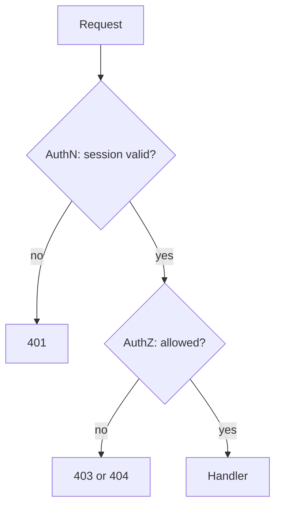
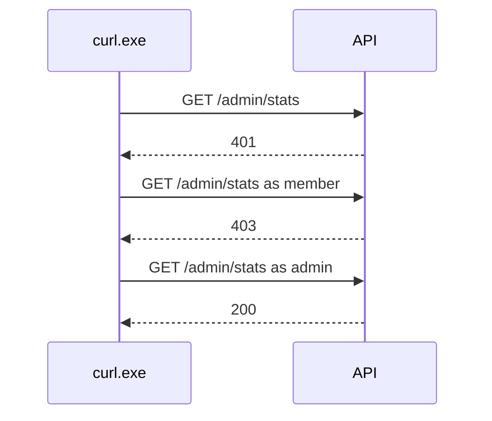

# Month 13 · Week 4 · Day 1
# Authentication vs Authorization — Hiding a Button Is Not AuthZ

**Program:** Full-Stack Mastery · 18 months  
**Phase:** 4 — Full-stack application engineering  
**Month index:** [../../README.md](../../README.md)  
**Week 4:** Day 1 (today) · [2](day-02.md) · [3](day-03.md) · [4](day-04.md) · [5](day-05.md) · [6](day-06.md) · [7](day-07.md)  
**Week 3 review:** [../week-03/day-07.md](../week-03/day-07.md)  
**Week rhythm today:** Learn + type-along  
**Student state:** Week 3 gate passed. You can talk about XSS/CSRF/SQL/CORS as **defenses**. Today the second question of the month: **what may you do?**  
**Study time:** 3–4 focused hours

Labs: `~\fullstack-lab\month-13\week-04\day-01\`. Project 7 notes, not a product dump.

---

## How to use this textbook

1. Say AuthN and AuthZ aloud until they annoy you.  
2. Type an API that **hides nothing** and still **refuses**.  
3. Optional review links are for later rechecking.

---

## How to read this chapter

**Authentication (AuthN):** **who** is this request? Session cookie, token, or “anonymous.” Failure: **401**.

**Authorization (AuthZ):** given who they are, **may they do this** to **this resource**? Failure: **403** (or **404** to hide existence — a policy).

The React UI **hiding a Delete button** is **courtesy**. An unauthorized person might **try** the **same HTTP** the button would have sent (`curl.exe`, a modified SPA, a replay). **What prevents it:** the **API** checks role or **owner_id** and **refuses**.



**Wrong belief:** “Hiding a button in React is authorization.”  
**Correct:** the API must refuse. The UI is courtesy.

**Wrong belief:** “If they are logged in, they may do everything.”  
**Correct:** that is only AuthN. Multi-user Project 7 **requires** AuthZ.

---

## Today's contract

By the end of this day you will be able to:

1. Define AuthN vs AuthZ in two sentences.  
2. Map **401** vs **403** vs **404** as a **policy**.  
3. Explain why UI checks are **not** sufficient.  
4. Write a FastAPI dependency that requires a user, and a second check for a permission.  
5. List Project 7 actions that need AuthZ (notes).

**Today's gate.** Closed-book:

> Login proves who. Authorization proves they may. Hidden buttons are not a control. The API refuses.

---

## Time box

| Block | Minutes | Work |
|---|---|---|
| A | 50 | Theory |
| B | 60 | Lab: 401 then 403 |
| C | 70 | Project 7 action list |
| D | 20 | Git |
| E | 15 | Recall |

---

# Block A — Theory

## 1. Two questions (from the month README)

1. Who are you?  
2. What may you do?

Every **endpoint** answers both. Public `GET /health` answers: anyone; they may see liveness.

## 2. Status policy for this course

| Status | Meaning |
|---|---|
| **401** | No valid proof of identity |
| **403** | Identity known; action forbidden |
| **404** | Missing **or** you **choose** to hide that the row exists from a non-owner |

**404 vs 403 for other people’s rows:** 403 tells them the id exists. 404 does not. Many products use **404** for “not yours and not public.” Pick one in CONTRACT.md and **test it**. Day 4 tests the **wrong user**.

**Wrong belief:** “403 is more honest so I always 403.”  
**Correct:** honesty can be a leak (id enumeration). Either is defensible if **consistent**.

## 3. Layers that are not AuthZ

| Layer | Why it fails alone |
|---|---|
| Hidden button | HTTP still exists |
| Client-side route guard | Direct URL / API still exists |
| CORS | curl.exe |
| “They won’t know the UUID” | UUIDs leak in logs, lists, emails | 
| `disabled` attribute | DevTools |

**Security through obscurity** is not the owner check.

## 4. Where AuthZ lives

**In the API** (and DB constraints). Optionally **also** in the UI for UX. Never **only** in the UI.

**Depends** in FastAPI: `get_current_user` → 401 if missing. Then `require_admin` or `require_owner(item)` → 403/404.

Services raise domain errors; routers map to HTTP. Same Month 9 habit.

## 5. Object level vs role level (preview Day 2)

- **Role:** `admin` may list all workspaces.  
- **Ownership:** `member` may PATCH **their** task, not **mine**.

You will usually need **both**.

## 6. What someone might try

- **Try** `PATCH` with another id while logged in as themselves. **Prevent:** owner/org check.  
- **Try** to call admin routes with a member session. **Prevent:** role check.  
- **Try** no session. **Prevent:** 401.

No script that scans ids on a site you do not own. **Your** tests use two users you created.

---

# Block B — Type-along

```powershell
cd ~\fullstack-lab
mkdir month-13\week-04\day-01 -Force
cd ~\fullstack-lab\month-13\week-04\day-01
uv init --name lab-authn-authz
uv add fastapi uvicorn
uv add --dev pytest httpx
```

In-memory users: `1` member, `2` admin. Header `X-User-Id` **for the lab only** (so you do not rebuild full cookies in hour 1). Write `NOT-PRODUCT.txt`: Project 7 uses sessions from AUTH.md, **not** this header.

Routes:

- `GET /who` → 401 if header missing; 200 `{id, role}`  
- `GET /admin/stats` → 401 if missing; **403** if member; 200 if admin  
- `GET /items/1` public stub 200  

Tests: member cannot admin; missing header 401.

```powershell
uv run pytest -q
```

Optional:

```powershell
uv run uvicorn main:app --reload --host 127.0.0.1 --port 8000
curl.exe -s -D - http://127.0.0.1:8000/admin/stats -o NUL
curl.exe -s -D - http://127.0.0.1:8000/admin/stats -H "X-User-Id: 1" -o NUL
```

---

# Block C — Independent

`PROJECT7-ACTIONS.md`: 8–15 actions (`create task`, `delete workspace`, `invite member`…). Columns: AuthN required? AuthZ rule (owner/admin/member)? UI hidden? **API enforced?**

If API enforced is “no,” that is a Week 4 backlog item.

```powershell
cd ~\fullstack-lab
git add month-13
git commit -m "Month 13 Week 4 Day 1: AuthN vs AuthZ lab."
```

---

# Block E — Recall

1. AuthN vs AuthZ.  
2. 401 vs 403.  
3. Why 404 might hide a row.  
4. Why React is courtesy.  
5. Why X-User-Id is lab-only.

---

## Office hours

**Returned 200 `{error}`.** Status is the channel.  
**Admin check in React only.** Fail the day.  
**Used X-User-Id in Project 7.** Anyone can send a header. Sessions exist.



---

# Lecture: the month’s two questions are not one

Students say “we added auth” and mean login. Product 7 requirements **roles and ownership**. If Day 1 feels like Month 12 all over again, good — the UI never was the lock.

---

## Definition of done

- [ ] 401 and 403 tests green  
- [ ] PROJECT7-ACTIONS.md  
- [ ] NOT-PRODUCT.txt  
- [ ] Commit exists  

---

## Optional review links

- [OWASP: Access Control](https://cheatsheetseries.owasp.org/cheatsheets/Authorization_Cheat_Sheet.html)  
- [FastAPI: Dependencies](https://fastapi.tiangolo.com/tutorial/dependencies/)

---

## Tomorrow

**RBAC roles vs ownership** (resource-level).

---

# Closing lecture — courtesy is not a lock

AuthN is who. AuthZ is whether.
401 vs 403 vs 404 as policy.
Hidden buttons are UX. curl.exe still speaks HTTP.

Lab header is a shortcut. Product uses AUTH.md sessions.
List actions. Mark API enforced.

If admin stats are 200 for a member, AuthZ is a comment.

Lab: `~\fullstack-lab\month-13\week-04\day-01\`.
Bind 127.0.0.1. curl.exe.

---

## Recite-back checklist (close the editor, then tick)

Write `RECITE.txt` with one honest sentence per line.

- [ ] AuthN who  
- [ ] AuthZ may  
- [ ] 401 vs 403  
- [ ] UI not enough  
- [ ] 404 hide policy  
- [ ] actions listed  
- [ ] lab header not product  
- [ ] tests refuse member admin  

If a line is mush, re-read this file only.

---

# Extra lecture — courtesy is not a lock, with HTTP traces

AuthN is who. AuthZ is whether. 401 vs 403 vs 404 as policy. Hidden buttons are UX. `curl.exe` still speaks HTTP.

Lab header `X-User-Id` is a **shortcut** so you can see 401/403 in an hour. Project 7 uses AUTH.md **sessions**. Anyone can send a header. Do not ship `X-User-Id` as production AuthN.

```powershell
uv run uvicorn main:app --reload --host 127.0.0.1 --port 8000
curl.exe -s -D - http://127.0.0.1:8000/admin/stats -o NUL
curl.exe -s -D - http://127.0.0.1:8000/admin/stats -H "X-User-Id: 1" -o NUL
```

Predict **401** then **403** for a member. Write `PREDICT.txt` before you run.

**Wrong belief:** “They won’t know the UUID.”  
**Correct:** ids leak in lists, emails, logs. Check owner/role anyway.

**Wrong belief:** “CORS will stop them calling admin.”  
**Correct:** curl ignores CORS. Role check on the route.

PROJECT7-ACTIONS.md must mark **API enforced** per action. If the column is “no,” that is Week 4 backlog.

Lab: `~\fullstack-lab\month-13\week-04\day-01\`. `uv run pytest -q`.

If admin stats are 200 for a member, AuthZ is a comment. Fix it.

`disabled` on a button is not a control. DevTools exists. The API refuses.

---

# Worked session — 401 then 403

In-memory users: id 1 member, id 2 admin. Lab header only.

- `GET /who` 401 missing; 200 `{id, role}`  
- `GET /admin/stats` 401 missing; 403 member; 200 admin  

Tests in pytest. `NOT-PRODUCT.txt` says Project 7 uses sessions.

PROJECT7-ACTIONS.md: 8–15 actions with AuthN required? AuthZ rule? UI hidden? **API enforced?**

**404 vs 403 for other people’s rows:** 403 tells them the id exists. 404 does not. Many products use 404. Pick one. Day 4 tests it.

Layers that fail alone: hidden button, client route guard, CORS, “they won’t know the UUID.”

`Depends(get_current_user)` → 401. Then `require_admin` or `require_owner` → 403/404.

Lab: `~\fullstack-lab\month-13\week-04\day-01\`. `uv init --name lab-authn-authz`.

The month’s two questions are not one. “We added auth” often means login only. Product 7 requires **roles and ownership**.

---

# Status policy (repeat until boring)

| Status | Meaning |
|---|---|
| **401** | No valid proof of identity |
| **403** | Identity known; action forbidden |
| **404** | Missing **or** you hide that the row exists |

Do not send 200 `{error: "please login"}`.

`get_current_user` missing → 401. Do not 403 “not owner” when you do not know who they are.

Lab: `uv add fastapi uvicorn` and pytest httpx. `uv run pytest -q`.

Write `PREDICT.txt` before curl. Member on `/admin/stats` is 403, not 200.

Tomorrow: RBAC vs ownership. You need **both**.

`~\fullstack-lab\month-13\week-04\day-01\`. `uv run pytest -q`. Bind `127.0.0.1`.

If `/admin/stats` is 200 for a member, stop and fix before Day 2. Role check is three lines and a test — the same shape as tomorrow’s owner check.

**Depends order:** identity first (401), permission second (403/404). Mixing them produces “not owner” for anonymous callers — a confused status.

PROJECT7-ACTIONS.md is not optional. If you cannot list eight actions, you do not know your product yet. Use Project 7 requirements (users, workspaces, primary and secondary entities) as prompts, not as a paste.

`X-User-Id` in production is an open door. AUTH.md sessions or tokens only.

```powershell
uv run uvicorn main:app --reload --host 127.0.0.1 --port 8000
curl.exe -s -D - http://127.0.0.1:8000/admin/stats -o NUL
curl.exe -s -D - http://127.0.0.1:8000/admin/stats -H "X-User-Id: 1" -o NUL
curl.exe -s -D - http://127.0.0.1:8000/admin/stats -H "X-User-Id: 2" -o NUL
```

Predict 401, then 403, then 200 for admin id 2. If the middle curl is 200, the member is an admin in your dict — fix the fixture.

Write `STATUSES.txt` with those three lines. That file is the day’s oral exam.

Hidden buttons, client routers, and CORS do not appear in STATUSES.txt. Only HTTP statuses from **your** API. That is AuthZ.

401 is missing identity. 403 is known identity, no. 404 may hide a row. Write which you use for cross-user GET-one.


