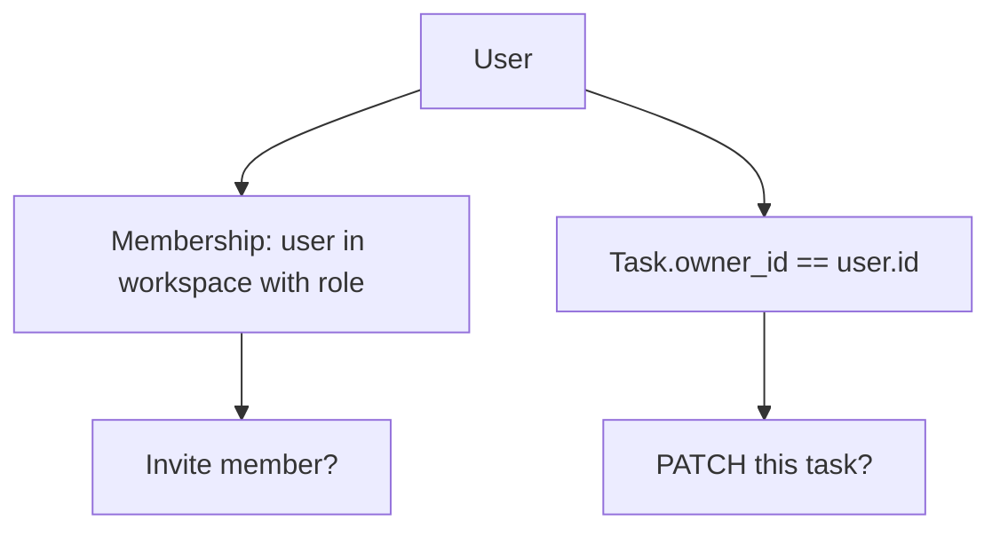
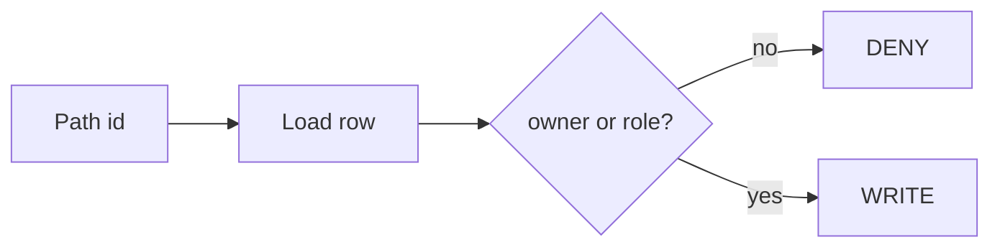

# Month 13 · Week 4 · Day 2
# RBAC Roles vs Ownership (Resource-Level)

**Program:** Full-Stack Mastery · 18 months  
**Phase:** 4 — Full-stack application engineering  
**Month index:** [../../README.md](../../README.md)  
**Week 4:** [1](day-01.md) · Day 2 (today) · [3](day-03.md) · [4](day-04.md) · [5](day-05.md) · [6](day-06.md) · [7](day-07.md)  
**Week rhythm today:** Exercises + debugging  
**Student state:** You can separate AuthN and AuthZ. Today: **two kinds of AuthZ** Project 7 needs — **roles** and **owners**.  
**Study time:** 3–4 focused hours

Labs: `~\fullstack-lab\month-13\week-04\day-02\`.

---

## How to use this textbook

1. Draw one resource with `owner_id` and one action gated by `role`.  
2. Debug the belief “admin can skip ownership everywhere” — sometimes yes, sometimes no; **you write it**.  
3. No IDOR exploit script. Tests use two users **you** created.

---

## How to read this chapter

**RBAC (role-based access control):** the user has a **role** (`member`, `admin`/`owner` of a workspace). Permissions are attached to the **role**.

**Ownership (resource-level):** this **row** has `owner_id` or `workspace_id`. Even a member in the same app may **not** edit **another** member’s object.



**Wrong belief:** “If they are `admin`, I skip all checks.”  
**Correct:** **platform** admin vs **workspace** admin are different. A workspace admin still should not edit **another workspace**. Write the matrix.

**Wrong belief:** “Ownership is enough; roles are enterprise fluff.”  
**Correct:** Project 7 **requires** at least member vs administrator/owner. Invites and billing-like actions are role-shaped.

---

## Today's contract

By the end of this day you will be able to:

1. Define RBAC vs ownership in one sentence each.  
2. Draw a **permission matrix** (role × action).  
3. Draw an **ownership rule** for one entity.  
4. Explain **IDOR** as a class: using another object’s id. **Prevent:** load + compare owner/org.  
5. Choose 403 vs 404 for cross-user access.

**Today's gate.** Closed-book:

> Roles are not enough; owner_id is not enough. I need both where the product has both. Wrong user’s id is denied on the server.

---

## Time box

| Block | Minutes | Work |
|---|---|---|
| A | 50 | Theory |
| B | 55 | Matrix + tiny store |
| C | 70 | Project 7 matrix |
| D | 20 | Git |
| E | 15 | Recall |

---

# Block A — Theory

## 1. RBAC

Roles are **strings** you persist (`workspace_members.role`). Check: `membership.role in {"admin", "owner"}`.

Do not sprinkle `if user.email == "me@..."`.

**Permission names** (`task:write`) are optional **ABAC/RBAC hybrid** later. Today: small role set.

## 2. Ownership

`notes.owner_id`. PATCH: `if note.owner_id != current_user.id: deny` unless your matrix says admins may.

**Nested resources:** a **task** belongs to a **project** belongs to a **workspace**. Check **the chain**. An unauthorized person might **try** to move a task to a workspace they are not in. **Prevent:** validate parent org membership on write.

## 3. IDOR class (Insecure Direct Object Reference)

The URL contains an id. AuthN succeeded. AuthZ forgot the row. **Prevent:** **always load the row** and check. Do not `update where id=:id` without `and owner_id=:uid` **or** an equivalent check in Python **before** write.

SQL `WHERE id = :id AND workspace_id = :ws` is a **good belt**. Python check is a **good belt**. Both is fine. Neither is a bug.

## 4. Lists

`GET /items` must **filter** to what they may see. Returning **all rows** for any logged-in user is an AuthZ bug. Pagination does not hide other people’s rows if you never filtered.

## 5. What someone might try

- **Try** incrementing integer ids. **Prevent:** checks, not “we use UUIDs so we are safe” (UUIDs help **guessing**, not **leaked** ids).  
- **Try** admin API as member. **Prevent:** role.  
- **Try** member API as logged-out. **Prevent:** 401.

---

# Block B — Type-along

```powershell
cd ~\fullstack-lab
mkdir month-13\week-04\day-02 -Force
cd ~\fullstack-lab\month-13\week-04\day-02
uv init --name lab-rbac-own
uv add fastapi uvicorn
uv add --dev pytest httpx
```

**Sticky notes** with `owner_id`. Two users via lab header `X-User-Id` again (`NOT-PRODUCT.txt`).

- POST `/notes` sets owner to current user  
- GET `/notes` returns **only** own notes  
- PATCH `/notes/{id}` owner only  
- DELETE `/notes/{id}` owner only  
- Optional: user `9` role admin can delete any — **if** you document it  

Tests: user 1 cannot PATCH user 2’s note.

Write `MATRIX.md` for this lab.

```powershell
uv run pytest -q
```

---

# Block C — Independent

`PROJECT7-MATRIX.md`:

Rows: actions. Columns: logged out, member, admin/owner. Cells: allow / deny / own-only.

One paragraph: **workspace** boundary.

```powershell
cd ~\fullstack-lab
git add month-13
git commit -m "Month 13 Day 2: RBAC vs ownership notes lab."
```

---

# Block E — Recall

1. RBAC vs owner_id.  
2. Why lists must filter.  
3. UUID ≠ AuthZ.  
4. Chain of parents.  
5. IDOR in one sentence.

---

## Office hours

**Filtered list but GET-one by id returns others.** You forgot get-one.  
**Admin in UI only.** Fail.  
**Global `is_admin` on user 1 in production.** Use membership per workspace.



---

# Lecture: two axes

Role is **who you are in the club**. Ownership is **whose backpack it is**. Admins of club A still do not open club B’s backpack unless you are a **platform** operator — which Project 7 probably is not.

---

## Definition of done

- [ ] Wrong owner denied in tests  
- [ ] List is filtered  
- [ ] PROJECT7-MATRIX.md  
- [ ] Commit exists  

---

## Optional review links

- [OWASP Authorization Cheat Sheet](https://cheatsheetseries.owasp.org/cheatsheets/Authorization_Cheat_Sheet.html)

---

## Tomorrow

**From memory:** an **update** endpoint that checks `owner_id`.

---

# Closing lecture — role and row

RBAC is the role on membership.
Ownership is a column on the row.
Lists filter. Get-one checks. Writes check.
UUIDs are not permission.

Matrix first. Then code. Lab notes, not the product dump.
X-User-Id is still not Project 7.

If user 1 patches user 2, the test must be red
until the check exists.

---

## Recite-back checklist (close the editor, then tick)

Write `RECITE.txt` with one honest sentence per line.

- [ ] RBAC defined  
- [ ] ownership defined  
- [ ] both needed  
- [ ] list filter  
- [ ] IDOR class  
- [ ] UUID not enough  
- [ ] matrix written  
- [ ] tests deny wrong user  

If a line is mush, re-read this file only.

---

# Extra lecture — two axes

Role is **who you are in the club**. Ownership is **whose backpack it is**. Admins of club A still do not open club B’s backpack unless you are a **platform** operator — which Project 7 probably is not.

RBAC: `membership.role`. Ownership: `notes.owner_id`. Lists **filter**. Get-one **checks**. Writes **check**. UUIDs help guessing, not leaked ids.

Nested: task → project → workspace. Check the **chain**. They might **try** to move a task into a workspace they are not in. **Prevent:** validate parent membership on write.

SQL belt: `WHERE id = :id AND workspace_id = :ws`. Python belt: compare after load. Neither is optional if the other is missing — both is fine.

Lab sticky notes: `~\fullstack-lab\month-13\week-04\day-02\`. `X-User-Id` still not Project 7. `NOT-PRODUCT.txt`.

`uv run pytest -q`. User 1 cannot PATCH user 2’s note.

PROJECT7-MATRIX.md: rows are actions; columns are logged out / member / admin; cells are allow / deny / own-only. One paragraph on **workspace** boundary.

If list is filtered but GET-one is not, you are not done.

---

# IDOR in one breath

The URL contains an id. AuthN succeeded. AuthZ forgot the row. **Prevent:** always load and check. Do not `update where id=:id` without owner/org.

Integer ids might be **tried** in sequence. UUIDs help **guessing**, not **leaked** ids. Still check.

Global `is_admin` on user 1 in production is not workspace-scoped. Use membership per workspace.

Lab: POST `/notes` owner = current user. GET list own only. PATCH/DELETE owner only. Optional admin user 9 if documented.

`MATRIX.md` for the lab. `PROJECT7-MATRIX.md` for the product.

`~\fullstack-lab\month-13\week-04\day-02\`. `uv run pytest -q`.

Do not sprinkle `if user.email == "me@..."`. Roles are persisted strings.

`NOT-PRODUCT.txt` again: Project 7 uses AUTH.md sessions. The lab header is a teaching crutch.

Workspace boundary paragraph in PROJECT7-MATRIX.md is required even if you only have one org today — write the future rule.

Lists that return every row to any logged-in user are an AuthZ bug. Pagination does not hide other people’s rows if you never filtered.

`~\fullstack-lab\month-13\week-04\day-02\`. Two users. Deny tests green.

If user 1 patches user 2, the test must be red until the check exists. Matrix first, then code.

UUIDs are not permission. Filter lists. Check get-one. Check writes. Check the parent chain.

`MATRIX.md` for the lab. `PROJECT7-MATRIX.md` for the product. Both exist before you call the day done.

`uv run pytest -q`. User 1 cannot PATCH user 2. List is filtered. GET-one denies or 404s.

Do not skip GET-one. A filtered list with an open get-one is still IDOR-shaped.


