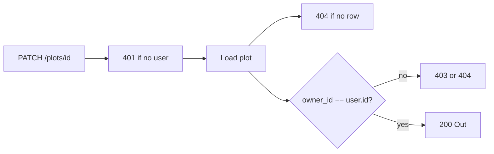

# Month 13 · Week 4 · Day 3
# From Memory: An Update Endpoint That Checks owner_id

**Program:** Full-Stack Mastery · 18 months  
**Phase:** 4 — Full-stack application engineering  
**Month index:** [../../README.md](../../README.md)  
**Week 4:** [1](day-01.md) · [2](day-02.md) · Day 3 (today) · [4](day-04.md) · [5](day-05.md) · [6](day-06.md) · [7](day-07.md)  
**Week rhythm today:** Implement from memory  
**Student state:** You can explain RBAC vs ownership. Today you **implement** a PATCH that **denies the wrong user**. Days 1–2 closed except this recap. Not Project 7’s domain.  
**Study time:** 3–4 focused hours  
**Prereq:** Day 2 gate passed.

Labs: `~\fullstack-lab\month-13\week-04\day-03\`. Noun: **garden plots**.

---

## How Day 3 works

Allowed: this recap, pytest, curl.exe.  
Not allowed: pasting Project 7, skipping the owner check “until Day 4 tests,” payloads.

Stuck 25 minutes: open Day 2 MATRIX section only. `lookups.txt`.

---

## How to read this chapter

An update is **not** `UPDATE plots SET label=:label WHERE id=:id`. That is how the **wrong** gardener changes a plot. The query (or the Python **before** it) must ensure **this user** may write **this row**.



**Wrong belief:** “I’ll check owner in React before enabling Save.”  
**Correct:** TestClient will PATCH anyway. The handler checks `owner_id`.

**Wrong belief:** “I’ll use X-User-Id in production because the lab did.”  
**Correct:** lab shortcut. Product: session from AUTH.md.

---

## Complete explanation (AuthZ you must still own)

**AuthN first:** no user → **401**. Do not 403 “not owner” when you do not know who they are.

**Load the row.** Missing → **404**.

**Compare `plot.owner_id` to `current_user.id`.** Mismatch → **403** or **404** (document). Do not leak the other gardener’s label in the error body.

**Then** apply PATCH with Pydantic `exclude_unset` if you have models; dict `in` if you do not. Do not change `owner_id` from the body unless the **matrix** says transfer is a feature (today: **ignore** body `owner_id`).

**Create:** `owner_id` from **session**, not from the client body (an unauthorized person might **try** to POST with someone else’s owner_id). **Prevent:** overwrite from current user.

**List:** filter `owner_id == current_user.id`.

**Statuses:** PATCH success 200. Unauthenticated 401. Wrong user 403/404.

**SQL:** `where(Plot.id == plot_id, Plot.owner_id == user.id)` is an extra belt. Still 404 if no row.

**Tests Day 4** will be the formal wrong-user suite. Today you still write **at least one** deny test so memory day is real.

**Windows:** `curl.exe`. Bind `127.0.0.1`.

```powershell
uv run uvicorn main:app --reload --host 127.0.0.1 --port 8000
```

---

## Today's contract

**Today's gate.** Closed-book:

> PATCH checks owner_id on the server. Create sets owner from the session. List is filtered. Wrong user is denied. I did not paste the product.

---

## Time box

| Block | Minutes | Work |
|---|---|---|
| A | 20 | Speak |
| B | 35 | Paper |
| C | 95 | Build garden plots |
| D | 30 | Two-user curl/TestClient |
| E | 15 | Lookups |

---

# Block A — Speak

1. 401 vs deny-owner.  
2. Why owner comes from session on create.  
3. Why body cannot retitle `owner_id` today.  
4. List filter.  
5. 403 vs 404 policy.

---

# Block B — Paper

1. Order of checks.  
2. Plot fields: `id`, `label`, `owner_id`.  
3. Two users, two plots — which PATCH statuses.

---

# Block C — Spec

```powershell
cd ~\fullstack-lab
mkdir month-13\week-04\day-03 -Force
cd ~\fullstack-lab\month-13\week-04\day-03
uv init --name lab-garden-plots
uv add fastapi uvicorn
uv add --dev pytest httpx
```

In-memory is enough. Lab auth: `X-User-Id` **or** the session sketch you can still type. `NOT-PRODUCT.txt`.

| Method | Path | Rules |
|---|---|---|
| POST | `/plots` | 201; owner = current user |
| GET | `/plots` | only own |
| GET | `/plots/{id}` | own 200; other 403/404 |
| PATCH | `/plots/{id}` | own 200; other denied; no owner change |

Tests: two users; user B denied on A’s id; B’s list empty of A’s plot.

```powershell
uv run pytest -q
```

---

# Block D — Defect hunt

1. PATCH without header → 401.  
2. PATCH other user’s id → deny.  
3. POST with body `owner_id` of someone else → still own.  
4. GET list as B does not include A.

---

# Block E

```powershell
cd ~\fullstack-lab
git add month-13
git commit -m "Month 13 Day 3: garden plot PATCH owner check from memory."
```

---

# Lecture: the check is boring on purpose

The best AuthZ looks like three lines and a test. Clever “signed ids” without a check still fail when the id leaks.

Do not return the other user’s plot in 403 `detail`.

---

## Definition of done

- [ ] Owner check on PATCH  
- [ ] Create ignores forged owner  
- [ ] List filtered  
- [ ] At least one deny test  
- [ ] Commit exists  

---

## Optional review links

- [FastAPI dependencies](https://fastapi.tiangolo.com/tutorial/dependencies/)  
- [OWASP Authorization](https://cheatsheetseries.owasp.org/cheatsheets/Authorization_Cheat_Sheet.html)

---

## Tomorrow

**Lab:** tests that the **wrong user is denied** (403/404). Write the test as **defense**.

---

# Closing lecture — load then compare

401 first. Load the row. Compare owner_id.
Deny without leaking. PATCH the fields you allow.
Create sets owner from the user, not the JSON.

Garden plots. Two users. pytest.
Not the product. Not X-User-Id in production.

If list is filtered but PATCH is not, you are not done.
If PATCH is checked but create accepts owner_id, you are not done.

---

## Recite-back checklist (close the editor, then tick)

Write `RECITE.txt` with one honest sentence per line.

- [ ] 401 first  
- [ ] load row  
- [ ] compare owner_id  
- [ ] deny status documented  
- [ ] create owner from session  
- [ ] list filter  
- [ ] deny test  
- [ ] not product dump  

If a line is mush, re-read this file only.

---

# Extra lecture — load then compare

401 first. Load the row. Compare `owner_id`. Deny without leaking the other gardener’s label. PATCH the fields you allow. Create sets owner from the **user**, not the JSON.

Garden plots. Two users. pytest. Not the product. Not `X-User-Id` in production.

If list is filtered but PATCH is not, you are not done.  
If PATCH is checked but create accepts `owner_id` from the body, you are not done.

Ignore body `owner_id` on PATCH unless transfer is a documented feature (today it is not).

Statuses: PATCH 200 own; 401 none; 403 or 404 other. Document in `ROUTES.txt`.

```powershell
uv run pytest -q
uv run uvicorn main:app --reload --host 127.0.0.1 --port 8000
```

`curl.exe` with two headers for two users. Predict deny **before** you run. `PREDICT.txt`.

Lab: `~\fullstack-lab\month-13\week-04\day-03\`. Day 4 will make the deny test ceremonial. Today you still write **one** deny test so memory day is real.

SQL extra belt: `where(Plot.id == plot_id, Plot.owner_id == user.id)` then 404 if no row.

---

# Spec table

| Method | Path | Rules |
|---|---|---|
| POST | `/plots` | 201; owner = current user |
| GET | `/plots` | only own |
| GET | `/plots/{id}` | own 200; other 403/404 |
| PATCH | `/plots/{id}` | own 200; other denied; no owner change |

Tests: two users; B denied on A’s id; B’s list empty of A’s plot.

`NOT-PRODUCT.txt`. Lab auth header or session sketch.

`lookups.txt` if you opened Day 2 after 25 minutes.

`~\fullstack-lab\month-13\week-04\day-03\`. `uv init --name lab-garden-plots`.

The best AuthZ looks like three lines and a test. Clever “signed ids” without a check still fail when the id leaks.

Do not return the other user’s plot in 403 `detail`.

`PREDICT.txt` before two-user curl. If B’s PATCH is 200, the memory day failed — add the compare before you commit.

`uv run pytest -q`. Bind `127.0.0.1`. `curl.exe` optional. Day 4 makes the deny test ceremonial; today you still write one deny test.

POST body `owner_id` of someone else still stores **you**. GET list as B does not include A. PATCH without header is 401.

`~\fullstack-lab\month-13\week-04\day-03\`. Garden plots. Not the product.

Create ignores forged `owner_id`. List filters. PATCH compares. One deny test today; four tomorrow.

If you skip the deny test because “Day 4 will do it,” memory day failed. Write it today.

`lookups.txt`. `NOT-PRODUCT.txt`. Two users in pytest. Garden plots.

PATCH without a user is 401, not “not owner.” Order of checks: AuthN, load, compare.

Day 4 will demand four tests. Today’s one deny test is the seed. Do not skip it.

Garden plots. Two users. Owner from session. Wrong user denied. That is memory day.

Commit. Do not paste Project 7. Day 4 is the ceremonial deny suite.


