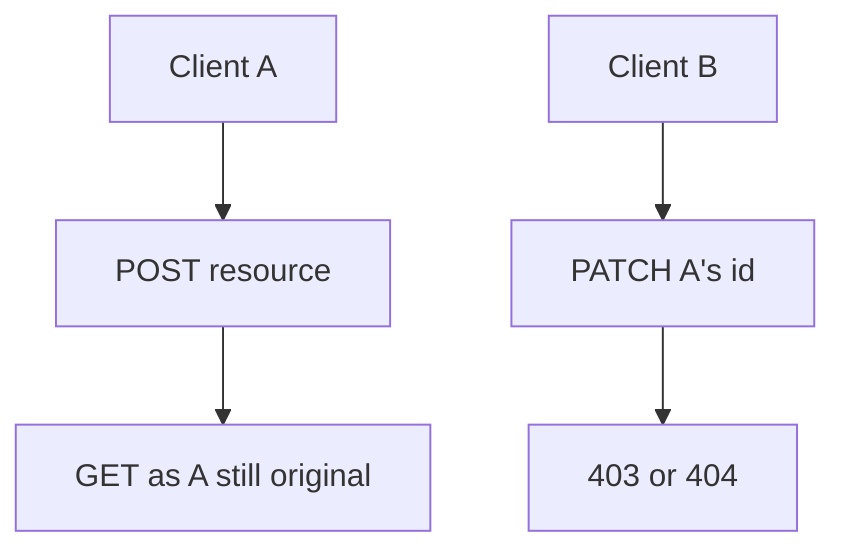
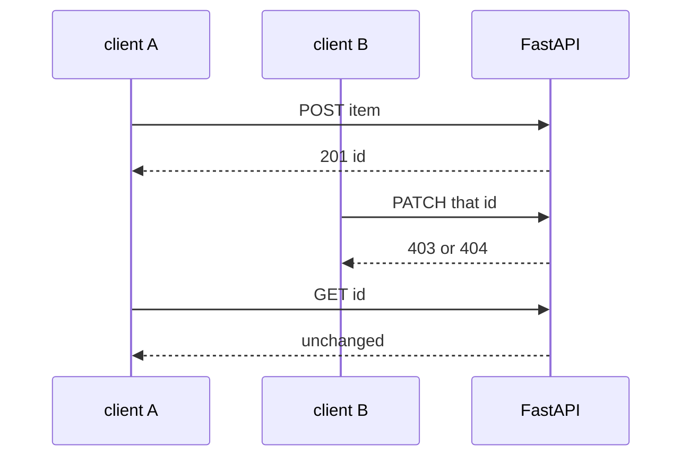

# Month 13 · Week 4 · Day 4
# Lab: Tests That the Wrong User Is Denied

**Program:** Full-Stack Mastery · 18 months  
**Phase:** 4 — Full-stack application engineering  
**Month index:** [../../README.md](../../README.md)  
**Week 4:** [1](day-01.md) · [2](day-02.md) · [3](day-03.md) · Day 4 (today) · [5](day-05.md) · [6](day-06.md) · [7](day-07.md)  
**Week rhythm today:** Learn + type-along (lab)  
**Student state:** You wrote a PATCH with `owner_id`. Today the **Month 13 gate** item becomes a **pytest**: the **wrong user** is **denied**. The test is **defense**, not an attack script against a live stranger.  
**Study time:** 3–4 focused hours

Labs: `~\fullstack-lab\month-13\week-04\day-04\`. Prefer adding the same **shape** of test to **Project 7** if the resource exists. This textbook will **not** paste the product.

---

## How to use this textbook

1. Create **two** users in the test.  
2. User A creates a resource.  
3. User B’s session/client **attempts** the mutating route.  
4. Assert **403 or 404** (your policy). Assert **A’s data unchanged**.  
5. Do not loop ids against production.

---

## How to read this chapter

An unauthorized (or **authorized-as-someone-else**) person might **try** to send **B’s** cookie to **A’s** object URL. **What prevents it:** the handler’s owner/role check. **What proves it:** a test that **will go red** if a future refactor removes the check.



**Wrong belief:** “I clicked in the UI as B and didn’t see the button, so we’re safe.”  
**Correct:** pytest uses HTTP. Buttons never ran.

**Wrong belief:** “A test that calls the API as the wrong user is an exploit.”  
**Correct:** it is a **regression lock** on **your** app with **your** fixtures. That is required professional work.

---

## Today's contract

By the end of this day you will be able to:

1. Fixture **two isolated users**.  
2. Write `test_wrong_user_cannot_update`.  
3. Write `test_wrong_user_cannot_delete` (or 405 if you have no delete).  
4. Write `test_wrong_user_cannot_get_if_policy_hides` if you chose 404.  
5. Apply the pattern to **one** Project 7 resource **or** document why the lab is the only evidence today.

**Today's gate.** Closed-book:

> Wrong-user tests exist and fail if AuthZ is removed. I did not scan someone else’s API.

---

## Time box

| Block | Minutes | Work |
|---|---|---|
| A | 40 | Theory of defensive tests |
| B | 70 | Type-along tests |
| C | 70 | Project 7 or extend garden |
| D | 20 | Git |
| E | 15 | Recall |

---

# Block A — Theory

## 1. Two clients

```python
def login(client: TestClient, email: str, password: str) -> TestClient:
    # or set cookie / header per your AUTH
    ...
```

Better: two `TestClient`s **or** the same client with **logout** between. Cookies stick — a classic flake is B still being A. **Logout** or **new client** per user. Fixture isolation from Month 9 still applies (clear DB).

If you use a lab header: `client.patch(..., headers={"X-User-Id": "2"})`.

## 2. Assertions that matter

- `status_code in {403, 404}` — **exact** one from CONTRACT.  
- Body has **no** A’s secret fields.  
- Follow-up GET as A: label unchanged.  
- B’s list still does not include A’s item (if list is private).

## 3. Do not assert only 401

If B is logged in, 401 would mean you **logged them out** by mistake. Wrong-user is **AuthZ**, not missing AuthN.

## 4. Admin exception

If admins **may** update, write **separate** tests: member denied, admin allowed — **only** if the matrix says so. Do not “fix” a failing member test by making everyone admin.

## 5. What this test is not

Not a fuzzing tool. Not a payload. Not a production scrape. Two users, one id, one verb.

---

# Block B — Type-along

```powershell
cd ~\fullstack-lab
mkdir month-13\week-04\day-04 -Force
cd ~\fullstack-lab\month-13\week-04\day-04
```

You may copy **your** Day 3 garden plots **into this folder** and add tests — do not copy Project 7.

Required tests in `test_authz.py`:

1. Unauthenticated PATCH → 401  
2. Wrong user PATCH → 403 or 404  
3. Owner PATCH → 200  
4. Wrong user does not change stored label  

```powershell
uv run pytest -q
```

**Break the check on purpose:** comment out `owner_id` compare, confirm tests **fail**, restore. Paste fail snippet into `RED-PROOF.txt`. That is the gate’s “tests that deny.”

---

# Block C — Independent

Project 7: pick **one** mutating path (update task, update item, …). Same four tests. If the app cannot register two users yet, finish users **today** or keep evidence in the lab and write `PRODUCT-GAP.md`.

Write `POLICY.txt`: 403 vs 404.

```powershell
cd ~\fullstack-lab
git add month-13
git commit -m "Month 13 Day 4: wrong-user authorization tests."
```

Commit product tests in the product repo.

---

# Block E — Recall

1. Why two users.  
2. Why 401 is the wrong deny for B.  
3. Why data-unchanged assert.  
4. Why commenting out the check must redden tests.

---

## Office hours

**Both users share one session cookie.** New client / logout.  
**Used the same email.** Unique emails in fixtures.  
**404 because id was wrong, not AuthZ.** Capture `id` from A’s 201 JSON.  
**TestClient `app` global users leaked.** Fixture clear.



---

# Lecture: this is the month’s unit of proof

The README gate: *ownership or role check on mutating endpoints; tests that deny the wrong user.* If Day 4 is only a lecture, the gate is false.

When you remove the check and tests stay green, the tests never looked at AuthZ.

`curl.exe` optional:

```powershell
curl.exe -s -D - -X PATCH http://127.0.0.1:8000/plots/1 -H "Content-Type: application/json" -H "X-User-Id: 2" --data-binary @patch.json
```

You want deny, not 200.

---

## Definition of done

- [ ] Wrong-user test green  
- [ ] RED-PROOF.txt shows tests catch a missing check  
- [ ] POLICY.txt  
- [ ] Product test or PRODUCT-GAP.md  
- [ ] Commit exists  

---

## Optional review links

- [FastAPI testing](https://fastapi.tiangolo.com/tutorial/testing/)  
- [OWASP Authorization](https://cheatsheetseries.owasp.org/cheatsheets/Authorization_Cheat_Sheet.html)

---

## Tomorrow

**Least privilege DB user**; **ABAC light** (owner, org attributes).

---

# Closing lecture — deny is a test, not a story

Two users. One id. Mutate as the wrong one.
403 or 404. Data unchanged. 401 is not this test.

Comment out the check. Tests must fail. Restore.
That loop is professional defense.

Lab garden or Project 7 resource. Not a scanner.
Not a payload. Your fixtures. Your app.

If B is still A, cookies stuck. New client.

Lab: `~\fullstack-lab\month-13\week-04\day-04\`.
Bind 127.0.0.1. uv run pytest -q.

---

## Recite-back checklist (close the editor, then tick)

Write `RECITE.txt` with one honest sentence per line.

- [ ] two users  
- [ ] wrong user denied  
- [ ] unchanged data  
- [ ] 401 vs 403/404  
- [ ] red when check removed  
- [ ] policy documented  
- [ ] product or gap  
- [ ] not an attack script  

If a line is mush, re-read this file only.

---

# Extra lecture — deny is a test, not a story

Two users. One id. Mutate as the wrong one. **403 or 404**. Data **unchanged**. **401** is not this test — 401 means B was not logged in.

Comment out the owner check. Tests **must fail**. Restore. Paste the fail in `RED-PROOF.txt`. If pytest stays green, the test never looked at AuthZ.

**Cookies stick.** B still being A is the classic flake. New `TestClient` or logout between users. Fixture **clears** stores.

**Capture `id` from A’s 201.** Do not hardcode `1` across tests without a reset.

Admin exception: only if the **matrix** says so. Do not “fix” a failing member test by making everyone admin.

```powershell
curl.exe -s -D - -X PATCH http://127.0.0.1:8000/plots/1 -H "Content-Type: application/json" -H "X-User-Id: 2" --data-binary @patch.json
```

You want deny, not 200. Bind `127.0.0.1`. `uv run uvicorn main:app --reload --host 127.0.0.1 --port 8000`.

Lab: `~\fullstack-lab\month-13\week-04\day-04\`. Product tests in **your** repo if the resource exists; else `PRODUCT-GAP.md`.

This is the month’s unit of proof. The README gate names it. If Day 4 is only a lecture, the gate is false.

Do not loop ids against production. Two fixtures. Your app. Defense.

---

# Worked session — the red-proof loop

1. Tests green with the owner check.  
2. Comment out the compare.  
3. `uv run pytest -q` — wrong-user test **red**.  
4. Restore. Green again.  
5. `RED-PROOF.txt` holds the fail snippet.

If step 3 is green, rewrite the test until it would catch the missing check.

Two `TestClient`s or logout. Unique emails. Capture id from 201.

Assertions: exact 403 **or** exact 404 (POLICY.txt); A’s GET still original label; B’s list omits A’s item if private.

Unauthenticated PATCH is **401** — a **different** test.

Project 7: one mutating path, same four tests, or `PRODUCT-GAP.md`.

Lab: `~\fullstack-lab\month-13\week-04\day-04\`. Copy **your** Day 3 garden, not the product.

`uv run pytest -q`. Windows: `curl.exe` optional for a deny status line.

The README gate: *tests that deny the wrong user.* This day is that sentence in pytest.

---

# Fixture isolation (Month 9 habit, now with two people)

Shared module dicts leak users between tests. `clear()` users, sessions, and items. Reset ids. Do not assert `id == 1` in two tests without a reset.

If B’s PATCH is 200 because B is still A, the cookie jar lied. New client.

If 404 because you patched `/plots/99` not A’s id, you did not test AuthZ. Use the id from 201.

Admin-allowed tests are **separate**. Do not weaken the member-deny test.

`POLICY.txt`: 403 vs 404. CONTRACT and tests agree.

Commit lab and, if you touched it, Project 7.

`~\fullstack-lab\month-13\week-04\day-04\`.

Tomorrow: least privilege DB user; ABAC-light owner and org attributes.

If RED-PROOF.txt is missing, the day is not done. The gate is a test that **would fail** without the check.

`POLICY.txt` and the test’s expected status must match. Do not assert `in {403, 404}` forever if the contract picked one.

Copy **your** Day 3 garden into this folder if you are not on Project 7 yet. Type the tests yourself. AI may not ship `test_wrong_user_cannot_update`.

When you remove the check and tests stay green, the tests never looked at AuthZ. That is the only interesting failure mode of this day.

`~\fullstack-lab\month-13\week-04\day-04\`. `uv run pytest -q`.

Product repo: same four tests on **one** mutating path. If two users cannot register yet, that is a Week 1 debt — finish users or write `PRODUCT-GAP.md` honestly.

Required test names (or equivalent):

- `test_unauthenticated_patch_401`  
- `test_wrong_user_cannot_update`  
- `test_owner_can_update`  
- `test_wrong_user_does_not_change_stored_label`  

Wrong-user is **403 or 404**, not 401. 401 means B was anonymous.

`~\fullstack-lab\month-13\week-04\day-04\`. Defense tests. No scanner.

Comment out the owner compare. Watch the wrong-user test go red. Restore. That loop is the definition of done, not a green suite you never broke.

If two tests share one cookie, B is A. New client. Fixture `clear()`.

The month gate names this day. If you only clicked the UI as B, you did not test HTTP. TestClient is the control.

Write `RED-PROOF.txt` with the failing assert when the check is removed. If you cannot make pytest fail, the test is theater.

Owner PATCH 200. Wrong user deny. Data unchanged. Unauthenticated 401. Those four claims.

Do not fuzz production. Do not write a loop over ids you do not own. Two fixtures. Your app. pytest.

`curl.exe` optional deny check on `127.0.0.1`. PowerShell `curl` is the wrong program.

Four named tests. RED-PROOF.txt. POLICY.txt. Product test or PRODUCT-GAP.md. That is the lab.

Comment out the check. Tests red. Restore. If that loop did not happen, the gate row is false.

This is defense. Two users you created. One id. One verb. pytest.


