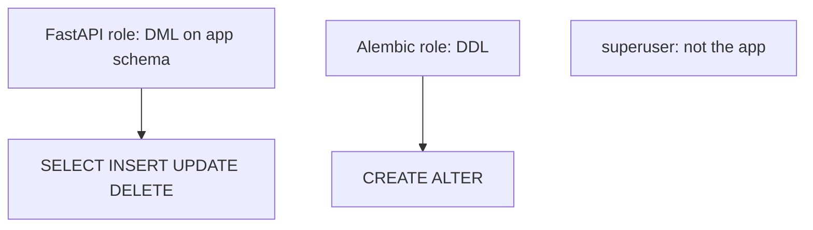
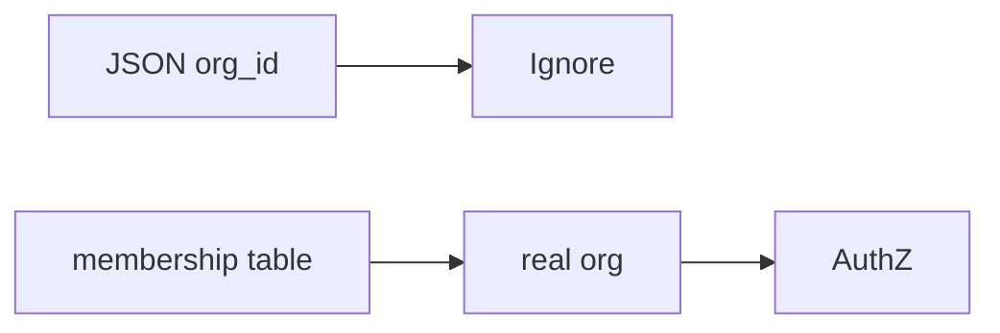

# Month 13 · Week 4 · Day 5
# Least Privilege for the Database User; ABAC Light

**Program:** Full-Stack Mastery · 18 months  
**Phase:** 4 — Full-stack application engineering  
**Month index:** [../../README.md](../../README.md)  
**Week 4:** [1](day-01.md) · [2](day-02.md) · [3](day-03.md) · [4](day-04.md) · Day 5 (today) · [6](day-06.md) · [7](day-07.md)  
**Week rhythm today:** Tests + refactor + documentation  
**Student state:** Wrong-user tests exist. Today: **the database account** should not be a superuser, and **attributes** (owner, org) as a light **ABAC** idea.  
**Study time:** 3–4 focused hours

Labs: `~\fullstack-lab\month-13\week-04\day-05\`. You may **not** have a spare Postgres role on Windows today — **writing GRANT policy** still counts; applying it is better.

---

## How to use this textbook

1. Read least privilege as **defense in depth** after binds.  
2. Write `DB-USER.md` for Project 7.  
3. Do not attempt to “pentest” your cloud vendor.

---

## How to read this chapter

**Least privilege:** every account (human, app, DB) gets **only** the permissions it needs. The FastAPI process should not migrate **and** serve **as `postgres` superuser** in production.

**ABAC (attribute-based access control), light:** decisions use **attributes** — `user.id`, `resource.owner_id`, `resource.org_id`, `membership.role`, `email_verified`. RBAC is “the role name.” ABAC is “the values on the row.” You already did owner_id; that **is** ABAC-light.



**Wrong belief:** “SQLAlchemy users cannot do harm if I bind parameters.”  
**Correct:** binds stop **injection**. A **stolen** app password that is **superuser** can still **DROP**. Least privilege **shrinks** that blast radius.

**Wrong belief:** “ABAC means I must buy a policy engine.”  
**Correct:** `if resource.org_id != user.org_id: deny` is ABAC-light. Cedar/OPA are later careers.

---

## Today's contract

By the end of this day you will be able to:

1. Explain **app user** vs **migration user** vs **superuser**.  
2. List **privileges** the app user needs (tables, sequences).  
3. Explain **owner** and **org** as attributes.  
4. Write a **deny** rule in attribute language.  
5. Note **Row Level Security** as optional Postgres awareness — not required to implement today.

**Today's gate.** Closed-book:

> The app DB user is not a superuser in the design. AuthZ uses attributes (owner, org) plus roles. I wrote it down even if I could not GRANT today.

---

## Time box

| Block | Minutes | Work |
|---|---|---|
| A | 45 | Theory |
| B | 55 | DB-USER.md + ABAC rules |
| C | 70 | Optional GRANT on local Postgres / paper |
| D | 20 | Git |
| E | 15 | Recall |

---

# Block A — Theory

## 1. Three roles (names yours)

| Role | Job |
|---|---|
| Superuser | Install Postgres, create DBs — **humans**, rare |
| Migrator | Alembic `upgrade` — CI or a controlled job |
| App | `SELECT/INSERT/UPDATE/DELETE` on **needed** tables |

App should **not** `DROP DATABASE`. App should **not** read `pg_shadow`.

**Connection string** in production uses the **app** user.

## 2. GRANT mindset (you need not memorize every SQL)

- `CONNECT` on database  
- `USAGE` on schema  
- DML on tables the API uses  
- `USAGE`/`SELECT` on sequences for serial ids  

Revoke public wild grants if you inherited a tutorial DB that said `GRANT ALL`.

If you cannot run GRANT on Windows today: the **document** is the deliverable. Month 15/16 will make ops more real.

## 3. ABAC-light attributes

| Attribute | Example rule |
|---|---|
| `user.id` | must equal `task.owner_id` for PATCH |
| `org_id` | `task.project.workspace_id` must be a workspace the user **belongs to** |
| `role` | `admin` may invite |
| `email_verified` | may not invite until verified |
| `is_active` | disabled user 401/403 |

**Wrong belief:** “I’ll pass `org_id` from the client and trust it.”  
**Correct:** take org from **membership lookup**, not from a spoofable body field (same as owner on create).

## 4. RLS awareness

Postgres **Row Level Security** can add `USING (owner_id = current_setting(...))`. Powerful, easy to misconfigure. **Literacy:** it exists. **This month:** Python/SQLAlchemy checks + tests are the bar. Do not enable RLS in production without a dedicated study block.

## 5. What someone might try

- **Try** to use a leaked `DATABASE_URL` that is superuser. **Prevent:** it is not superuser; rotate anyway.  
- **Try** to send `org_id` of a victim org in JSON. **Prevent:** ignore body org; use membership.

---

# Block B — Type-along (writing)

```powershell
cd ~\fullstack-lab
mkdir month-13\week-04\day-05 -Force
cd ~\fullstack-lab\month-13\week-04\day-05
```

`DB-USER.md`: three roles, what the app may do, what it must not, whether you **applied** GRANT (yes/no).

`ABAC.md`: five rules in the form `ALLOW PATCH task IF ...`.

`SPOOF.md`: why `owner_id` in the body is ignored.

---

# Block C — Independent

If local Postgres exists (Month 10/11 habit):

- Create a role `app_garden` with a password in **local .env only**.  
- GRANT DML on one lab table.  
- Try a migration as that user — **expect** failure if no DDL — write `EXPECTED.txt`.  

If no Postgres: skip without guilt; document.

Project 7: copy policy into `docs/DB-USER.md`. Confirm production plan is not `postgres:postgres`.

```powershell
cd ~\fullstack-lab
git add month-13
git commit -m "Month 13 Day 5: least privilege DB user and ABAC-light notes."
```

Do not commit DB passwords.

---

# Block E — Recall

1. Why binds ≠ least privilege.  
2. App vs migrator.  
3. Org from membership.  
4. RLS: awareness only.  
5. Body owner_id spoof.

---

## Office hours

**One URL for migrate and serve.** Works on a laptop. Production: split when you can.  
**GRANT ALL TO PUBLIC.** Undo in notes.  
**ABAC engine in week 5.** No. Five `if`s you can test.



---

# Lecture: defense in depth is a stack

Hashing. Sessions. Encoding. Binds. Owner checks. **Then** a DB user who cannot drop the cluster. Remove any layer and the story gets worse. Add RLS later if you outgrow app checks — not instead of tests.

---

## Definition of done

- [ ] DB-USER.md  
- [ ] ABAC.md five rules  
- [ ] SPOOF.md  
- [ ] No secrets committed  
- [ ] Commit exists  

---

## Optional review links

- [PostgreSQL GRANT](https://www.postgresql.org/docs/current/sql-grant.html)  
- [PostgreSQL RLS](https://www.postgresql.org/docs/current/ddl-rowsecurity.html)  
- [OWASP Authorization](https://cheatsheetseries.owasp.org/cheatsheets/Authorization_Cheat_Sheet.html)

---

## Tomorrow

**Independent:** threat model **one-pager** for Project 7.

---

# Closing lecture — small accounts, real attributes

The app is not a superuser.
Migrator is not the request path.
Owner and org are attributes you check.
Roles still exist. Bodies still lie. Look up membership.

RLS is a name you can say. Tests still rule this month.
GRANT on paper counts if Postgres is not here.

Lab: `~\fullstack-lab\month-13\week-04\day-05\`.
Never commit the app password.

If production DATABASE_URL is the superuser,
the one-pager tomorrow must say so as a gap.

---

## Recite-back checklist (close the editor, then tick)

Write `RECITE.txt` with one honest sentence per line.

- [ ] least privilege  
- [ ] app ≠ superuser  
- [ ] migrator split  
- [ ] ABAC-light owner/org  
- [ ] do not trust body org_id  
- [ ] RLS awareness  
- [ ] binds still required  
- [ ] docs written  

If a line is mush, re-read this file only.

---

# Extra lecture — small accounts, real attributes

The app is not a superuser. Migrator is not the request path. Owner and org are attributes you check. Roles still exist. Bodies still lie. Look up membership.

RLS is a name you can say. Tests still rule this month. GRANT on paper counts if Postgres is not here.

Lab: `~\fullstack-lab\month-13\week-04\day-05\`. Never commit the app password.

If production `DATABASE_URL` is the superuser, tomorrow’s one-pager must say so as a **gap**.

Binds stop **injection**. A stolen **superuser** URL can still `DROP`. Least privilege shrinks blast radius.

Do not trust `org_id` in JSON. Take org from **membership**.

ABAC-light is `if resource.org_id != membership.org_id: deny`. You do not need a policy engine this month.

Five rules in `ABAC.md` in the form `ALLOW PATCH task IF ...`.

`SPOOF.md`: why body `owner_id` is ignored.

Optional: create role `app_garden`, GRANT DML, expect Alembic to fail as that user — `EXPECTED.txt`.

---

# Three DB roles (names yours)

| Role | Job |
|---|---|
| Superuser | Install Postgres, create DBs — humans, rare |
| Migrator | Alembic `upgrade` — CI or a job |
| App | DML on needed tables only |

App should not `DROP DATABASE`. Connection string in production uses the **app** user.

GRANT mindset: CONNECT, USAGE on schema, DML on API tables, sequences as needed. Revoke tutorial `GRANT ALL`.

RLS: Postgres can filter rows in the database. Easy to misconfigure. **Literacy this month.** Python checks + tests are the bar.

`DB-USER.md` in lab and copy to Project 7. Confirm production plan is not `postgres:postgres`.

`~\fullstack-lab\month-13\week-04\day-05\`.

Binds ≠ least privilege. You need both.

`ABAC.md` five rules. `SPOOF.md` one page. `DB-USER.md` three roles. No passwords in git.


