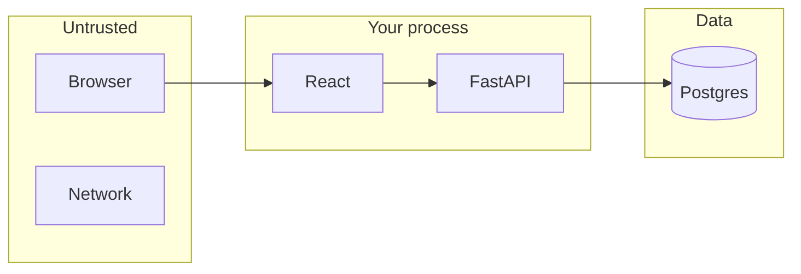

# Month 13 · Week 4 · Day 6
# Independent: Threat Model One-Pager for Project 7

**Program:** Full-Stack Mastery · 18 months  
**Phase:** 4 — Full-stack application engineering  
**Month index:** [../../README.md](../../README.md)  
**Week 4:** [1](day-01.md) · [2](day-02.md) · [3](day-03.md) · [4](day-04.md) · [5](day-05.md) · Day 6 (today) · [7](day-07.md)  
**Week rhythm today:** Independent implementation  
**Student state:** You have endpoint notes and AuthZ tests. Today you write the **one-pager** the month gate requires: assets, actors, trust boundaries, surfaces, mitigations.  
**Study time:** 3–4 focused hours

Canonical file: **Project 7** `docs/THREAT-MODEL.md` (or `THREAT-MODEL.md` at repo root). Copy under `~\fullstack-lab\month-13\week-04\day-06\` **without secrets**. This textbook will **not** fill in your domain.

---

## How to use this textbook

1. One **page** (you may go to two; not a novel).  
2. Defense language: might **try** / **prevent**.  
3. Link AUTH.md, matrix, wrong-user tests.  
4. AI may review structure; it may not invent your assets.

---

## How to read this chapter

A **threat model** is a **map**, not a vibe. Strangers to the repo should see **what you protect** and **which control you claim**.



**Wrong belief:** “I’ll copy an OWASP list and call it a model.”  
**Correct:** your endpoints, your cookies, your Postgres.

**Wrong belief:** “Threat model means I prove I can break in.”  
**Correct:** you prove you **thought** and **mitigated**. The gate is explanation plus deny-tests, not a red-team kit. No payloads. No intrusion steps.

---

## Today's contract

By the end of this day you will be able to:

1. List **assets**.  
2. List **actors** (anonymous, member, admin, stolen-session as a **class**, curious teammate).  
3. Draw **trust boundaries** (browser, API, DB, email vendor).  
4. List **attack surfaces** (endpoints, cookies, uploads if any, webhooks).  
5. Map **mitigations** (hash, flags, binds, CSRF, CORS, AuthZ tests, secrets, rate limit).  
6. List **gaps** you still accept this month.

**Today's gate.** Closed-book:

> I have a one-pager for Project 7 that a professor could mark. It uses defense language. Gaps are honest. I can walk an examiner through each major endpoint’s prevention.

---

## Time box

| Block | Minutes | Work |
|---|---|---|
| A | 25 | Outline + asset list |
| B | 40 | Write the full page |
| C | 90 | Align with AUTH.md, matrix, deny-tests; fix one gap or record it |
| D | 30 | Read the page aloud without the repo |
| E | 15 | Recall + git |

---

# Block A — Required headings

```markdown
# Threat model — Project 7 — <your product name>

## Assets
## Actors
## Trust boundaries
## Surfaces
## What someone might try / what prevents it
## Tests that lock the story
## Secrets and operations
## Gaps and Month 14+
```

No real passwords. No production URLs with tokens.

---

# Complete explanation (keep this open)

**AuthN:** argon2 or bcrypt via passlib/argon2-cffi; session or token per AUTH.md; HttpOnly, Secure, SameSite; generic 401; hashed reset/verify tokens. Never log passwords or tokens.

**AuthZ:** roles **and** owner/org attributes. The API refuses. Tests deny the **wrong user**. Hiding a button is courtesy.

**Web:** encode / React text children; CSRF plan for cookie POSTs; SQL binds not f-strings; CORS is not authentication; no private keys in `VITE_`; rate limit named; lockfiles committed.

**DB user:** not a superuser (Day 5).

**JWT:** only if AUTH.md chose it, with a **revoke** paragraph.

**Stolen session (class):** XSS plus a readable cookie, or HTTP without Secure. Mitigations you already named. Do not write malware.

**SSRF:** if any endpoint accepts a URL to fetch, allowlist or remove.

**IDOR class:** they might **try** another user’s id on PATCH. **Prevent:** load the row, check `owner_id` or org membership.

If Project 7 is still thin, model the **lab** auth API from this month **and** say so. Honesty about missing mitigations is a pass; fake green is not.

---

# Block B — Write the try/prevent table

Fill **8–12 rows** covering at least:

| Surface | Might try (one sentence) | Prevents it |
|---|---|---|
| POST /login | Guess passwords; compare error text | Hash, generic 401, rate limit (or gap) |
| POST /register | Flood; weak passwords | Validation, hash, rate limit |
| GET /me | Call with no cookie | 401 |
| PATCH /{your resource}/{id} | Another user’s id | owner/org check + deny test |
| GET list | See all tenants | filter by owner/org |
| Admin route | Member session | role check |
| Reset request | Enumerate emails | generic 200 |
| Cookie | Read from JS; ride on HTTP | HttpOnly, Secure, SameSite |
| SQL search `q` | Concatenate into SQL | parameterized / ORM bind |
| SPA origin | Browser JS from a stranger origin | tight CORS; still not auth |

Use **your** paths. Replace the examples.

---

# Block C — Align with evidence

Open **only** AUTH.md, the permission matrix, and the wrong-user test file. Tick:

- [ ] Cookie flags match AUTH.md  
- [ ] 403 vs 404 policy matches tests  
- [ ] Hashing library named  
- [ ] CORS origins named  
- [ ] Rate limit: done or gap  
- [ ] Deny-test **function names** appear under Tests  

If a prevent column **lies**, fix **code** or fix **the page**. Lying one-pagers fail tomorrow’s exam.

One improvement today if a gap is easy: generic 401 equality, or a missing owner check. Do not start a WAF. Do not probe a deployed URL you do not own.

---

# Block D — Aloud

Read the page without the repo. If a sentence needs the code to mean anything, rewrite it. A classmate should understand **assets** and **controls**.

---

# Block E — Recall

1. Asset vs surface.  
2. Why stolen-session is a class, not a tutorial.  
3. Where the canonical file lives.  
4. What happens if AUTH.md says sessions and the page says JWT.

---

## Quality bar

Too thin: “We follow OWASP.”  
Enough: “POST /login — they might try credential guessing; we hash with argon2, generic 401, and will 429; test `test_login_unknown_and_wrong_password_match`.”

Too thin: “IDOR is mitigated.”  
Enough: “PATCH /items/{id} — they might try another user’s id; we compare owner_id; `test_wrong_user_cannot_update`.”

Too thin: “hackers might hack login.”  
Enough: name the **status**, the **hash library**, and the **test**.

```powershell
cd ~\fullstack-lab
mkdir month-13\week-04\day-06 -Force
```

Copy THREAT-MODEL.md into the lab as backup **without** secrets.

```powershell
cd ~\fullstack-lab
git add month-13
git commit -m "Month 13 Day 6: Project 7 threat model one-pager copy."
```

Also commit the canonical file in the **Project 7** repo.

---

## Definition of done

- [ ] One-pager in Project 7  
- [ ] All headings present  
- [ ] Tests named  
- [ ] Gaps honest  
- [ ] No secrets / no payloads  
- [ ] AUTH.md agrees  

---

## Optional review links

Your model is the lesson. These pages are for later checking, not for first learning.

- [OWASP: Threat Modeling](https://owasp.org/www-community/Threat_Modeling)

---

## Tomorrow

**Month 13 exam + gate.** Synthesis lives in [day-07.md](day-07.md). Link to **Month 14** only if the gate table is true.

---

# Closing lecture — one page that could be marked

Assets. Actors. Boundaries. Surfaces.
Try/prevent in sentences. Tests with names.
Gaps with dates. AUTH.md agrees.

Your product name. Not a template CRM dump.
Defense only. Tomorrow’s exam will ask you to teach this
without opening Weeks 1–3 day files.

If the page says “JWT everywhere” and AUTH.md says
sessions, you are not done.

Lab copy has no secrets. Product repo is canonical.
curl.exe is not in this day’s critical path unless you
spot-check a deny status. Bind 127.0.0.1 if you do.

If the table lists only /health, you did not inventory.

---

## Recite-back checklist (close the editor, then tick)

Write `RECITE.txt` with one honest sentence per line.

- [ ] assets named  
- [ ] actors named  
- [ ] boundaries drawn  
- [ ] try + prevent rows  
- [ ] tests named  
- [ ] gaps honest  
- [ ] matches AUTH.md  
- [ ] in Project 7 repo  

If a line is mush, re-read this file only.
Do not start Month 14 tonight.
Do not paste exploit steps into the one-pager to “look senior.”
Controls and tests are senior.

---

# Quality bar examples (use YOUR paths)

Too thin: “We follow OWASP.”  
Enough: “POST /login — they might try credential guessing; we hash with argon2, generic 401, and will 429; test `test_login_unknown_and_wrong_password_match`.”

Too thin: “IDOR is mitigated.”  
Enough: “PATCH /items/{id} — they might try another user’s id; we compare owner_id; `test_wrong_user_cannot_update`.”

Stolen-session **class**: XSS + missing HttpOnly, or TLS missing. Name the flags. Do not write malware.

JWT only if AUTH.md chose it, with revoke. If the page says JWT and AUTH.md says sessions, you are not done.

`~\fullstack-lab\month-13\week-04\day-06\` copy without secrets.

Tomorrow: [day-07.md](day-07.md) exam. Month 14 only if the gate is true.

Read the page aloud. If a sentence needs the repo to mean anything, rewrite it. The exam will not open Weeks 1–3 day files for you.

If the table lists only `/health`, you did not inventory. Eight to twelve try/prevent rows. Tests named.

Gaps with dates. AUTH.md agrees. No secrets. No payloads. Canonical file in Project 7.

Stolen-session is a **class**. XSS plus a readable cookie, or HTTP without Secure. Name HttpOnly and Secure. Do not write malware.


