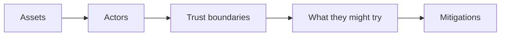

# Month 13 · Week 4 · Day 6
# Independent: Threat Model for Project 7

**Program:** Full-Stack Mastery · 18 months  
**Phase:** 4 — Full-stack application  
**Month index:** [../../README.md](../../README.md)  
**Week 4:** [1](day-01.md) · [2](day-02.md) · [3](day-03.md) · [4](day-04.md) · [5](day-05.md) · Day 6 (today) · [7](day-07.md)  
**Week rhythm today:** Independent  
**Study time:** 3–4 focused hours

Work in **your** Project 7 repo: `THREAT-MODEL.md`. This textbook will not paste the product. Defense only: what someone **might try**, what **stops** it. No payloads, no intrusion steps.

---

## How to read this chapter

A threat model is a **map**, not a horror story. Four columns you will fill:

**Wrong belief:** “I’ll copy an OWASP list and call it a model.”  
**Correct:** your endpoints, your cookies, your Postgres.

**Wrong belief:** “Threat model means I prove I can break in.”  
**Correct:** you prove you **thought** and **mitigated**. The gate is explanation plus deny-tests, not a red-team kit.

---

## Today's contract

Fill:

1. **Assets:** password hashes, session ids, project rows, uploaded files if any.  
2. **Actors:** anonymous, logged-in user, another user, future admin.  
3. **Trust boundaries:** browser, your API, Postgres, email port, Redis if any.  
4. For **each major mutating endpoint:** what an unauthorized person might try (one sentence) and **what prevents it** (authn, owner check, CSRF flags, parameterized SQL, CORS tightness).  
5. Tests you already have that **deny** the wrong user.

**Gate:** I can walk an examiner through each major endpoint’s prevention.

---

## Time box

| Block | Minutes | Work |
|---|---|---|
| A | 25 | List endpoints |
| B | 90 | THREAT-MODEL.md |
| C | 30 | Link deny-tests |
| D | 15 | Git |
| E | 15 | Recall |

---

If Project 7 is thin, model the **lab** auth API from this month. Honesty about missing mitigations is a pass; fake green is not.

---

## Definition of done

- [ ] THREAT-MODEL.md  
- [ ] Deny-tests linked  
- [ ] Commit  

---

## Tomorrow

Month 13 exam + gate.

---

## Optional review links

Your model is the lesson. These pages are for later checking, not for first learning.

- [OWASP: Threat Modeling](https://owasp.org/www-community/Threat_Modeling)
