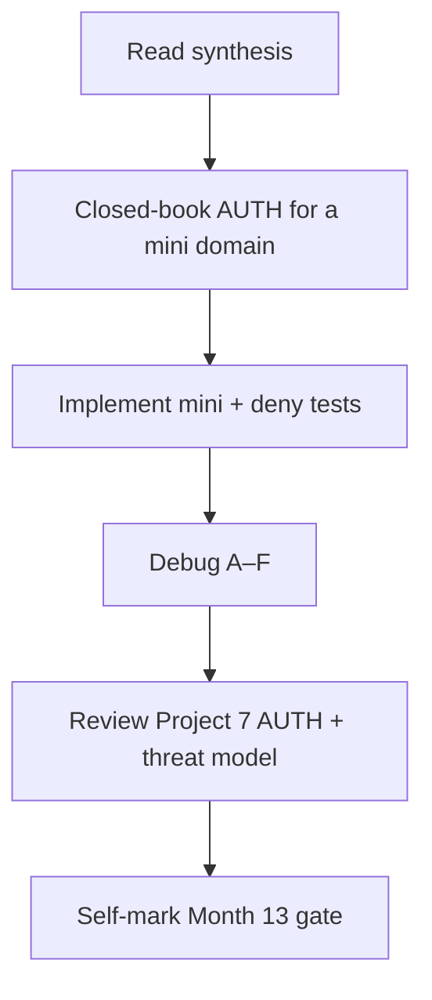
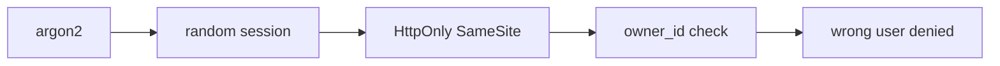

# Month 13 · Week 4 · Day 7
# Month 13 Exam + Gate

**Program:** Full-Stack Mastery · 18 months  
**Phase:** 4 — Full-stack application engineering  
**Month index:** [../../README.md](../../README.md)  
**Week 4:** [1](day-01.md) · [2](day-02.md) · [3](day-03.md) · [4](day-04.md) · [5](day-05.md) · [6](day-06.md) · Day 7 (today)  
**Week rhythm today:** Monthly exam  
**Study time:** 3–4 focused hours (Project 7 continues **after** if the gate is still false)

Textbook files stay **closed** except:

- **this file** (synthesis + exam blocks + self-mark table),
- Stage headings in `full_stack_project_requirements_2026/project_07_evolving_full_stack_product.md` if you need to remember **what 7 must contain** — not as a source to paste,
- your **own** `AUTH.md` and `THREAT-MODEL.md` only in Block 4 (review), not during Blocks 1–3.

Repair forgotten facts from **this synthesis**, not from Weeks 1–4 day files and not from an auth tutorial.

Work in `~\fullstack-lab\month-13-exam\` for exam evidence. Do **not** implement the exam mini inside Project 7. Do **not** start Month 14 because the calendar moved.

This exam teaches **defense**. Do not write exploits, payloads, or intrusion recipes in any answer.

---

## How to read this chapter

This file is the **exam and the teacher**. The synthesis is written so a student whose Weeks 1–4 notes are foggy can still re-learn the month from **today’s pages**, then prove it with the blocks and the gate.



During Blocks 1–3, other day files stay closed. If you go blank, re-read **this synthesis**. AI may not write exam-01, the mini-API, or the debug answers.

---

## Today's contract

By the end of this day you will be able to teach Month 13 aloud from this synthesis, design a tiny authz contract closed-book, ship a mini with hashing and wrong-user deny, debug classic failures, and **honestly** mark the Month 13 gate.

**Today's gate** is the Month 13 Gate table below — not “I attended four weeks.” If any required row is false, **do not start Month 14**. Continue Project 7.

---

## Time box

| Block | Minutes | Work |
|---|---|---|
| 0 | 25 | Read the complete explanation; speak it |
| 1 | 40 | Closed-book `exam-01-auth.md` |
| 2 | 50 | Mini-build (`mini/`) |
| 3 | 30 | Debug A–F |
| 4 | 20 | Review Project 7 AUTH.md + threat model |
| 5 | 15 | Break the wrong-user test; restore |
| 6 | 15 | Design: sessions vs JWT for first-party |
| 7 | 20 | Retro + self-mark |

---

## Month 13 synthesis (the lesson, in this book)

**Two questions:** Who are you (**AuthN**)? What may you do (**AuthZ**)? The UI hiding a button is **courtesy**. The **API refuses**. **401** = no valid identity. **403** = known identity, forbidden. **404** may hide that a row exists — pick a policy and test it.

**Passwords:** store **argon2 or bcrypt** via **passlib** / **argon2-cffi**. Never plaintext. **Salt is included** in the modern hash string. **Verify** is the library. Timing-safe compare is a **library property**, not your `==`. Never log passwords or tokens. Never put hashes on Out models. Hashing is not encryption; you cannot email the old password. **Reset** issues a **new** secret.

**Session id:** **random** (`secrets.token_urlsafe`), **unguessable**, mapped **server-side**, expired, **deleted on logout**. Not `user.id`. **Cookies** carry it for browsers. **HttpOnly:** JS cannot read via `document.cookie`. **Secure:** HTTPS only in production. **SameSite=Lax** (typical): limits cross-site sending. Server expiry still required. `curl.exe -D -` **shows** flags; browsers **enforce** SameSite.

**Tokens / JWT:** optional. Trade-offs: **revoke**, keys, size, SPA storage. **First-party** React + FastAPI often wants **server sessions + HttpOnly cookies**. Do not assume JWT. Do not put bearers in `localStorage`. AUTH.md **justifies** the choice.

**Enumeration:** they might **try** to learn which emails exist from login errors. **Prevent:** same **401** body. Tests assert **equality**. Dummy hash when user missing. Rate limit later. No guessing scripts against others’ sites.

**OAuth 2 / OIDC:** roles — **resource owner, client, authorization server, resource server**. OIDC adds identity. Code exchange on the **server**. No client secret in `VITE_`. **state** / **PKCE** concepts. Do not paste Google login as proof of the month. **No auto-link** on email match; store provider **`sub`**. **Email verification** proves **inbox control**.

**Reset / verify tokens:** random, **hashed at rest**, **purpose**, **expires_at**, **used_at**, **email port** (fake in tests). Request **generic**. Confirm refuses **expiry** (tests inject time).

**2FA:** a **second factor** (TOTP idea). Does not replace hashing. Not a product dump on the exam mini.

**XSS:** untrusted text must not become HTML/JS. **Encode**. **React children escape**. Avoid `dangerouslySetInnerHTML` unless **DOMPurify** sanitized. **CSP** backup. No payloads.

**CSRF:** cookie-authenticated **unsafe** methods. **SameSite** + **CSRF token concept**. GET does not mutate. HttpOnly ≠ CSRF.

**SQL injection:** never concatenate user text into SQL. **ORM binds** / `:params`. f-string SQL is the bug **shape** — do not complete it. Sort **whitelist**. **SSRF:** do not fetch arbitrary URLs; allowlist.

**CORS:** **browser** only. **Not authentication.** `curl.exe` still works. Tight origins. No `*`.

**Secrets:** `.env` gitignored; no private keys in `VITE_`. Rotate if committed.

**Rate limiting:** 429 on login/reset **attempts**. **Lockfiles** pin dependencies.

**RBAC vs ownership:** roles **and** `owner_id` / org attributes (**ABAC-light**). Lists **filter**. Create sets owner from **session**, not body. **Least privilege** DB user is not a superuser.

**Tests:** wrong user **denied**; data unchanged. Threat model one-pager: assets, actors, boundaries, mitigations.

**Wrong belief:** “JWT is how modern apps authenticate.”  
**Correct:** sessions are often simpler and safer for first-party browser apps.

**Wrong belief:** “Hiding a button is authorization.”  
**Correct:** the API must refuse.

The rest of this file unpacks those sentences so the exam is not a vocabulary quiz against a ghost month.

---

# Complete explanation — security you must still own

## 1. Hashing and sessions (Week 1)

Register hashes. Login verifies. Session row. Cookie flags. Generic 401. AUTH.md choice.

## 2. Recovery and OAuth literacy (Week 2)

Hashed expiring tokens. Email port. No auto-link. OAuth roles. 2FA named.

## 3. Web classes (Week 3)

XSS encode. CSRF SameSite+token. SQL binds. CORS myth. Secrets. Rate limit. Pinning.

## 4. Authorization (Week 4)

AuthN ≠ AuthZ. Matrix. Owner check. Wrong-user tests. DB least privilege. Threat model.

## 5. Project 7

Your domain. This exam mini is **lighthouse keepers** — not your product.

## 6. Windows

`curl.exe`. `uv run uvicorn main:app --reload --host 127.0.0.1 --port 8000`. Bind **127.0.0.1**.

---

# Block 0 — Speak the synthesis

Out loud, no other files: hash vs encrypt; session id; three cookie flags; JWT costs; generic 401; XSS vs CSRF; binds; CORS ≠ auth; AuthN vs AuthZ; wrong-user test. Then start Block 1.

---

# Block 1 — Closed-book contract (40 min)

Create `~\fullstack-lab\month-13-exam\exam-01-auth.md`.

**Domain (imposed so you cannot paste Project 7):** **lighthouse keepers** (users) and **logs** (each log belongs to a keeper via `owner_id`). No OAuth required.

The contract **must** include:

- Hashing library and algorithm  
- Session **or** token choice with **one** JWT trade-off sentence even if you chose sessions  
- Cookie flags if cookies  
- Register/login/logout/me statuses  
- Generic login 401  
- Log resource: POST create (owner from session), GET list (filtered), PATCH (owner check), statuses for wrong user  
- CORS origin `http://127.0.0.1:5173`  
- Persistence: in-memory **allowed** for the mini  
- One threat sentence per: login, PATCH log  

If you cannot fill it without opening Week files, re-read the synthesis. Do not open Day 6’s threat model during Block 1.

This block is **design**. Code is Block 2.

---

# Block 2 — Mini-build (50 min)

Textbook closed except this file’s spec reminders.

```powershell
cd ~\fullstack-lab
mkdir month-13-exam\mini -Force
cd ~\fullstack-lab\month-13-exam\mini
uv init --name exam-lighthouse
uv add fastapi uvicorn passlib argon2-cffi
uv add --dev pytest httpx
```

Implement **enough** of exam-01 to prove the month:

**Must:**

- `GET /health`  
- Register + login + `/me` + logout  
- Password hashed; UserOut no hash  
- Generic 401 equality test  
- Session cookie **HttpOnly** + **SameSite=lax** (or documented lab header **plus** a sentence that product uses cookies — prefer cookies)  
- Logs: POST, GET list own-only, PATCH owner check  
- TestClient: wrong user PATCH denied; owner’s label unchanged  
- Fixture clears users, sessions, logs  

**Should if time:** dummy hash on missing login user; CORS header test with Origin 5173.

**Must not:** SQL f-strings, JWT required, Google OAuth, `allow_origins=["*"]`, payloads, Project 7 copy, `dangerouslySetInnerHTML`.

```powershell
uv run pytest -q
uv run uvicorn main:app --reload --host 127.0.0.1 --port 8000
```

Use `curl.exe` once for unauthenticated PATCH (expect 401).

---

# Block 3 — Debug (30 min)

Write `exam-03-debug.md`. For each: **what the client sees**, **root cause**, **fix in one or two sentences**. **Defense language.** No exploit steps.

**A.** Login unknown email 404 `"no user"`; wrong password 401 `"bad password"`.  
**B.** PATCH as user B on A’s log returns 200 and changes the label. React hid the button.  
**C.** Session cookie is the string of `user.id`.  
**D.** `VITE_ARGON2_SECRET` in the SPA so “the client can hash first.”  
**E.** CORS `*` with credentials “so mobile works.”  
**F.** Reset token stored plaintext; request returns 404 if email unknown.

---

# Block 4 — Review Project 7

Open **only** AUTH.md, THREAT-MODEL.md (or THREATS.md), and the wrong-user test path. One mismatch: file `exam-04-p7.md` or fix **after** the mini is done. If threat model is missing, the month gate is **false**.

Do not start Month 14 “while you’re here.”

---

# Block 5 — Break a test

In mini: remove the owner check; `uv run pytest -q` must fail the wrong-user test; restore. Paste the fail snippet into `exam-05-fail.txt`.

If pytest stayed green, the test never checked AuthZ — fix the test, then break again.

---

# Block 6 — Design

`exam-06-design.md` (10–15 lines): why first-party Project 7 should **default to** server sessions + HttpOnly cookies rather than localStorage JWT. Name revoke and XSS **as classes**.

---

# Block 7 — Retro + self-mark

`exam-07-retro.md`: weakest week; whether AUTH.md still matches; remaining Project 7 work.

---

## Month 13 Gate (self-mark)

True **without a tutorial**. Evidence paths are yours.

| # | Claim | Evidence | Pass? |
|---|---|---|---|
| 1 | Password **hashes** (argon2 or bcrypt); never log passwords or tokens | register code + no hash on Out | |
| 2 | Session cookie vs tokens and **JWT trade-offs** explained | AUTH.md | |
| 3 | Cookie flags **HttpOnly**, **Secure**, **SameSite** — what each prevents | AUTH.md or exam mini Set-Cookie | |
| 4 | XSS and CSRF as **classes** and **mitigations** (encoding, CSP concept, SameSite / CSRF token) | threat model or exam-01 | |
| 5 | Parameterized SQL / ORM binds — never string-built queries | grep notes or product | |
| 6 | CORS is not authentication | exam-03 E or CORS.md | |
| 7 | **Ownership or role check** on mutating endpoints; tests that **deny** the wrong user | pytest + exam-05 | |
| 8 | Written threat model: assets, actors, trust boundaries, mitigations | THREAT-MODEL.md | |

If any **required** row is false, **do not start Month 14**. Finish Project 7 authz.

```powershell
cd ~\fullstack-lab
git add month-13-exam
git commit -m "Complete Month 13 exam evidence."
```

---

## If you passed

Month 14 is **Testing, code quality, reliability**. Open it only when this gate is true. You will **break a feature on purpose** and name the test that catches it. Authz tests you wrote this month should still exist.

Continue with [Month 14](../../month-14/README.md).

## If you did not pass

Stay on Month 13. This synthesis remains the teacher. Project 7 still needs hashes, sessions or a justified token design, deny tests, and a one-pager.

---

If the gate table has a false row, the honest action is more Project 7, not Month 14.

---

## Optional review links

Repair from this synthesis first.

- [OWASP Authentication](https://cheatsheetseries.owasp.org/cheatsheets/Authentication_Cheat_Sheet.html)  
- [OWASP Session Management](https://cheatsheetseries.owasp.org/cheatsheets/Session_Management_Cheat_Sheet.html)  
- [OWASP Authorization](https://cheatsheetseries.owasp.org/cheatsheets/Authorization_Cheat_Sheet.html)  
- [OWASP XSS Prevention](https://cheatsheetseries.owasp.org/cheatsheets/Cross_Site_Scripting_Prevention_Cheat_Sheet.html)  
- [OWASP CSRF Prevention](https://cheatsheetseries.owasp.org/cheatsheets/Cross-Site_Request_Forgery_Prevention_Cheat_Sheet.html)  
- [FastAPI CORS](https://fastapi.tiangolo.com/tutorial/cors/)  
- [passlib](https://passlib.readthedocs.io/en/stable/)

---

# Scoring the mini (you, not a grader bot)

| Piece | Honest pass |
|---|---|
| exam-01 | Hashing, session/token, flags, generic 401, owner PATCH, CORS, threats |
| Mini hash | stored ≠ plaintext; Out omits hash |
| Mini 401 | unknown vs wrong password **equal** |
| Mini PATCH | wrong user denied; label unchanged |
| Mini cookie | HttpOnly + SameSite **or** documented exception |
| Debug A–C | generic 401; API AuthZ; random sid |

If the mini used plaintext passwords to “save time,” Block 2 is a fail even if pytest is green.

---

## Worked answers you should not need — check after you write debug

**A.** Enumeration leak + wrong status. Same **401** string for both.  
**B.** UI is not AuthZ. Load log, compare `owner_id`, deny 403/404. Tests must exist.  
**C.** Session id is random unguessable, server-mapped — not user id.  
**D.** Hashing is **server-side**. `VITE_` is public. No secret in the SPA. Client-side hashing is not your password store.  
**E.** CORS is a browser allowlist, not auth. `*` + credentials is invalid/wrong. Use `http://127.0.0.1:5173`. curl still works.  
**F.** Hash tokens; generic 200 on reset **request**.

If your written answers disagree, fix them from this box **only after** you attempted A–F alone.



---

## Month 14 is not a reward for finishing the calendar

Month 14 deepens **tests**. It will not invent hashing for you. Students who skip deny tests produce green CI that never logs in as B. The gate exists to stop that.

Continue Project 7 until every gate row is true. Do not begin Month 14 on a false self-mark.

## Closed-book cards (write answers in exam-07-retro or a cards.md)

1. Hash vs encryption for passwords.  
2. Where salt lives in argon2/bcrypt.  
3. What a session id is.  
4. HttpOnly is for …  
5. Secure is for …  
6. SameSite is for …  
7. One JWT cost.  
8. Why two login failures must match.  
9. XSS in one sentence without a payload.  
10. CSRF vs HttpOnly.  
11. Why f-string SQL is forbidden (no payload).  
12. Why CORS is not auth.  
13. Why `VITE_` cannot hold the session secret.  
14. AuthN vs AuthZ.  
15. Why hiding a button fails.  
16. 401 vs 403 vs 404.  
17. Why create ignores body `owner_id`.  
18. What a wrong-user test asserts besides status.  
19. App DB user vs superuser.  
20. What the threat model one-pager must contain.

If you miss more than three, re-read the synthesis, then the gate table. Missing these and starting Month 14 is how “we’ll add AuthZ later” ships.

**Mini uvicorn** (after pytest is green):

```powershell
uv run uvicorn main:app --reload --host 127.0.0.1 --port 8000
curl.exe -s -D - -X PATCH http://127.0.0.1:8000/logs/1 -H "Content-Type: application/json" --data-binary @body.json
```

You want **401** without a session, not **200**. That is AuthN in a terminal.

Do not put the mini inside Project 7. Do not start Month 14 tonight on a false self-mark.

## Definition of done (exam day)

- [ ] exam-01 is implementable (hash, session/token, owner PATCH, CORS, threats)  
- [ ] Mini hashes passwords, generic 401, denies wrong user  
- [ ] Debug A–C written, then checked against the worked box  
- [ ] Self-mark table is honest  
- [ ] Month 14 not started on a false row  

The gate table is the course’s definition of done for the month. Attendance is not.

---

# Closing lecture — who, then whether, then tests

Hash passwords. Random sessions. Cookie flags.
JWT is a trade-off. Generic 401. Encode output.
Binds not f-strings. CORS is not a lock.
The API refuses the wrong user. pytest proves it.
Threat model names assets and controls.

Lighthouse mini. Not the product. curl.exe.
Bind 127.0.0.1. No payloads in exam-03.

If the gate has a false row, Month 14 waits.
If the wrong-user test stays green without a check,
the test is theater — rewrite it.

Month 14: [../../month-14/README.md](../../month-14/README.md)
when — and only when — the table is true.
