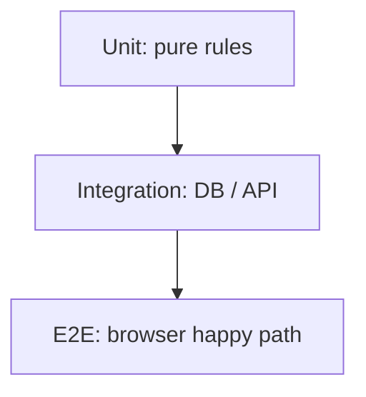

# Month 14 — Testing, Code Quality, Reliability

**Program:** Full-Stack Mastery Textbook  
**Phase:** 4 — Full-stack application engineering  
**Length:** 4 weeks · 7 days each · 3–4 focused hours/day  
**Prereq:** Month 13 gate passed (authz tests exist)  
**This month’s job:** Build a **test strategy** that would catch a real break — backend, frontend, and one **Playwright** critical flow — then **prove it** by breaking a feature on purpose.

This textbook will **not** paste Project 7.

---

## How this textbook is organized

```
month-14/
  README.md     ← you are here
  week-01/      pyramid, doubles, fixtures, determinism
  week-02/      pytest, DB isolation, fakes, failure paths
  week-03/      RTL, MSW, a11y in tests
  week-04/      Playwright, lint/format/hooks, review, coverage honesty
                + exam: break it; name the test
```

Labs: `~\fullstack-lab\month-14\`. Product tests live in **your** repos.

---

## What a test is (still)

Month 1: a claim that can fail. Month 14: the same idea with a **pyramid** — many fast unit tests, fewer integration tests, few E2E tests that walk a user story.



**Wrong belief:** “100% coverage means the product works.”  
**Correct:** coverage is a flashlight. A test that never failed is a souvenir (Month 1). This month you **make one fail on purpose**.

---

## Month 14 Gate

True **without a tutorial**:

1. Explain what **unit / integration / component / E2E** each catch — with examples from *your* Project 7.  
2. Pytest fixtures isolate the database (transaction or dedicated test DB).  
3. External I/O (email, Redis, clock) is faked at a **boundary**.  
4. RTL tests query by **role and name**, not CSS soup.  
5. MSW (or equivalent) stands in for HTTP in component tests.  
6. Playwright covers **one** critical flow (login + a core create/list).  
7. Lint + format are automatic; review comments are about behavior.  
8. **Break a feature deliberately** and show **which automated test** turns red.

If any item is false, do not start Month 15.

---

## Start

Open [week-01/day-01.md](week-01/day-01.md).

When Month 14’s gate is true, Month 15 (Linux, Docker, observability) is next.
