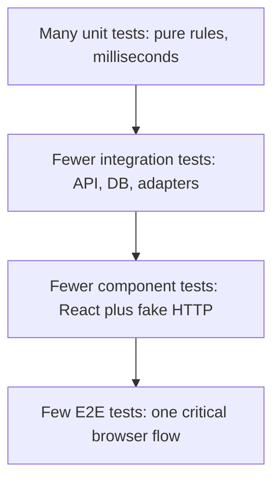
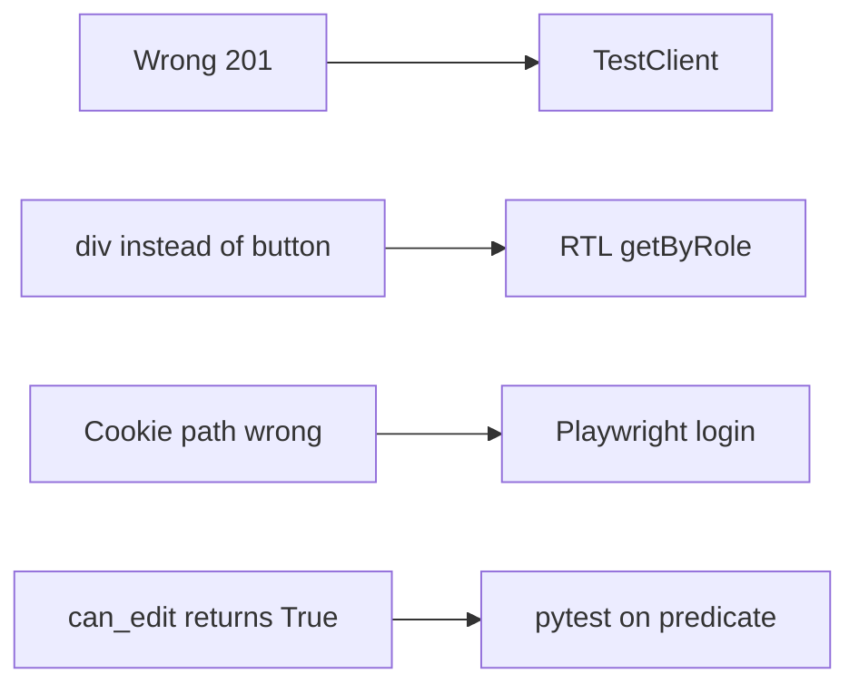

# Month 14 · Week 1 · Day 1
# The Test Pyramid: Layers, Cost, and Coverage as a Flashlight

**Program:** Full-Stack Mastery · 18 months  
**Phase:** 4 — Full-stack application  
**Month index:** [../../README.md](../../README.md)  
**Week 1:** Day 1 (today) · [2](day-02.md) · [3](day-03.md) · [4](day-04.md) · [5](day-05.md) · [6](day-06.md) · [7](day-07.md)  
**Week rhythm today:** Learn + type-along  
**Student state:** Month 13’s gate is true: you have authz tests that **deny** the wrong user. Project 7 already lives in **your** repos. This month you do not invent a new product. You build a **net** that would catch a real break.  
**Study time:** 3–4 focused hours

**This week covers:** unit, integration, API, component, E2E, pyramid trade-offs, doubles, fixtures, determinism.

Today: what each layer **catches**, what it **costs**, and why **coverage percent** is a flashlight. Doubles are Day 2. The typed unit-plus-HTTP lab is Day 4. Do not skip either.

Labs: `~\fullstack-lab\month-14\week-01\day-01\`. Product tests stay in **your** Project 7 repos. This textbook will **not** paste that product.

---

## How to use this textbook

1. Read a section. Close it. Say the idea in a full sentence with an example from **your** app.  
2. Type the tiny classifier lab. Do not paste a “test strategy template” from the internet.  
3. When you name a layer, name **what bug it would catch** — not a slogan.  
4. Optional review links are for later rechecking.

---

## How to read this chapter

A **test** is still Month 1’s claim that can fail. Month 14 organizes those claims into a **pyramid**: many fast tests close to pure rules, fewer tests that cross a real boundary (HTTP, database), few tests that walk a browser like a person.



Cost rises as you climb. Signal also changes. A unit test tells you **which function** lied. An E2E test tells you **a person cannot finish the job**. You need both kinds of sentence. You do not need a thousand of the expensive kind.

**Wrong belief:** “100% coverage means the product works.”  
**Correct:** coverage is a **flashlight**. It shows lines the suite never executed. It does not prove those lines are *right*, and it does not prove the lines you *did* execute match what a user needs. A test that never failed is still a souvenir (Month 1). This month you will **make one fail on purpose**.

**Wrong belief:** “If Playwright is green, I can skip pytest.”  
**Correct:** a browser test that logs in and creates a record is slow, flaky when the database is dirty, and almost silent about *why* a 403 became a 200. The pyramid exists so the cheap tests catch cheap bugs.

---

## Today's contract

By the end of this day you will be able to:

1. Name **unit**, **integration** (including HTTP/API), **component**, and **E2E** — and say what each **catches** that the others miss.  
2. Explain **cost**: time to write, time to run, time to debug, flake risk.  
3. Place eight example claims on the pyramid (practice for Day 3).  
4. Treat **coverage %** as a search tool, not a trophy.  
5. Write `LAYERS.md` in the lab with examples from **your** Project 7 — without pasting product source into this course folder.

**Today's gate.** Closed-book:

> Unit tests catch pure rules. Integration tests catch wiring: status codes, SQL, adapters. Component tests catch what the UI shows for a given HTTP story. E2E catches one path a person must not lose. Coverage shows darkness; it does not prove light.

---

## Time box

| Block | Minutes | Work |
|---|---|---|
| A | 55 | Theory |
| B | 55 | Type-along: tiny rules + a layer table |
| C | 70 | Independent: map *your* product to the pyramid |
| D | 15 | Git |
| E | 15 | Recall |

---

# Block A — Theory

## 1. Why this month exists

You already wrote tests. Month 8 taught pytest on functions. Month 9 taught `TestClient` as **HTTP**, not a function call. Month 11 asked for a **test database**. Month 12 asked you to change **DB → API → UI → a test**. Month 13 required tests that **deny** the wrong user.

Those were local skills. Teams still ship bugs because the suite is a pile: slow E2E for everything, or 2,000 unit tests that never open a socket, or 97% coverage on getters and 0% on the permission branch.

Month 14’s job is a **strategy** you can defend, then a **proof**: break a feature on Week 4 Day 7 and **name the test** that turns red.

## 2. Four layers this course names

People argue about labels. We will use these four so your `TEST-STRATEGY.md` (Day 6) has a shared vocabulary. **API tests** are integration tests of the HTTP adapter. Saying “API tests” when you mean TestClient is fine. Just know they do not replace a SQL constraint test, and they do not replace Playwright.

| Layer | Speaks to | Typical tools here | What it is *not* |
|---|---|---|---|
| **Unit** | A function or small module with **no I/O** | `uv run pytest` on pure Python; Vitest on a pure TS helper | A TestClient call; a real Postgres session |
| **Integration** | Two real pieces wired together | `TestClient` + app; pytest + **test DB**; adapter + fake clock | A full Chrome login |
| **Component** | React tree as a user would query it | Vitest + **React Testing Library** + **MSW** | CSS-selector soup; Playwright |
| **E2E** | A person in a real browser against a running stack | **Playwright**, locators by **role and name** | `time.sleep`; clicking by `div.btn-primary` |

**Wrong belief:** “If I use TestClient, I wrote an E2E test.”  
**Correct:** TestClient is **in-process HTTP**. No browser. Fast. That is a gift. Call it integration (or API integration). Save “E2E” for Playwright.

## 3. What each layer actually catches

Speak these aloud. If you cannot, you do not own the pyramid yet.

**Unit** catches: off-by-one in a paginator helper; a timezone math error in a pure function; a permission **predicate** that returns `True` for the wrong role when you pass it plain data. It will **not** catch a missing `status_code=201` on the decorator, a SQL `JOIN` that duplicates rows, or a button with no accessible name.

**Integration** catches: the decorator says 200 instead of 201; Pydantic 422 `loc`; SQLAlchemy session not committed; a 403 that the service intended but the router never raised; a unique constraint that the Python `if` forgot. It will **not** catch “the submit control is a `div`” or “the list never refetches after create.”

**Component** catches: loading / empty / error **copy** the user sees; a form that cannot be found by label; MSW returned `[]` and the heading “No permits yet” never appears. It will **not** catch Postgres isolation bugs or a CORS header your Vite origin needs.

**E2E** catches: login cookie never set, create form submits, list never shows the new row — the **story** broke. It will **not** cheaply tell you *which* layer lied. Debug starts with “the flow is red,” then you walk down the pyramid.



## 4. Cost is not only runtime

When a professor says “E2E is expensive,” students hear “seconds on CI.” That is the smallest bill.

| Cost | Unit | Integration | Component | E2E |
|---|---|---|---|---|
| Write time | Low if the function is pure | Medium: fixtures, DB | Medium: MSW handlers | High: auth, data, selectors |
| Run time | Milliseconds | Seconds | Seconds | Tens of seconds to minutes |
| Debug time | Stack in one module | HTTP + SQL logs | “What did MSW return?” | Video, trace, shared DB |
| Flake risk | Low if deterministic | Medium if DB dirty | Medium if timers | High if sleeps and shared state |
| Confidence for a **user story** | Low | Medium | Medium | High **for that path** |

A healthy suite is **not** “as many E2E as we can afford.” It is **enough** E2E that a broken login-or-create would scream, plus enough cheaper tests that you can find the scream’s cause.

**Wrong belief:** “I will write one Playwright test per REST endpoint.”  
**Correct:** that is how CI becomes a weather report. Cover endpoints with TestClient. Cover **one** critical user flow with Playwright (Week 4).

## 5. The pyramid is a shape, not a religion

Mike Cohn’s pyramid (many unit, fewer service, few UI) is a **default** for server-heavy apps. Some teams draw a **trophy** (too many UI tests) or an **ice-cream cone** (a huge E2E suite sitting on almost no units). You will see those cartoons. Use them as diagnosis, not as identity.

For **your** full-stack app:

- Pure domain rules (who may edit, how a total is computed, how a slug is normalized) → **unit**.  
- FastAPI path operations, status codes, authz on the API, SQL constraints → **integration**.  
- List/detail/create screens, Query loading states → **component** with MSW.  
- Login + create + see it in the list → **one** Playwright flow, then maybe one more if a second story is equally load-bearing (you will justify it in Day 6).

If your domain has almost no pure functions, that is a design smell, not a reason to skip unit tests. Extract a predicate. Test it.

## 6. Coverage as a flashlight

**Line coverage** answers: did *any* test execute this line?  
**Branch coverage** answers: did we take `if` and `else`?

Neither answers: did we assert anything **true**?

```python
def can_edit(role: str, owner_id: int, user_id: int) -> bool:
    if role == "admin":
        return True
    return owner_id == user_id
```

A test that only calls `can_edit("admin", 1, 2)` can look “covered” while the member path never ran. A test that never asserts the **False** case can still look green. The **deny** path is the Month 13 lesson. Coverage % will not shame you into writing it. **You** have to look.

How to use the flashlight this month:

1. Generate a report (`pytest-cov` or Vitest coverage) **locally**.  
2. Open the **uncovered** files that sit on money, permission, delete, and “wrong user.”  
3. Write **one** test for a dark branch that matters.  
4. Do **not** add `pragma: no cover` to feel finished.  
5. Do **not** chase 100% on `__init__.py` and trivial getters.

**Wrong belief:** “CI should fail under 90% or we are unprofessional.”  
**Correct:** a floor can help a team that already writes meaningful tests. A floor on a suite of tautologies produces tautologies. Week 4 Day 5 returns to this. Today: learn to **read** a report.

Python: `uv add --dev pytest-cov` then `uv run pytest --cov=. --cov-report=term-missing`. The `term-missing` column is the flashlight. Frontend: Vitest coverage with `v8`. Walk **authz and mutations**. Ignore generated env types.

**Wrong belief:** “Uncovered lines are always bugs.”  
**Correct:** some lines are defensive `if TYPE_CHECKING` or unreachable framework glue. Walk the report with a question: “If this line were wrong, would a user suffer?” If yes, write a test. If no, leave it dark and stay calm.

## 7. Isolation vs “the whole app”

A unit test that imports your FastAPI `app` and hits Postgres is not a unit test. That is fine — **call it integration** and give it a fixture. Lying about the layer is how juniors “have 400 unit tests” that need Docker.

A component test that fetches the real `http://127.0.0.1:8000` is not a component test. It is an accidental E2E with no browser. Week 3 uses **MSW** so the component suite does not require the API process.

**Wrong belief:** “Hitting the real API from Vitest is more honest.”  
**Correct:** it is a different layer. Honesty is **naming** the layer and isolating it. Mixing layers in one file makes failures unreadable.

## 8. Worked bugs — which layer should have caught them

Keep this table in your notes. Day 3 will ask you to classify without looking.

**Bug A.** `POST /holds` returns **200** and the JSON has no `id`. The service function `create_hold` returns the right dict when you call it in a REPL.  
**Layer:** integration (HTTP). The decorator defaulted to 200. A unit test on `create_hold` stayed green.

**Bug B.** Members can `PATCH` someone else’s hold. `can_edit` is never called; the router loads the row and saves.  
**Layer:** integration (authz on the API). A unit test on an unused predicate would not have saved you. You still want the predicate *and* the 403 HTTP test.

**Bug C.** The list page shows a spinner forever because the query key never includes the filter. The API is fine in TestClient.  
**Layer:** component (TanStack Query + UI). E2E would also catch it, slowly.

**Bug D.** Login works in Playwright on your machine and fails in CI because both jobs share one database user row and one job logs the user out.  
**Layer:** E2E **isolation** (Week 4 Day 3), not “Playwright is bad.”

**Bug E.** `round_money` is wrong because you used local `datetime.now()` to pick a tax table.  
**Layer:** unit — **if** you pass the date in. If the function reads the clock globally, Day 5 applies.

## 9. How this course already used the pyramid

| Month | What you wrote | Layer |
|---|---|---|
| 4 | Arrange / act / assert on JS functions | Unit |
| 6–7 | RTL `getByRole` on a component | Component |
| 8 | pytest on a CLI’s functions + `tmp_path` | Unit / thin file integration |
| 9 | `TestClient` status + JSON | Integration (HTTP, in-process) |
| 11 | Tests against a **test database** | Integration (DB) |
| 12 | DB → API → UI → a test | Cheapest layer that could catch the change |
| 13 | Deny the wrong user | Integration (and unit predicates if extracted) |

Month 14 is not a new religion. It is **naming**, **balancing cost**, and **proving** the net with a deliberate break.

## 10. How many tests is “enough”?

There is no honest integer. There is an honest **set of risks**:

1. Pure rules (money, permission, date math) have unit tests including **deny / zero / empty**.  
2. Every path operation you advertise in CONTRACT.md has at least one HTTP test for success and one for a documented error.  
3. List/detail screens have loading, empty, and error **component** tests (Week 3).  
4. One Playwright flow would fail if login or create-or-list died (Week 4).  
5. You can name the test that would go red if you commented out an authz check.

If item 5 is “none,” the pyramid is decoration. Week 4 Day 7 exists for that reason.

## 11. What you will not do today

- You will not install Playwright today (Week 4).  
- You will not rewrite Project 7.  
- You will not paste product source into `fullstack-lab`.  
- You will not treat this file as a license to skip Days 2–6 because “I already know testing.”

## 12. Say it — closed-book drill (two minutes)

Without looking: unit vs integration vs component vs E2E; why 100% coverage on a predicate can still ship a 200; one cost of E2E besides wall-clock time; whether TestClient is E2E. If you stumble, re-read sections 2–6. Do not open Playwright docs.

---

# Block B — Type-along

```powershell
cd ~\fullstack-lab
mkdir month-14\week-01\day-01 -Force
cd ~\fullstack-lab\month-14\week-01\day-01
uv init --name lab-pyramid
uv add --dev pytest
```

Create `rules.py`. Type it. A **permit** may be edited if the actor is an admin or the owner:

```python
def can_edit_permit(role: str, owner_id: int, actor_id: int) -> bool:
    if role == "admin":
        return True
    return owner_id == actor_id
```

Create `test_rules.py` with three unit tests: admin yes, owner yes, other member no. Names like `test_member_cannot_edit_someone_elses_permit`.

```powershell
uv run pytest -q
```

Then write `LAYERS.md` **in this lab folder**. It is not Project 7. It is a **practice table**. Fill “Would catch” and “Would miss” in your own words:

| # | Claim | Layer | Would catch | Would miss |
|---|---|---|---|---|
| 1 | `can_edit_permit` is false for a member who is not the owner | unit | | |
| 2 | `POST /permits` returns 201 and an `id` | | | |
| 3 | `GET /permits/999` returns 404 | | | |
| 4 | `GET /permits/1` as another user returns 403 | | | |
| 5 | The permits list shows “No permits yet” when the API returns `[]` | | | |
| 6 | The submit control is a real button named “Create permit” | | | |
| 7 | After login, creating a permit shows that title on the list page | | | |
| 8 | Coverage report says `rules.py` is 100% | *(not a test)* | | |

Row 8 is a trick. Coverage is not a test layer. Write one sentence under the table: **what coverage cannot catch** even at 100% on `rules.py` (example: the router never calls `can_edit_permit`).

Write `COST.txt`: five lines, one per layer plus coverage, each naming **one cost** (time, flake, or false confidence).

---

# Block C — Independent

Open **your** Project 7 in another window. Do not copy source into the lab.

Write `MY-PYRAMID.md` in the lab folder (paths and resource **names** only — no pasted handlers).

Required sections:

1. **Unit** — two functions or predicates you have *or will extract*. If you cannot name two, that is the homework: extract them this week.  
2. **Integration** — three HTTP claims you already have or owe (include **one deny**: 401/403).  
3. **Component** — one list or detail screen and the three states: loading, empty, error.  
4. **E2E** — one sentence: login + create + see in list, using **your** nouns.  
5. **Coverage** — one file you will inspect with a flashlight later this month (permission or delete).

If a section is empty because the product is behind, write **that** honestly. Empty and honest beats a fake table.

Do not start Week 4 Playwright today “to get ahead.” The pyramid is the lesson.

---

# Block D — Git

```powershell
cd ~\fullstack-lab
git add month-14
git commit -m "Month 14 Day 1: pyramid layers, unit rules, MY-PYRAMID.md."
```

---

# Block E — Recall

1. Why TestClient is not E2E.  
2. What a unit test cannot catch about `status_code=201`.  
3. Why a 100% covered `can_edit` can still ship a 200 for the wrong user.  
4. Name one cost of E2E that is not “it is slow.”  
5. Flashlight vs trophy — one sentence.

## Office hours — pyramids that lie

**Ice-cream cone.** Twenty Playwright files, three pytest functions, no 403 test. CI is red for “timing.” Authz is untested. Repair: move endpoint claims to TestClient; keep one flow in Playwright.

**Trophy coverage.** `can_edit` tested only with `admin`. Report looks fine. A member edits someone else’s row. Repair: a **deny** unit test *and* a 403 HTTP test. They catch different bugs.

**Calling it unit because pytest ran it.** `test_create` uses TestClient and Postgres. Fine — **label it integration** in `TEST-STRATEGY.md`. Wrong labels make Day 6 unreadably optimistic.

**One test to rule them all.** A Playwright test that also asserts JSON of an intercept *and* SQL row counts. When it fails you learn nothing. Split.

**Skipping unit because “we are full-stack.”** Full-stack still has predicates. Extract them.

**Painting `except Exception: pass` green.** Coverage ran the line. The product still swallows bugs. Write a test for the **behavior** you want, not the line.

Windows: `uv run pytest -q` from the lab folder. If `pytest` is “not recognized,” you ran it outside `uv run`.

## Minimum unit shape

```python
from rules import can_edit_permit

def test_stranger_cannot_edit() -> None:
    assert can_edit_permit("member", owner_id=1, actor_id=2) is False
```

That test is **not** your 403 test. Tomorrow you will learn doubles so the 403 test does not send email.

---

## Definition of done

- [ ] Three unit tests green via `uv run pytest -q`  
- [ ] `LAYERS.md` table filled, including the coverage trick row  
- [ ] `COST.txt` names costs, not slogans  
- [ ] `MY-PYRAMID.md` uses *your* product names without pasted source  
- [ ] You can say the gate paragraph closed-book  
- [ ] Commit exists  

---

## Optional review links

The pyramid and coverage-as-flashlight are explained in this chapter.

- [Maria Santos: Test Pyramid](https://martinfowler.com/bliki/TestPyramid.html)  
- [pytest](https://docs.pytest.org/en/stable/)  
- [Testing Library: Guiding Principles](https://testing-library.com/docs/guiding-principles/)  
- [Playwright: locators](https://playwright.dev/docs/locators) — preview only; install in Week 4  

---

## Tomorrow

**Test doubles** — fake, stub, mock, spy. You will prefer **fakes at boundaries** (email, clock, a port), not a mock of every neighbor.
