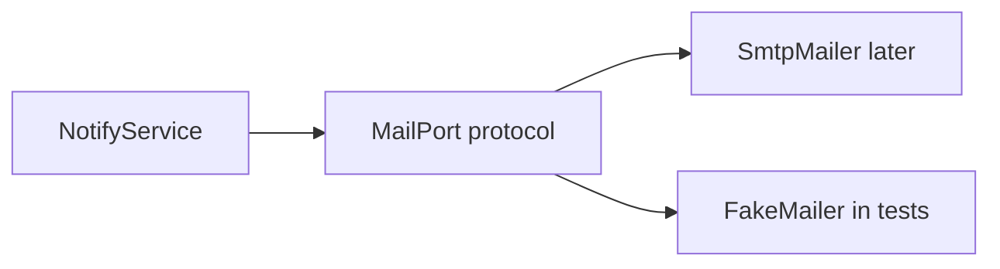
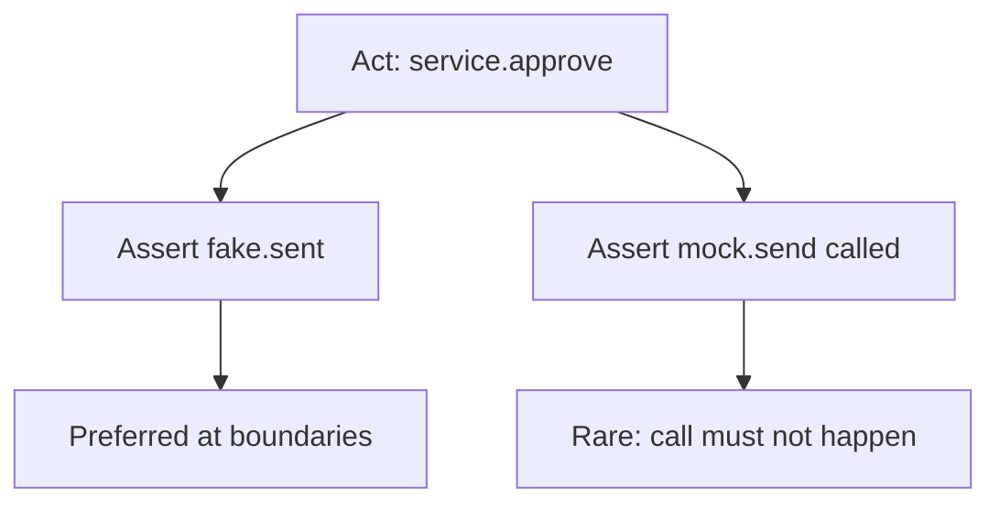

# Month 14 · Week 1 · Day 2
# Doubles: Fake, Stub, Mock, Spy — Prefer Fakes at Boundaries

**Program:** Full-Stack Mastery · 18 months  
**Phase:** 4 — Full-stack application  
**Month index:** [../../README.md](../../README.md)  
**Week 1:** [1](day-01.md) · Day 2 (today) · [3](day-03.md) · [4](day-04.md) · [5](day-05.md) · [6](day-06.md) · [7](day-07.md)  
**Week rhythm today:** Learn + type-along  
**Student state:** Yesterday you placed claims on the pyramid. Today the question is **what stands in** when a unit or API test must not hit SMTP, Stripe, or a wall clock.  
**Study time:** 3–4 focused hours

Labs: `~\fullstack-lab\month-14\week-01\day-02\`. Do not send real email. Do not paste Project 7.

---

## How to use this textbook

1. Read until you can define fake, stub, mock, and spy without swapping the words.  
2. Type the notifier lab. The fake is a **class you own**, not a cloud sandbox.  
3. If a test “passes because the mock was configured to pass,” rewrite it.  
4. Optional review links are for later rechecking.

---

## How to read this chapter

A **test double** is a stand-in for a neighbor you do not want to run for real in this test. The neighbor is usually **I/O**: email, Redis, HTTP outbound, the clock, a random generator, a payment API.



The important line is the **port** (an interface, a Protocol, a small ABC). Tests supply a **fake**. Production supplies the real adapter. You do **not** mock `NotifyService` itself if that is the thing you are testing.

**Wrong belief:** “Mock everything that is not the one line I wrote today.”  
**Correct:** mock-heavy tests freeze **how** collaborators are called and miss **whether** the behavior is right. Prefer a **fake** that actually stores messages, then assert on the fake’s memory.

**Wrong belief:** “If I patch `smtplib.SMTP`, I tested email.”  
**Correct:** you tested that your code called a library the way you guessed. A **fake mailer** tests that *your* app decided to notify, with which `to` and which body. SMTP belongs in a rare smoke test, not in pytest on every save.

---

## Today's contract

By the end of this day you will be able to:

1. Define **dummy, stub, fake, spy, mock** in this course’s vocabulary.  
2. Draw a **port** at the boundary and implement a **fake** behind it.  
3. Assert that a fake **was used** (messages recorded) without opening a network.  
4. Explain when a **mock** (expect a call) is justified — and when it is theater.  
5. Refuse to double **your own** FastAPI route under test (Month 9: do not mock your 404).

**Today's gate.** Closed-book:

> A fake is a working stand-in with a small memory. A stub returns canned answers. A mock fails if the expected call did not happen. A spy records calls to a real or fake object. I put fakes at **boundaries**. I do not mock the code I am trying to trust.

---

## Time box

| Block | Minutes | Work |
|---|---|---|
| A | 50 | Theory |
| B | 65 | Type-along: MailPort + FakeMailer |
| C | 65 | Independent: clock port + a spy |
| D | 15 | Git |
| E | 15 | Recall |

---

# Block A — Theory

## 1. Why doubles exist

`NotifyService.notify_owner(...)` should not wait on Gmail. Tests that hit the network are slow, need credentials, and fail when the cafe Wi-Fi blinks. They also have **side effects**: you do not want 400 exam emails in a real inbox.

The opposite failure is also common: you patch so much that the test only proves the patches exist.

Doubles are a **precision tool**. Name them so your future self knows what the test is allowed to skip.

## 2. Five words, used carefully

Authors disagree. This course uses Gerard Meszaros’s cluster, tightened for FastAPI + React:

| Double | What it does | Typical assert |
|---|---|---|
| **Dummy** | Satisfies a required argument; never used | None — it is a placeholder `None` or empty object |
| **Stub** | Returns a canned value (`get_user` always returns Alice) | You assert the **unit’s output**, not that the stub was clever |
| **Fake** | A **working** implementation, simpler (in-memory dict, list of sent mail) | You assert **state of the fake** (sent list, stored rows) |
| **Spy** | Wraps or records calls (how many times, with which args) | You assert **calls happened** (and maybe still assert state) |
| **Mock** | Pre-programmed **expectations**; unexpected or missing calls fail | The mock’s `assert_called_once_with(...)` **is** the test |

In Python, `unittest.mock.Mock` and `MagicMock` are **mock objects**. People also say “mock” for any double. In writing this month, say **fake** when you mean a small class with memory. Say **mock** when the test dies unless a call signature matches.

**Wrong belief:** “`MagicMock` is a fake.”  
**Correct:** a `MagicMock` will accept any attribute and return another mock. That is closer to a **stub/mock hybrid**. A fake `FakeMailer.send` appends to `self.sent`. You can print `self.sent` and understand it.

## 3. Prefer fakes at boundaries

A **boundary** is where your process would leave itself:

- SMTP / transactional email  
- Redis  
- S3 / disk (sometimes a temp dir is enough — Month 8 `tmp_path`)  
- Outbound HTTP (payments, maps)  
- Clock and RNG (Day 5)  
- The database — **usually not faked** in API tests; use a **test database** (Week 2). Faking SQLAlchemy session in every test is how you miss a missing `commit`.

Ports:

```python
from typing import Protocol

class MailPort(Protocol):
    def send(self, to: str, subject: str, body: str) -> None: ...
```

Production: `SmtpMailer` implements `MailPort`. Tests: `FakeMailer`. FastAPI `Depends` swaps them (you did `Depends` in Month 9; Week 2 Day 4 will wire this on a tiny app).

**Wrong belief:** “I will fake the repository so API tests stay unit-speed.”  
**Correct:** then you never see a real `IntegrityError`. Fake the **email** port. Keep the **test DB** for persistence. That split is the professional default for this course.

## 4. When a stub is enough

A stub is honest when the neighbor’s **behavior does not matter** beyond a return value.

Example: a currency helper needs `rates.get("USD")` to return `1.0`. You do not need a fake bank. A dict **is** a stub (and almost a fake). Keep it boring.

If you start stubbing ten methods on one object, you wanted a **fake** with a coherent in-memory model.

## 5. When a mock (expectation) is justified

Use a mock when the **call itself** is the requirement and there is no useful state to read.

Example: you must **not** call `mail.send` on a dry-run flag. `assert_not_called()` is the claim.

Example: an audit logger has no query API in tests. A spy/mock on `log.append` may be the only handle.

Do **not** mock to “prove” `repository.save` was called with the same dict you built in the test. That test is a photocopy of the implementation. Prefer: save, then **load**, then assert fields — even if load hits the fake repo or the test DB.

**Wrong belief:** “`assert_called_with` is always more precise than state.”  
**Correct:** it is precise about **calls**, not about **outcomes**. Users care about outcomes. Call counts drift when you refactor a helper. State assertions often survive a refactor.

## 6. Spies

A **spy** records. The real code may still run.

Python: `Mock(wraps=real_mailer)` still sends if `real_mailer` sends — **dangerous**. Prefer wrapping a **fake**, or a recording decorator on `FakeMailer.send`.

JavaScript: `vi.fn()` wrapping an implementation is a spy. Vitest `vi.spyOn(obj, "method")` is a spy. Week 3 will spy less and **MSW** more for HTTP.

## 7. What you must not double

| Do not double | Why |
|---|---|
| The FastAPI route under test | You would skip validation, status codes, dependencies |
| Pydantic models | 422 is the point |
| “The database” in *all* API tests | Constraints and transactions are the point (Week 2) |
| React Testing Library’s `render` | You need a document |
| Playwright’s browser | Then it is not E2E |

Month 9 already said: do not mock your 404. Still true.

## 8. Interaction vs state

**State-based** test: after `notify`, `fake.sent == [("ada@example.com", "Permit approved")]`.  
**Interaction-based** test: `mock.send.assert_called_once_with(...)`.

This course prefers **state-based fakes** at I/O ports. Interaction tests are a spice.



## 9. Over-mocking symptoms

- Test names mention `MagicMock` more than the business.  
- Refactoring a private helper breaks twenty tests; production still works.  
- You cannot explain the test to a teammate without opening the mock setup.  
- `autospec=False` and a typo `mail.sennd` still “passes.”

Mitigations: `autospec=True` if you must mock; prefer a typed `FakeMailer`; keep fakes in `tests/fakes/`.

## 10. Ports in a FastAPI app (preview of Week 2 Day 4)

You already know `Depends`. The mailer is a dependency, not a global `import smtplib` inside the path operation.

```python
def get_mailer() -> MailPort:
    return SmtpMailer()  # production


@router.post("/permits", status_code=201)
def create_permit(..., mailer: MailPort = Depends(get_mailer)) -> PermitOut:
    ...
    mailer.send(owner.email, "Permit created", body)
```

In tests: `app.dependency_overrides[get_mailer] = lambda: fake`. Clear overrides in a fixture. That is how you **assert the fake was called** without SMTP. You will type that wiring on Week 2 Day 4. Today the service takes the port in `__init__` so you can test without FastAPI.

**Wrong belief:** “I’ll patch `smtplib` inside the route; Depends is extra.”  
**Correct:** patching a library couples tests to an implementation detail. A port lets you swap SMTP for a list.

## 11. Redis, outbound HTTP, and files

**Redis:** if Month 11 used it for a cache or rate limit, do not talk to the cafe’s Redis from pytest. A fake that is a dict with TTL approximated by the fake clock is enough for *unit* tests of the cache key function. An **integration** test against a throwaway Redis is optional and must be marked so default `uv run pytest` stays offline.

**Outbound HTTP:** Month 9 said mock outbound if you call it. A fake client that records `GET` URLs and returns canned JSON is a fake. `respx` or `httpx.MockTransport` are tools; the idea is still a boundary.

**Files:** Month 8 `tmp_path` is often better than a fake filesystem. A temporary directory is a real adapter with a short life. Prefer it for JSON stores.

## 12. Mapping doubles onto the pyramid

| Layer | Typical double |
|---|---|
| Unit | Fake/stub ports; no TestClient |
| Integration (HTTP) | Real app + fake mailer + test DB (not a fake DB) |
| Component | **MSW** as the HTTP fake (Week 3) |
| E2E | Prefer **no** doubles for the journey; seed data instead |

If your Playwright test stubs every API with route intercepts, you built a slow component test. Either use RTL+MSW or hit a real staged backend.

## 13. Say it

Define dummy, stub, fake, spy, mock. Name one boundary in your product. Name one thing you will **not** fake in API tests. If “Postgres” was not on that list, re-read section 3.

---

# Block B — Type-along

```powershell
cd ~\fullstack-lab
mkdir month-14\week-01\day-02 -Force
cd ~\fullstack-lab\month-14\week-01\day-02
uv init --name lab-doubles
uv add --dev pytest
```

Type these modules. Do not invent SMTP.

`ports.py` — `MailPort` Protocol with `send(self, to: str, subject: str, body: str) -> None`.

`fakes.py` — `FakeMailer` with `sent: list[tuple[str, str, str]]` and `send` that appends.

`service.py` — `PermitNotifier` takes a `MailPort` in `__init__`. Method `owner_created(self, to: str, title: str) -> None` sends subject `Permit created` and a body that **includes the title**.

`test_notifier.py`:

1. `test_owner_created_records_one_message` — assert `len(fake.sent) == 1` and title in body.  
2. `test_owner_created_uses_given_address` — assert `to`.  
3. `test_does_not_send_when_email_blank` — if `to == ""`, send must not happen (`fake.sent == []`). That is a case where “not called” is a **state** assert on the fake.

```powershell
uv run pytest -q
```

Write `DOUBLES.md`: four headings (stub, fake, spy, mock). Under each, **one sentence** and **one example from this lab or from your product** (names only).

Write `BOUNDARY.md`: which neighbors in *your* Project 7 are ports (email, Redis, clock, outbound HTTP). Which you will **not** fake in API tests (Postgres). Ten lines.

---

# Block C — Independent

Add a **clock port**.

`ClockPort` with `now(self) -> datetime`. `FakeClock` returns a fixed `datetime(2026, 8, 16, 15, 0, tzinfo=UTC)`.

`PermitNotifier.owner_created` adds a line `Created at 2026-08-16T15:00:00+00:00` (ISO) using the clock — **not** `datetime.now()` inside the service.

Test that the body contains that timestamp. Change the fake clock; test follows. You have just previewed Day 5 without `time.sleep`.

Optional spy: wrap `FakeMailer.send` with a counter. Assert `calls == 1`. Then delete the spy if the `sent` list already proved it. Write `SPY.txt`: did the spy teach you anything the list did not? Honest answers are often “no.”

Do not connect Gmail. Do not add `fastapi` unless you want extra work — Week 2 Day 4 wires Depends.

```powershell
cd ~\fullstack-lab
git add month-14
git commit -m "Month 14 Day 2: MailPort fake, clock port, DOUBLES.md."
```

---

# Block E — Recall

1. Fake vs stub in one sentence each.  
2. Why a fake mailer is better than patching `smtplib` for *this* course.  
3. When `assert_not_called` is the right tool.  
4. Why faking the ORM session in every API test is a trap.  
5. Dummy — when is it enough?

## Office hours — doubles that flatter you

**Patching the unit under test.** `patch("service.PermitNotifier.owner_created")` then calling it. You tested the patch. Patch **neighbors**, not the subject.

**Shared fake at module scope.** Test A sends; test B expects empty `sent`. Reset in a fixture (Week 2) or construct a new `FakeMailer()` per test **today**.

**Mocking datetime everywhere.** Prefer a clock port. Day 5 will show `freeze` tools; the port still wins in app code.

**JS students:** `vi.fn()` returning `undefined` for `fetch` is a stub. **MSW** is the fake HTTP server for components (Week 3). Do not mix both for the same call without a reason.

**“I’ll just use MagicMock for MailPort.”** Then `mail.send()` typos silently. Write the tiny class.

Windows: if pytest cannot import `ports`, you are not running from the project root or `uv init` layout is missing `src`. Keep modules next to tests for this lab (Month 8 style is fine).

## Minimum fake

```python
class FakeMailer:
    def __init__(self) -> None:
        self.sent: list[tuple[str, str, str]] = []

    def send(self, to: str, subject: str, body: str) -> None:
        self.sent.append((to, subject, body))
```

Production mailers are Week 2’s **absence**: you still will not hit SMTP in pytest.

---

## Definition of done

- [ ] Protocol + FakeMailer + service tests green  
- [ ] Blank email sends nothing  
- [ ] FakeClock appears in the body  
- [ ] `DOUBLES.md` and `BOUNDARY.md` written  
- [ ] No real network in the lab  
- [ ] Commit exists  

---

## Optional review links

Doubles and ports are explained in this chapter.

- [pytest: monkeypatch](https://docs.pytest.org/en/stable/how-to/monkeypatch.html)  
- [unittest.mock](https://docs.python.org/3/library/unittest.mock.html) — use sparingly after you can write a fake  

---

# Lecture: a worked notify path

Imagine `approve_permit` should email the owner and write a row. Three tests, three jobs:

1. **Unit** on `should_notify(status)` — no mailer at all.  
2. **Unit** on `PermitNotifier` with `FakeMailer` — `sent` contains the address.  
3. **HTTP** with TestClient and `dependency_overrides` — status 200 *and* `fake.sent` grew. Week 2 Day 4 is test 3.

If you only write test 3, a typo in `should_notify` is buried in fixture noise. If you only write test 1, SMTP might still run in the route because nobody injected the port.

**monkeypatch** is a pytest built-in for attributes and env vars. It is not a fake. `monkeypatch.setenv("MAIL_FROM", "lab@example.com")` is fine. `monkeypatch.setattr(service, "send_mail", lambda *a: None)` is a stub that **drops** the claim you wanted to assert. Prefer replacing a `MailPort` with `FakeMailer`.

**Protocol vs ABC.** `typing.Protocol` is structural: `FakeMailer` does not inherit anything. An ABC would force subclassing. Either is acceptable; Protocol keeps fakes small.

**Where fakes live.** `tests/fakes/mailer.py` in the product repo — not copied into every test module. Week 2 `conftest.py` can expose a `mailer` fixture that returns a new fake.

Write `SAY.md` in the lab if you still swap the four words. One paragraph. Then Day 3.

---

## Tomorrow

**From memory:** classify eight example tests into pyramid layers. Days 1–2 stay closed during the drill. The recap in that file is the teacher.
