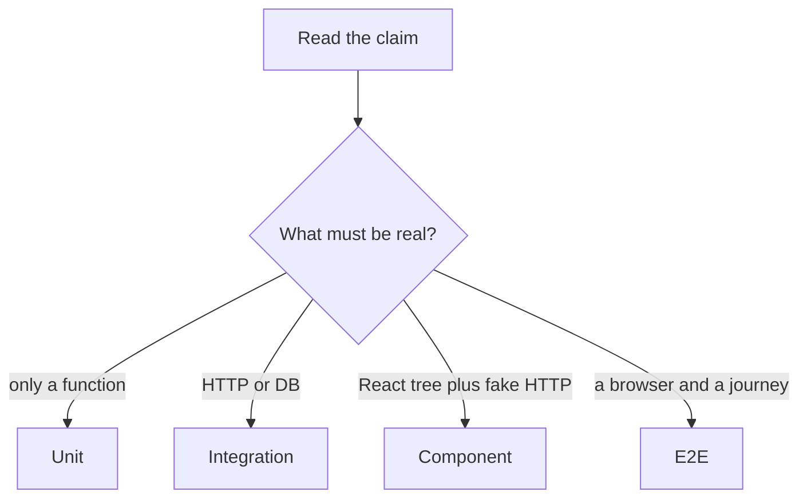

# Month 14 · Week 1 · Day 3
# From Memory: Classify Eight Tests into Layers

**Program:** Full-Stack Mastery · 18 months  
**Phase:** 4 — Full-stack application  
**Month index:** [../../README.md](../../README.md)  
**Week 1:** [1](day-01.md) · [2](day-02.md) · Day 3 (today) · [4](day-04.md) · [5](day-05.md) · [6](day-06.md) · [7](day-07.md)  
**Week rhythm today:** Implement from memory  
**Student state:** Day 2 gate passed. You can name pyramid layers and doubles. Today those ideas must still live in your head — from **this file**.  
**Study time:** 3–4 focused hours  
**Prereq:** Day 2 gate passed.

Labs: `~\fullstack-lab\month-14\week-01\day-03\`. Do **not** copy Day 1 `LAYERS.md`. Do **not** paste Project 7. Days 1–2 stay **closed** during the drills.

---

## How Day 3 works

Days 1 and 2 had type-along code. During the drills they stay **closed**. This file contains a recap so you are not sent to another site to learn.

Allowed:

- The complete explanation in this file
- Your own notes in `fullstack-lab` (not Day 1–2 textbook files)
- pytest output in front of you

Not allowed:

- Pasting a finished classification from AI
- Opening Day 1 or Day 2 during Blocks 1–3
- Browsing Fowler or pytest docs as the teacher during the drill

If you are stuck **more than 25 minutes** on one task, open **only** the matching Day 1 or Day 2 section **in this textbook**, read it, close it, continue from memory. Record what you had to look up in `lookups.txt`. That list is tomorrow’s repair list.

There is **no answer key in the first half** of this file. You write `CLASSIFY.md` first. A worked box waits at the end for **after** you commit your attempt.

---

## How to read this chapter

A test’s **layer** is where it runs and what it is allowed to touch — not the filename `test_unit_something.py`.



**Wrong belief:** “Memory day means I reread Day 1 with the file open.”  
**Correct:** the recap below is the teacher. Days 1–2 are the backup after 25 minutes.

---

## Complete explanation (layers and doubles you must still own)

**Unit.** A function or small module. No socket, no Postgres, no browser. Clock and mail, if needed, are **fakes you pass in**. `uv run pytest` finishes in milliseconds. Catches: wrong predicate, bad slug, off-by-one. Misses: decorator `status_code`, SQL constraints, unlabeled buttons.

**Integration.** Two real pieces. In this program that usually means **TestClient + FastAPI** (HTTP in-process) and/or **pytest + a test database**. API tests **are** integration tests of the HTTP adapter. Catches: 201 vs 200, 404 vs 422, 403 deny, missing `commit`, unique violations. Misses: accessible names, Query cache keys, cookie flags a browser cares about.

**Component.** React Testing Library renders a tree into jsdom. You query by **role and name**, not CSS. HTTP is **MSW** (Week 3), not a live Uvicorn. Catches: empty/loading/error UI, missing labels. Misses: real CORS, real SQL.

**E2E.** Playwright drives a browser. Locators by **role and name**. One (or few) **critical journeys**. Catches: login + create + list broken as a story. Misses cheap diagnosis; flakes if you `sleep` or share a DB.

**Coverage.** Not a layer. A flashlight: lines or branches that never ran. 100% on a predicate that the router never calls still ships a 200 for the wrong user.

**Doubles (Day 2).** A **fake** is a working stand-in with memory (`FakeMailer.sent`). A **stub** returns a canned value. A **mock** fails unless expected calls happen. A **spy** records calls. Prefer **fakes at boundaries** (email, clock, outbound HTTP). Do **not** fake Postgres in every API test. Do **not** mock the route under test. Do **not** mock your 404.

**Cost.** Unit: cheap to write and run. E2E: expensive to write, run, and debug; high flake if isolation is sloppy. Put many claims down the pyramid; keep journeys rare and precious.

**Wrong belief:** “TestClient is E2E because it uses HTTP.”  
**Correct:** there is no browser. It is in-process ASGI. Month 9 already taught this.

**Wrong belief:** “If I mock `can_edit`, I tested authorization.”  
**Correct:** you tested that you configured a mock. Authorization tests **deny** with a real predicate or a real 403.

**Ice-cream cone (diagnosis).** Many E2E, almost no units: you wait minutes to learn a title validator is wrong. **Trophy coverage:** a high percent with no deny test. Neither is a layer; both are smells you name in Day 6’s strategy.

**Fixtures (preview).** Tests that share a module dict or a FakeMailer at import time will flake. Construct doubles **inside** the test or in a pytest fixture (Week 2). Isolation is not `time.sleep`.

**Windows.** `uv run pytest -q`. PowerShell. `curl.exe` if you spot-check HTTP tomorrow, not today.

---

## Today's contract

By the end of this day you will be able to:

1. Classify eight given tests into unit / integration / component / E2E (or “not a test”).  
2. Name what each would **catch** and **miss**.  
3. Mark any double as fake, stub, mock, spy, or “none — real adapter.”  
4. Rebuild a tiny unit test from the recap without opening Day 1.

**Today's gate.** Closed-book:

> I can read a test description and place it on the pyramid. I do not call TestClient E2E. I do not call coverage a layer. I prefer fakes at boundaries.

---

## Time box

| Block | Minutes | Work |
|---|---|---|
| 1 | 25 | Speak the recap; write `exam-01.md` (12–20 lines) |
| 2 | 50 | Classify eight tests in `CLASSIFY.md` |
| 3 | 45 | Mini-build: `can_hold` unit tests from memory |
| 4 | 30 | Debug five mislabels (on paper) |
| 5 | 20 | Only now: compare to the worked box; `DIFF.md` |
| 6 | 20 | Design: one Project 7 risk per layer |
| 7 | 15 | Retro + `lookups.txt` |

---

# Block 1 — Speak

No Day 1–2 files. Cover: four layers; TestClient vs Playwright; coverage as flashlight; fake vs mock; what not to double. Write `exam-01.md` in the lab folder — your words, not a paste of this recap.

```powershell
cd ~\fullstack-lab
mkdir month-14\week-01\day-03 -Force
cd ~\fullstack-lab\month-14\week-01\day-03
```

---

# Block 2 — Classify eight tests

Write `CLASSIFY.md`. For **each** row: layer, one catch, one miss, double used (if any).

These tests are **described**. You do not run them. You do not need Project 7 source.

**T1.** `test_slugify_rejects_blank` calls `slugify("  ")` and expects `ValueError`. No FastAPI import.

**T2.** `test_create_hold_201` uses `TestClient`, `POST /holds` with JSON, asserts `status_code == 201` and `"id" in body`. In-memory dict, fixture clears it.

**T3.** `test_get_hold_404` uses TestClient, `GET /holds/999`, asserts 404 and `"detail"` in JSON.

**T4.** `test_member_gets_403_on_foreign_hold` uses TestClient as a logged-in member, `PATCH` another user’s hold, asserts 403. Postgres **test** database. Mailer is a `FakeMailer`.

**T5.** `test_empty_list_copy` renders `<HoldList />` with Testing Library. MSW returns `[]` for `GET /holds`. Asserts `getByRole("heading", { name: /no holds yet/i })`.

**T6.** `test_create_button_is_named` renders a form and `getByRole("button", { name: /create hold/i })`. No HTTP.

**T7.** Playwright: fill email, click “Sign in”, create a hold titled “North dock”, assert the list shows a row named “North dock”.

**T8.** A CI job fails if `pytest --cov` is under 95%. No `assert` about product behavior.

If you want a ninth: “`MagicMock` on the route function, then `assert_called`.” Classify that too — it is a trap.

---

# Block 3 — Mini-build from memory

Days 1–2 closed. Recap is enough.

```powershell
cd ~\fullstack-lab\month-14\week-01\day-03
uv init --name lab-classify
uv add --dev pytest
```

Domain: **library holds**, not Project 7.

`rules.py`: `can_release_hold(role: str, owner_id: int, actor_id: int) -> bool` — admin or owner. Anyone else False.

Tests:

- `test_admin_can_release`  
- `test_owner_can_release`  
- `test_stranger_cannot_release`  
- `test_blank_role_is_not_admin` — `role=""` is not admin

```powershell
uv run pytest -q
```

Write `LAYER.txt`: one sentence — these four tests are **unit** because …

Do not add FastAPI today. That is Day 4.

---

# Block 4 — Debug mislabels

Write `DEBUG.md`. For each, **wrong label someone used**, **correct layer**, **why**.

**A.** “T2 is E2E because it uses HTTP.”  
**B.** “T4 is unit because it uses a FakeMailer.”  
**C.** “T5 is E2E because it talks to an API.”  
**D.** “T8 is integration because coverage runs the app.”  
**E.** “I mocked `can_release_hold` in T4 so the test is faster.”  

No running broken code required.

---

# Block 5 — Worked box (only after CLASSIFY.md exists)

Compare. Write `DIFF.md`: three lines you had wrong, or `MATCH.txt` if you nailed it. Then read the box below.

**T1** unit; no double. Catches blank slug rule. Misses HTTP 422 vs ValueError mapping.

**T2** integration (API / TestClient). Catches missing 201. Misses UI. Dict store is a fake persistence — still HTTP integration.

**T3** integration. Catches missing `HTTPException` 404. Misses framework 404 vs your 404 if you never hit the route.

**T4** integration (HTTP + DB). FakeMailer is a **fake at a boundary**. The test is not “unit” because TestClient and Postgres are real. Catches missing 403. Misses whether the UI hides the button (courtesy, not authz).

**T5** component. MSW is a fake HTTP server. Catches empty copy. Misses SQL.

**T6** component (or a very small unit of UI). No MSW needed. Catches `div` pretending to be a button. Misses submit behavior if you never click.

**T7** E2E. No double if it hits a real stack. Catches the journey. Misses cheap 403 diagnosis.

**T8** **not a test layer**. A metric gate. Can pass while T4 does not exist.

**Trap ninth:** mock of the route — **not a useful layer**. You skipped the adapter.

**A–E keys:** A HTTP ≠ E2E. B a fake neighbor does not demote the test. C MSW ≠ browser. D coverage ≠ integration. E mocking the predicate in an authz test is how 403 tests lie.

---

# Block 6 — Design

`DESIGN.md` (10–15 lines): pick **your** primary resource (name only). One risk per layer that should catch it **first**. One sentence: which risk would Playwright catch too late.

Do not paste handlers.

---

# Block 7 — Retro

`retro.md`: which classification was hardest; whether you still want to call TestClient E2E; what you will extract as a pure function this week.

```powershell
cd ~\fullstack-lab
git add month-14
git commit -m "Month 14 Day 3: classified eight tests; holds unit mini-build."
```

---

## Office hours

**“Integration vs API.”** This course treats API/TestClient as a **kind of** integration. In `CLASSIFY.md` write `integration (HTTP)` for T2/T3. That is an A.

**“T6 has no MSW so it is unit.”** If it `render`s React, it is a component test. Unit is for `can_release_hold`, not for buttons.

**pytest not found.** `uv add --dev pytest` then `uv run pytest -q`.

---

## Definition of done

- [ ] `CLASSIFY.md` completed **before** reading the worked box  
- [ ] Four unit tests green  
- [ ] `DEBUG.md` A–E attempted  
- [ ] `DIFF.md` or `MATCH.txt` after the box  
- [ ] `DESIGN.md` uses your nouns, no product source  
- [ ] Commit exists  

---

## Optional review links

Repair from this recap first.

- [pytest](https://docs.pytest.org/en/stable/)  

---

# Lecture: how to read a test description

When a prompt says “uses TestClient,” the layer is **integration (HTTP)** even if a FakeMailer appears. The **most expensive real piece** names the layer. A fake neighbor does not demote the test to unit.

When a prompt says “Playwright,” look for a **journey**. If the same prompt also says “intercept all APIs and never start a backend,” it is a slow component test wearing E2E clothing. Say that in `CLASSIFY.md` if you add a tenth row.

When a prompt says “coverage must be 95%,” it is **policy**, not a test. Policies can be useful later; they are not pyramid layers.

Write `HEURISTIC.md` (six lines): your rule for choosing the layer from a description. Then go to Block 5 if you have not.

---

## Tomorrow

**Lab:** a pure unit test **and** an HTTP integration test on a **tiny** app you type. Still not Project 7.
