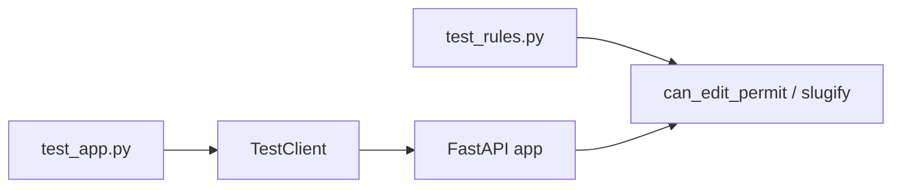

# Month 14 · Week 1 · Day 4
# Lab: A Pure Unit Test and an HTTP Integration Test

**Program:** Full-Stack Mastery · 18 months  
**Phase:** 4 — Full-stack application  
**Month index:** [../../README.md](../../README.md)  
**Week 1:** [1](day-01.md) · [2](day-02.md) · [3](day-03.md) · Day 4 (today) · [5](day-05.md) · [6](day-06.md) · [7](day-07.md)  
**Week rhythm today:** Lab (type-along + independent)  
**Student state:** You can classify layers. Today you **type** both a unit suite and a TestClient suite on a tiny app so the pyramid is not only a diagram.  
**Study time:** 3–4 focused hours

Labs: `~\fullstack-lab\month-14\week-01\day-04\`. Do **not** implement this inside Project 7. Do **not** paste Project 7. Domain today: **parking permits** (or lockers if you prefer — pick one and stick to it).

---

## How to use this textbook

1. Read Block A. Close it. Say why two test files exist.  
2. Type the app and tests. Do not paste a “FastAPI testing template.”  
3. Predict status codes in `PREDICT.txt` **before** you run pytest.  
4. Optional review links are for later rechecking.

---

## How to read this chapter

A **unit** test calls `slugify` or `can_edit_permit` as Python. An **HTTP integration** test uses `TestClient` and asserts `status_code` and JSON keys. If you only have the first, a missing `status_code=201` stays green. If you only have the second, a wrong predicate is slow to find.



**Wrong belief:** “TestClient already runs `can_edit_permit`, so unit tests are duplicate.”  
**Correct:** HTTP tests are few and fatter. Unit tests pin the rule in milliseconds and name the deny case clearly. You still need a 403 HTTP test when the router must call the rule — that is Week 2. Today the HTTP tests pin **create/list/404** and a 422 from a blank title.

**Wrong belief:** “I will start Uvicorn and use `curl.exe` instead of pytest.”  
**Correct:** `curl.exe` is a spot-check. `uv run pytest` is the regression net. TestClient does not need port 8000.

---

## Today's contract

By the end of this day you will be able to:

1. Split **rules** (pure) from **path operations** (HTTP).  
2. Write pytest unit tests including a **deny** / blank case.  
3. Build `TestClient` from `fastapi.testclient`.  
4. Isolate an in-memory store with a fixture (reset dict and id counter).  
5. Explain why 204 and `.json()` fight — even if you only DELETE as stretch.

**Today's gate.** Closed-book:

> Unit tests call functions. HTTP tests call TestClient. I assert status and body keys. A dirty module dict is a flaky test. I did not paste Project 7.

---

## Time box

| Block | Minutes | Work |
|---|---|---|
| A | 35 | Theory (short — you have Days 1–3) |
| B | 80 | Type-along: permits app + both layers |
| C | 70 | Independent: 409 unique code + extra unit |
| D | 15 | Git |
| E | 15 | Recall |

---

# Block A — Theory

## 1. Why a tiny app, not Project 7

Product tests live in **your** repos. Today’s lab is a **gym**: small enough to finish, large enough that two layers disagree if you make a mistake. If you “save time” by editing Project 7, you will paste production coupling into a learning day and skip isolation practice.

## 2. TestClient is HTTP (Month 9, still true)

```python
from fastapi.testclient import TestClient
from app import app

client = TestClient(app)

def test_health() -> None:
    r = client.get("/health")
    assert r.status_code == 200
    assert r.json() == {"status": "ok"}
```

- `json=` on POST sets Content-Type.  
- `r.json()` parses the body. Do not call it on **204**.  
- The **same** app runs: Pydantic and `HTTPException` still fire.

**Wrong belief:** “TestClient is a mock; it skips validation.”  
**Correct:** it runs the ASGI app in-process.

## 3. Isolation

```python
PERMITS: dict[int, dict] = {}
_next_id = 1
```

Test A POSTs id 1. Test B expects an empty list. Test B **fails** if it runs after A. pytest order is not a contract.

Fixture pattern:

```python
import pytest
from fastapi.testclient import TestClient
import app as appmod

@pytest.fixture
def client() -> TestClient:
    appmod.PERMITS.clear()
    appmod._next_id = 1
    return TestClient(appmod.app)
```

**Wrong belief:** “I’ll use `autouse` sleep so the dict settles.”  
**Correct:** clear the dict. Time is not isolation. Day 5 is about clocks, not this.

## 4. What to assert (minimum)

| Case | Assert |
|---|---|
| POST create | 201, `id` in body, `code` echoed |
| GET one | 200, fields |
| GET missing | 404, `"detail"` in JSON |
| POST blank title / empty code | 422 (Pydantic or your `HTTPException`) |
| POST duplicate unique code | 409 (independent block) |
| GET list empty | 200 and `[]` |

One idea per test. Names: `test_get_missing_permit_returns_404`.

Do not `assert True`. Do not snapshot OpenAPI.

## 5. Unit file vs HTTP file

`test_rules.py` never imports `TestClient`.  
`test_app.py` never re-implements `slugify` with a copy-paste of the algorithm — it **uses** the app.

If slugify breaks, **both** may fail. That is acceptable. The unit failure is the faster sentence.

---

# Block B — Type-along

```powershell
cd ~\fullstack-lab
mkdir month-14\week-01\day-04 -Force
cd ~\fullstack-lab\month-14\week-01\day-04
uv init --name lab-permits
uv add fastapi uvicorn
uv add --dev pytest httpx
```

### B1. Pure rules — you type

`rules.py`:

- `slugify(title: str) -> str` — strip, lower, split on whitespace, join with `-`. Blank after strip → `ValueError("title required")`.  
- `can_edit_permit(role: str, owner_id: int, actor_id: int) -> bool` — admin or owner.

`test_rules.py`: at least four tests (slug happy, slug blank, editor owner, editor stranger). Use `pytest.raises(ValueError)` for blank.

```powershell
uv run pytest test_rules.py -q
```

Green before you add FastAPI routes. That is the pyramid in miniature: cheap layer first.

### B2. HTTP adapter — you type

`app.py`:

- `GET /health` → 200 `{"status": "ok"}`  
- In-memory `PERMITS` dict and `_next_id`  
- Pydantic `PermitIn`: `title: str` min length 1, `code: str` min length 1  
- `PermitOut`: `id`, `title`, `code`, `slug`  
- `POST /permits` → 201; store `owner_id=1` for now (no auth today); `slug = slugify(title)`  
- `GET /permits` → 200 list  
- `GET /permits/{permit_id}` → 200 or `HTTPException` 404  

Wire `response_model` so you do not leak a future `internal_note`.

### B3. HTTP tests — you type

`test_app.py` with the `client` fixture above.

Minimum:

1. `test_health`  
2. `test_create_and_get`  
3. `test_get_missing_404`  
4. `test_list_empty_200`  
5. `test_create_blank_title_422` — `json={"title": "", "code": "A1"}`  

Write `PREDICT.txt` first: for each test, the status you expect. Then run:

```powershell
uv run pytest -q
```

If 422 does not happen for `""` because you used a plain `str` with no `min_length`, **that is the lesson**. Add `Field(min_length=1)` or reject in the handler. Do not weaken the test.

Write `TESTS.md`: one paragraph — fixture clears `PERMITS`; TestClient is HTTP; unit tests do not need the app.

Optional: `uv run uvicorn app:app --reload --host 127.0.0.1 --port 8000` and `curl.exe` once for 404. Pytest remains the net.

---

# Block C — Independent

1. Unique `code`: second POST with the same code → **409**. Test it. Implement it.  
2. Unit test: `slugify("North  Line")` (two spaces) still one hyphen (your choice documented in `SLUG.md`).  
3. HTTP test: create then list length 1 — **must** use the fixture so it does not depend on other tests.  
4. Stretch: `DELETE /permits/{id}` 204 then GET 404. Do not `.json()` on 204.  
5. Write `TWO-LAYERS.md`: a table with one bug that **only** unit would explain quickly, and one bug that **only** TestClient would catch (`status_code=201` forgotten).

Do not add JWT. Do not add SQLAlchemy. Do not open Project 7.

---

# Block D — Git

```powershell
cd ~\fullstack-lab
git add month-14
git commit -m "Month 14 Day 4: permit unit tests and TestClient HTTP tests."
```

---

# Block E — Recall

1. Why HTTP tests catch decorator bugs.  
2. Why `PERMITS` leaks across tests.  
3. 422 vs 404 vs 409 in this lab.  
4. Why unit tests still exist when TestClient calls `slugify`.  
5. Why this lab is not Project 7.

## Office hours

**Order-dependent green.** If you need `test_a` before `test_b`, the fixture is wrong. Reset the dict and `_next_id`.

**Asserting the entire JSON blob.** A new Out field breaks every test. Assert keys you care about.

**Calling `create_permit()` as a Python function in `test_app.py`.** You never notice missing 201. Use TestClient.

**Blank title is 200.** Pydantic `str` allows `""`. `Field(min_length=1)` or your `HTTPException`. The test is the teacher.

**`pytest` not found.** `uv run pytest -q` from the lab directory after `uv add --dev pytest httpx`.

**Import errors.** Keep `app.py` and `rules.py` next to the tests for this lab. If `uv init` created a `src` layout, either put modules there and teach pytest `pythonpath`, or keep the flat lab. Document which in `TESTS.md`.

Windows: `curl.exe` not `curl`. Bind 127.0.0.1 if you run Uvicorn.

## Minimum HTTP test shape

```python
def test_duplicate_code_409(client: TestClient) -> None:
    client.post("/permits", json={"title": "A", "code": "L1"})
    r = client.post("/permits", json={"title": "B", "code": "L1"})
    assert r.status_code == 409
```

The fixture must have cleared the store **before** this function body.

---

## Definition of done

- [ ] `uv run pytest -q` green  
- [ ] Unit file has deny or blank case  
- [ ] HTTP file has 201, 404, 422  
- [ ] Store reset between HTTP tests  
- [ ] 409 unique code (Block C)  
- [ ] `TWO-LAYERS.md` written  
- [ ] Commit exists  

---

## Optional review links

TestClient and fixtures are explained in this chapter.

- [FastAPI: Testing](https://fastapi.tiangolo.com/tutorial/testing/)  
- [pytest fixtures](https://docs.pytest.org/en/stable/explanation/fixtures.html)  

---

# Lecture: two files, two failure sentences

When `slugify` is wrong, pytest should print `test_rules.py` first in your mind. When `status_code=201` is missing, pytest should print `test_app.py`. If both files import the world, you lost that sentence.

`httpx` is a dev dependency because Starlette’s TestClient uses it. You still write `from fastapi.testclient import TestClient` unless you chose the ASGI transport style (Month 9). Pick one per lab.

**422 loc.** For Block C, if you have time, assert that `r.json()["detail"]` is a **list** and that some `loc` contains `"title"` or `"code"`. Do not freeze the English `msg`.

**Health checks.** `GET /health` is a cheap 200. It is not a pyramid. Do not confuse it with E2E “the site is up.”

Write `SENTENCES.md`: two failures you actually saw (or forced) and which file reported them.

---

## Tomorrow

**Fixtures and determinism** — time, randomness, timezone. You will stop calling `datetime.now()` inside the rule you are trying to test.
