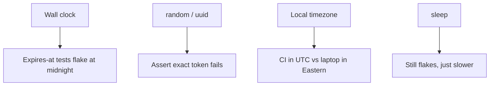

# Month 14 · Week 1 · Day 5
# Fixtures and Determinism: Time, Randomness, Timezone

**Program:** Full-Stack Mastery · 18 months  
**Phase:** 4 — Full-stack application  
**Month index:** [../../README.md](../../README.md)  
**Week 1:** [1](day-01.md) · [2](day-02.md) · [3](day-03.md) · [4](day-04.md) · Day 5 (today) · [6](day-06.md) · [7](day-07.md)  
**Week rhythm today:** Learn + type-along  
**Student state:** You have unit tests and TestClient tests on a tiny app. Today those tests must **not** depend on the wall clock, `random`, or “whatever timezone Windows woke up in.”  
**Study time:** 3–4 focused hours

Labs: `~\fullstack-lab\month-14\week-01\day-05\`. Do not paste Project 7. Do not use `time.sleep` to “wait for the clock.”

---

## How to use this textbook

1. Read until you can name three sources of nondeterminism in tests.  
2. Type a clock port (or a function argument) — not a patch of every `datetime` in the stdlib unless you can explain it.  
3. Run pytest twice. The second run must not depend on luck.  
4. Optional review links are for later rechecking.

---

## How to read this chapter

A **deterministic** test returns the same result given the same code. Flakes that “pass on my machine” are often **time**, **randomness**, **timezone**, **locale**, or **shared state** (Day 4’s dict). Shared state is isolation. Today is the rest.



**Wrong belief:** “I’ll `time.sleep(1)` so the timestamp moves.”  
**Correct:** sleep is not control. Inject a clock. Advance it in the test. Week 4 will say the same about Playwright waits.

**Wrong belief:** “Timezone does not matter; I store strings.”  
**Correct:** `"2026-08-16 15:00:00"` without an offset is a lie waiting for DST. Prefer **UTC in storage** (`TIMESTAMPTZ` in Postgres, `datetime` with `tzinfo=UTC` in Python). Display zones in the UI.

---

## Today's contract

By the end of this day you will be able to:

1. List time, RNG, timezone, locale, and network as flake sources.  
2. Inject a **clock** (port or argument) so expiry math is testable.  
3. Seed or fake **randomness** when a test must see a known token — or **do not assert the exact random value**.  
4. Use timezone-aware datetimes; compare in UTC.  
5. Prefer pytest **fixtures** to build a fresh clock/RNG per test.

**Today's gate.** Closed-book:

> I do not sleep to make time pass. I inject a clock. I do not assert an unseeded UUID. I store UTC. Fixtures give each test a clean double.

---

## Time box

| Block | Minutes | Work |
|---|---|---|
| A | 50 | Theory |
| B | 70 | Type-along: holds that expire |
| C | 60 | Independent: random codes + timezone assert |
| D | 15 | Git |
| E | 15 | Recall |

---

# Block A — Theory

## 1. What “flaky” means

A test is flaky if it **sometimes** fails with no code change. CI re-runs that “go green” train you to ignore red. Month 14’s gate needs a test that is **red when the feature is broken**, not red when it is 11:59 p.m.

Nondeterminism is a common flake. Isolation (dirty DB, dirty dict) is the other. Name which one you have before you add retries.

**Wrong belief:** “Retries in CI are a testing strategy.”  
**Correct:** retries hide flakes. Fix the clock or the fixture. Retries are for infrastructure blips after the suite is deterministic — and even then they are a last resort.

## 2. Time

Production code loves `datetime.now()`. Tests hate it.

Bad:

```python
def is_expired(expires_at: datetime) -> bool:
    return datetime.now() >= expires_at
```

This fails around boundaries, fails if you assume local vs UTC, and cannot simulate “tomorrow” without waiting.

Better — **pass now**:

```python
def is_expired(expires_at: datetime, now: datetime) -> bool:
    return now >= expires_at
```

Better for an application service — **clock port** (Day 2):

```python
class ClockPort(Protocol):
    def now(self) -> datetime: ...

class FakeClock:
    def __init__(self, instant: datetime) -> None:
        self.instant = instant

    def now(self) -> datetime:
        return self.instant

    def advance(self, **kwargs: object) -> None:
        from datetime import timedelta
        self.instant = self.instant + timedelta(**kwargs)  # type: ignore[arg-type]
```

The test sets `instant`, calls `is_expired` or the service, then `advance(days=1)`, asserts expired.

`freezegun` and `time-machine` patch the stdlib clock. They are allowed **if** you understand they are process-wide patches. A port is clearer in **your** services. Use freeze libraries for third-party code you cannot inject. Do not stack freeze + sleep.

## 3. Timezone

Naive `datetime.now()` on Windows uses the machine’s local zone. GitHub Actions often uses UTC. A test that builds `datetime(2026, 3, 8, 2, 30)` (DST spring-forward in US Eastern) is a famous footgun.

Rules for this course:

1. Inside domain logic, use **timezone-aware** UTC: `datetime.now(tz=UTC)` or a clock that returns UTC.  
2. Compare aware to aware. Mixing naive and aware raises (or worse, in some libraries, lies).  
3. Postgres: `TIMESTAMPTZ`. You learned this in Month 10.  
4. APIs: ISO-8601 with offset `Z` or `+00:00`.  
5. UI may format in the user’s zone; tests of **rules** still use UTC.

```python
from datetime import UTC, datetime

def parse_iso(s: str) -> datetime:
    dt = datetime.fromisoformat(s.replace("Z", "+00:00"))
    return dt.astimezone(UTC)
```

**Wrong belief:** “I’ll store local time because the shop is in one city.”  
**Correct:** servers, CI, and travelers disagree. Store UTC; display local.

## 4. Randomness

`random.random()`, `secrets.token_hex()`, `uuid4()` are correct in production and painful in tests if you assert equality on the result.

Options, in order of preference:

1. **Do not assert the exact token.** Assert `len(token) == 32` and that two calls differ — if uniqueness is the claim.  
2. **Inject an RNG port**: `next_code(self) -> str` with `FakeRng` that returns `"AAA111"` then `"AAA112"`.  
3. **Seed** `random.seed(0)` in a fixture — only if the code uses `random` (not `secrets`). Seeding `secrets` is the wrong instinct; inject instead.  
4. Never copy production secrets into tests.

UUIDs: if the API returns `id` as a UUID, assert it is present and GET-able, not that it equals a hardcoded UUID unless you injected an id factory.

## 5. Locale, filesystem, and environment

`str.upper()` is not the same as case-folding Turkish `i`. If you case-fold user input, write a test with a character you care about or pin locale. For this course, ASCII slugs are enough if you **document** that.

Filesystem: `tmp_path` (pytest) is deterministic enough. Do not write to `~/Documents`.

Environment: `monkeypatch.setenv("APP_TZ", "UTC")` in a fixture. Do not rely on the developer’s user env for tests.

## 6. Fixtures that keep tests deterministic

A fixture is a **setup function pytest injects**. Day 4 used one to clear a dict. Today:

```python
@pytest.fixture
def clock() -> FakeClock:
    return FakeClock(datetime(2026, 8, 16, 15, 0, tzinfo=UTC))
```

Each test gets a **new** FakeClock. Do not create one FakeClock at module level and `advance` it in test A, then expect test B to start at 15:00 — unless you reset, you invented order dependence.

**Factory vs fixture** is Week 2 Day 1. Preview: a fixture is for **this test’s** collaborators; a factory is a function `make_hold(**overrides)` that returns data. You will want both.

`autouse=True` fixtures that freeze time globally can surprise other tests. Prefer **opt-in** clock fixtures.

## 7. What you still do not sleep for

| Temptation | Do this instead |
|---|---|
| Wait for expiry | `clock.advance(hours=25)` |
| Wait for retry backoff | inject a clock / zero delay in tests |
| Wait for uniqueness | FakeRng sequence |
| Playwright UI | Week 4: **assertions that wait**, not `sleep` |

## 8. Coverage and time branches

`if now >= expires_at` is two branches. A flashlight report that never runs the expired branch is how “100% on the file” still misses midnight. Write **both** `test_not_expired_before` and `test_expired_on_or_after`.

---

# Block B — Type-along

```powershell
cd ~\fullstack-lab
mkdir month-14\week-01\day-05 -Force
cd ~\fullstack-lab\month-14\week-01\day-05
uv init --name lab-clock
uv add --dev pytest
```

Domain: **library hold expiry**. A hold lasts **7 days** from creation. `is_expired(created_at, now) -> bool`.

Rules you type in `expiry.py`:

- All datetimes **must** be timezone-aware. Naive → `ValueError`.  
- Expired when `now >= created_at + timedelta(days=7)`.  
- Equal to the boundary counts as expired (document in `RULES.md` if you choose the opposite — then test that choice).

`clocks.py`: `FakeClock` with `now` and `advance`.

`test_expiry.py`:

1. `test_just_created_not_expired` — same instant.  
2. `test_six_days_not_expired`.  
3. `test_seven_days_expired`.  
4. `test_naive_datetime_rejected`.  
5. Use a `clock` fixture; do not call `datetime.now()` in tests.

```powershell
uv run pytest -q
```

Run it twice. If the second run differs, you used the wall clock.

Write `DETERMINISM.md`: three flakes this lab **would have had** with `datetime.now()`.

---

# Block C — Independent

1. `confirm_code.py`: `make_code(rng) -> str` six characters from `ABCDEFGHJKLMNPQRSTUVWXYZ23456789` (no `0/O/1/I`). Inject `rng` with a `.choice` method. `FakeRng` returns a fixed sequence of characters. Test that the code equals the sequence you scripted.  
2. A second test: two `FakeRng` sequences produce different codes.  
3. Timezone: `parse_iso("2026-08-16T19:00:00+00:00")` and `parse_iso("2026-08-16T15:00:00-04:00")` compare **equal** in UTC. That is the Eastern-vs-UTC lesson without guessing Windows settings.  
4. Stretch: a tiny `HoldService.create` that stamps `created_at=clock.now()`. Test expiry through the service, not by sleeping.

Do not hit the internet for a “time library tutorial” until the port works.

```powershell
cd ~\fullstack-lab
git add month-14
git commit -m "Month 14 Day 5: deterministic expiry, fake clock, fake rng."
```

---

# Block E — Recall

1. Why sleep is not a clock.  
2. Naive vs aware datetime.  
3. Why asserting `uuid4()` equality is usually wrong.  
4. Why a module-level FakeClock flakes.  
5. UTC storage vs local display.

## Office hours

**`can't compare offset-naive and offset-aware`.** You mixed them. Make the clock UTC-aware; parse ISO to aware; do not strip `tzinfo`.

**freezegun in one test broke another.** Patch leaked. Use a fixture with yield that stops the freeze, or drop freezegun and inject.

**`random.seed` did not affect `secrets.token_hex`.** Different generators. Inject a port.

**DST test failed only in March.** You constructed a local datetime that does not exist. Use UTC.

**pytest collected zero tests.** Files must be `test_*.py` or `*_test.py`. Run from the lab folder: `uv run pytest -q`.

Windows: PowerShell’s `Get-Date` is not your app clock. Do not shell out to set time. Inject.

## Minimum clock test

```python
from datetime import UTC, datetime, timedelta

from expiry import is_expired

def test_seven_days_expired() -> None:
    created = datetime(2026, 8, 16, 15, 0, tzinfo=UTC)
    now = created + timedelta(days=7)
    assert is_expired(created, now) is True
```

No `sleep`. No `now()`.

---

## Definition of done

- [ ] Expiry tests green twice in a row  
- [ ] Naive datetime rejected  
- [ ] FakeRng scripted code  
- [ ] Two ISO strings in different offsets compare equal in UTC  
- [ ] `DETERMINISM.md` written  
- [ ] Commit exists  

---

## Optional review links

Determinism and clocks are explained in this chapter.

- [pytest fixtures](https://docs.pytest.org/en/stable/explanation/fixtures.html)  
- [datetime — Aware and Naive Objects](https://docs.python.org/3/library/datetime.html#aware-and-naive-objects)  

---

# Lecture: fixtures, freeze tools, and CI clocks

pytest **injects** fixtures by parameter name. `def test_x(clock: FakeClock)` asks for `clock`. The function that created it can `yield` to run teardown after the test — Week 2 will use `yield` to roll back a transaction. Today, returning a new `FakeClock` is enough.

**Scope.** Default `function` scope: one instance per test. `module` or `session` scope for a FakeClock will leak `advance()` into the next test. Do not “optimize” a clock fixture to session scope.

**Parametrize time.** `@pytest.mark.parametrize("hours, expired", [(167, False), (168, True)])` if your rule is hourly. Keep the examples readable. Parametrize is not an excuse to hide the boundary in a soup of numbers.

**freezegun / time-machine.** They patch `datetime.datetime.now` (and sometimes `time.time`). Useful when a library you do not own calls the clock. Costs: surprising other threads; forgetting to stop the patch; tests that pass only while frozen at a date that skips a leap second or DST. Prefer injection in **your** services.

**CI.** GitHub-hosted runners are UTC. Your laptop might be `America/New_York`. Any test that formats `strftime` without a zone will fail for someone. Pin `TZ=UTC` in CI later (Month 15–16 territory); still write aware datetimes **now**.

**UUID vs time vs random.** If a column is `created_at`, test ordering with a fake clock, not by sleeping until timestamps differ. If a column is `uuid`, do not use time to “make unique enough.”

**Locale.** `title.strip().lower()` is not Unicode case-folding. For slugs this week, ASCII is enough if `RULES.md` says so. Do not assert on `datetime.strftime("%c")` — it follows locale.

**Re-run proof.** After Block B, run `uv run pytest -q` twice. Copy both summaries into `TWICE.txt`. They must match. If they do not, you still have a wall clock or a shared fake.

**Wrong belief:** “Flakes will go away when we have Docker.”  
**Correct:** Docker does not inject a clock. Isolation and determinism are still your job.

---

## Tomorrow

**Independent:** write `TEST-STRATEGY.md` for **your** Project 7. This textbook will not write it for you. Product tests stay in your repos; the strategy document may live there too.
