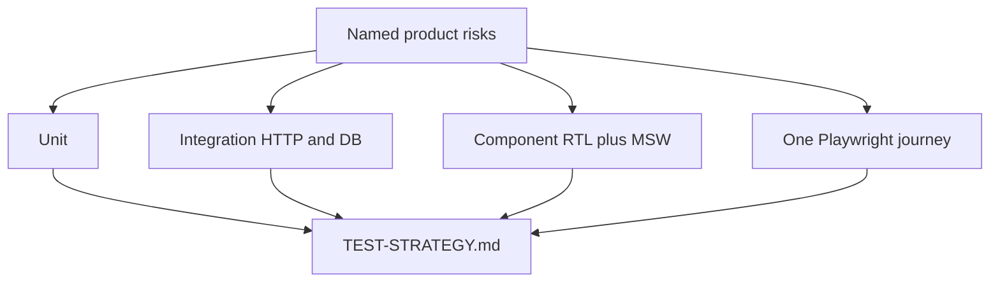

# Month 14 · Week 1 · Day 6
# Independent: Write TEST-STRATEGY.md for Project 7

**Program:** Full-Stack Mastery · 18 months  
**Phase:** 4 — Full-stack application  
**Month index:** [../../README.md](../../README.md)  
**Week 1:** [1](day-01.md) · [2](day-02.md) · [3](day-03.md) · [4](day-04.md) · [5](day-05.md) · Day 6 (today) · [7](day-07.md)  
**Week rhythm today:** Independent implementation  
**Student state:** You can name layers, doubles, isolation, and determinism. Today you apply them to **your** product in writing — not by pasting a template and not by pasting source.  
**Study time:** 3–4 focused hours

This textbook will **not** give you a finished `TEST-STRATEGY.md`. It will give you a **spec envelope** and a **forbidden list**.

Product tests live in **your** repos. Put the strategy document in the API repo, the web repo, or a small `docs/` folder you already use — **your** choice, written down. A copy of the outline may also live in `~\fullstack-lab\month-14\week-01\day-06\` if you want exam evidence later; still **no product source**.

---

## How to use this textbook

1. Write the strategy **first**. Empty tests are allowed; empty strategy is not.  
2. Point at **existing** tests by **path and test name** when you have them. Do not dump code.  
3. Honest gaps are passing work. Invented green tests are not.  
4. Optional review links are for later rechecking.

---

## How to read this chapter

Week 1’s skill is not “I followed five labs.” It is “I can **defend** where each risk is caught in *this* product.”



**Wrong belief:** “I’ll copy a Google testing blog into the repo and fill names later.”  
**Correct:** the document is a **map of your** code. If a section is “not built yet,” say so and date it.

**Wrong belief:** “Strategy means I must write 200 tests today.”  
**Correct:** today is a **document** plus at most **one** extracted pure function with tests if a gap is embarrassing. Weeks 2–4 fill the net. Week 4 Day 7 **breaks** a feature on purpose.

---

## Today's contract

By the end of this day you will be able to:

1. Produce `TEST-STRATEGY.md` with layers, doubles, isolation, determinism, and coverage-as-flashlight.  
2. Name **one** critical user journey (login + create + see in list) using **your** nouns.  
3. Name ports you will fake (email, clock, outbound HTTP) and what you will **not** fake (Postgres in API tests).  
4. List gaps without pretending CI is green.

**Today's gate.** Closed-book:

> I wrote a strategy for my product. I can point at a deny test or admit I still owe one. Coverage is not the goal. Breaking a feature in Week 4 is.

---

## Time box

| Block | Minutes | Work |
|---|---|---|
| A | 25 | Inventory: what tests exist (names/paths only) |
| B | 40 | Draft sections 1–4 of the strategy |
| C | 90 | Finish the document; extract one predicate if needed |
| D | 20 | Peer-style self-review against the checklist |
| E | 15 | Recall + commit |

---

# Block A — Inventory (no essays yet)

Open **your** API and web repos. Create `inventory.md` in the lab folder **or** at the top of `TEST-STRATEGY.md`.

Fill a table:

| Path or command | Layer you claim | What it catches in one sentence | Last time you saw it fail |
|---|---|---|---|
| | | | |

Include pytest, Vitest/RTL, and any Playwright you already have (Month 12 allowed a thin happy path). If a cell is empty, write `none yet`.

Run what you can:

```powershell
# in YOUR api repo — adjust to your layout
uv run pytest -q
```

```powershell
# in YOUR web repo — adjust to your scripts
npm test -- --run
```

Record pass/fail counts in the inventory. Do not “fix the whole suite” unless a failure is a five-minute isolation bug you already understand. Today’s deliverable is the **strategy**.

---

# Block B — Document shape (you write every heading)

Create `TEST-STRATEGY.md` with **these headings**. Prose in full sentences. No bullet-only manifesto.

### 1. Product and risk

What the product is (one paragraph). The **three** failures that would hurt a real user most this month (authz hole, lost create, silent empty error, etc.).

### 2. Pyramid for this repo pair

How **you** use unit / integration (HTTP + DB) / component / E2E. One example each, with a **test name** if it exists or `OWED`.

### 3. Doubles and boundaries

Mail, Redis, clock, RNG, outbound HTTP: fake or not. Postgres: test database (Week 2 will deepen isolation). “We mock the ORM in every test” is not an acceptable default — if you do it, you must **justify** and list what you will miss.

### 4. Determinism

Where `datetime.now()` still lives. Timezone policy (UTC storage?). Any test that sleeps — schedule its removal.

### 5. Isolation

How API tests avoid dirty data **today** (clear tables, transaction, dedicated DB, hope). Honest “hope” is useful; Week 2 exists.

### 6. Frontend

RTL queries by **role and name**. MSW plan for list/detail (Week 3). No CSS-selector contracts.

### 7. E2E

Exactly **one** critical flow for Week 4: login + create + see in list. Names of screens and the accessible names you **think** exist. If login is painful, write that — you still owe the flow.

### 8. Coverage

How you will use a report as a flashlight (which files). No 100% trophy. No CI gate required this week.

### 9. Gaps and order

A numbered list of the next ten tests you will write in Weeks 2–4. Put **deny 403/401** near the top if inventory showed it missing.

### 10. Break rehearsal (preview)

One sentence: which feature you might break on Week 4 Day 6–7, and **which test name** should go red. If you cannot name a test, the gap list is not done.

---

# Block C — Independent build rules

**Must:**

- All ten headings exist.  
- At least one **OWED** is honest if true.  
- No pasted Project 7 source, serializers, or SQL.  
- No third-party “test strategy” copied verbatim.

**Should if time:**

- Extract `can_*` (or money/date helper) into a pure module in **your** API repo with three pytest examples, including deny/zero. Commit **there**. Mention the path in section 2.  
- Delete or skip one test that sleeps or hits the real internet. Note it in section 4.

**Must not:**

- Install Playwright today to “finish section 7.”  
- Add a coverage % gate to feel complete.  
- Rewrite the product.

If the API and web are separate repos, either one `TEST-STRATEGY.md` at the “product” level with relative paths to both, or two files that **point at each other**. Write which option you chose in a three-line `WHERE.md` in the lab folder.

---

# Block D — Self-review checklist

Read your document as a hostile TA. Tick in `REVIEW.md`:

- [ ] Could a new teammate find the deny test from the doc alone?  
- [ ] Is TestClient called E2E anywhere? (Fix if yes.)  
- [ ] Is coverage described as a flashlight?  
- [ ] Is there exactly one primary Playwright story (not twenty)?  
- [ ] Are fakes at **boundaries**, not on the route under test?  
- [ ] Did you mention Windows commands you actually use (`uv run pytest`, `npx playwright` later)?  
- [ ] Forbidden: pasted product source  

Fix the doc, not the checklist.

---

# Block E — Recall

1. Why the strategy lives with the product, not only in `fullstack-lab`.  
2. What “OWED” is for.  
3. Why faking SQLAlchemy session in every test belongs in the doc as a **risk**, not a flex.  
4. The Month 14 gate sentence.  
5. Where you will put Playwright files in Week 4 (web repo, not the textbook).

```powershell
cd ~\fullstack-lab
git add month-14
git commit -m "Month 14 Day 6: TEST-STRATEGY outline evidence (no product source)."
```

Commit the **product** document in **that** repo with a message you write. This lab commit is only the outline copy / `WHERE.md` / `REVIEW.md`.

---

## Office hours

**“I do not have Project 7.”** Then Month 12–13 gates were false. Write the strategy for the farthest full-stack pair you do have (`ops-api` + web) and mark Month 14 gate **blocked**. Do not start Month 15.

**“The suite is red.”** Capture the failure name in inventory. Do not spend the whole day debugging an unrelated migration unless it blocks *all* pytest.

**“AI wrote a beautiful strategy.”** If you cannot teach section 2 without reading it, it is not yours. Rewrite from the headings in Block B.

**Two repos, two pyramids.** That is normal. E2E still describes **one** journey across both.

## Forbidden list (again)

Do not paste route handlers, React pages, `.env`, or secrets into the lab folder. Names and paths only.

---

## Definition of done

- [ ] `TEST-STRATEGY.md` exists in a product repo (or documented equivalent)  
- [ ] Ten headings present  
- [ ] Inventory of existing tests is honest  
- [ ] `REVIEW.md` ticked  
- [ ] Lab commit has no product source  
- [ ] You can say the gate paragraph  

---

## Optional review links

The pyramid and doubles are in this week’s day files.

- [pytest](https://docs.pytest.org/en/stable/)  

---

# Lecture: what a good strategy sounds like

Read this example **voice**, then write yours with **your** nouns. Do not copy the domain.

> “Holds are the primary resource. The failures I fear are: a member editing someone else’s hold; create succeeding in the API and never appearing in the list; the list spinning forever on a 500. Unit tests will pin `can_edit_hold`. TestClient will pin 403 and 201. RTL+MSW will pin empty and error copy. Playwright will log in, create ‘North dock’, and see that row. Email is a FakeMailer via Depends. Postgres is a dedicated test database; we will not mock Session. `datetime.now()` still lives in `services/holds.py` — Week 2 I will inject a clock. Coverage I will walk `authz.py`, not `schemas.py` getters.”

If your document cannot be read aloud in under two minutes, it is too vague or too long. Cut slogans. Keep paths.

**Evidence pack for the exam (Week 4 Day 7).** You will need to name a test that goes red. Section 10 of the strategy is that name, or an OWED you will create before the exam. Do not wait until the exam morning to discover you have only snapshots of CSS classes.

**Where.md reminder.** Lab folder: path to the real document. If the real document is `~/your-api/docs/TEST-STRATEGY.md`, write that path. Examiners (you, next month) must find it.

Write `ALOUD.md`: the two-minute version in your voice. If it mentions Project 7 table names, that is fine. If it pastes SQL, delete it.

---

## Tomorrow

**Week review.** Closed-book synthesis, a mini classify-and-build, debug, then plan Week 2 (pytest fixtures and database isolation). Do not start Week 2 because the calendar moved.


<!-- length-pad -->
# Lecture: strategy documents that can be read aloud

This section is still the lesson. Read it if a block felt thin. Say each claim aloud before you continue.

## Claims you must still own

1. Ten headings exist; slogans do not replace paths.

2. OWED is honest; invented green is not.

3. Product tests live in product repos.

4. One Playwright story, not twenty.

5. Fakes at boundaries; Postgres is a test database.

6. Section 10 names the test that should go red in Week 4.

7. Coverage walks permission files, not getters.

8. Windows commands you actually type belong in the doc.

## Wrong belief / Correct

**Wrong belief:** “Copy a Google testing blog.”  
**Correct:** Map YOUR risks.

**Wrong belief:** “Strategy means write 200 tests today.”  
**Correct:** Document plus maybe one extracted predicate.

**Wrong belief:** “I do not have Project 7 so I skip the doc.”  
**Correct:** Write for the farthest stack you have and mark the gate blocked.

## Drills (write answers in the lab folder)

1. Read TEST-STRATEGY.md aloud in two minutes.

2. Tick REVIEW.md as a hostile TA.

3. Write WHERE.md with the real path.

## Windows

- uv run pytest -q in YOUR api repo.

- npm test -- --run in YOUR web repo.

## Pitfalls

- Pasting handlers into fullstack-lab.

- Calling TestClient E2E in the strategy.

## Say it in six sentences

Close the file. Speak the day's gate paragraph. Name the command you will run. Name the folder you will type in. Name what you will not paste. Name the test that would go red if you broke the matching product behavior. If you cannot, reread Block A.

## Git reminder

```powershell
cd ~\fullstack-lab
git add month-14
git status
```

Commit when the day's definition of done is true. Do not commit secrets. Product tests stay in product repos.
