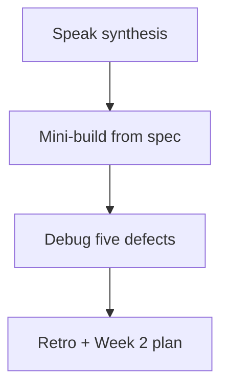

# Month 14 · Week 1 · Day 7
# Week Review — Pyramid, Doubles, Determinism

**Program:** Full-Stack Mastery · 18 months  
**Phase:** 4 — Full-stack application  
**Month index:** [../../README.md](../../README.md)  
**Week 1:** [1](day-01.md) · [2](day-02.md) · [3](day-03.md) · [4](day-04.md) · [5](day-05.md) · [6](day-06.md) · Day 7 (today)  
**Week rhythm today:** Review, repair, plan Week 2  
**Student state:** You classified layers, typed a fake mailer and a clock, wrote unit plus TestClient tests, and drafted a product strategy. Today those ideas must still live in your head — from **this file**.  
**Study time:** 3–4 focused hours

Do not start Week 2 because the calendar moved. Database isolation on a strategy you cannot defend is two problems.

Work in `~\fullstack-lab\month-14\week-01\day-07\`. Do not implement the mini-build inside Project 7.

---

## How to read this chapter

This is a **closed-book teaching day**. The synthesis **is** the Week 1 lesson.



Days 1–6 closed during mini-build. Repair from **this** recap.

---

## Week synthesis (the lesson, in this book)

A **test** is a claim that can fail (Month 1). Month 14 stacks claims in a **pyramid**: many **unit** tests on pure rules; fewer **integration** tests (TestClient HTTP, test database, adapters); **component** tests (RTL + MSW) for what the UI shows; few **E2E** tests (Playwright) for a journey a person must not lose.

**API tests are integration tests of the HTTP adapter.** TestClient is **in-process ASGI**. It is not E2E. It catches missing `status_code=201`, 404 vs 422, 403 deny. It does not catch a `div` used as a button.

**Coverage is a flashlight**, not a trophy. It shows lines that never ran. It does not prove meaning. 100% on `can_edit` still ships a 200 if the router never calls it. Month 14’s gate is: **break a feature deliberately and name the test that turns red** — not a coverage number.

**Doubles.** A **fake** is a working stand-in with memory (`FakeMailer.sent`). A **stub** returns canned values. A **mock** fails unless expected calls happen. A **spy** records calls. Prefer **fakes at boundaries** (email, clock, outbound HTTP). Do not fake Postgres in every API test. Do not mock the route under test. Do not mock your 404.

**Isolation.** Module dicts and fake `.sent` lists leak across tests. Reset in a fixture. pytest order is not a contract. Sleep is not isolation.

**Determinism.** Inject a clock; do not `time.sleep`. Use timezone-aware **UTC** in rules. Do not assert unseeded `uuid4()`. Seed or fake RNG when the exact code is the claim; otherwise assert shape.

**Strategy.** `TEST-STRATEGY.md` maps *your* risks to layers. Product tests live in **your** repos. This textbook does not paste Project 7.

**Wrong belief:** “Playwright for every endpoint.”  
**Correct:** TestClient for endpoints; one (or few) Playwright journeys.

**Wrong belief:** “MagicMock on the mailer is a fake.”  
**Correct:** a fake is a small class you can print. Mocks freeze call signatures.

**Wrong belief:** “If CI coverage is 92%, we are done.”  
**Correct:** walk permission, money, and delete branches. Week 4 returns to useful coverage.

---

## Today's contract

**Today's gate.** Closed-book:

> I can place a claim on the pyramid, name a fake at a boundary, reset state without sleep, inject a clock, and I built a tiny two-layer suite from this file’s spec.

---

## Time box

| Block | Minutes | Work |
|---|---|---|
| 1 | 35 | Speak the synthesis; write `exam-01.md` |
| 2 | 55 | Mini-build: cafeteria trays |
| 3 | 30 | Debug A–E |
| 4 | 20 | Review Day 6 strategy — one honest gap |
| 5 | 20 | `uv run pytest -q`; break one test; restore |
| 6 | 20 | Design: why not fake the ORM |
| 7 | 15 | Retro + Week 2 plan |

---

# Complete explanation — testing you must still own

## 1. Layers

| Layer | Real pieces | Double typical |
|---|---|---|
| Unit | Function | Clock/mail fakes passed in |
| Integration HTTP | FastAPI + TestClient | Fake mailer via Depends later |
| Integration DB | Test database | Not a mocked Session as default |
| Component | React + jsdom | MSW |
| E2E | Browser | Seeded data, not `sleep` |

## 2. TestClient

`from fastapi.testclient import TestClient`. `client.post("/trays", json={...})`. Assert `status_code` then keys. Fixture `clear()`s the store. 204: do not `.json()`.

## 3. Cost

E2E write/debug/flake cost dominates. Unit cost is low. Put deny rules in unit **and** 403 in HTTP.

## 4. Clock

`is_expired(created_at, now)` or `FakeClock`. Naive datetimes rejected. Store UTC.

---

# Block 1 — Speak

No notes. Cover: pyramid; TestClient ≠ E2E; flashlight; fake vs mock; isolation; clock; strategy gaps. Then `exam-01.md` (15–25 lines, your words).

---

# Block 2 — Mini-build (Days 1–6 closed)

```powershell
cd ~\fullstack-lab
mkdir month-14\week-01\day-07\mini -Force
cd ~\fullstack-lab\month-14\week-01\day-07\mini
uv init --name lab-trays
uv add fastapi uvicorn
uv add --dev pytest httpx
```

**Spec: cafeteria trays** — not Project 7.

`rules.py`: `can_return_tray(role: str, owner_id: int, actor_id: int) -> bool` — admin or owner.

`app.py`:

| Method | Path | Rules |
|---|---|---|
| GET | `/health` | 200 `{"status":"ok"}` |
| POST | `/trays` | 201. Body `label` (str min 1), `code` (str min 1). Unique `code` → 409. `slug` from a tiny `slugify`. |
| GET | `/trays/{id}` | 200 or 404 |
| GET | `/trays` | 200 array |

In-memory dict. Fixture resets dict and `_next_id`.

Tests:

- Unit: stranger cannot return; admin can; blank slug `ValueError`  
- HTTP: 201, 404, 409, 422 on empty label  

No Pydantic leak of an `internal_note` if you store one. No SQL. No Playwright.

```powershell
uv run pytest -q
```

---

# Block 3 — Debug

Write `exam-03-debug.md`. For each: **what is wrong**, **layer**, **fix in one or two sentences**.

**A.** Developer says TClient tests are E2E and skips RTL later.  
**B.** `test_create` asserts `id == 1` always; second test fails.  
**C.** Expiry test uses `time.sleep(2)` then `datetime.now()`.  
**D.** Coverage 100% on `can_return_tray`; router never calls it; members return others’ trays.  
**E.** `patch("app.create_tray")` in the HTTP test; 201 never asserted on the real route.

---

# Block 4 — Review Day 6

Open **only** your `TEST-STRATEGY.md` (product or lab copy). One gap: write `GAP.txt` with the test you will add in Week 2. If the file is missing, Week 1 Day 6 is incomplete — do it before Week 2.

---

# Block 5 — Break a test

In mini: change 404 assert to 200; `uv run pytest -q` fails; restore. Paste the fail snippet into `exam-05-fail.txt`. This is rehearsal for Month 14’s gate (break a **feature**, not only an assert — Week 4).

---

# Block 6 — Design

`design.md` (10–15 lines): why API tests should use a **test database** (Week 2) rather than mocking SQLAlchemy `Session.commit`. What bug a mock session hides.

---

# Block 7 — Retro

`retro.md`: weakest layer in *your* product; whether you still want Playwright-for-everything; Week 2 question about transactions.

Week 2 is **pytest fixtures, database isolation, failure paths, email fakes on FastAPI, regression tests**. Do not start it if Block 2 is incomplete.

## Debug keys (after you write A–E)

**A.** TestClient is HTTP in-process. E2E is a browser.  
**B.** Shared dict; fixture must clear and reset ids.  
**C.** Inject a clock; sleep is not determinism.  
**D.** Flashlight missed the unused call; add 403 HTTP test and call the predicate.  
**E.** You mocked the subject; test the adapter.

If you wrote “pytest bug” for any of these, rewrite from the synthesis.

```powershell
cd ~\fullstack-lab
git add month-14
git commit -m "Month 14 Week 1 review: trays mini-build and debug notes."
```

---

## Office hours

**Mini used `payload: dict`.** Add a Pydantic model; 422 is part of the week.  
**Unique 409 not implemented.** That was in the spec; finish before Week 2.  
**Imported Day 4 app.** Rebuild. Copying files is not review.

Windows: `uv run pytest -q --tb=short`.

---

## Definition of done

- [ ] Synthesis spoken; `exam-01.md` exists  
- [ ] Mini pytest green (unit + HTTP)  
- [ ] Debug A–E written, then checked  
- [ ] `GAP.txt` from Day 6 strategy  
- [ ] Fail snippet captured and restored  
- [ ] Week 2 not started on an empty mini  

---

## Optional review links

Repair from this synthesis first.

- [FastAPI: Testing](https://fastapi.tiangolo.com/tutorial/testing/)  
- [pytest](https://docs.pytest.org/en/stable/)  

---

# Lecture: two-layer mini, slowly

`slugify` is a unit. `POST /trays` is HTTP. If you implement slugify **inside** the path operation as an anonymous block, you cannot unit-test it without TestClient. Extract the function. That is the week’s design lesson in one motion.

`can_return_tray` without a 403 route is a predicate in a drawer. The mini does not require 403 — Week 2 Day 3 will. Write `TODO-403.txt` if you felt the gap. That honesty is the review working.

**Fixture sketch you may type in the mini:**

```python
@pytest.fixture
def client() -> TestClient:
    import app as m
    m.TRAYS.clear()
    m._next_id = 1
    return TestClient(m.app)
```

Every HTTP test takes `client`. No global `client = TestClient(app)` at import time unless you like flakes.

**Closed-book cards** (write answers in `retro.md`):

1. TestClient vs Playwright — one sentence.  
2. Fake vs mock — one sentence.  
3. Why coverage 100% can still ship a 200.  
4. Why sleep is not a clock.  
5. Why this textbook will not paste Project 7.  
6. Name the Month 14 gate.  
7. What `dependency_overrides` will be for (Week 2).  
8. 422 vs 404 vs 409 in the mini.  
9. Why pytest order is not a contract.  
10. UTC: storage or display?

Miss more than two: re-read the synthesis, then the mini, then Week 2.

---

## Next week

**Week 2 — Backend quality:** `conftest` and factories, transaction vs truncate vs test DB, failing-path tests (404/403/422), fake email port on the API, regression tests first, then isolate **your** API tests.
