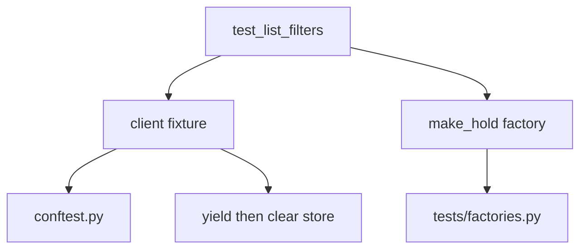

# Month 14 · Week 2 · Day 1
# pytest Fixtures, conftest, Factory vs Fixture

**Program:** Full-Stack Mastery · 18 months  
**Phase:** 4 — Full-stack application  
**Month index:** [../../README.md](../../README.md)  
**Week 2:** Day 1 (today) · [2](day-02.md) · [3](day-03.md) · [4](day-04.md) · [5](day-05.md) · [6](day-06.md) · [7](day-07.md)  
**Week rhythm today:** Learn + type-along  
**Student state:** Week 1 gate passed. You reset a dict in a fixture and injected a clock. Today fixtures become a **system**: `conftest.py`, scopes, `yield` teardown, and **factories** for test data.  
**Study time:** 3–4 focused hours

Labs: `~\fullstack-lab\month-14\week-02\day-01\`. Do not paste Project 7. Database transaction isolation is tomorrow.

---

## How to use this textbook

1. Read until you can say fixture vs factory in one sentence each.  
2. Type `conftest.py`. Do not copy a 200-line “pytest layout” from a blog.  
3. If a test needs data, prefer `make_hold(...)` over a 40-line arrange block — after you understand both.  
4. Optional review links are for later rechecking.

---

## How to read this chapter

A **fixture** is setup (and maybe teardown) that pytest **injects** by parameter name. A **factory** is an ordinary function that **returns data or objects** you can call three times with different fields. You want both. A fixture that returns a huge pre-seeded universe is how tests become mysterious.



**Wrong belief:** “Everything should be an `autouse` fixture so tests stay short.”  
**Correct:** autouse is invisible. Invisible setup is how a test “randomly” has a user already logged in. Prefer **opt-in** fixtures: the test’s signature is the documentation.

**Wrong belief:** “A factory is a fixture with a fancier name.”  
**Correct:** pytest does not inject factories unless you wrap them. Factories are Python functions. Fixtures can **provide** a factory (`def make_hold(client): def _make(**kw): ...; return _make`).

---

## Today's contract

By the end of this day you will be able to:

1. Put shared fixtures in `conftest.py` (discovery rules).  
2. Use `yield` fixtures for teardown.  
3. Choose **function** scope unless you can defend module/session.  
4. Write a `make_*` factory with overrides.  
5. Avoid autouse except for true globals (UTC env, maybe).

**Today's gate.** Closed-book:

> Fixtures inject setup. Yield runs teardown. Factories build data. conftest is discovered, not imported. Autouse is a last resort. Session-scoped mutable fakes will flake.

---

## Time box

| Block | Minutes | Work |
|---|---|---|
| A | 50 | Theory |
| B | 70 | Type-along: holds with conftest + factory |
| C | 60 | Independent: nested factory + param |
| D | 15 | Git |
| E | 15 | Recall |

---

# Block A — Theory

## 1. How pytest finds fixtures

- A test file can define fixtures used in that file.  
- `conftest.py` in the same directory (or a parent directory of the test) is **automatically** loaded. You do **not** `import conftest`.  
- Nested `conftest.py` files override or add fixtures for that subtree.  
- Plugin fixtures exist too (`tmp_path`, `monkeypatch`). You already used `tmp_path` in Month 8.

**Wrong belief:** “I should `from tests.conftest import client`.”  
**Correct:** that fights discovery and duplicates. Let pytest inject `client`.

## 2. The injection contract

```python
def test_ok(client: TestClient) -> None:
    r = client.get("/health")
    assert r.status_code == 200
```

The parameter name `client` must match a fixture named `client`. Type hints are for humans and checkers; pytest matches **names**.

If you misspell `clinet`, pytest errors: fixture not found. That is a gift. Do not catch it by creating a global.

## 3. yield and teardown

```python
@pytest.fixture
def client() -> Iterator[TestClient]:
    store.clear()
    yield TestClient(app)
    store.clear()
    app.dependency_overrides.clear()
```

Code before `yield` is setup. Code after is teardown, run even if the test failed. Clearing `dependency_overrides` is mandatory once Week 2 Day 4 starts overriding mailers — start the habit today.

A non-yield fixture `return TestClient(app)` cannot run teardown after the test. For a dict `clear()` at the **start** of the next test is often enough (Day 4). Teardown still matters for files, sessions, and overrides.

## 4. Scope

| Scope | Lifetime | Use |
|---|---|---|
| `function` (default) | One test | Almost everything |
| `class` | Test class | Rare in this course (we prefer functions) |
| `module` | One test module | Expensive immutable setup |
| `session` | Whole pytest process | Engine / DB schema migrate once (tomorrow) |

Mutable session-scoped objects are flake machines. A session-scoped `FakeMailer` will collect `.sent` from every test.

```python
@pytest.fixture(scope="session")
def engine():
    ...
```

Tomorrow you may session-scope a **database engine** and function-scope a **transaction**. Today: keep `client` at function scope.

## 5. Factories

A factory builds a **valid** object with defaults, and lets the test override the one field it cares about.

```python
def make_hold_payload(**overrides: object) -> dict:
    data: dict = {"title": "North dock", "code": "H1"}
    data.update(overrides)
    return data
```

HTTP factory:

```python
@pytest.fixture
def make_hold(client: TestClient):
    def _make(**overrides: object) -> dict:
        payload = make_hold_payload(**overrides)
        r = client.post("/holds", json=payload)
        assert r.status_code == 201, r.text
        return r.json()
    return _make
```

Now `test_get` can write `h = make_hold(code="Z9")` instead of duplicating POST. The `assert r.status_code == 201` inside the factory is a **sharp edge**: factories that hide failures waste an hour. Keep the assert; the test that expects 409 should **not** use `make_hold` for the colliding POST — it should `client.post` itself.

**Wrong belief:** “Factories should catch 409 and retry a new code.”  
**Correct:** that hides uniqueness bugs. Unique codes belong in the test, or the factory uses a counter.

## 6. Factory vs fixture for “a user”

- Fixture `admin_client`: a TestClient that sends an auth header for a seeded admin. Good when **many** tests need that actor.  
- Factory `make_user(role="member")`: good when tests need **two** users.

If you only have a fixture `user`, you cannot make a second user without a second fixture. Factories scale to “two members and one admin.”

## 7. Parametrize vs factory

`@pytest.mark.parametrize` runs the same test with different inputs. Factories build arrange data. Combine them:

```python
@pytest.mark.parametrize("title", ["A", "North dock"])
def test_create_201(make_hold, title: str) -> None:
    body = make_hold(title=title, code=title[:2] or "X1")
    assert body["title"] == title
```

Do not parametrize yourself into unreadability. Two clear tests beat twelve cryptic rows.

## 8. tmp_path, monkeypatch, capsys

Built-ins:

- `tmp_path` — `pathlib.Path` unique to the test.  
- `monkeypatch` — env, attributes, `chdir`.  
- `capsys` — capture print.  
- `recwarn` — warnings.

Use `monkeypatch.setenv` for settings. Prefer a clock port over `monkeypatch.setattr(datetime, "now", ...)`.

## 9. Marks and skipping

`@pytest.mark.integration` plus `pytest -m "not integration"` is how you keep default runs fast once a real DB exists (tomorrow). Register marks in `pytest.ini` or `pyproject.toml` so pytest does not warn.

Do not skip failing tests to go green. `xfail` is for documented bugs; it is not a drawer.

## 10. Layout for this course

```
lab/
  app.py
  rules.py
  tests/
    conftest.py
    factories.py
    test_rules.py
    test_app.py
  pyproject.toml
```

Tell pytest where code lives. With a flat `app.py` next to `tests/`, you may need:

```toml
[tool.pytest.ini_options]
pythonpath = ["."]
```

in `pyproject.toml`. `uv run pytest` from the lab root.

---

# Block B — Type-along

```powershell
cd ~\fullstack-lab
mkdir month-14\week-02\day-01 -Force
cd ~\fullstack-lab\month-14\week-02\day-01
uv init --name lab-fixtures
uv add fastapi
uv add --dev pytest httpx
```

Rebuild a **tiny holds** API (in-memory) — list, create, get, unique `code` 409. You may type from memory of Week 1 Day 4; do not copy Project 7.

Add `tests/conftest.py` with `client` **yield** fixture that clears the store and `dependency_overrides`.

Add `tests/factories.py` with `make_hold_payload` and a `make_hold` fixture as above.

Tests:

1. `test_make_hold_returns_id`  
2. `test_two_holds_different_ids` using `make_hold` twice  
3. `test_duplicate_code_409` **without** using `make_hold` for the second POST  
4. `test_factory_override_title`

```powershell
uv run pytest -q
```

Write `FIXTURE-VS-FACTORY.md`: ten lines, your words.

Write `SCOPE.md`: why `client` is function-scoped.

---

# Block C — Independent

1. Factory counter: `make_hold` without `code` generates `H-{n}` so tests do not collide. Document it.  
2. Parametrize 422: missing title vs missing code (if your model requires both).  
3. A fixture `empty_client` that is just `client` — then delete it and write `WHY-NOT.md` if it added no meaning. Redundant fixtures are noise.  
4. Stretch: `make_hold` accepts `as_client` so you can POST as different TestClients later (auth Week 2 Day 3). Even if both are the same unauthenticated client today, the signature teaches you.

Do not add SQLAlchemy today.

```powershell
cd ~\fullstack-lab
git add month-14
git commit -m "Month 14 Week 2 Day 1: conftest, yield client, hold factory."
```

---

# Block E — Recall

1. Why you do not import `conftest`.  
2. What runs after `yield` if the test failed.  
3. Factory vs fixture for two users.  
4. Danger of session-scoped FakeMailer.  
5. Why factories should not swallow 409.

## Office hours

**Fixture not found.** Name mismatch, or `conftest.py` not in a parent of the test path. Run from lab root.

**`pythonpath`.** If `import app` fails, set `[tool.pytest.ini_options] pythonpath = ["."]` or a `src` layout you understand.

**Factory assert 201 failed inside factory.** Read `r.text`. Do not catch Exception.

**Circular fixtures.** `client` needs `app`, `app` needs `client`. Stop. App is a module; client is the fixture.

Windows: `uv run pytest -q --fixtures` lists available fixtures. Use it when lost.

---

## Definition of done

- [ ] `conftest.py` yield client  
- [ ] Factory builds holds with overrides  
- [ ] Duplicate 409 test does not hide inside the factory  
- [ ] Two docs written  
- [ ] `uv run pytest -q` green  
- [ ] Commit exists  

---

## Optional review links

Fixtures are explained in this chapter.

- [pytest fixtures](https://docs.pytest.org/en/stable/explanation/fixtures.html)  
- [conftest.py](https://docs.pytest.org/en/stable/reference/fixtures.html#conftest-py-sharing-fixtures-across-multiple-files)  

---

## Tomorrow

**Database isolation:** transaction rollback vs truncate vs a dedicated test database. You will not mock `Session.commit` as a lifestyle.


<!-- length-pad -->
# Lecture: conftest and factories

This section is still the lesson. Read it if a block felt thin. Say each claim aloud before you continue.

## Claims you must still own

1. pytest matches fixture names, not types.

2. Do not import conftest.

3. yield teardown runs even if the test failed.

4. Clear dependency_overrides in teardown.

5. Function scope is default; session-scoped mutable fakes flake.

6. Factories take overrides; they must not swallow 409.

7. A factory that asserts 201 is a sharp edge — keep the assert.

8. Two users means a factory, not one fixture named user.

9. pythonpath = ['.'] when imports fail.

10. autouse is invisible; last resort.

## Wrong belief / Correct

**Wrong belief:** “Everything should be autouse so tests stay short.”  
**Correct:** The signature is the documentation.

**Wrong belief:** “A factory is a fixture with a fancier name.”  
**Correct:** Factories are functions; fixtures inject.

**Wrong belief:** “Session-scope the FakeMailer for speed.”  
**Correct:** It will collect .sent from every test.

## Drills (write answers in the lab folder)

1. Run uv run pytest --fixtures and find client.

2. Write a 409 test that does not use make_hold for the colliding POST.

3. Delete a useless alias fixture and write WHY-NOT.md.

## Windows

- uv run pytest -q from the lab root.

- uv run pytest --fixtures

## Pitfalls

- Name mismatch clinet.

- Circular client/app fixtures.

- Hardcoded factory code A1 twice.

## Say it in six sentences

Close the file. Speak the day's gate paragraph. Name the command you will run. Name the folder you will type in. Name what you will not paste. Name the test that would go red if you broke the matching product behavior. If you cannot, reread Block A.

## Git reminder

```powershell
cd ~\fullstack-lab
git add month-14
git status
```

Commit when the day's definition of done is true. Do not commit secrets. Product tests stay in product repos.
