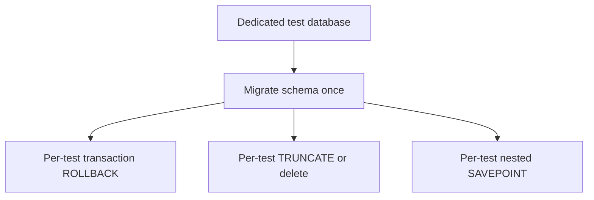

# Month 14 · Week 2 · Day 2
# Database Isolation: Rollback vs Truncate vs a Dedicated Test DB

**Program:** Full-Stack Mastery · 18 months  
**Phase:** 4 — Full-stack application  
**Month index:** [../../README.md](../../README.md)  
**Week 2:** [1](day-01.md) · Day 2 (today) · [3](day-03.md) · [4](day-04.md) · [5](day-05.md) · [6](day-06.md) · [7](day-07.md)  
**Week rhythm today:** Learn + type-along  
**Student state:** You have `conftest` and factories on an in-memory app. Product APIs use **PostgreSQL**. Today you isolate tests so they do not share rows, without mocking `Session.commit` as a lifestyle.  
**Study time:** 3–4 focused hours

Labs: `~\fullstack-lab\month-14\week-02\day-02\`. Product isolation work belongs in **your** API repo on Day 6. Do not paste Project 7. Do not point tests at a production database.

---

## How to use this textbook

1. Read until you can teach rollback vs truncate vs dedicated DB in full sentences.  
2. Type the SQLite (or Postgres if you already have it) lab. SQLite is allowed **today** so Windows students without a second cluster still learn the **pattern**. Your product still uses Postgres.  
3. Never run the lab against a database that holds real user data.  
4. Optional review links are for later rechecking.

---

## How to read this chapter

API tests that hit SQL are only honest if each test sees a **known** database. Three common patterns:



**Wrong belief:** “I’ll mock SQLAlchemy Session so tests stay unit-fast.”  
**Correct:** then you never see a missing `commit`, a unique constraint, or an `ON DELETE` rule. Fake **email**. Keep a **test database** for persistence.

**Wrong belief:** “I’ll use the same Postgres I click on in TablePlus for pytest.”  
**Correct:** tests will delete rows you care about, or fail because yesterday’s UI leftovers exist. Dedicated database (or at least a dedicated schema/name like `holds_test`).

---

## Today's contract

By the end of this day you will be able to:

1. Explain **dedicated test DB**, **transaction rollback**, and **truncate** — cost and risk of each.  
2. Wire a pytest fixture that gives each test a clean store.  
3. Name what rollback **cannot** see (some DDL, connections outside the transaction, `commit` inside the app that ends the test transaction if you designed it wrong).  
4. Mark slow DB tests so `uv run pytest -q` can stay focused.  
5. Write `ISOLATION.md` for **your** product: which pattern you use or will use.

**Today's gate.** Closed-book:

> Tests get their own database name. I prefer rollback around a real session, or truncate if I must. I do not mock commit. I do not pytest against production.

---

## Time box

| Block | Minutes | Work |
|---|---|---|
| A | 55 | Theory |
| B | 70 | Type-along: SQLite file or memory + fixtures |
| C | 55 | Independent: prove isolation with two tests |
| D | 15 | Git |
| E | 15 | Recall |

---

# Block A — Theory

## 1. Why in-memory dicts were a warm-up

Week 1 cleared `PERMITS = {}`. Postgres does not vanish when a Python fixture returns. Rows persist until you **rollback**, **delete**, or **drop**. Alembic migrations (Month 11) define schema; tests must **apply** that schema to a disposable database.

Month 11’s gate already asked for integration tests against a **test database**. Today we name **how** you keep tests from colliding.

## 2. Dedicated test database

Create a database that is not `postgres` and not your development data. Examples: `app_test`, `holds_test`. CI creates it too.

Properties:

- Same engine as production (Postgres for the product).  
- Migrations run in a session-scoped fixture or a CI step.  
- Credentials from env (`TEST_DATABASE_URL`), never hardcoded passwords in git.

SQLite `file:memdb1?mode=memory&cache=shared` or a temp file is a **lab stand-in**. It will not catch Postgres-only types (`TIMESTAMPTZ` quirks, `EXCLUDE` constraints). Write that limitation in `ISOLATION.md`.

## 3. Transaction rollback (preferred default)

Pattern:

1. Session-scoped engine + migrated schema.  
2. Function-scoped connection begins a transaction.  
3. Tests use a Session bound to that connection.  
4. After the test, **rollback**.

Fast: no DELETE of millions of rows. The next test sees the schema, not the data.

SQLAlchemy 2.x sketch (you type a smaller version in Block B):

```python
@pytest.fixture
def db_session(engine):
    connection = engine.connect()
    transaction = connection.begin()
    session = Session(bind=connection)
    yield session
    session.close()
    transaction.rollback()
    connection.close()
```

FastAPI: override `get_db` to yield **this** session. If the path operation calls `session.commit()`, it may **end** the test transaction early. Common repair: use a session whose `commit` is a nested savepoint (`begin_nested`) so “commit” in the app does not persist to other tests.

This is the fiddly part. If rollback fixtures fight `commit`, **truncate** is an honest fallback while you learn — still on a test DB.

**Wrong belief:** “Rollback means I never test commit.”  
**Correct:** you test that the app **issued** commit (data visible inside the test via the same session, or via nested transactions). You still need at least one test that proves a real commit path if you use savepoint tricks — or use truncate and a real commit.

## 4. Truncate (or delete all)

After each test (or before): `TRUNCATE table1, table2 RESTART IDENTITY CASCADE` (Postgres) or `DELETE FROM ...` in FK order.

Properties:

- Works even if the app committed.  
- Slower than rollback on large schemas.  
- You must list tables or introspect. Alembic order / `CASCADE` helps.  
- Sequences reset if you `RESTART IDENTITY` — tests that assume `id == 1` still should not assume order of other tests, but they become less flaky.

SQLite has no full `TRUNCATE`; `DELETE FROM` plus sqlite sequence table if you use AUTOINCREMENT.

## 5. Drop and recreate schema

Slow. Useful overnight, not per test. CI sometimes drops the test database at the start of the job, migrates once, then uses rollback or truncate per test.

## 6. Comparison

| Pattern | Speed | Sees real commit | Risk |
|---|---|---|---|
| Rollback / savepoint | Fast | Needs care | App `commit` breaks isolation |
| Truncate | Medium | Yes | Forgotten table leaks rows |
| Dedicated DB only, no cleanup | Feels fast | Yes | **Flakes** — this is not isolation |
| Mock Session | Fastest | **No** | Misses constraints |

**Wrong belief:** “I’ll use `dependency_overrides` to swap an in-memory dict in ‘DB tests’.”  
**Correct:** that is Week 1 again. Keep one suite that hits SQL. Dict fakes belong in unit tests of services that take a repository **port** — and you still owe SQL tests for the SQL adapter.

## 7. Parallel pytest (`-n auto`)

If you run tests in parallel, one database + truncate will collide. Options: one DB per worker (`xdist` worker id in the name), or stay serial until CI needs speed. Do not enable parallelism today.

## 8. Marks

```toml
[tool.pytest.ini_options]
markers = [
  "db: hits a database",
]
```

```python
@pytest.mark.db
def test_unique_code(client):
    ...
```

```powershell
uv run pytest -q -m "not db"
uv run pytest -q -m db
```

Default for you this month: running **all** lab tests is fine. In a large product, developers might run unit first.

## 9. What rollback will not save you from

- Data written through a **second connection** (background task, raw psycopg) that autocommits.  
- Files on disk, Redis, external SMTP — different stores, different fakes.  
- `time.sleep` flakes — Day 5, not today.

## 10. Safety

`TEST_DATABASE_URL` must not equal production. A fixture can refuse to start if the name does not contain `test`. That assertion has prevented more disasters than a coverage gate.

```python
assert "test" in url, "refusing to run pytest on a non-test database name"
```

Imperfect (a prod name could include the letters). Still worth it. Prefer a dedicated user with rights only on `*_test`.

---

# Block B — Type-along

Use **SQLite** in a temp file so you do not need a second Postgres. If you already have Postgres from Month 10 and prefer it, use a database named `m14_isolation_test` and say so in `ENGINE.md`.

```powershell
cd ~\fullstack-lab
mkdir month-14\week-02\day-02 -Force
cd ~\fullstack-lab\month-14\week-02\day-02
uv init --name lab-isolation
uv add fastapi sqlalchemy
uv add --dev pytest httpx
```

Tiny model: `Hold` with `id`, `code` (unique), `title`. FastAPI `POST /holds` 201, `GET /holds/{id}` 404/200.

`conftest.py`:

- Session-scoped engine (`sqlite:///<tmp file>` or memory with shared cache).  
- `Base.metadata.create_all` once.  
- Function-scoped session with **rollback** **or** `DELETE FROM holds` — pick one, document in `ISOLATION.md`.  
- `get_db` override.  
- Clear overrides after yield.

Tests:

1. `test_create_201`  
2. `test_get_404`  
3. `test_isolation_empty_start` — GET list empty even after other tests exist in the file. **This is the point.** If it fails, your cleanup is wrong.

```powershell
uv run pytest -q
```

Write `ENGINE.md`: SQLite lab vs Postgres product.

---

# Block C — Independent

1. Second test file `test_isolation_again.py` with only `test_also_starts_empty`. If it fails depending on collection order, fix fixtures, do not delete the test.  
2. Unique `code` 409 (IntegrityError → HTTP 409). That test **needs** a real unique constraint, not a Python `if` only — if you only have the `if`, add the SQL unique and prove it.  
3. `SAFETY.md`: the assert you would use on `TEST_DATABASE_URL` in the product.  
4. Stretch: begin_nested savepoint if you chose rollback and `commit` in the route broke isolation.

Do not connect this lab to Project 7’s database.

```powershell
cd ~\fullstack-lab
git add month-14
git commit -m "Month 14 Week 2 Day 2: DB isolation fixtures and empty-start tests."
```

---

# Block E — Recall

1. Why a dedicated test DB.  
2. Rollback vs truncate — one cost each.  
3. How `session.commit()` in a route can break rollback isolation.  
4. Why mock Session hides unique violations.  
5. The `"test" in url` safety check — limitation?

## Office hours

**Tests pass alone, fail together.** Isolation. Print row counts at the start of `test_isolation_empty_start`.

**SQLite vs Postgres 409.** SQLite unique errors still exist; the exception type may differ. The product must be tested on Postgres in **your** repo (Day 6).

**`create_all` vs Alembic.** Lab: `create_all` is enough. Product: run migrations on the test DB so you do not drift.

**Foreign keys.** Truncate with `CASCADE` or delete children first. Rollback is easier here.

Windows: if the SQLite file is locked, close sessions in teardown; do not keep TablePlus on the same file during pytest.

## Minimum isolation test

```python
def test_starts_empty(client: TestClient) -> None:
    r = client.get("/holds")
    assert r.status_code == 200
    assert r.json() == []
```

If this is order-dependent, nothing else in the file can be trusted.

---

## Definition of done

- [ ] Two files prove empty start  
- [ ] Unique constraint test exists  
- [ ] `ISOLATION.md` + `ENGINE.md` + `SAFETY.md`  
- [ ] No production URL  
- [ ] Commit exists  

---

## Optional review links

Isolation patterns are explained in this chapter.

- [SQLAlchemy sessions](https://docs.sqlalchemy.org/en/20/orm/session_basics.html)  
- [pytest fixtures](https://docs.pytest.org/en/stable/explanation/fixtures.html)  

---

## Tomorrow

**From memory:** write a failing-path test for **404, 403, and 422**. The recap in that file is the teacher. Days 1–2 stay closed during the drill.
