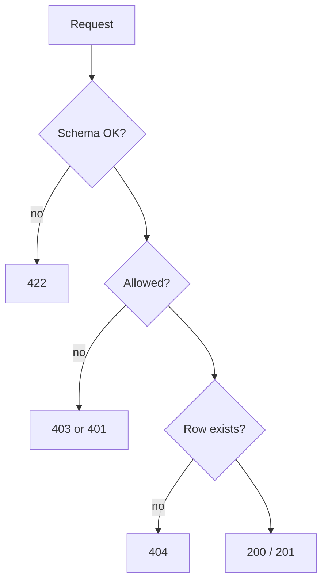

# Month 14 · Week 2 · Day 3
# From Memory: Failing-Path Tests (404, 403, 422)

**Program:** Full-Stack Mastery · 18 months  
**Phase:** 4 — Full-stack application  
**Month index:** [../../README.md](../../README.md)  
**Week 2:** [1](day-01.md) · [2](day-02.md) · Day 3 (today) · [4](day-04.md) · [5](day-05.md) · [6](day-06.md) · [7](day-07.md)  
**Week rhythm today:** Implement from memory  
**Student state:** You can isolate stores and name fixtures. Today you prove the **unhappy** HTTP paths without opening Days 1–2.  
**Study time:** 3–4 focused hours  
**Prereq:** Day 2 gate passed.

Labs: `~\fullstack-lab\month-14\week-02\day-03\`. Do **not** copy a product router. Do **not** paste Project 7. Domain: **shift signups**.

---

## How Day 3 works

Days 1–2 stay **closed** during the build. This recap is the teacher.

Allowed: this file, your lab notes, pytest output.  
Not allowed: AI-finished apps, copying Week 1 `app.py`, browsing FastAPI testing docs as the teacher.

Stuck more than 25 minutes: open **only** the matching earlier section, close it, record `lookups.txt`.

---

## How to read this chapter

Happy-path 201 tests are necessary and insufficient. Month 13 already required **deny**. Month 9 required 404 and 422. Today you write all three on one tiny API so the reflex is automatic.



**Wrong belief:** “422 is my 404 for bad ids.”  
**Correct:** `GET /shifts/abc` is **422** if `id: int`. `GET /shifts/999` is **your** 404 after the route ran.

**Wrong belief:** “Hiding the button is the 403 test.”  
**Correct:** TestClient as the wrong user must see 403. The UI is courtesy.

---

## Complete explanation (statuses you must still own)

**404.** Resource missing. `raise HTTPException(status_code=404, detail="...")`. Framework 404 means **no route**. Tests: `assert r.status_code == 404` and `"detail" in r.json()`. Do not return `null` with 200 (Month 9 exam bug A).

**401 vs 403.** 401: we do not know who you are (or credentials failed). 403: we know, and you may **not**. Month 13. Today: a header `X-User-Id` and `X-Role` is an **ugly lab stand-in** for auth — not for production. Production stays your real sessions/JWT. The lab fakes identity so you can write 403 without rebuilding Month 13.

**422.** Pydantic / path parse. `detail` is a **list** with `loc`. Assert status + loc, not a frozen `msg`. Empty string may need `Field(min_length=1)` or it will **not** 422.

**409.** Unique conflict — optional stretch today if you have time; Week 1 already did it.

**TestClient.** In-process HTTP. Fixture resets store. Function-scoped client.

**Isolation.** In-memory dict is enough today so you finish three statuses. You already practiced SQL isolation yesterday; do not rebuild Postgres unless you finish early.

**Doubles.** Do not mock `HTTPException`. Do not mock the route. If a signup notifies email, skip mail today or use a list append — Day 4 is the fake mail port.

**Wrong belief:** “I’ll assert 400 for everything ugly.”  
**Correct:** this course maps schema → 422, missing → 404, forbidden → 403, conflict → 409.

---

## Today's contract

1. Implement GET one 404, PATCH 403, POST 422.  
2. Explain 422 vs 404 for `/shifts/abc` vs `/shifts/999`.  
3. Fixture isolation.  
4. Names: `test_get_missing_shift_returns_404`, etc.

**Today's gate.** Closed-book:

> 422 is schema/types. 404 is missing resource after the route matched. 403 is authenticated but not allowed. I test all three with TestClient. I do not mock the deny.

---

## Time box

| Block | Minutes | Work |
|---|---|---|
| 1 | 20 | Speak recap; `exam-01.md` |
| 2 | 70 | Mini-build + three failing-path tests |
| 3 | 25 | Debug A–E on paper |
| 4 | 20 | Extra: 401 vs 403 note |
| 5 | 20 | Break 403 assert; restore |
| 6 | 20 | Design: header fake vs real auth |
| 7 | 15 | Retro |

---

# Block 1 — Speak

Cover: 422 loc vs 404 string; 403 vs 401; TestClient; fixture clear; why not mock deny. Write `exam-01.md`.

```powershell
cd ~\fullstack-lab
mkdir month-14\week-02\day-03 -Force
cd ~\fullstack-lab\month-14\week-02\day-03
```

---

# Block 2 — Mini-build

```powershell
uv init --name lab-shifts
uv add fastapi
uv add --dev pytest httpx
```

**Shifts** (not Project 7):

- `Shift`: `id`, `title` (min length 1), `owner_id` (int).  
- `POST /shifts` 201. Identity from headers `X-User-Id` (int) and `X-Role` (`member`|`admin`). Missing headers → **401**.  
- `GET /shifts/{id}` 200 or 404.  
- `PATCH /shifts/{id}` body `{title}`: 200 if admin **or** owner; **403** if member and not owner; 404 if missing; 422 if title empty.  
- In-memory dict. Fixture clears.

Tests you must name and write:

1. `test_get_missing_shift_returns_404`  
2. `test_patch_foreign_shift_returns_403`  
3. `test_create_empty_title_returns_422` — assert `detail` is a list  
4. `test_missing_headers_returns_401`  
5. Happy: owner can PATCH 200  

```powershell
uv run pytest -q
```

`RULES.md`: who may PATCH. One paragraph.

Do not add SQL. Do not copy ops-api auth.

---

# Block 3 — Debug

`DEBUG.md`:

**A.** `GET /shifts/abc` — student expects 404.  
**B.** PATCH foreign returns 200 because they only checked role==admin and forgot owner.  
**C.** Empty title returns 201.  
**D.** 403 test uses `dependency_overrides` to replace the path function.  
**E.** Two tests both create id 1; second 403 test hits the wrong owner.

---

# Block 4 — 401 vs 403

`AUTHZ.md`: when your **product** uses 401 vs 403 (cookie missing vs member forbidden). The lab headers are not a product design.

---

# Block 5 — Break

Change 403 test to expect 200; run pytest; restore; save snippet `fail.txt`.

---

# Block 6 — Design

`design.md`: why Week 4 Playwright must not be the **only** 403 net.

---

# Block 7 — Retro

`retro.md`: which status you still mix up; `lookups.txt`.

## Worked debug (after you write A–E)

**A.** Path `int` failed → 422.  
**B.** Predicate must be admin **or** owner. TestClient as member 2 on owner 1.  
**C.** `Field(min_length=1)` or handler reject.  
**D.** You skipped the adapter; test the real PATCH.  
**E.** Fixture reset `_next_id` and dict.

```powershell
cd ~\fullstack-lab
git add month-14
git commit -m "Month 14 Week 2 Day 3: shift 404 403 422 tests."
```

---

## Office hours

**403 vs 404 on foreign ids.** Some products 404 to hide existence. If you choose that, **contract it** and test 404, but still test that the row did not change. This lab uses **403** so the status is visible.

**Pydantic v2 `detail`.** List of objects. `loc` includes `body` and field name.

Windows: `uv run pytest -q --tb=short`.

---

## Definition of done

- [ ] 404, 403, 422, 401 tests green  
- [ ] Happy PATCH green  
- [ ] Debug written then checked  
- [ ] No Project 7 source  
- [ ] Commit exists  

---

## Optional review links

Repair from this recap first.

- [FastAPI handling errors](https://fastapi.tiangolo.com/tutorial/handling-errors/)  

---

## Tomorrow

**Lab:** fake the email **port**; assert the fake was called; do not hit SMTP.


<!-- length-pad -->
# Lecture: 404 403 422

This section is still the lesson. Read it if a block felt thin. Say each claim aloud before you continue.

## Claims you must still own

1. 422 is schema/types; detail is a list with loc.

2. 404 is missing resource after the route matched.

3. GET /shifts/abc is 422 if id is int.

4. 403 is authenticated but not allowed; 401 is unknown.

5. Do not mock the deny.

6. Lab headers are not production auth.

7. Empty title may need Field(min_length=1).

8. Fixture reset prevents id==1 flakes.

9. Hiding a button is not the 403 test.

10. Some products 404 to hide existence; contract it and still assert no mutation.

## Wrong belief / Correct

**Wrong belief:** “422 is my 404 for bad ids.”  
**Correct:** Types vs missing rows.

**Wrong belief:** “I'll assert 400 for everything ugly.”  
**Correct:** This course maps statuses.

**Wrong belief:** “dependency_overrides on the path function tests 403.”  
**Correct:** You skipped the adapter.

## Drills (write answers in the lab folder)

1. Name five tests from Block 2 from memory.

2. Write AUTHZ.md for the product 401 vs 403.

3. Break 403 expect 200, restore, save fail.txt.

## Windows

- uv run pytest -q --tb=short

## Pitfalls

- Returning 200 null for missing.

- Empty string accepted as title.

## Say it in six sentences

Close the file. Speak the day's gate paragraph. Name the command you will run. Name the folder you will type in. Name what you will not paste. Name the test that would go red if you broke the matching product behavior. If you cannot, reread Block A.

## Git reminder

```powershell
cd ~\fullstack-lab
git add month-14
git status
```

Commit when the day's definition of done is true. Do not commit secrets. Product tests stay in product repos.

<!-- length-pad-2 -->
# Worked questions: statuses

Write answers in `Q.md` in the day's lab folder before you peek at the sentences under each question. Then compare.

**Q1.** Why is /shifts/abc 422?

Answer: The path matched; int parsing failed before your 404.

**Q2.** Why is /shifts/999 404?

Answer: The route ran; the store had no row; you raised HTTPException.

**Q3.** Why 403 not 401 for a logged-in member?

Answer: We know who they are; they may not edit.

**Q4.** Why assert loc not msg?

Answer: Pydantic messages change across versions.

**Q5.** Why not mock deny?

Answer: Then you tested the mock, not the adapter.

**Q6.** Lab headers vs JWT?

Answer: Headers are a gym. Production stays Month 13 sessions or tokens.

**Q7.** What if 403 still saved?

Answer: Assert GET still has the original title.

**Q8.** Empty title 201?

Answer: Add min_length or reject in the handler; keep the test.

## Quick table

| Idea | Honest use | Dishonest use |
|---|---|---|
| 422 | Schema/types | Using it for missing ids |
| 404 | Missing row | Using it for bad JSON |
| 403 | Forbidden | Hiding a button only |
| 401 | Unknown | Mixing with 403 copy |
| 409 | Unique conflict | Optional stretch today |

## Closing

Three failing-path tests are a reflex. Happy 201 without them is a demo.

If this page is the only thing you remember tomorrow, you still have the day's gate. Type the lab. Run the command. Do not paste Project 7.
