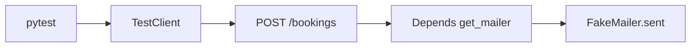

# Month 14 · Week 2 · Day 4
# Lab: Fake the Email Port — Assert the Call, Never SMTP

**Program:** Full-Stack Mastery · 18 months  
**Phase:** 4 — Full-stack application  
**Month index:** [../../README.md](../../README.md)  
**Week 2:** [1](day-01.md) · [2](day-02.md) · [3](day-03.md) · Day 4 (today) · [5](day-05.md) · [6](day-06.md) · [7](day-07.md)  
**Week rhythm today:** Lab (type-along + independent)  
**Student state:** You can write 403 tests and isolate stores. Today a create endpoint **notifies** — and pytest proves it **without** Gmail.  
**Study time:** 3–4 focused hours

Labs: `~\fullstack-lab\month-14\week-02\day-04\`. Do not configure SMTP. Do not paste Project 7. Domain: **desk bookings** (a notice email when created).

---

## How to use this textbook

1. Read the port + override pattern. Close it. Say it.  
2. Type FakeMailer, Depends, tests that inspect `fake.sent`.  
3. If a test passes without the fake recording a message, the test is wrong or the route never sent.  
4. Optional review links are for later rechecking.

---

## How to read this chapter

Week 1 Day 2 taught a fake in a service `__init__`. Today the fake is wired through **FastAPI `Depends`**, which is how your product should swap adapters.



**Wrong belief:** “I’ll patch `smtplib.SMTP.sendmail` and call that a mail test.”  
**Correct:** you coupled tests to a library. A **MailPort** plus `dependency_overrides` tests **your** decision to notify.

**Wrong belief:** “BackgroundTasks means I cannot assert send.”  
**Correct:** TestClient runs background tasks before returning by default (Starlette). A fake still records. If you ever see a race, call the notify **inline** in tests via a setting `MAIL_INLINE=1` — still no SMTP.

---

## Today's contract

1. Define `MailPort` and `FakeMailer` with a `sent` list.  
2. `get_mailer` dependency; override in a fixture.  
3. POST create sends one message; assert `to`, subject or body contains the title.  
4. A path that must **not** send (validation fail) leaves `sent` empty.  
5. Clear `dependency_overrides` in teardown.

**Today's gate.** Closed-book:

> I fake email at a port. I assert the fake’s memory. I never open SMTP in pytest. Overrides are cleared so tests do not leak mailers.

---

## Time box

| Block | Minutes | Work |
|---|---|---|
| A | 40 | Theory |
| B | 75 | Type-along: bookings + FakeMailer |
| C | 65 | Independent: no-mail on 422; two recipients stretch |
| D | 15 | Git |
| E | 15 | Recall |

---

# Block A — Theory

## 1. The port

```python
from typing import Protocol

class MailPort(Protocol):
    def send(self, to: str, subject: str, body: str) -> None: ...
```

Production adapter (you may write a stub that **raises** `NotImplementedError` or prints — still no network):

```python
class SmtpMailer:
    def send(self, to: str, subject: str, body: str) -> None:
        raise RuntimeError("SMTP is not for pytest or this lab")
```

`get_mailer()` returns `SmtpMailer()` in the app module. Tests never call it if they override.

## 2. Fake

```python
class FakeMailer:
    def __init__(self) -> None:
        self.sent: list[tuple[str, str, str]] = []

    def send(self, to: str, subject: str, body: str) -> None:
        self.sent.append((to, subject, body))
```

New instance **per test** (fixture). Module-level fake leaks.

## 3. Override

```python
@pytest.fixture
def mailer() -> FakeMailer:
    return FakeMailer()

@pytest.fixture
def client(mailer: FakeMailer) -> Iterator[TestClient]:
    app.dependency_overrides[get_mailer] = lambda: mailer
    yield TestClient(app)
    app.dependency_overrides.clear()
    STORE.clear()
```

The `lambda: mailer` closes over the fixture instance. Do not write `lambda: FakeMailer()` inside the override — that would be a **different** object than the one you assert on.

**Wrong belief:** “I’ll override with MagicMock.”  
**Correct:** you can, and then you will debug `assert_called` instead of reading `.sent`. Prefer the tiny class.

## 4. What to assert

- `len(mailer.sent) == 1` after a successful create.  
- `mailer.sent[0][0] == "owner@example.com"` (or whatever the booking uses).  
- Title appears in subject or body.  
- After 422, `mailer.sent == []` — **this** catches “send before validation” bugs.

Do not assert SMTP envelope internals. You have no SMTP.

## 5. BackgroundTasks

If you `background.add_task(mailer.send, ...)`, TestClient waits. If a future version does not, your 422 test still matters (send must not happen on invalid bodies). Prefer calling `mailer.send` in the service after the row is stored if you want simplicity today.

Month 9 taught fake email with BackgroundTasks. Same idea: **fake function**, not Gmail.

## 6. Product mapping

Your Project 7 may already send mail on register or assign. Day 6 you will attach this pattern **there**. Today the gym is bookings.

---

# Block B — Type-along

```powershell
cd ~\fullstack-lab
mkdir month-14\week-02\day-04 -Force
cd ~\fullstack-lab\month-14\week-02\day-04
uv init --name lab-mail
uv add fastapi
uv add --dev pytest httpx
```

Type:

- `ports.py` — Protocol  
- `fakes.py` — FakeMailer  
- `mailer.py` — SmtpMailer that raises; `get_mailer`  
- `app.py` — in-memory bookings `{id, title, owner_email}`; POST 201; GET 404; Pydantic min length 1 on title and email  
- After successful store, `mailer.send(owner_email, "Booking created", body_with_title)`  
- `tests/conftest.py` — client + mailer fixtures  
- `tests/test_mail.py` — create records one send; 404 does not send extra; health does not send  

```powershell
uv run pytest -q
```

Write `NO-SMTP.md`: how you know SMTP was not used (SmtpMailer raises; tests still pass).

---

# Block C — Independent

1. `test_invalid_title_does_not_send` — 422, `sent == []`.  
2. If create 409 (duplicate title optional), still no extra mail.  
3. Stretch: admin POST that notifies **owner and admin** — `len(sent)==2` or one email with two sends; document the rule.  
4. A test that **fails** if you comment out `mailer.send` in the route — that is the point. Try it, restore. `RED.txt` snippet.  
5. `PRODUCT-NOTE.md`: where in *your* API you will apply this (path names only).

Do not add Redis. Do not send to a real address.

```powershell
cd ~\fullstack-lab
git add month-14
git commit -m "Month 14 Week 2 Day 4: FakeMailer via Depends, no SMTP."
```

---

# Block E — Recall

1. Why `lambda: mailer` not `lambda: FakeMailer()`.  
2. Why clear overrides.  
3. Why 422 must not send.  
4. Protocol vs MagicMock.  
5. TestClient and BackgroundTasks (default).

## Office hours

**Tests pass, `sent` empty, you forgot to assert `sent`.** Then you never proved notify. Assert the list.

**`RuntimeError: SMTP is not for pytest`.** Override did not apply — wrong function object (`get_mailer` imported from two paths). Override the same object the route uses.

**Shared fake.** Function-scoped fixture.

Windows: `uv run pytest -q`. No extra firewall rules; there is no network.

## Minimum assert

```python
def test_create_sends_mail(client: TestClient, mailer: FakeMailer) -> None:
    r = client.post(
        "/bookings",
        json={"title": "Desk A", "owner_email": "ada@example.com"},
    )
    assert r.status_code == 201
    assert len(mailer.sent) == 1
    to, subject, body = mailer.sent[0]
    assert to == "ada@example.com"
    assert "Desk A" in body
```

---

## Definition of done

- [ ] Create sends exactly once  
- [ ] 422 sends nothing  
- [ ] SmtpMailer unused in pytest  
- [ ] Overrides cleared  
- [ ] `RED.txt` from commenting out send  
- [ ] Commit exists  

---

## Optional review links

Ports and Depends are explained in this chapter.

- [FastAPI testing dependencies](https://fastapi.tiangolo.com/advanced/testing-dependencies/)  
- [FastAPI Background Tasks](https://fastapi.tiangolo.com/tutorial/background-tasks/)  

---

## Tomorrow

**Regression tests:** reproduce a bug with a test **first**, then fix. That is how Week 4’s exam stays honest.
