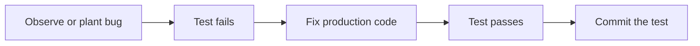

# Month 14 · Week 2 · Day 5
# Regression Tests: Reproduce the Bug with a Test First

**Program:** Full-Stack Mastery · 18 months  
**Phase:** 4 — Full-stack application  
**Month index:** [../../README.md](../../README.md)  
**Week 2:** [1](day-01.md) · [2](day-02.md) · [3](day-03.md) · [4](day-04.md) · Day 5 (today) · [6](day-06.md) · [7](day-07.md)  
**Week rhythm today:** Learn + type-along  
**Student state:** You can fake mail and assert 403. Today you practice the loop Month 1 promised: **red, green, keep the test**.  
**Study time:** 3–4 focused hours

Labs: `~\fullstack-lab\month-14\week-02\day-05\`. Do not paste Project 7. You will **plant** a bug in a tiny app, lock it with pytest, then fix it.

---

## How to use this textbook

1. Read the loop. Do not skip the red step.  
2. Type the broken behavior **on purpose**, write the test, watch it fail, fix, watch it pass.  
3. A test written after you already fixed the bug is a souvenir unless you proved it would have failed.  
4. Optional review links are for later rechecking.

---

## How to read this chapter

A **regression test** is a claim that a bug **cannot return unnoticed**. The honest way to write it is to **see red** on the bug, then green on the fix.



**Wrong belief:** “I’ll fix it first; tests later if I have time.”  
**Correct:** after the fix you cannot prove the test would have caught it unless you temporarily revert the fix (Week 4 Day 6 rehearsal). Today we **start** from red.

**Wrong belief:** “Any new assert is a regression test.”  
**Correct:** it is a regression test when it encodes a **specific failure that happened** (or that you planted as practice). Name the test after the bug: `test_blank_code_does_not_create_hold`.

---

## Today's contract

1. Tell a bug story in one paragraph (`BUG.md`).  
2. Write a failing test **before** changing the fix (or restore the bug if you jumped).  
3. Fix the smallest production change.  
4. Keep the test.  
5. Explain why a snapshot of the whole JSON is a weak regression net.

**Today's gate.** Closed-book:

> I reproduce with a test first. I watch pytest fail for the right reason. I fix. I keep the test. That is the Month 14 exam in miniature.

---

## Time box

| Block | Minutes | Work |
|---|---|---|
| A | 45 | Theory |
| B | 75 | Type-along: planted bug → red → green |
| C | 60 | Independent: second bug (authz or 409) |
| D | 15 | Git |
| E | 15 | Recall |

---

# Block A — Theory

## 1. Why “test first” for bugs

When you fix by intuition, you often fix a **symptom** (add a null check) without pinning the **rule**. The next refactor removes the check. A named test is the rule’s memory.

Month 8 already did a regression drill on a JSON store. Month 14 does it on **HTTP + a rule**, because that is Project 7’s shape.

## 2. The red you want

`uv run pytest -q --tb=short` should fail with an **assertion** you recognize, not an import error, not a fixture hang.

Bad red: `FixtureNotFound`. You wrote the test wrong.  
Good red: `assert 201 == 422` or `assert True is False` on `can_edit`.

Read the traceback from the **bottom** (Month 8). The last assertion is the claim.

## 3. Bisecting a real bug (product)

When Day 6 you isolate **your** API tests, a real bug might appear:

1. Write `test_...` that names the behavior you wanted.  
2. Confirm red on current main.  
3. Fix.  
4. Confirm green.  
5. Commit **test and fix together** or test-first then fix — both are fine if red was seen.

If you cannot get red, you do not understand the bug yet. Do not skip to green.

## 4. Characterization tests

Sometimes you inherit mystery code. A **characterization** test pins **current** behavior, even if it is ugly, so a refactor cannot drift silently. Later you change the test when you change the contract on purpose.

Regression tests for **bugs** pin the **desired** behavior. Do not confuse the two. If current behavior is the bug, the test must fail now.

## 5. Weak regression tests

| Weak | Why | Stronger |
|---|---|---|
| Snapshot entire JSON | Any new field fails; bug might still be in a field you never read | Assert the field that was wrong |
| `assert status_code != 500` | 200 with wrong body still passes | Assert 403/422/body key |
| UI screenshot only | Flakes; misses API | TestClient + one Playwright journey |
| `test_bugfix` with no comment | Nobody knows the story | Name + `BUG.md` link |

## 6. pytest.raises and HTTP

Unit: `with pytest.raises(ValueError):`.  
HTTP: assert status. Do not `raises(HTTPException)` around TestClient — the client **catches** it and returns a response.

## 7. Repro files

Keep `tests/test_regressions.py` or put the test next to the resource. A junk drawer is fine if names are searchable. `TEST-STRATEGY.md` can list “regression: blank code 409 vs 201” as a story.

## 8. The exam connection

Week 4 Day 7: **break a feature on purpose**; show which automated test fails; repair. That only works if a test exists. Today you practice **creating** that kind of test from a bug story.

---

# Block B — Type-along

```powershell
cd ~\fullstack-lab
mkdir month-14\week-02\day-05 -Force
cd ~\fullstack-lab\month-14\week-02\day-05
uv init --name lab-regression
uv add fastapi
uv add --dev pytest httpx
```

Build a tiny **holds** API: POST 201 with `title` and `code`. **Plant this bug on purpose:** POST with `code: "  "` (spaces) still returns **201** and stores a blank-looking code (strip never ran). That is a real class of bug.

`BUG.md`: “Whitespace-only codes were accepted and later broke uniqueness.”

**Order of work (do not skip):**

1. Implement the buggy behavior (no strip / no reject).  
2. Write `test_whitespace_code_rejected` expecting **422** (or 400 if you contract that — pick 422).  
3. `uv run pytest` — **must be red**. Paste the failure in `RED1.txt`.  
4. Fix: `Field(min_length=1)` after strip, or a validator.  
5. `uv run pytest` — green.  
6. Keep the test.

Also a unit test on `normalize_code(code: str) -> str` if you extract strip+validate. Red/green that too.

```powershell
uv run pytest -q
```

---

# Block C — Independent

Second story — pick **one**:

- **Unique:** second POST same code returns 200 instead of 409 (plant, test 409, fix).  
- **Deny:** PATCH as stranger returns 200 (plant, test 403, fix).  
- **Mail:** create 422 still sends mail (if you copy Day 4 pattern).

Same loop: `BUG2.md`, `RED2.txt`, fix, green.

Write `WHY-FIRST.md`: what would have happened if you had fixed before the test.

Do not start a coverage trophy. Do not paste product bugs as source; you may **name** a real Project 7 bug in `PRODUCT.md` (title only) for Day 6.

```powershell
cd ~\fullstack-lab
git add month-14
git commit -m "Month 14 Week 2 Day 5: regression red-green for whitespace codes."
```

---

# Block E — Recall

1. Good red vs fixture red.  
2. Why TestClient does not use `pytest.raises(HTTPException)`.  
3. Characterization vs regression.  
4. Weak snapshot tests.  
5. How this prepares Week 4 Day 7.

## Office hours

**Went green immediately.** You already fixed it. Revert the fix (`git checkout` the app file), confirm red, then fix again. That is the skill.

**Test failed on 201 vs 422 but for the wrong field.** Tighten the assert (`loc` contains `code`).

**Planted bug felt fake.** Good. Real bugs feel the same in pytest: red, then green.

Windows: `--tb=short` keeps the story readable.

## Minimum regression shape

```python
def test_whitespace_code_rejected(client: TestClient) -> None:
    r = client.post("/holds", json={"title": "North", "code": "   "})
    assert r.status_code == 422
```

If this is green on a buggy app, your app already rejects — pick another bug.

---

## Definition of done

- [ ] `RED1.txt` shows a real assertion failure  
- [ ] Fix committed with the test  
- [ ] Second bug loop done  
- [ ] `WHY-FIRST.md` written  
- [ ] Commit exists  

---

## Optional review links

The red-green loop is explained in this chapter.

- [pytest](https://docs.pytest.org/en/stable/)  

---

## Tomorrow

**Independent:** isolate **your** API tests (test DB, fixtures, fakes at boundaries). Product repo, not a paste of this lab into production.
