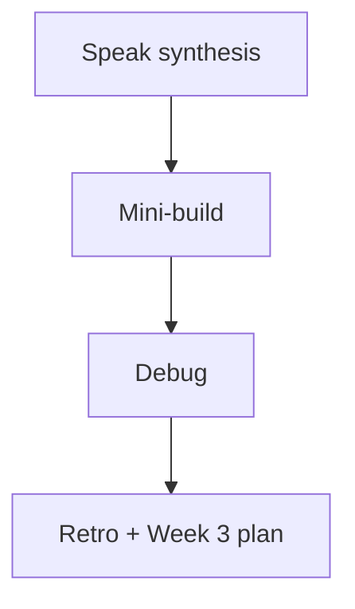

# Month 14 · Week 2 · Day 7
# Week Review — Fixtures, Isolation, Failure Paths, Fakes, Regression

**Program:** Full-Stack Mastery · 18 months  
**Phase:** 4 — Full-stack application  
**Month index:** [../../README.md](../../README.md)  
**Week 2:** [1](day-01.md) · [2](day-02.md) · [3](day-03.md) · [4](day-04.md) · [5](day-05.md) · [6](day-06.md) · Day 7 (today)  
**Week rhythm today:** Review, repair, plan Week 3  
**Student state:** You wired conftest, isolated a database, wrote 403 tests, faked mail, and practiced red-green regressions. Today those ideas must still live in your head — from **this file**.  
**Study time:** 3–4 focused hours

Do not start Week 3 because the calendar moved. MSW on an API you cannot isolate is two problems.

Work in `~\fullstack-lab\month-14\week-02\day-07\`. Do not implement the mini-build inside Project 7.

---

## How to read this chapter

This is a **closed-book teaching day**. The synthesis **is** the Week 2 lesson.



Days 1–6 closed during mini-build. Repair from **this** recap.

---

## Week synthesis (the lesson, in this book)

**Fixtures** inject setup by **name**. `conftest.py` is discovered, not imported. `yield` runs teardown even on failure. **Function** scope is the default. Session-scoped **mutable** fakes flake. **Factories** build data with overrides; they must not swallow 409. Autouse is invisible — last resort.

**Database isolation.** Dedicated **test** database (name contains a clear signal). **Rollback** (fast; `commit` in the app can break it; savepoints are the repair). **Truncate/delete** (works after real commits; list tables / CASCADE). Mocking `Session.commit` hides unique constraints and missing commits. SQLite in a lab is a pattern gym; **product tests use Postgres**.

**Safety.** Refuse pytest if the URL looks like production. Imperfect. Still do it.

**Failing paths.** 422 schema/types (`detail` list, assert `loc`). 404 missing resource (`HTTPException`). 403 authenticated but forbidden. 401 unknown. `GET /x/abc` is 422 if `id: int`, not 404. Do not mock the deny. TestClient is HTTP.

**Email.** `MailPort` + `FakeMailer.sent` + `dependency_overrides[get_mailer] = lambda: mailer` (same instance). Clear overrides. 422 must not send. No SMTP. `SmtpMailer` that raises in the lab proves the override worked.

**Regression.** Bug story → failing test (good red) → fix → keep test. Characterization pins current behavior; regression pins desired behavior. Weak: full JSON snapshots, `!= 500`.

**Product Day 6.** Isolation lives in **your** API repo. Labs do not replace that.

**Wrong belief:** “Empty-start failed, so I deleted it.”  
**Correct:** the empty-start test is the isolation detector. Fix fixtures.

**Wrong belief:** “I’ll patch smtplib.”  
**Correct:** port + fake.

---

## Today's contract

**Today's gate.** Closed-book:

> I can explain fixture vs factory, rollback vs truncate, 422/404/403, FakeMailer overrides, and red-green regression — and I built a tiny API that demonstrates three of those.

---

## Time box

| Block | Minutes | Work |
|---|---|---|
| 1 | 35 | Speak; `exam-01.md` |
| 2 | 60 | Mini-build: lab samples |
| 3 | 30 | Debug A–F |
| 4 | 15 | Review Day 6 evidence |
| 5 | 20 | pytest; break 403; restore |
| 6 | 15 | Design: rollback vs truncate for *your* app |
| 7 | 15 | Retro + Week 3 plan |

---

# Complete explanation — backend tests you must still own

## 1. conftest

Place `tests/conftest.py`. `pythonpath = ["."]` if needed. `uv run pytest -q` from the project root.

## 2. Isolation sketch

Engine session-scoped. Per-test session + rollback **or** truncate. Override `get_db`. Clear overrides. Empty-start test in a **second file** so order cannot hide the bug.

## 3. Mail sketch

Same `get_mailer` object. Lambda returns the fixture instance. Assert `sent`.

## 4. Statuses

You raise 404/403/409. Framework raises 422. Tests follow CONTRACT.md.

---

# Block 1 — Speak

Cover: fixture/factory; test DB; rollback vs truncate; 422/404/403; FakeMailer; red-green. `exam-01.md` 15–25 lines.

---

# Block 2 — Mini-build

```powershell
cd ~\fullstack-lab
mkdir month-14\week-02\day-07\mini -Force
cd ~\fullstack-lab\month-14\week-02\day-07\mini
uv init --name lab-samples
uv add fastapi
uv add --dev pytest httpx
```

**Lab samples** (not Project 7): in-memory is enough **if** you still isolate the dict. Optional SQLite if you want isolation practice; not required if time is short — then write `WHY-RAM.md` connecting to Day 6 Postgres.

Must:

- POST `/samples` 201 `{label, code}` unique code 409; mail fake on success  
- GET missing 404  
- PATCH foreign 403 using lab headers `X-User-Id` / `X-Role` (ugly, documented)  
- POST empty label 422, **no mail**  
- `conftest` yield client + FakeMailer  
- Factory `make_sample`  
- `test_list_starts_empty` in `test_isolation.py`  

```powershell
uv run pytest -q
```

---

# Block 3 — Debug

**A.** Factory’s second `make_sample()` 409 because codes are hardcoded `"A1"`.  
**B.** Override `lambda: FakeMailer()` but assert on a different instance.  
**C.** Rollback fixture + `session.commit()` in route → leftover rows.  
**D.** `GET /samples/xyz` expected 404.  
**E.** Regression test written after the fix, never seen red.  
**F.** pytest against `postgresql://.../postgres` with live data.

---

# Block 4 — Day 6

Open **only** `EVIDENCE.md` / strategy isolation section. `GAP.txt` one remaining hole (maybe Redis).

---

# Block 5 — Break

403 → expect 200; fail; restore; `fail.txt`.

---

# Block 6 — Design

`design.md`: for **your** API, rollback or truncate this month, and why. Ten lines.

---

# Block 7 — Retro

`retro.md`: weakest status; whether Session is still mocked; Week 3 question (RTL queries).

## Debug keys (after A–F)

**A.** Factory counter or unique override.  
**B.** Close over the fixture mailer.  
**C.** Savepoint or truncate.  
**D.** 422.  
**E.** Revert fix to prove red, or plant in a lab.  
**F.** Dedicated `*_test` DB + safety assert.

```powershell
cd ~\fullstack-lab
git add month-14
git commit -m "Month 14 Week 2 review: samples mini-build and debug."
```

---

## Office hours

**Mini skipped FakeMailer.** Then Block 2 is incomplete.  
**Used Project 7 nouns.** Rename to samples.  
Windows: `uv run pytest -q --tb=short`.

---

## Definition of done

- [ ] Mini green with empty-start, 403, 422 no-mail  
- [ ] Debug written then checked  
- [ ] Day 6 gap noted  
- [ ] Week 3 not started on a failing mini  

---

## Optional review links

Repair from this synthesis first.

- [FastAPI testing](https://fastapi.tiangolo.com/tutorial/testing/)  
- [pytest fixtures](https://docs.pytest.org/en/stable/explanation/fixtures.html)  

---

## Next week

**Week 3 — Frontend quality:** React Testing Library philosophy (role and name), MSW, loading/empty/error, light a11y checks, then component tests on **your** list/detail.
