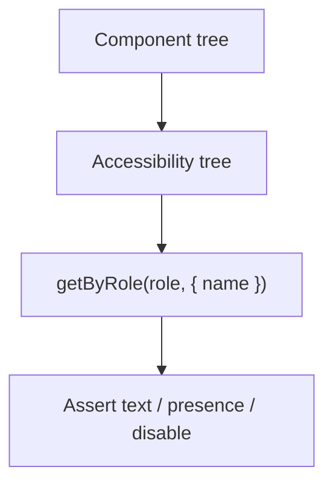

# Month 14 · Week 3 · Day 1
# RTL Philosophy: User-Focused Queries, Not CSS Selectors

**Program:** Full-Stack Mastery · 18 months  
**Phase:** 4 — Full-stack application  
**Month index:** [../../README.md](../../README.md)  
**Week 3:** Day 1 (today) · [2](day-02.md) · [3](day-03.md) · [4](day-04.md) · [5](day-05.md) · [6](day-06.md) · [7](day-07.md)  
**Week rhythm today:** Learn + type-along  
**Student state:** Week 2 isolated the API. This week tests the **UI the way a person (and a screen reader) experiences it**. You used Testing Library in Months 6–7. Today we make the **philosophy** non-negotiable for Project 7.  
**Study time:** 3–4 focused hours

Labs: `~\fullstack-lab\month-14\week-03\day-01\`. Product tests stay in **your** web repo. This textbook will **not** paste Project 7. Query by **role and name**.

---

## How to use this textbook

1. Read until you can say why `getByRole("button", { name: /save/i })` beats `querySelector(".btn-primary")`.  
2. Scaffold a tiny Vite React app if you need a gym; do not dump the product.  
3. If a query fails, **fix the accessible name** in the component — not the test with a CSS selector.  
4. Optional review links are for later rechecking.

---

## How to read this chapter

React Testing Library (RTL) renders your component into **jsdom** and asks questions a user could ask: what is this **role**, what is its **name**, what happens when I click it. It is not Enzyme. It is not “find the `div` with this class because the stylesheet said so.”



**Wrong belief:** “CSS selectors are fine if they are stable BEM names.”  
**Correct:** classes change when you restyle. Roles and names change when **meaning** changes — which is what you wanted to test. A `div` with class `btn` has **no** button role. `getByRole("button")` failing is the product bug.

**Wrong belief:** “I’ll `data-testid` everything; it is more reliable.”  
**Correct:** `testid` is an escape hatch for a chart or a non-semantic region after you tried role/label. A page of testids means the UI is mute to assistive tech. Prefer role and name.

---

## Today's contract

1. Recite query priority: role, label, placeholder (last), text, testid.  
2. Use `getByRole` / `findByRole` / `queryByRole` correctly (throw vs wait vs null).  
3. `userEvent` for typing and clicking — not only `fireEvent` unless you can say why.  
4. Avoid `container.querySelector`.  
5. Write `PHILOSOPHY.md` mapping one **your** screen to queries (names only).

**Today's gate.** Closed-book:

> I query by role and name. A missing name is a product defect. getBy throws, queryBy returns null, findBy waits. I do not test implementation (`useState`) by spying on setters.

---

## Time box

| Block | Minutes | Work |
|---|---|---|
| A | 50 | Theory |
| B | 70 | Type-along: tiny list + form tests |
| C | 60 | Independent: empty vs filled; no CSS |
| D | 15 | Git |
| E | 15 | Recall |

---

# Block A — Theory

## 1. Guiding principle (Months 6–7, still the law)

Testing Library’s guiding principle: the more your tests resemble **how users use the software**, the more confidence they give you.

Users do not use CSS classes. Screen readers use the **accessibility tree**: roles (button, textbox, list, heading, alert), names (visible text, `aria-label`, associated `<label>`).

## 2. Query priority

Use the first that fits:

1. **`getByRole`** — `button`, `textbox`, `link`, `heading`, `list`, `listitem`, `alert`, `dialog`, `navigation`, `checkbox`, `radio`. Pass `{ name: /save/i }`.  
2. **`getByLabelText`** — forms; equivalent to role+name for inputs if the label is wired (`htmlFor` / wrapping).  
3. **`getByPlaceholderText`** — weak; placeholders are not labels. Fix the label.  
4. **`getByText`** — non-interactive copy.  
5. **`getByTestId`** — last.

**Wrong belief:** “`getByText('Save')` is as good as role.”  
**Correct:** it will also match a heading that says Save, or a disabled span. Role says **what it is**.

## 3. get vs query vs find

| API | If missing | Async |
|---|---|---|
| `getBy...` | Throws (good when it **must** exist) | No |
| `queryBy...` | `null` (good when asserting **absence**) | No |
| `findBy...` | Throws after timeout | **Yes** — waits |

`getAllBy` / `queryAllBy` / `findAllBy` for multiples.

Loading states (Week 3 Day 4) almost always need `findByRole` after a click, not `getBy` immediately.

**Wrong belief:** “I’ll `waitFor` plus `getBy` always.”  
**Correct:** `findBy` is `waitFor` + `getBy`. Prefer `findBy`.

## 4. userEvent

`userEvent.setup()` then `await user.click(...)` and `await user.type(...)`. It fires the events a browser would (pointer, focus). `fireEvent.change` is lower level and misses some listeners. This course prefers `userEvent`.

Always `await`. Forgetting `await` is a flake source (Week 4 Day 3 will say the same in Playwright).

## 5. What you do not test

- Internal state (`useState` values) by exporting them.  
- CSS class strings as the contract.  
- Redux/Query **cache internals** as the first assert — assert **what is on screen**.  
- Snapshot of the whole DOM (brittle, like JSON snapshots in Week 2).

You **do** test: can a user find the control, activate it, and see the result.

## 6. Accessible names

A button’s name is its text, or `aria-label`, or `aria-labelledby`. An input’s name is its `<label>`.

```tsx
<label htmlFor="title">Title</label>
<input id="title" />
```

```tsx
screen.getByRole("textbox", { name: /title/i })
```

Icon-only buttons **need** `aria-label="Delete hold"`. If the test cannot find it, neither can a screen reader.

Headings: `getByRole("heading", { name: /holds/i, level: 1 })` when the level matters.

Lists: use `<ul>`/`<li>` (or `role="list"`) if you want `getByRole("listitem", { name: /north dock/i })`. A pile of `div`s is harder to query **and** harder to use.

## 7. Multiple matches

`Found multiple elements` means your name is too vague (`/edit/i` matches every row). Include the **row’s** name or use `within(row)`. `within` is the tool for list rows:

```tsx
const row = screen.getByRole("listitem", { name: /north dock/i });
await user.click(within(row).getByRole("button", { name: /delete/i }));
```

## 8. Vitest + jsdom (this program)

Months 6–7: Vitest, jsdom, `@testing-library/react`, `@testing-library/user-event`, `@testing-library/jest-dom/vitest`. `npm test` → `vitest run`. Same stack this month unless your repo already standardized something equivalent. Do not switch to Jest “for professionalism.”

```ts
import { render, screen, within } from "@testing-library/react";
import userEvent from "@testing-library/user-event";
```

## 9. Component tests vs E2E

RTL does **not** start FastAPI. If the component fetches, you need **MSW** (tomorrow) or you accidentally wrote a slow integration test. Today’s lab components can take **props** (items array, onSubmit) so we practice queries without HTTP. Tomorrow we add handlers.

## 10. Coverage flashlight on UI

Covered JSX lines can still be unlabeled. A11y tests (Day 5) and `getByRole` failures catch that. Do not chase 100% on `className` strings.

---

# Block B — Type-along

```powershell
cd ~\fullstack-lab
mkdir month-14\week-03\day-01 -Force
cd ~\fullstack-lab\month-14\week-03\day-01
npm create vite@latest . -- --template react-ts
npm install
npm install -D vitest jsdom @testing-library/react @testing-library/user-event @testing-library/jest-dom
```

Wire Vitest like Month 6 (`vitest` script, `environment: "jsdom"`, jest-dom import). You have done this. Do not paste Project 4.

Build `PermitForm.tsx` + `PermitList.tsx` (props only):

- Form: labeled textboxes **Title** and **Code**, button **Create permit**.  
- List: `ul` of permits; empty heading **No permits yet**.  
- Parent holds state (lifted) or a tiny `App.tsx`.

Tests:

1. `getByRole("textbox", { name: /title/i })`  
2. Submit with userEvent; listitem named after the title  
3. Empty state heading when items `[]`  
4. **Must fail** if you change the button to `<div className="btn">Create permit</div>` — prove it, restore. `RED-DIV.txt`

Do **not** use `querySelector`. Grep your test file for `querySelector` and `getByTestId` — both should be absent today.

```powershell
npx vitest run
```

Write `PHILOSOPHY.md`: five queries you will use on **your** product list screen (role + name). No JSX paste.

---

# Block C — Independent

1. Disable the submit button while title is blank; assert `toBeDisabled()`. Still by role.  
2. Duplicate heading: two `h2` with similar text — fix names or use `level`. Document in `NAMES.md`.  
3. Icon-only delete on a row: `aria-label`, query `getByRole("button", { name: /delete north/i })`.  
4. Stretch: `within` a row.

Do not add MSW today. Do not add Playwright.

```powershell
cd ~\fullstack-lab
git add month-14
git commit -m "Month 14 Week 3 Day 1: RTL role-and-name permit form tests."
```

---

# Block E — Recall

1. Why a class selector is a styling contract.  
2. get vs query vs find.  
3. Why `div.btn` fails `getByRole("button")`.  
4. `within` purpose.  
5. testid last.

## Office hours

**Unable to find role textbox.** Input missing a label. Use `<label htmlFor>` not only placeholder.

**Found multiple buttons /submit/i.** Name them **Create permit** vs **Save changes**.

**userEvent not awaited.** Flaky assertions. `await user.click`.

**Vite template counter tests.** Delete the demo; this lab is permits.

Windows: `npx vitest run`. If `npm create vite` needs the extra `--`, Month 5 already taught that.

## Minimum query

```tsx
await user.click(screen.getByRole("button", { name: /create permit/i }));
expect(screen.getByRole("listitem", { name: /north dock/i })).toBeInTheDocument();
```

---

## Definition of done

- [ ] `npx vitest run` green  
- [ ] No `querySelector` in tests  
- [ ] `RED-DIV.txt` proved the div-button fails  
- [ ] `PHILOSOPHY.md` for your product names  
- [ ] Commit exists  

---

## Optional review links

Query priority is explained in this chapter.

- [Testing Library: Which query?](https://testing-library.com/docs/queries/about/#priority)  
- [Testing Library: Guiding Principles](https://testing-library.com/docs/guiding-principles/)  
- [user-event](https://testing-library.com/docs/user-event/intro/)  

---

## Tomorrow

**MSW** — HTTP in component tests without starting Uvicorn.
