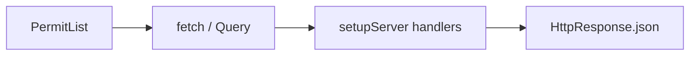

# Month 14 · Week 3 · Day 2
# MSW for HTTP in Component Tests

**Program:** Full-Stack Mastery · 18 months  
**Phase:** 4 — Full-stack application  
**Month index:** [../../README.md](../../README.md)  
**Week 3:** [1](day-01.md) · Day 2 (today) · [3](day-03.md) · [4](day-04.md) · [5](day-05.md) · [6](day-06.md) · [7](day-07.md)  
**Week rhythm today:** Learn + type-along  
**Student state:** You query by role and name. Today list/detail components **fetch**. The HTTP neighbor is **Mock Service Worker**, not a live FastAPI process.  
**Study time:** 3–4 focused hours

Labs: `~\fullstack-lab\month-14\week-03\day-02\`. Do not start Uvicorn for these tests. Do not paste Project 7. Query by **role and name**.

---

## How to use this textbook

1. Read until you can draw MSW between `fetch`/Query and the network.  
2. Type handlers with `http.get` / `HttpResponse.json` (MSW v2).  
3. If a test hits `127.0.0.1:8000`, you missed the server setup.  
4. Optional review links are for later rechecking.

---

## How to read this chapter

**MSW** intercepts requests in the test process (and can intercept in a browser). For Vitest + jsdom we use the **Node** interceptors: `setupServer` from `msw/node`. Your component still calls `fetch` or Axios or TanStack Query. The **response** comes from a handler you wrote.



**Wrong belief:** “I’ll `vi.mock('../api')` and skip MSW.”  
**Correct:** mocking the client module freezes **your wrapper’s internals**. MSW tests the same path the browser uses: URL, method, status, JSON. That is closer to Month 9’s “TestClient is HTTP.”

**Wrong belief:** “MSW is E2E.”  
**Correct:** no real browser journey, no real Postgres. It is a **fake HTTP server** for **component** tests. Playwright may also intercept — that is a different layer. Do not turn Playwright into MSW-with-a-window (Week 1).

---

## Today's contract

1. Install `msw` and create `setupServer`.  
2. `listen` / `resetHandlers` / `close` in Vitest `beforeAll` / `afterEach` / `afterAll`.  
3. Write a GET handler that returns a list; assert listitems by **name**.  
4. Override a handler in one test (`server.use`) for an error status.  
5. Keep queries on **role and name**.

**Today's gate.** Closed-book:

> MSW stands in for HTTP in component tests. I reset handlers between tests. I do not call the real API from Vitest. I still query the document by role and name.

---

## Time box

| Block | Minutes | Work |
|---|---|---|
| A | 50 | Theory |
| B | 75 | Type-along: list with MSW |
| C | 55 | Independent: error handler override |
| D | 15 | Git |
| E | 15 | Recall |

---

# Block A — Theory

## 1. Why not the real API

Hitting Uvicorn from Vitest:

- Requires a running server and a test DB.  
- Turns every component test into an accidental integration test.  
- Fails when CORS or env base URL differs.  
- Is **slower** and **flakier**.

That suite can exist later as a true API+UI job. It is **not** the component layer. Week 1 named this.

## 2. MSW v2 API (this course)

```ts
import { http, HttpResponse } from "msw";
import { setupServer } from "msw/node";

const server = setupServer(
  http.get("/api/permits", () => {
    return HttpResponse.json([
      { id: 1, title: "North dock", code: "N1" },
    ]);
  }),
);
```

- `http.get`, `http.post`, `http.patch`, `http.delete`.  
- `HttpResponse.json(body, { status: 500 })` for errors.  
- Match the **path your client actually requests**. If the app uses `http://127.0.0.1:8000/v1/permits`, the handler must match that (or you set `VITE_API_BASE` to empty and use relative `/api` in the lab).

**Wrong belief:** “The handler path is a regex I copy from a blog `/api/*`.”  
**Correct:** start with the exact path. Wildcards when you have a reason.

## 3. Lifecycle

```ts
beforeAll(() => server.listen({ onUnhandledRequest: "error" }));
afterEach(() => server.resetHandlers());
afterAll(() => server.close());
```

`onUnhandledRequest: "error"` is a gift: a fetch you forgot to handle **fails the test** instead of hanging or hitting the network.

`resetHandlers()` clears `server.use` overrides so one test’s 500 does not poison the next.

## 4. server.use — per-test stories

```ts
server.use(
  http.get("/api/permits", () => {
    return HttpResponse.json({ detail: "boom" }, { status: 500 });
  }),
);
```

Default handlers in `setupServer(...)` are the happy list. Tests for error/empty **override**.

Empty list:

```ts
http.get("/api/permits", () => HttpResponse.json([]));
```

## 5. TanStack Query

If the component uses Query (Month 7/12), wrap with `QueryClientProvider` and a **new** `QueryClient` per test (`retry: false` so 500 does not spin). Still MSW for HTTP. Still RTL for the document.

```tsx
const client = new QueryClient({
  defaultOptions: { queries: { retry: false } },
});
```

Forgetting `retry: false` makes error tests slow (three retries). That is a flake-adjacent smell.

## 6. POST handlers

Create-form tests may `http.post("/api/permits", async ({ request }) => { const body = await request.json(); return HttpResponse.json({ id: 1, ...body }, { status: 201 }); })`.

Assert the **UI** result (listitem appears), not only that MSW was hit — unless you also inspect a fake side channel. Prefer UI. You can read `request.json()` inside the handler and throw if title missing — then the UI should show an error. Day 4 is loading/empty/error.

## 7. Auth headers

If the product sends a cookie or `Authorization`, the handler can read `request.headers`. For component tests you may wrap with a fake auth provider. Do not paste production token logic. A lab can skip auth or send a dummy header the handler checks.

## 8. What MSW is not

- Not a test database.  
- Not Playwright.  
- Not an excuse to query `.card-title`.  
- Not `vi.fn()` on `fetch` with a one-off implementation in every file — MSW centralizes handlers.

## 9. File layout

```
src/test/server.ts      setupServer + default handlers
src/test/setup.ts       jest-dom + server lifecycle
src/components/...
src/components/PermitList.test.tsx
```

Vitest `setupFiles: ["./src/test/setup.ts"]`.

---

# Block B — Type-along

Continue Day 1’s Vite app **or** scaffold `~\fullstack-lab\month-14\week-03\day-02`.

```powershell
cd ~\fullstack-lab
mkdir month-14\week-03\day-02 -Force
cd ~\fullstack-lab\month-14\week-03\day-02
```

```powershell
npm install msw --save-dev
```

`PermitList` **fetches** `GET /api/permits` on mount (plain `useEffect`+`fetch` is allowed so Query is optional). Render titles as a list.

Default MSW: two permits “North dock” and “South gate”.

Test: `findByRole("listitem", { name: /north dock/i })` — **findBy** because fetch is async.

```powershell
npx vitest run
```

Write `HANDLERS.md`: the exact URL your `fetch` uses and the handler string. They must match.

Prove `onUnhandledRequest: "error"`: temporarily fetch `/api/typo`, see the test fail, restore. `UNHANDLED.txt`.

---

# Block C — Independent

1. `server.use` empty array → heading **No permits yet** (`findByRole("heading", { name: /no permits yet/i })`).  
2. `server.use` status 500 → `getByRole("alert")` (you must render an alert).  
3. Stretch: QueryClient wrapper with `retry: false`.  
4. `PRODUCT-MSW.md`: the list URL in **your** app (path only) and where handlers will live.

Do not start the real API.

```powershell
cd ~\fullstack-lab
git add month-14
git commit -m "Month 14 Week 3 Day 2: MSW list handlers and role queries."
```

---

# Block E — Recall

1. Why not `vi.mock` the api module as the default.  
2. Why `resetHandlers`.  
3. Why `onUnhandledRequest: "error"`.  
4. Why `retry: false` in Query tests.  
5. MSW vs E2E.

## Office hours

**Test hangs.** Unhandled fetch, or `getBy` instead of `findBy`.  
**Network error in jsdom.** MSW not listening; setupFiles missed.  
**CORS in component tests.** jsdom `fetch` to absolute another origin may need the full URL in the handler. Prefer relative URLs in the lab.  
**MSW v1 `rest.get`.** This course uses v2 `http.get`. If you installed v1 by accident, upgrade.

Windows: `npx vitest run`. PowerShell.

## Minimum handler

```ts
http.get("/api/permits", () => {
  return HttpResponse.json([{ id: 1, title: "North dock", code: "N1" }]);
});
```

Minimum assert: `await screen.findByRole("listitem", { name: /north dock/i })`.

---

## Definition of done

- [ ] Server lifecycle in setup  
- [ ] Happy list test green  
- [ ] Empty override test  
- [ ] Unhandled-request proof  
- [ ] No `querySelector`  
- [ ] Commit exists  

---

## Optional review links

MSW in this chapter is the teacher.

- [MSW: Getting started](https://mswjs.io/docs/getting-started)  
- [MSW + Vitest](https://mswjs.io/docs/integrations/node)  

---

## Tomorrow

**From memory:** render a list with an MSW handler. Days 1–2 closed during the drill.
