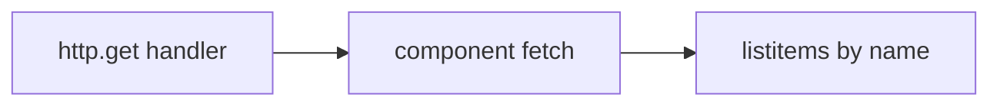

# Month 14 · Week 3 · Day 3
# From Memory: Render a List with an MSW Handler

**Program:** Full-Stack Mastery · 18 months  
**Phase:** 4 — Full-stack application  
**Month index:** [../../README.md](../../README.md)  
**Week 3:** [1](day-01.md) · [2](day-02.md) · Day 3 (today) · [4](day-04.md) · [5](day-05.md) · [6](day-06.md) · [7](day-07.md)  
**Week rhythm today:** Implement from memory  
**Student state:** You have RTL philosophy and MSW lifecycle. Today you rebuild a **list + handler** without opening Days 1–2.  
**Study time:** 3–4 focused hours  
**Prereq:** Day 2 gate passed.

Labs: `~\fullstack-lab\month-14\week-03\day-03\`. Do **not** copy Day 2 source. Do **not** paste Project 7. Domain: **cafeteria trays** (titles on a list). Query by **role and name**.

---

## How Day 3 works

Days 1–2 stay **closed**. This recap is the teacher.

Allowed: this file, your notes, Vitest output.  
Not allowed: AI-finished components, CSS-selector tests, starting Uvicorn.

Stuck > 25 minutes: open one matching section, close it, `lookups.txt`.

---

## How to read this chapter

A component test with HTTP is three pieces: **render**, **handler**, **user-shaped query**.



**Wrong belief:** “Memory day means I paste Day 2.”  
**Correct:** new folder, new noun (`trays`), same ideas.

---

## Complete explanation (RTL + MSW you must still own)

**Queries.** `getByRole(role, { name })`. Buttons, textboxes, headings, listitems, alerts. Labels for inputs. No `querySelector`. `testid` last. `within(row)` for per-row buttons.

**get / query / find.** get throws if missing. query returns null (absence). find **waits** (async fetch). List tests use `findByRole`.

**userEvent.** `setup()`, `await click/type`.

**MSW v2.** `http.get` / `HttpResponse.json` / `setupServer` from `msw/node`. `listen` `{ onUnhandledRequest: "error" }`. `resetHandlers` after each. `close` at end. `server.use` per-test empty or 500.

**URL match.** Handler path equals `fetch` URL (relative `/api/trays` in the lab).

**QueryClient.** If you use Query, new client per test, `retry: false`.

**Not E2E.** No Playwright today. No real API.

**Empty heading.** When JSON `[]`, the document must expose a heading or status the user can find by role/name — you implement that; the test is the contract.

**Wrong belief:** “`getByText` on the whole page is enough.”  
**Correct:** prefer listitem **name** so you know it is a list.

---

## Today's contract

1. Scaffold Vite React-TS + Vitest + RTL + MSW (you have done this).  
2. `TrayList` fetches `/api/trays`.  
3. Default handler two trays; `findByRole` listitems.  
4. One `server.use` empty case.  
5. No CSS selectors.

**Today's gate.** Closed-book:

> I can render a list from MSW and find rows by role and name. findBy waits. Unhandled requests fail the test.

---

## Time box

| Block | Minutes | Work |
|---|---|---|
| 1 | 20 | Speak recap; `exam-01.md` |
| 2 | 80 | Mini-build trays list |
| 3 | 25 | Debug A–E |
| 4 | 20 | Unhandled request proof |
| 5 | 20 | Break the button into a div; watch test (if any) — or add one |
| 6 | 15 | Design: your product list URL |
| 7 | 15 | Retro |

---

# Block 1 — Speak

Role vs class; findBy; MSW lifecycle; why not Uvicorn. `exam-01.md`.

```powershell
cd ~\fullstack-lab
mkdir month-14\week-03\day-03 -Force
cd ~\fullstack-lab\month-14\week-03\day-03
```

---

# Block 2 — Mini-build

Vite `react-ts`. Install vitest, jsdom, Testing Library, user-event, jest-dom, msw.

Spec:

- `GET /api/trays` → `[{ id, title }]`  
- Default titles: **Blue tray**, **Red tray**  
- `ul`/`li`; accessible names include the title  
- Empty: heading **No trays yet**  
- Tests: both items; empty override  
- `onUnhandledRequest: "error"`

```powershell
npx vitest run
```

No Project 7 routes. No Playwright.

---

# Block 3 — Debug

**A.** Used `getByRole` immediately; test flakes or fails.  
**B.** Handler `/trays` but fetch `/api/trays`.  
**C.** `querySelector(".tray-title")`.  
**D.** Forgot `resetHandlers`; empty test poisons the next.  
**E.** Query retries a 500 three times (if they used Query).

---

# Block 4 — Unhandled

Fetch a wrong path once; capture error; restore. `UNHANDLED.txt`.

---

# Block 5 — Div button (if you have a reload control)

If there is no button, add **Reload trays** as a real `<button>`. Test `getByRole("button", { name: /reload trays/i })`. Temporarily make it a `div`; test fails; restore.

---

# Block 6 — Design

`design.md`: your product list endpoint path and the RTL query for a row. Names only.

---

# Block 7 — Retro

`lookups.txt`; whether you still want testids on every card.

## Debug keys

**A.** `findBy`. **B.** Match URL. **C.** Fix the test and the markup. **D.** `afterEach(resetHandlers)`. **E.** `retry: false`.

```powershell
cd ~\fullstack-lab
git add month-14
git commit -m "Month 14 Week 3 Day 3: trays list from MSW from memory."
```

---

## Office hours

**npm create vite quoting.** Extra `--` on Windows PowerShell (Month 5).  
**jsdom fetch.** MSW node interceptors must `listen` before render.

---

## Definition of done

- [ ] Two listitem tests green  
- [ ] Empty heading test  
- [ ] No querySelector  
- [ ] Debug written  
- [ ] Commit exists  

---

## Optional review links

Repair from this recap first.

- [MSW http](https://mswjs.io/docs/api/http/)  

---

## Tomorrow

**Lab:** loading, empty, and error states — still RTL + MSW, still role and name.


<!-- length-pad -->
# Lecture: from memory list plus MSW

This section is still the lesson. Read it if a block felt thin. Say each claim aloud before you continue.

## Claims you must still own

1. New folder, new noun trays.

2. findByRole listitem.

3. Empty heading No trays yet.

4. onUnhandledRequest error.

5. No querySelector.

6. Vite extra -- on Windows.

7. jsdom environment.

8. Delete demo counter tests.

## Wrong belief / Correct

**Wrong belief:** “Memory day means paste Day 2.”  
**Correct:** Rebuild.

**Wrong belief:** “getByRole immediately after render.”  
**Correct:** Use findBy.

## Drills (write answers in the lab folder)

1. UNHANDLED.txt

2. Reload trays real button

3. design.md product list URL

## Windows

- npx vitest run

## Pitfalls

- Handler /trays vs fetch /api/trays.

- Forgot resetHandlers.

## Say it in six sentences

Close the file. Speak the day's gate paragraph. Name the command you will run. Name the folder you will type in. Name what you will not paste. Name the test that would go red if you broke the matching product behavior. If you cannot, reread Block A.

## Git reminder

```powershell
cd ~\fullstack-lab
git add month-14
git status
```

Commit when the day's definition of done is true. Do not commit secrets. Product tests stay in product repos.

<!-- length-pad-2 -->
# Worked questions: memory list

Write answers in `Q.md` in the day's lab folder before you peek at the sentences under each question. Then compare.

**Q1.** Noun?

Answer: Trays, not Project 7.

**Q2.** findBy?

Answer: Fetch is async.

**Q3.** Empty copy?

Answer: Heading No trays yet.

**Q4.** Vite --?

Answer: Windows extra --.

**Q5.** jsdom?

Answer: vitest environment.

**Q6.** Demo counter?

Answer: Delete it.

**Q7.** Unhandled proof?

Answer: Wrong path once.

**Q8.** div reload?

Answer: Use a button.

**Q9.** Product URL?

Answer: design.md names only.

**Q10.** Copy Day 2?

Answer: Not allowed.

## Quick table

| Idea | Honest use | Dishonest use |
|---|---|---|
| Layer | Component | E2E |
| HTTP | MSW | Uvicorn |
| Query | Role name | CSS |
| Wait | findBy | getBy |
| Reset | afterEach | Shared 500 |

## Closing

Rebuild. New folder. Same ideas. That is from-memory day.

If this page is the only thing you remember tomorrow, you still have the day's gate. Type the lab. Run the command. Do not paste Project 7.
