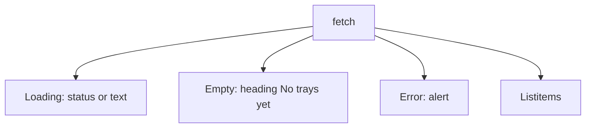

# Month 14 · Week 3 · Day 4
# Lab: Loading, Empty, and Error States

**Program:** Full-Stack Mastery · 18 months  
**Phase:** 4 — Full-stack application  
**Month index:** [../../README.md](../../README.md)  
**Week 3:** [1](day-01.md) · [2](day-02.md) · [3](day-03.md) · Day 4 (today) · [5](day-05.md) · [6](day-06.md) · [7](day-07.md)  
**Week rhythm today:** Lab (type-along + independent)  
**Student state:** You can render a happy list from MSW. Today the **other two-thirds** of the UI contract: loading, empty, error.  
**Study time:** 3–4 focused hours

Labs: `~\fullstack-lab\month-14\week-03\day-04\`. Query by **role and name**. Do not paste Project 7. Do not use CSS as the contract for “spinner.”

---

## How to use this textbook

1. Read until you can name how a **user** recognizes each state.  
2. Type three MSW stories and three RTL asserts.  
3. Prefer `status` / `alert` / headings over `data-busy="true"` only.  
4. Optional review links are for later rechecking.

---

## How to read this chapter

Month 12 required loading, empty, and error on list/detail. Tests that only cover 200 + two rows lie about the product. Each state must be **findable**.



**Wrong belief:** “A spinner `div` with class `animate-spin` is the loading test.”  
**Correct:** use `getByRole("status")` (and `aria-live`) or a named heading **Loading trays**. Class names are not user-facing.

**Wrong belief:** “Empty and error can be the same red text.”  
**Correct:** empty is success with zero rows. Error is a failed request. Users and tests must tell them apart (`heading` vs `alert`, or distinct names).

---

## Today's contract

1. Loading: delay the MSW response; assert status/loading **then** listitem.  
2. Empty: `[]` → named empty heading; **no** listitems.  
3. Error: 500 (or 403) → `role="alert"` with useful text.  
4. Happy path still green.  
5. `findBy` for async; `queryBy` for absence.

**Today's gate.** Closed-book:

> I can test loading, empty, and error without CSS selectors. Empty is not error. findBy waits. queryBy asserts gone.

---

## Time box

| Block | Minutes | Work |
|---|---|---|
| A | 35 | Theory |
| B | 80 | Type-along: three states |
| C | 65 | Independent: detail 404; retry button |
| D | 15 | Git |
| E | 15 | Recall |

---

# Block A — Theory

## 1. Loading

Options that are honest:

- `role="status"` with text **Loading trays** (`aria-live="polite"`).  
- `role="progressbar"` if you mean a progress bar.  
- Disable the main region with a named status.

To **see** loading in tests, the handler must not resolve instantly:

```ts
http.get("/api/trays", async () => {
  await delay(200);
  return HttpResponse.json([{ id: 1, title: "Blue tray" }]);
});
```

MSW v2: `import { delay } from "msw"` (or a small `await new Promise`).

Pattern:

```ts
render(<TrayList />);
expect(await screen.findByRole("status", { name: /loading trays/i })).toBeInTheDocument();
expect(await screen.findByRole("listitem", { name: /blue tray/i })).toBeInTheDocument();
expect(screen.queryByRole("status", { name: /loading trays/i })).not.toBeInTheDocument();
```

If loading disappears too fast without `delay`, you never asserted it. That is OK for some tests — you still need **one** that proves the loading UI exists.

## 2. Empty

`HttpResponse.json([])`. UI: heading **No trays yet** (or your copy). Assert:

```ts
expect(await screen.findByRole("heading", { name: /no trays yet/i })).toBeInTheDocument();
expect(screen.queryByRole("listitem")).not.toBeInTheDocument();
```

Do not use an `alert` for empty unless you have a special reason — alerts mean **attention, something is wrong**.

## 3. Error

`HttpResponse.json({ detail: "Server error" }, { status: 500 })`. UI: `role="alert"` **Could not load trays** (or include detail). Distinct from empty.

403 can be an error state on a list if the user should not see it — still an alert or a specific heading. Document the copy.

Query `retry: false` if using TanStack Query.

## 4. Absence

`queryByRole("listitem")` + `not.toBeInTheDocument()`. `getBy` would throw and fail for the wrong reason.

## 5. Detail pages

Loading/empty/error apply to **one** record: loading, **not found** (404), error 500, happy heading with the title. Independent block.

---

# Block B — Type-along

```powershell
cd ~\fullstack-lab
mkdir month-14\week-03\day-04 -Force
cd ~\fullstack-lab\month-14\week-03\day-04
```

New Vite app or copy **by typing** from Day 3 ideas (new noun if you copy: **lockers**).

Implement `LockerList` with the three states. Tests in `LockerList.test.tsx`:

1. `test_shows_loading_then_rows`  
2. `test_empty_heading_when_no_lockers`  
3. `test_error_alert_on_500`  
4. `test_happy_listitems`

```powershell
npx vitest run
```

Write `COPY.md`: the exact accessible names you chose.

Grep tests for `querySelector` — zero hits.

---

# Block C — Independent

1. `LockerDetail` for `GET /api/lockers/1`: happy title heading; 404 heading **Locker not found**; 500 alert.  
2. Error state includes a **Retry** button (`getByRole("button", { name: /retry/i })`). Clicking retries fetch (second handler succeeds). Use `userEvent`.  
3. `PRODUCT-STATES.md`: loading/empty/error names on **your** list (honest missing copy is a product bug to fix this week).

```powershell
cd ~\fullstack-lab
git add month-14
git commit -m "Month 14 Week 3 Day 4: loading empty error locker tests."
```

---

# Block E — Recall

1. Why delay exists in one loading test.  
2. Empty vs alert.  
3. queryBy for absence.  
4. retry: false.  
5. Why spinner class is not the contract.

## Office hours

**Loading never found.** Too fast; add `delay`. Or missing `role="status"`.  
**Found multiple status.** Name them.  
**Retry did nothing.** You did not increment a query key or remount fetch. In `useEffect` lab, a `key` or `reload` count state is enough.

Windows: `npx vitest run`.

## Minimum empty test

```ts
server.use(http.get("/api/lockers", () => HttpResponse.json([])));
render(<LockerList />);
expect(await screen.findByRole("heading", { name: /no lockers yet/i })).toBeInTheDocument();
```

---

## Definition of done

- [ ] Four list tests green  
- [ ] Detail 404 + 500  
- [ ] Retry stretch or documented skip  
- [ ] `COPY.md` + product note  
- [ ] Commit exists  

---

## Optional review links

States are explained in this chapter.

- [ARIA status role](https://developer.mozilla.org/en-US/docs/Web/Accessibility/ARIA/Roles/status_role)  
- [ARIA alert role](https://developer.mozilla.org/en-US/docs/Web/Accessibility/ARIA/Roles/alert_role)  

---

## Tomorrow

**a11y:** jest-axe (or equivalent) light check; names and roles still rule.
