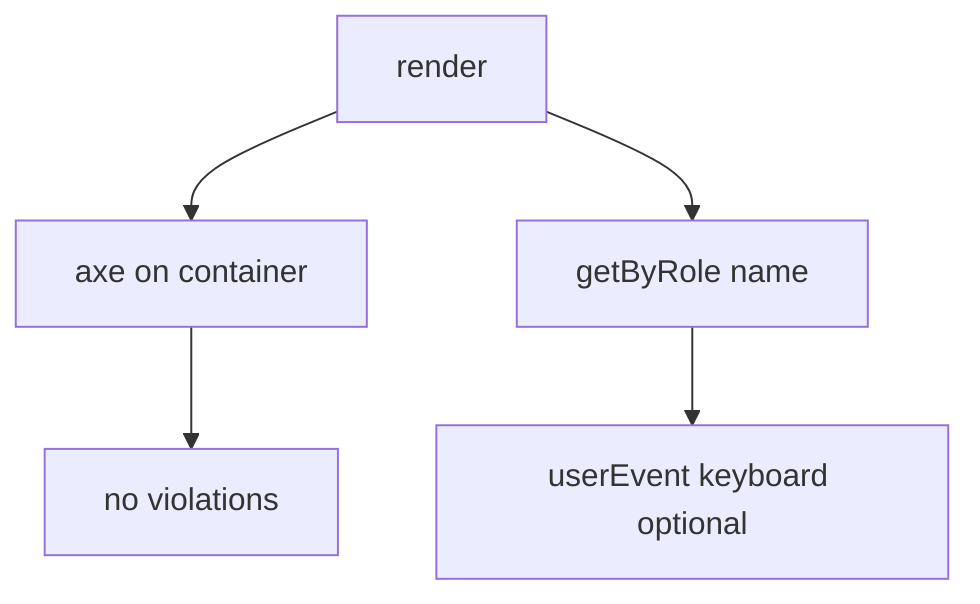

# Month 14 · Week 3 · Day 5
# Accessibility in Tests: jest-axe, Name, and Role

**Program:** Full-Stack Mastery · 18 months  
**Phase:** 4 — Full-stack application  
**Month index:** [../../README.md](../../README.md)  
**Week 3:** [1](day-01.md) · [2](day-02.md) · [3](day-03.md) · [4](day-04.md) · Day 5 (today) · [6](day-06.md) · [7](day-07.md)  
**Week rhythm today:** Learn + type-along  
**Student state:** Loading/empty/error are findable. Today you add a **light automated a11y check** and double down on **name and role** — not a full WCAG audit.  
**Study time:** 3–4 focused hours

Labs: `~\fullstack-lab\month-14\week-03\day-05\`. Query by **role and name**. Do not paste Project 7. Do not claim “we are accessible” because one axe run is green.

---

## How to use this textbook

1. Read what axe **can** and **cannot** catch.  
2. Type `jest-axe` (or `vitest-axe` / `axe-core` + RTL) on a small page.  
3. When axe fails, **fix the markup**. Do not disable the rule to go green unless you write why.  
4. Optional review links are for later rechecking.

---

## How to read this chapter

Automated accessibility tests are a **smoke alarm**, like coverage is a flashlight. They catch missing labels, duplicate ids, poor contrast **sometimes**, and invalid ARIA. They do **not** catch “the workflow is confusing” or “the focus order is cruel.” Humans and keyboard still matter. Month 2 taught that. Month 14 adds a **check in CI later**; today you learn the **light** version in Vitest.



**Wrong belief:** “jest-axe replaces Testing Library queries.”  
**Correct:** axe can pass while you still query with CSS. You still **must** `getByRole`. Axe plus role queries is the pair.

**Wrong belief:** “I’ll `axe.run(document)` and ignore color-contrast because CI is headless.”  
**Correct:** jsdom contrast is limited. Configure a **small** ruleset you understand. Do not enable a hundred rules you will immediately skip.

---

## Today's contract

1. Install `jest-axe` (works with Vitest via `expect.extend(toHaveNoViolations)`).  
2. Run axe on a rendered form and a list.  
3. Introduce a violation (unlabeled input); see red; restore.  
4. Keep role-and-name tests.  
5. Write `LIMITS.md`: three bugs axe will miss.

**Today's gate.** Closed-book:

> Axe is a light net. Name and role remain the contract. I fix markup, not the linter config, when an unlabeled input fails. I do not confuse a green axe run with a complete a11y review.

---

## Time box

| Block | Minutes | Work |
|---|---|---|
| A | 50 | Theory |
| B | 70 | Type-along: axe + unlabeled red/green |
| C | 60 | Independent: dialog or icon button |
| D | 15 | Git |
| E | 15 | Recall |

---

# Block A — Theory

## 1. What axe looks at

[axe-core](https://github.com/dequelabs/axe-core) encodes many WCAG techniques. In tests, `jest-axe` runs axe on a DOM node.

Typical hits in student apps:

- Form control without a name  
- Buttons without content or `aria-label`  
- Images without `alt` (empty `alt` is OK for decorative — know the difference)  
- Invalid `aria-*`  
- Duplicate ids  
- Document missing `lang` (often on `index.html`, not the component)

## 2. What axe misses (say these aloud)

- Keyboard trap that is logic, not markup  
- Focus not moving into a modal you built with `div`  
- Meaningless heading order that is still “valid”  
- Color meaning only (“red means error”) without text  
- Your 403 copy being rude but labeled  
- Timing, language complexity, screen reader pronunciation

**Wrong belief:** “We ran axe, so Month 2 is done forever.”  
**Correct:** Month 2 still wants real labels, real buttons, real headings. Tests **guard** that.

## 3. jest-axe + Vitest

```ts
import { axe, toHaveNoViolations } from "jest-axe";
import { render } from "@testing-library/react";

expect.extend(toHaveNoViolations);

it("has no obvious axe violations", async () => {
  const { container } = render(<PermitForm />);
  const results = await axe(container);
  expect(results).toHaveNoViolations();
});
```

`container` is the DOM subtree. For portals (modals), you may need `document.body`.

If `jest-axe` types complain under Vitest, use `axe-core` directly:

```ts
import axe from "axe-core";
const results = await axe.run(container);
expect(results.violations).toEqual([]);
```

Either is acceptable. Document which in `TOOL.md`.

## 4. Keep the query tests

An axe-green form can still lack a **Create permit** button role if you used a clickable `div` that you labeled with `aria-label` — axe might be happy, RTL `getByRole("button")` might still fail. **Both** tests: axe on the tree, role queries on the contract.

Icon-only controls: `aria-label="Delete Blue tray"`. Axe and `getByRole("button", { name: /delete blue tray/i })` agree.

## 5. Live regions

Loading `role="status"` and error `role="alert"` are a11y **and** test seams. Day 4 was not decoration.

`aria-live="assertive"` on every keystroke is noisy. Alerts for errors; status for loading.

## 6. Dialogs (preview)

`role="dialog"` + `aria-labelledby` pointing at the title. Focus trap is hard to fully test in jsdom. A light test: dialog is present and named; a keyboard test in Playwright is Week 4 if you need it. Do not fake a full screen reader in Vitest.

## 7. Color contrast in jsdom

Often incomplete. If contrast rules noise your suite, you may disable **that rule** with a comment in `LIMITS.md`. Do not disable `label` rules.

## 8. Product honesty

One axe test on the login form and one on the list/detail is enough **this week**. A campaign of 80 axe tests that everyone skips is worse.

---

# Block B — Type-along

```powershell
cd ~\fullstack-lab
mkdir month-14\week-03\day-05 -Force
cd ~\fullstack-lab\month-14\week-03\day-05
```

Tiny form + list (lockers or permits). Install `jest-axe` and `axe-core` as needed.

Tests:

1. Role queries from Day 1 (textbox Title, button named).  
2. `toHaveNoViolations` (or `violations === []`).  
3. Plant unlabeled `<input>` without label; axe **red**; `RED-A11Y.txt`; restore label; green.

```powershell
npx vitest run
```

Write `LIMITS.md`: three misses. Write `TOOL.md`: jest-axe vs axe-core.

---

# Block C — Independent

1. Icon-only delete with `aria-label`; role test + axe.  
2. Image: decorative `alt=""` vs informative `alt="Map of lockers"`. One test each (query by role `img` and name).  
3. Stretch: a modal dialog named **Confirm delete** (`getByRole("dialog", { name: /confirm delete/i })`).  
4. `PRODUCT-A11Y.md`: which two screens in **your** app will get axe this week (names only).

Do not install a full Storybook a11y addon unless you already have Storybook — out of scope.

```powershell
cd ~\fullstack-lab
git add month-14
git commit -m "Month 14 Week 3 Day 5: jest-axe light checks and labeled inputs."
```

---

# Block E — Recall

1. Axe vs getByRole — both needed.  
2. Three things axe misses.  
3. Why disable contrast maybe, never labels.  
4. alert vs status.  
5. Green axe ≠ done.

## Office hours

**jest-axe + Vitest ESM errors.** Use `axe-core` `run` instead. Same lesson.  
**Violations in third-party widgets.** Wrap later; do not skip your form.  
**`html` lang.** Set in `index.html` `lang="en"`; component axe may not see it. Note in LIMITS.

Windows: `npx vitest run`.

## Minimum axe test

```ts
const { container } = render(<LockerForm />);
expect(await axe(container)).toHaveNoViolations();
```

Plus:

```ts
expect(screen.getByRole("textbox", { name: /title/i })).toBeInTheDocument();
```

---

## Definition of done

- [ ] Axe green on form  
- [ ] Unlabeled input proved red  
- [ ] Role-and-name tests remain  
- [ ] `LIMITS.md` written  
- [ ] Commit exists  

---

## Optional review links

Light a11y testing is explained in this chapter.

- [jest-axe](https://github.com/nickcolley/jest-axe)  
- [axe-core](https://github.com/dequelabs/axe-core)  
- [Testing Library a11y](https://testing-library.com/docs/queries/byrole/)  

---

## Tomorrow

**Independent:** component tests for **your** list/detail — MSW, role and name, loading/empty/error, light axe if it fits.
