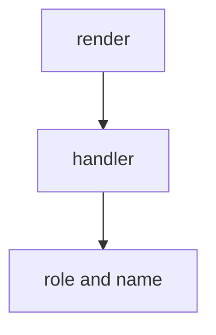

# Month 14 · Week 3 · Day 6
# Independent: Component Tests for Your List and Detail

**Program:** Full-Stack Mastery · 18 months  
**Phase:** 4 — Full-stack application  
**Month index:** [../../README.md](../../README.md)  
**Week 3:** [1](day-01.md) · [2](day-02.md) · [3](day-03.md) · [4](day-04.md) · [5](day-05.md) · Day 6 (today) · [7](day-07.md)  
**Week rhythm today:** Independent  
**Study time:** 3–4 focused hours

Work in **your** frontend. This textbook will not paste Project 7.

---

## How to read this chapter

Week 3’s point is not a perfect coverage number. It is: a user-focused RTL test plus MSW so the list **loading / empty / error / data** states cannot rot silently.

**Wrong belief:** “I’ll snapshot the whole DOM.”  
**Correct:** snapshots of markup are brittle. Assert text and roles.

**Wrong belief:** “I must test CSS classes.”  
**Correct:** users do not click class names.

---

## Today's contract

1. List page: MSW success, empty array, 500 error.  
2. Queries by **role and name** (getByRole('button', { name: … })).  
3. Detail page at least one happy path **or** an honest gap in `GAPS.md`.  
4. Tests run with `npm test` / `vitest` as your repo already does.

**Gate:** My UI states have tests that would fail if I broke the heading or the error alert.

---

## Time box

| Block | Minutes | Work |
|---|---|---|
| A | 20 | Pick pages |
| B | 100 | Write tests |
| C | 30 | GAPS.md |
| D | 15 | Git |
| E | 15 | Recall |

---

If Project 7 UI is not ready, test the Month 12 lab client. Same skills.

---

## Definition of done

- [ ] Three list states tested  
- [ ] No CSS-selector soup  
- [ ] Commit  

---

## Tomorrow

Week 3 review. Then Playwright.

---

## Optional review links

Your tests are the lesson. These pages are for later checking, not for first learning.

- [Testing Library: Queries](https://testing-library.com/docs/queries/about/)
