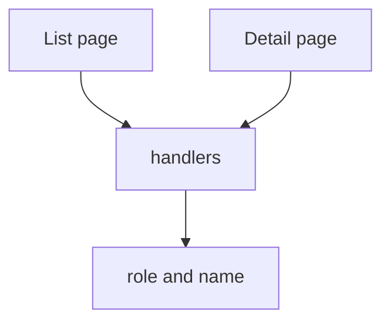

# Month 14 · Week 3 · Day 6
# Independent: Component Tests for Your List and Detail

**Program:** Full-Stack Mastery · 18 months  
**Phase:** 4 — Full-stack application  
**Month index:** [../../README.md](../../README.md)  
**Week 3:** [1](day-01.md) · [2](day-02.md) · [3](day-03.md) · [4](day-04.md) · [5](day-05.md) · Day 6 (today) · [7](day-07.md)  
**Week rhythm today:** Independent implementation  
**Student state:** Labs proved RTL + MSW + states + light axe. Today those tests land on **your** list and detail screens.  
**Study time:** 3–4 focused hours

This textbook will **not** paste Project 7. Tests live in **your** web repo. Evidence (names, commands) in `~\fullstack-lab\month-14\week-03\day-06\`. Query by **role and name**.

---

## How to use this textbook

1. Open **your** list and detail routes.  
2. Write tests you can defend in Week 4’s exam.  
3. If copy is unlabeled, **fix the product**, not the test with a class selector.  
4. Optional review links are for later rechecking.

---

## How to read this chapter

Week 3’s product skill is: a teammate can break list empty-copy or the detail error alert and **a component test goes red** without Playwright.



**Wrong belief:** “I’ll test App.tsx with the real API because it is more honest.”  
**Correct:** that is a different layer. MSW for component tests. Playwright next week for the journey.

**Wrong belief:** “My list is too wrapped in Query/Router to test.”  
**Correct:** wrap `MemoryRouter` + `QueryClientProvider` (`retry: false`) + MSW. If a wrapper is impossible, extract a presentational list **and** still add one container test that fetches via MSW.

---

## Today's contract

1. List: happy rows, empty, error (and loading if you can delay).  
2. Detail: happy heading, 404 or error.  
3. No `querySelector` in the new tests.  
4. Optional one axe run on the form or list.  
5. Update `TEST-STRATEGY.md` frontend section.

**Today's gate.** Closed-book:

> My list and detail have component tests that query by role and name and use MSW. Empty is not error. I did not paste selectors from DevTools.

---

## Time box

| Block | Minutes | Work |
|---|---|---|
| A | 25 | Inventory screens + current tests |
| B | 40 | MSW server in the web repo |
| C | 90 | List + detail tests |
| D | 20 | Strategy + evidence |
| E | 15 | Recall |

---

# Block A — Inventory

`INVENTORY.md` in the lab folder:

| Screen | Route | Row accessible name? | Tests today |
|---|---|---|---|
| List | | | none / some |
| Detail | | | |
| Create form | | | |

Run `npx vitest run` (or `npm test -- --run`) in the **web** repo. Record counts.

---

# Block B — MSW in the product

**Must:** `msw` if missing; `setupServer` + lifecycle + `onUnhandledRequest: "error"` (or `"warn"` documented); handlers for **your** real paths (`VITE_API_BASE` if fetch is absolute).

**Must not:** Point Vitest at production APIs; commit tokens; copy lab `TrayList` into the product.

```powershell
npx vitest run
```

---

# Block C — Tests you write

**List (must):** happy `findByRole("listitem", { name: /.../i })`; empty heading or status; error `alert` (or named heading + justification).

**Detail (must):** happy heading with the title; missing 404 copy by role/name.

**Should:** loading status; create form labels; one `axe` test.

**Must not:** `getByTestId("list-row-0")` as the primary contract; whole-page snapshots.

Use `MemoryRouter` with `initialEntries` when params matter.

---

# Block D — Strategy and evidence

Update frontend section of **your** `TEST-STRATEGY.md`. Lab `EVIDENCE.md`: test file paths, test names, command, pass count. No source dumps.

---

# Block E — Recall

1. Why MemoryRouter.  
2. Why retry false.  
3. Empty vs error.  
4. Product copy bugs vs test bugs.  
5. What Week 4 still needs (Playwright journey).

```powershell
cd ~\fullstack-lab
git add month-14
git commit -m "Month 14 Week 3 Day 6: list/detail component test evidence."
```

Commit tests in the **web** repo separately.

---

## Office hours

**Unhandled analytics/fonts.** Narrow the flag or bypass; do not disable globally without a note.  
**Query cache across tests.** New `QueryClient` per test.  
**Cannot find listitem.** Rows are `div`s — add list markup or `role="listitem"` plus names.

## Forbidden

Project 7 pages pasted into fullstack-lab.

---

# Lecture: wrappers you will actually need

**QueryClient.** `retry: false`, `gcTime: 0` optional so cache does not leak. Create **inside** the test or a helper `renderWithProviders(ui)`.

**MemoryRouter.** `initialEntries={["/holds"]}` for list, `["/holds/1"]` for detail. If you use a data router, wrap with `createMemoryRouter` + `RouterProvider` — still no real browser history.

**Auth.** If the page redirects when `user` is null, wrap a fake auth provider that says logged in. Do not call the real `/login` from Vitest.

**MSW URL.** Log `request.url` in a temporary handler if you cannot match. Absolute `http://127.0.0.1:8000/v1/holds` must appear in `http.get` the same way. Relative `/v1/holds` is easier in tests if the client uses `VITE_API_BASE=""`.

**Evidence quality.** “I added tests” is not evidence. Names like `test_list_shows_empty_heading` are.

Write `WRAPPERS.md` in the lab: which providers your product tests use (names only).

If the UI is not ready, test the farthest Month 12 lab client — same skills — and mark the Month 14 product row as still owed.

---

## Definition of done

- [ ] List happy/empty/error tests in the web repo  
- [ ] Detail happy + missing  
- [ ] No new CSS-selector contracts  
- [ ] Evidence file without source  
- [ ] Strategy updated  

---

## Optional review links

RTL and MSW are in this week’s day files.

- [Testing Library queries](https://testing-library.com/docs/queries/about/#priority)  

---

## Tomorrow

**Week review.** Synthesis, a mini list+MSW (not your product), debug, plan Week 4 (Playwright, lint, coverage honesty, exam).


<!-- length-pad -->
# Lecture: product list and detail tests

This section is still the lesson. Read it if a block felt thin. Say each claim aloud before you continue.

## Claims you must still own

1. Tests live in the web repo.

2. MSW handlers match real paths.

3. MemoryRouter plus QueryClient retry false.

4. Happy empty error on list.

5. Happy plus 404 on detail.

6. Fix product names when queries fail.

7. Evidence is names not source.

8. GAPS.md is allowed if detail is unbuilt.

9. Do not snapshot the DOM.

10. Do not point Vitest at production.

11. Auth provider fake, not real login.

12. Week 4 still needs Playwright for cookies and CORS.

## Wrong belief / Correct

**Wrong belief:** “Test App with the real API.”  
**Correct:** Different layer.

**Wrong belief:** “Too wrapped to test.”  
**Correct:** Providers exist.

**Wrong belief:** “getByTestId list-row-0 is the contract.”  
**Correct:** Role and name.

## Drills (write answers in the lab folder)

1. INVENTORY.md

2. EVIDENCE.md

3. WRAPPERS.md

## Windows

- npx vitest run

## Pitfalls

- Unhandled fonts/analytics.

- Query cache leak.

- Div rows without list semantics.

## Say it in six sentences

Close the file. Speak the day's gate paragraph. Name the command you will run. Name the folder you will type in. Name what you will not paste. Name the test that would go red if you broke the matching product behavior. If you cannot, reread Block A.

## Git reminder

```powershell
cd ~\fullstack-lab
git add month-14
git status
```

Commit when the day's definition of done is true. Do not commit secrets. Product tests stay in product repos.

<!-- length-pad-2 -->
# Worked questions: your list and detail

Write answers in `Q.md` in the day's lab folder before you peek at the sentences under each question. Then compare.

**Q1.** Where tests live?

Answer: Web repo.

**Q2.** Providers?

Answer: MemoryRouter, QueryClient retry false, maybe fake auth.

**Q3.** MSW paths?

Answer: Real VITE_API_BASE plus path.

**Q4.** Must list?

Answer: Happy empty error.

**Q5.** Must detail?

Answer: Happy plus missing.

**Q6.** querySelector?

Answer: Forbidden as contract.

**Q7.** GAPS?

Answer: OK if detail unbuilt; date it.

**Q8.** Evidence?

Answer: Names and commands.

**Q9.** Production API?

Answer: No.

**Q10.** Exam?

Answer: Empty-copy break can be the red test.

**Q11.** Div rows?

Answer: Add list semantics.

**Q12.** Analytics unhandled?

Answer: Bypass documented.

## Quick table

| Idea | Honest use | Dishonest use |
|---|---|---|
| List | Three states | Happy only |
| Detail | Heading + 404 | Skipped forever |
| MSW | Handlers | Live :8000 |
| Query | Role name | testid row 0 |
| Evidence | Paths | Pasted JSX |

## Closing

If you only remember one thing: fix the product when the query fails. Do not weaken the test.

If this page is the only thing you remember tomorrow, you still have the day's gate. Type the lab. Run the command. Do not paste Project 7.
