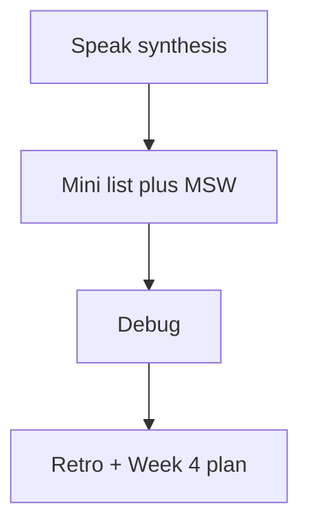

# Month 14 · Week 3 · Day 7
# Week Review — RTL, MSW, States, Light a11y

**Program:** Full-Stack Mastery · 18 months  
**Phase:** 4 — Full-stack application  
**Month index:** [../../README.md](../../README.md)  
**Week 3:** [1](day-01.md) · [2](day-02.md) · [3](day-03.md) · [4](day-04.md) · [5](day-05.md) · [6](day-06.md) · Day 7 (today)  
**Week rhythm today:** Review, repair, plan Week 4  
**Student state:** You queried by role and name, intercepted HTTP with MSW, tested loading/empty/error, and ran a light axe check. Today those ideas must still live in your head — from **this file**.  
**Study time:** 3–4 focused hours

Do not start Week 4 because the calendar moved. Playwright on a list you cannot query by role is two problems.

Work in `~\fullstack-lab\month-14\week-03\day-07\`. Do not implement the mini-build inside Project 7.

---

## How to read this chapter

This is a **closed-book teaching day**. The synthesis **is** the Week 3 lesson.



Days 1–6 closed during mini-build. Repair from **this** recap.

---

## Week synthesis (the lesson, in this book)

**RTL** tests the accessibility tree. Query **role and name**. Priority: role, label, text, testid last. `getBy` throws; `queryBy` null (absence); `findBy` waits. `userEvent` is awaited. `within` scopes a row. Do not `querySelector`. A `div` button is a product bug.

**MSW** (`http.get`, `HttpResponse.json`, `setupServer` from `msw/node`) is the fake HTTP server for component tests. `listen` with `onUnhandledRequest: "error"`. `resetHandlers` after each test. `close` at end. `server.use` for empty/500. Match the **exact** fetch URL. Not E2E. Not a test database. Prefer MSW over `vi.mock` of your API module.

**TanStack Query.** New `QueryClient` per test; `retry: false`. `MemoryRouter` for routes.

**States.** Loading: `role="status"` (delay handler to observe). Empty: heading, not alert. Error: `role="alert"`. 404 detail is not empty list. Absence uses `queryBy`.

**a11y.** jest-axe / axe-core is a **light** net. Fix unlabeled inputs. Axe misses keyboard traps and confusing copy. Green axe ≠ accessible product. Keep role queries.

**Product tests** live in **your** web repo. Labs are gyms.

**Wrong belief:** “CSS modules hashes are stable enough.”  
**Correct:** meaning lives in roles and names.

**Wrong belief:** “Component tests that fetch :8000 are more honest.”  
**Correct:** they are a different, slower layer.

---

## Today's contract

**Today's gate.** Closed-book:

> I query by role and name, intercept with MSW, test empty vs error, and I know axe is a smoke alarm. I built a tiny list from this spec.

---

## Time box

| Block | Minutes | Work |
|---|---|---|
| 1 | 30 | Speak; `exam-01.md` |
| 2 | 70 | Mini-build: parking stickers |
| 3 | 25 | Debug A–F |
| 4 | 15 | Review Day 6 evidence |
| 5 | 20 | vitest; break empty heading; restore |
| 6 | 15 | Design: Playwright vs RTL for your list |
| 7 | 15 | Retro |

---

# Complete explanation — frontend tests you must still own

## 1. Render

`render` from RTL. Providers: Query, Router. Cleanup is automatic in modern RTL.

## 2. Handler

Default happy list. Overrides for `[]` and `{ status: 500 }`.

## 3. Assert

`findByRole("listitem", { name: /.../i })`. Empty heading. Alert on error.

---

# Block 1 — Speak

Role vs class; findBy; MSW lifecycle; empty vs alert; axe limits. `exam-01.md`.

---

# Block 2 — Mini-build

```powershell
cd ~\fullstack-lab
mkdir month-14\week-03\day-07\mini -Force
cd ~\fullstack-lab\month-14\week-03\day-07\mini
```

Vite react-ts + vitest + RTL + MSW.

**Parking stickers** — not Project 7.

- `GET /api/stickers`  
- Default: **Lot A**, **Lot B** as listitems  
- Empty heading **No stickers yet**  
- 500 → alert **Could not load stickers**  
- Loading status **Loading stickers** (or `LOADING.txt` if time)  
- No querySelector  

```powershell
npx vitest run
```

---

# Block 3 — Debug

**A.** `getByRole` before fetch resolved.  
**B.** Handler path mismatch.  
**C.** Empty uses `role="alert"`.  
**D.** `afterEach` missing; 500 leaks.  
**E.** `div` with onClick labeled “Reload”.  
**F.** Axe green, input still has no name for `getByRole("textbox", { name: /lot/i })`.

---

# Block 4 — Day 6

`GAP.txt` from evidence: one screen still missing empty copy.

---

# Block 5 — Break

Change empty heading text without changing the test; run; fail; restore. `fail.txt`. Rehearsal for Month 14 gate (UI copy break).

---

# Block 6 — Design

`design.md`: which list bugs RTL should catch vs which need Playwright (login cookie, CORS, full create journey). Ten lines.

---

# Block 7 — Retro

`retro.md`: weakest query; Week 4 Playwright question.

## Debug keys

**A.** findBy. **B.** match URL. **C.** empty is not error. **D.** resetHandlers. **E.** use button. **F.** axe ≠ labeled for your query; add visible label.

```powershell
cd ~\fullstack-lab
git add month-14
git commit -m "Month 14 Week 3 review: stickers mini MSW tests."
```

---

## Office hours

**Mini used the product repo.** Move it.  
**Vitest not found.** `npm install -D vitest` in the mini.  
Windows: extra `--` for `npm create vite`.

---

# Lecture: closed-book cards

Write answers in `retro.md`:

1. get vs query vs find.  
2. Why MSW is not E2E.  
3. Empty vs alert.  
4. Why retry false.  
5. Unhandled request flag.  
6. `within` a row.  
7. Why `div.btn` fails getByRole button.  
8. What axe misses.  
9. QueryClient per test.  
10. What Week 4 will add that RTL cannot (cookies, CORS, real browser).

Miss more than two: re-read the synthesis, then the mini.

Week 4 is Playwright, flakes, lint/format/hooks, review, coverage honesty, break rehearsal, **exam**. Do not start it if the mini cannot find a listitem by name.

---

## Definition of done

- [ ] Mini vitest green (happy, empty, error)  
- [ ] Debug written then checked  
- [ ] fail.txt from broken heading  
- [ ] Week 4 not started on a failing mini  

---

## Optional review links

Repair from this synthesis first.

- [Testing Library which query](https://testing-library.com/docs/queries/about/#priority)  
- [MSW](https://mswjs.io/docs/)  

---

## Next week

**Week 4 — E2E and hygiene:** Playwright install and role locators; one critical flow against **your** app; flakes and waits that are not sleep; lint/format/pre-commit **concept**; review + useful coverage; break-a-feature rehearsal; **exam + Month 14 gate**. Month 15 (Linux, Docker, observability) is **forthcoming** — only after the gate is true.


<!-- length-pad -->
# Lecture: week 3 review extras

This section is still the lesson. Read it if a block felt thin. Say each claim aloud before you continue.

## Claims you must still own

1. Stickers mini: Lot A Lot B, empty heading, error alert.

2. Break empty heading for fail.txt.

3. Debug A findBy, B URL, C empty not alert, D reset, E button, F axe vs label.

4. Closed-book ten cards.

5. Week 4 does not start on a red mini.

6. Playwright will not save CSS-selector tests.

## Wrong belief / Correct

**Wrong belief:** “Mini in the product repo.”  
**Correct:** Move it.

**Wrong belief:** “querySelector in the mini because time.”  
**Correct:** Rebuild.

## Drills (write answers in the lab folder)

1. exam-01.md

2. GAP.txt

3. design.md RTL vs Playwright

## Windows

- npx vitest run

- npm create vite extra --

## Pitfalls

- Product nouns in the mini.

- Vitest not installed.

## Say it in six sentences

Close the file. Speak the day's gate paragraph. Name the command you will run. Name the folder you will type in. Name what you will not paste. Name the test that would go red if you broke the matching product behavior. If you cannot, reread Block A.

## Git reminder

```powershell
cd ~\fullstack-lab
git add month-14
git status
```

Commit when the day's definition of done is true. Do not commit secrets. Product tests stay in product repos.

<!-- length-pad-2 -->
# Worked questions: week 3 review

Write answers in `Q.md` in the day's lab folder before you peek at the sentences under each question. Then compare.

**Q1.** Mini noun?

Answer: Parking stickers.

**Q2.** Three tests?

Answer: Happy, empty, error.

**Q3.** fail.txt?

Answer: Break empty heading.

**Q4.** A?

Answer: findBy.

**Q5.** C?

Answer: Empty is not alert.

**Q6.** E?

Answer: Use a button.

**Q7.** F?

Answer: Axe green does not imply getByRole textbox name.

**Q8.** Cards?

Answer: Ten in the lecture.

**Q9.** Week 4?

Answer: Not on a red mini.

**Q10.** Playwright vs RTL?

Answer: Cookies CORS journey vs copy states.

## Quick table

| Idea | Honest use | Dishonest use |
|---|---|---|
| RTL | Role name | CSS |
| MSW | HTTP fake | vi.mock api |
| Empty | Heading | Alert |
| Axe | Smoke | Done forever |
| Next | Playwright | Skip markup |

## Closing

Closed-book teaching day. This file is the lesson. Then Week 4.

If this page is the only thing you remember tomorrow, you still have the day's gate. Type the lab. Run the command. Do not paste Project 7.
