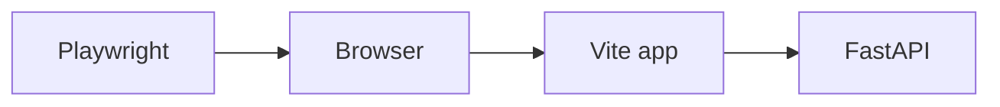

# Month 14 · Week 4 · Day 1
# Playwright: First Browser Test

**Program:** Full-Stack Mastery · 18 months  
**Phase:** 4 — Full-stack application  
**Month index:** [../../README.md](../../README.md)  
**Week 4:** Day 1 (today) · [2](day-02.md) · [3](day-03.md) · [4](day-04.md) · [5](day-05.md) · [6](day-06.md) · [7](day-07.md)  
**Week rhythm today:** Learn + type-along  
**Study time:** 3–4 focused hours

Labs: `~\fullstack-lab\month-14\week-04\day-01\` **or** your Project 7. One critical flow is Day 2. Today: install, locators, a smoke visit.

---

## How to read this chapter

Playwright drives a **real browser**. It is slow and precious. You use it for a **journey**, not for `slugify`.



**Wrong belief:** “I’ll Playwright every unit.”  
**Correct:** pyramid. Today is the top slice’s tool.

**Wrong belief:** “CSS selectors are fine in E2E.”  
**Correct:** `getByRole` still wins. When the designer restyles, the test should live.

---

## Today's contract

1. `npm init playwright@latest` in a lab or add to the frontend (Windows).  
2. A test that opens the app (or a static lab page) and asserts a heading by role.  
3. `npx playwright test` green.  
4. Note in README: both servers must run for a full-stack test (or use webServer config later).  
5. No `waitForTimeout(5000)` as your strategy — Day 3.

**Gate:** I can run a browser test that asserts a named heading.

---

## Time box

| Block | Minutes | Work |
|---|---|---|
| A | 30 | When E2E |
| B | 80 | Install + first test |
| C | 40 | Role locator |
| D | 15 | Git |
| E | 15 | Recall |

---

```ts
import { test, expect } from "@playwright/test";

test("home shows title", async ({ page }) => {
  await page.goto("http://127.0.0.1:5173/");
  await expect(page.getByRole("heading", { name: /project/i })).toBeVisible();
});
```

Adapt the name to **your** heading. If the app is down, the test should fail honestly.

---

## Definition of done

- [ ] playwright test green against something you run  
- [ ] Role locator  
- [ ] Commit  

---

## Tomorrow

Login (if you have it) + create + see in list — **your** app.

---

## Optional review links

Playwright locators are explained in this chapter. These pages are for later checking, not for first learning.

- [Playwright: Locators](https://playwright.dev/docs/locators)
