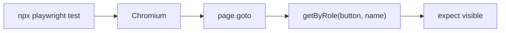

# Month 14 · Week 4 · Day 1
# Playwright: Install, First Test, Locators by Role

**Program:** Full-Stack Mastery · 18 months  
**Phase:** 4 — Full-stack application  
**Month index:** [../../README.md](../../README.md)  
**Week 4:** Day 1 (today) · [2](day-02.md) · [3](day-03.md) · [4](day-04.md) · [5](day-05.md) · [6](day-06.md) · [7](day-07.md)  
**Week rhythm today:** Learn + type-along  
**Student state:** Component tests cover list/detail. Today a **real browser** runs one small test. Locators follow the same law as RTL: **role and name**, not CSS soup.  
**Study time:** 3–4 focused hours

Labs: `~\fullstack-lab\month-14\week-04\day-01\`. Tomorrow you point Playwright at **your** app. Today a tiny static page so install pain is not mixed with product auth. Do not paste Project 7.

---

## How to use this textbook

1. Read until you can contrast Playwright with RTL.  
2. Type `npx playwright` commands in **PowerShell**.  
3. Write locators with `getByRole`. If it fails, fix the page.  
4. Optional review links are for later rechecking.

---

## How to read this chapter

**Playwright** launches Chromium (and optionally Firefox/WebKit), drives it like a person, and asserts on the page. It is the **E2E** layer: slow, precious, excellent at “can a human finish this journey?”



**Wrong belief:** “Playwright should replace pytest and RTL.”  
**Correct:** Playwright is the **top** of the pyramid. Endpoints stay on TestClient. List empty-copy stays on RTL+MSW. E2E is login + create + list (tomorrow).

**Wrong belief:** “I’ll copy CSS selectors from DevTools.”  
**Correct:** `page.locator("div.MuiButton-root:nth-child(3)")` will break on restyle. `getByRole("button", { name: /sign in/i })` breaks when **meaning** changes.

---

## Today's contract

1. Install Playwright (`npm init playwright@latest` or add to the lab).  
2. Run the first test with `npx playwright test`.  
3. Locate by **role and name**.  
4. Use web-first assertions (`toBeVisible`) that **wait** — not `sleep`.  
5. Know headed vs headless, and where the HTML report lives.

**Today's gate.** Closed-book:

> Playwright is a browser driver. I locate by role and name. Assertions wait. I do not sleep. E2E is few and precious. `npx playwright test` is the command on Windows.

---

## Time box

| Block | Minutes | Work |
|---|---|---|
| A | 50 | Theory |
| B | 75 | Install + first test on a tiny page |
| C | 55 | Independent: form fill by label |
| D | 15 | Git |
| E | 15 | Recall |

---

# Block A — Theory

## 1. Where Playwright sits

| Tool | Process | Typical assert |
|---|---|---|
| pytest + TestClient | Python, in-process ASGI | status + JSON |
| Vitest + RTL + MSW | Node, jsdom | role/name in a fake document |
| Playwright | Real browser, real layout, real cookies | journey |

Playwright **can** intercept HTTP like MSW (`page.route`). If you intercept **everything**, you built a slow component test. Default for this course: **do not stub the API** for the critical flow. Talk to **your** running stack (tomorrow). Today the lab page can be static HTML so you learn locators without auth.

## 2. Install on Windows

```powershell
cd ~\fullstack-lab
mkdir month-14\week-04\day-01 -Force
cd ~\fullstack-lab\month-14\week-04\day-01
npm init -y
npm init playwright@latest
```

Answer the prompts: TypeScript if offered, tests in `tests/`, GitHub Action optional **no** for today. Then:

```powershell
npx playwright install
npx playwright test
npx playwright show-report
npx playwright test --headed
```

**Wrong belief:** “I must test Firefox and WebKit today.”  
**Correct:** Chromium is enough for the month gate.

## 3. Locators — same philosophy as RTL

```ts
import { test, expect } from "@playwright/test";

test("home has a heading", async ({ page }) => {
  await page.goto("http://127.0.0.1:5179/");
  await expect(page.getByRole("heading", { name: /parking permits/i })).toBeVisible();
});
```

Preferred locators: `getByRole`, `getByLabel`, `getByText`, `getByTestId` last. `page.locator(".card")` is the CSS escape hatch. Do not start there.

## 4. Web-first assertions (no sleep)

`expect(locator).toBeVisible()` **retries** until timeout. You do not `waitForTimeout(3000)`.

**Wrong belief:** “`waitForLoadState('networkidle')` is the professional wait.”  
**Correct:** networkidle is brittle (analytics, websockets). Prefer asserting the **element the user needs**.

## 5. page, context, browser

A **test** gets a fresh `page` by default (isolated context). That is like a function-scoped fixture.

`storageState` can reuse a login — useful later, dangerous if it hides login bugs. Tomorrow you log in **in the critical spec**.

## 6. Config

`playwright.config.ts`: `testDir`, `baseURL`, optional `webServer`. For today’s static lab, `npx --yes serve -l 5179`.

Do not commit secrets. Use env `PLAYWRIGHT_BASE_URL` when pointing at the product tomorrow.

## 7. Traces

On failure, Playwright can record a **trace**. `npx playwright show-trace`. Use this instead of guessing. Today, `--headed` is enough.

## 8. What not to E2E

Every validation 422 (TestClient). Every empty list copy (RTL). Visual pixel diffs. Admin every-click tours. One flow is the Month 14 bar.

## 9. Accessibility locators vs axe

Playwright role locators are the a11y-aligned habit. Light axe stays in Vitest unless you have time.

## 10. Cost reminder

E2E write/debug/flake cost dominates. That is why Week 1 forbade Playwright-per-endpoint.

---

# Block B — Type-along

Create `index.html` in the lab with:

- `h1` **Parking permits**  
- labeled inputs **Title** and **Code**  
- `button` **Create permit**  
- `ul` that JS appends an `li` with the title on click (client-only is OK today)

Install Playwright. Write `tests/permits.spec.ts`: heading visible; fill by label/role; click create; listitem visible.

```powershell
npx --yes serve -l 5179
npx playwright test
```

Write `LOCATORS.md`. Grep tests for `page.locator("` — empty or justified.

---

# Block C — Independent

1. Disable create while title is empty; assert enabled after fill.  
2. `npx playwright test --headed` once; `HEADED.md`.  
3. Fail on purpose: wrong heading name; `RED.txt`; restore.  
4. `PRODUCT-GOTO.md`: URL for tomorrow (`http://127.0.0.1:5173` plus login path) — no secrets.

```powershell
cd ~\fullstack-lab
git add month-14
git commit -m "Month 14 Week 4 Day 1: Playwright install and role locators."
```

---

# Block E — Recall

1. pytest vs RTL vs Playwright.  
2. Why not CSS nth-child.  
3. Why not `waitForTimeout`.  
4. `npx playwright test` vs `npx playwright install`.  
5. Why one critical flow, not one per endpoint.

## Office hours

**Browsers missing.** `npx playwright install`.  
**file:// CORS.** Use `serve` or Vite.  
**Strict mode: extra locators.** Tighten `name:`.

Windows: PowerShell; `npx playwright test`.

## Minimum test

```ts
test("creates a permit in the list", async ({ page }) => {
  await page.goto("/");
  await page.getByRole("textbox", { name: /title/i }).fill("North dock");
  await page.getByRole("textbox", { name: /code/i }).fill("N1");
  await page.getByRole("button", { name: /create permit/i }).click();
  await expect(page.getByRole("listitem", { name: /north dock/i })).toBeVisible();
});
```

---

# Lecture: first-week Playwright mistakes

Students treat Playwright like Selenium circa 2014: `sleep`, CSS, one giant test. This course treats it like the top of the pyramid you already drew.

**Isolation.** Default Playwright gives each test a browser context. Do not log in once in `beforeAll` and share cookies until the critical flow itself is green. Tomorrow’s spec **includes** login because the gate includes login.

**Base URL.** `http://127.0.0.1:5173` and `http://localhost:5173` are different origins. Cookies and CORS care. Pick one and match Month 9’s CORS allowlist.

**Assertions vs locators.** `page.getByRole("heading", { name: /permits/i })` is a locator. It does not fail until you `expect` it or click it. A hanging test often forgot `await expect(...).toBeVisible()`.

**Auto-waiting on click.** Playwright waits for actionability (visible, stable, enabled). If your button is covered by a modal, the click waits then times out — that is a **product** overlay bug or a missing close.

**Reports.** `npx playwright show-report` opens an HTML report. Read the failed step. Do not paste a screenshot into chat as the only evidence; the locator error is the sentence.

**gitignore.** `test-results/` and `playwright-report/` and `blob-report/` belong in `.gitignore`. Commit the spec and config, not the last run’s videos, unless you have a reason.

**One browser.** Chromium project only in `playwright.config.ts` for this month. Three browsers triple CI time for the same locator lesson.

Write `MISTAKES.md`: which of these you already almost did.

---

## Definition of done

- [ ] `npx playwright test` green  
- [ ] Role locators only (or justified exception)  
- [ ] `RED.txt` from a bad name  
- [ ] `PRODUCT-GOTO.md` drafted  
- [ ] Commit exists  

---

## Optional review links

Playwright locators are explained in this chapter.

- [Playwright locators](https://playwright.dev/docs/locators)  
- [Playwright assertions](https://playwright.dev/docs/test-assertions)  
- [Playwright intro](https://playwright.dev/docs/intro)  

---

## Tomorrow

**One critical user flow** — login + create + see in list — written against **your** app, not a paste of Project 7.


<!-- length-pad -->
# Lecture: playwright locators and waits

This section is still the lesson. Read it if a block felt thin. Say each claim aloud before you continue.

## Claims you must still own

1. npx playwright install then npx playwright test.

2. Chromium is enough this month.

3. getByRole then getByLabel; CSS last.

4. toBeVisible retries; waitForTimeout does not wait for a condition.

5. networkidle is brittle.

6. Fresh page per test.

7. Do not stub your own CRUD in the critical flow tomorrow.

8. gitignore reports and test-results.

9. 127.0.0.1 versus localhost origins.

10. expect the locator; locators alone do not fail.

11. One E2E flow is the bar, not one per endpoint.

12. serve -l 5179 for static gym.

## Wrong belief / Correct

**Wrong belief:** “Playwright replaces pytest and RTL.”  
**Correct:** Top of the pyramid.

**Wrong belief:** “DevTools CSS is fine.”  
**Correct:** Restyle breaks it.

**Wrong belief:** “Must run Firefox and WebKit today.”  
**Correct:** Chromium first.

## Drills (write answers in the lab folder)

1. LOCATORS.md

2. RED.txt

3. PRODUCT-GOTO.md

4. MISTAKES.md

## Windows

- PowerShell npx playwright test

- npx playwright test --headed

- npx playwright show-report

## Pitfalls

- Missing browsers.

- file:// CORS.

- Vague names failing strict mode.

## Say it in six sentences

Close the file. Speak the day's gate paragraph. Name the command you will run. Name the folder you will type in. Name what you will not paste. Name the test that would go red if you broke the matching product behavior. If you cannot, reread Block A.

## Git reminder

```powershell
cd ~\fullstack-lab
git add month-14
git status
```

Commit when the day's definition of done is true. Do not commit secrets. Product tests stay in product repos.

<!-- length-pad-2 -->
# Worked questions: first Playwright

Write answers in `Q.md` in the day's lab folder before you peek at the sentences under each question. Then compare.

**Q1.** Commands?

Answer: install then test.

**Q2.** Locator law?

Answer: Role and name.

**Q3.** Wait?

Answer: toBeVisible retries.

**Q4.** Sleep?

Answer: Forbidden.

**Q5.** networkidle?

Answer: Brittle.

**Q6.** Browsers?

Answer: Chromium this month.

**Q7.** file://?

Answer: Use serve.

**Q8.** Origins?

Answer: 127.0.0.1 vs localhost.

**Q9.** gitignore?

Answer: reports and test-results.

**Q10.** Pyramid?

Answer: Do not Playwright slugify.

**Q11.** Tomorrow?

Answer: Your app login create list.

**Q12.** Locator without expect?

Answer: May not fail.

## Quick table

| Idea | Honest use | Dishonest use |
|---|---|---|
| Tool | Browser | jsdom |
| Wait | expect | sleep |
| Locator | getByRole | nth-child |
| Scope | One smoke | Every endpoint |
| Report | show-report | Guess |

## Closing

Install, first test, role locators. That is Day 1. The journey is Day 2.

If this page is the only thing you remember tomorrow, you still have the day's gate. Type the lab. Run the command. Do not paste Project 7.
