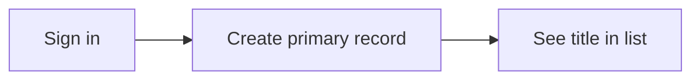

# Month 14 · Week 4 · Day 2
# One Critical User Flow: Login, Create, See in List

**Program:** Full-Stack Mastery · 18 months  
**Phase:** 4 — Full-stack application  
**Month index:** [../../README.md](../../README.md)  
**Week 4:** [1](day-01.md) · Day 2 (today) · [3](day-03.md) · [4](day-04.md) · [5](day-05.md) · [6](day-06.md) · [7](day-07.md)  
**Week rhythm today:** Learn + independent (against **your** app)  
**Student state:** Playwright locators work on a gym page. Today the E2E test must walk **your** product: **sign in, create a primary record, see it in the list**.  
**Study time:** 3–4 focused hours

Product tests live in **your** web repo (or a `e2e/` next to it). Labs: `~\fullstack-lab\month-14\week-04\day-02\` for notes only. This textbook will **not** paste Project 7. Query by **role and name**. `npx playwright test`.

---

## How to use this textbook

1. Run **your** API and Vite app locally (the way you already do).  
2. Write **one** spec. Do not tour the whole admin.  
3. If a locator fails, fix the accessible name in **your** UI.  
4. Optional review links are for later rechecking.

---

## How to read this chapter

The Month 14 gate needs a test that would catch a broken **journey**. Component tests will not set a real cookie. TestClient will not click your form. Playwright will.



**Wrong belief:** “I’ll intercept every API and still call it E2E.”  
**Correct:** then you are not proving FastAPI + Postgres + cookies. Intercept only if a third-party payment would charge a real card — not for your own CRUD.

**Wrong belief:** “I’ll use `waitForTimeout(5000)` after login because the dashboard is slow.”  
**Correct:** wait for a **heading** that means you are in. Day 3 unpacks flakes. Today: `expect(...).toBeVisible()`.

---

## Today's contract

1. One Playwright spec: login → create → list.  
2. Unique title (timestamp or random **in the test data**, not `sleep`).  
3. Locators by role and name.  
4. Document env: base URL, test user (a **seeded** user, not production customers).  
5. `npx playwright test` green on your machine.

**Today's gate.** Closed-book:

> I have one critical-flow spec against my app. It logs in, creates, and sees the row. It uses role locators. It does not sleep. It does not paste selectors from Chrome DevTools.

---

## Time box

| Block | Minutes | Work |
|---|---|---|
| A | 30 | Theory: data, users, uniqueness |
| B | 40 | Seed / pick a test user; start stack |
| C | 100 | Write the spec until green |
| D | 15 | Notes + git in **your** repo |
| E | 15 | Recall |

---

# Block A — Theory

## 1. What “critical” means

If this flow dies, the product is a brochure. For most Project 7 domains that is: **authenticate**, **create the primary entity**, **find it in the list**. Not settings, not avatar upload.

If your create is a wizard, still one journey: finish the wizard.

## 2. Test user

Use a dedicated user in the **test** (or local) database: `e2e@example.com` with a password in env `E2E_PASSWORD`, never committed. Seed it with a script or a fixture you already have from Month 13.

Do **not** use your personal Google account. Do not hit production.

## 3. Unique titles

If the list already has “North dock”, asserting that name is weak. Build `North dock ${Date.now()}` or a uuid slice. Assert **that** string as a listitem name.

Isolation: if two Playwright tests run in parallel they will collide on users. **One** spec today. Serial is fine.

## 4. Auth storage

Once login works, `storageState` can skip login in other tests. **Do not** skip login in the **critical** spec — the gate includes login. Other future tests may reuse state.

## 5. webServer vs manual run

`playwright.config.ts` can start Vite. Starting FastAPI + Postgres from Playwright is optional; many students start API in another terminal. Document in `E2E.md`:

```powershell
# terminal 1 — YOUR api, YOUR module name
uv run uvicorn ... --host 127.0.0.1 --port 8000
# terminal 2 — YOUR web
npm run dev
# terminal 3
npx playwright test
```

Bind **127.0.0.1**.

## 6. Failures you want

If you comment out the list render, this spec should go red. That is Week 4 Day 6–7. Today get green on a working product.

---

# Block B — Start the stack

Write `~\fullstack-lab\month-14\week-04\day-02\STACK.md`: ports, commands, test user **email only** (no password). Confirm login by hand once with the browser. If login is broken, **fix the product** — E2E cannot invent auth.

---

# Block C — The spec (you write every line)

In **your** web repo, `e2e/critical-flow.spec.ts` (path yours).

Skeleton **ideas** (adapt nouns; this is not your source):

- `page.goto("/login")` (your path)  
- `getByRole("textbox", { name: /email/i })` — **your** label  
- password textbox  
- `getByRole("button", { name: /sign in/i })`  
- expect a heading that means the app shell  
- navigate to create if needed  
- fill **your** required fields by label  
- submit  
- expect listitem or table row **named** with the unique title  

If your list is a table, `getByRole("row", { name: /.../i })` is correct. If it is cards that are not lists, add list semantics or `getByRole("link", { name: title })`. Fix markup if needed — that is in scope.

```powershell
npx playwright test
```

`FLOW.md` in the lab: the accessible names you used. No JSX.

---

# Block D — Git

Commit the spec in the **web** repo. Lab commit: notes only.

```powershell
cd ~\fullstack-lab
git add month-14
git commit -m "Month 14 Week 4 Day 2: critical flow notes (no product source)."
```

---

# Block E — Recall

1. Why unique titles.  
2. Why not intercept your own CRUD.  
3. Why login stays in the critical spec.  
4. Role for a table row.  
5. Where the spec lives.

## Office hours

**Login never finishes.** Cookie flags, CORS, wrong origin (127.0.0.1 vs localhost). Month 13. Fix the app; do not sleep.

**Create 403.** Test user lacks permission. Seed a member who **may** create, or use the role that can.

**List virtualized.** Row not in DOM. Scroll into view (`getByRole(...).scrollIntoViewIfNeeded()`) or disable virtualization in test env. Do not `waitForTimeout`.

**Two-factor.** If you added 2FA, use a test bypass **only** in local/test env, documented. Do not disable 2FA in production.

Windows: `npx playwright test --headed` to watch.

---

## Definition of done

- [ ] One spec green: login + create + list  
- [ ] Role/name locators  
- [ ] Unique title  
- [ ] `STACK.md` + `FLOW.md` without secrets  
- [ ] Product repo commit  

---

## Optional review links

The flow is explained in this chapter.

- [Playwright locators](https://playwright.dev/docs/locators)  
- [Playwright auth](https://playwright.dev/docs/auth)  

---

## Tomorrow

**From memory:** flake sources (timing, shared DB) and waits that are **not** sleep.


<!-- length-pad -->
# Lecture: critical flow against YOUR app

This section is still the lesson. Read it if a block felt thin. Say each claim aloud before you continue.

## Claims you must still own

1. Login, create primary record, see unique title in the list.

2. Spec lives in the web repo.

3. Seeded e2e user; password in env, not git.

4. Unique title with Date.now or uuid.

5. Role locators; table rows are rows.

6. Do not intercept your own CRUD.

7. Do not waitForTimeout after login; expect a heading.

8. Fix CORS and cookies if login fails; do not sleep.

9. Virtualized lists may need scrollIntoViewIfNeeded.

10. STACK.md ports; FLOW.md names; no secrets.

11. If create is 403, the user cannot create — seed a role that can.

12. This spec is a candidate for the exam red test.

## Wrong belief / Correct

**Wrong belief:** “Intercept every API and call it E2E.”  
**Correct:** Then you did not prove Postgres or cookies.

**Wrong belief:** “waitForTimeout 5000 after login.”  
**Correct:** Expect the shell heading.

**Wrong belief:** “Use your personal Google account.”  
**Correct:** Seeded local user.

## Drills (write answers in the lab folder)

1. STACK.md

2. FLOW.md

3. USER.md role only

4. npx playwright test green

## Windows

- Start API and Vite on 127.0.0.1

- npx playwright test --headed

## Pitfalls

- localhost vs 127.0.0.1 cookies.

- Row on page 2.

- 2FA without a test bypass in local env.

## Say it in six sentences

Close the file. Speak the day's gate paragraph. Name the command you will run. Name the folder you will type in. Name what you will not paste. Name the test that would go red if you broke the matching product behavior. If you cannot, reread Block A.

## Git reminder

```powershell
cd ~\fullstack-lab
git add month-14
git status
```

Commit when the day's definition of done is true. Do not commit secrets. Product tests stay in product repos.

<!-- length-pad-2 -->
# Worked questions: critical flow

Write answers in `Q.md` in the day's lab folder before you peek at the sentences under each question. Then compare.

**Q1.** Three steps?

Answer: Login, create, see unique title.

**Q2.** Where spec?

Answer: Your web repo.

**Q3.** Unique?

Answer: Timestamp or uuid in the title.

**Q4.** Intercept CRUD?

Answer: No.

**Q5.** Sleep after login?

Answer: No; expect heading.

**Q6.** 403 on create?

Answer: Wrong role; seed a creator.

**Q7.** Table?

Answer: getByRole row.

**Q8.** Password in STACK.md?

Answer: No.

**Q9.** Virtualized?

Answer: scrollIntoViewIfNeeded or disable in test.

**Q10.** storageState?

Answer: Not for the critical spec; login stays.

**Q11.** CORS?

Answer: 127.0.0.1 match Month 9.

**Q12.** Exam?

Answer: This spec may be the named red test.

## Quick table

| Idea | Honest use | Dishonest use |
|---|---|---|
| Login | Real cookies | Stubbed APIs |
| Create | Unique title | North dock forever |
| List | Role name | CSS card |
| Wait | Heading | sleep 5s |
| User | Seeded e2e | Personal Gmail |

## Closing

One precious journey. Green on your machine. Then Day 3 removes sleeps.

If this page is the only thing you remember tomorrow, you still have the day's gate. Type the lab. Run the command. Do not paste Project 7.
