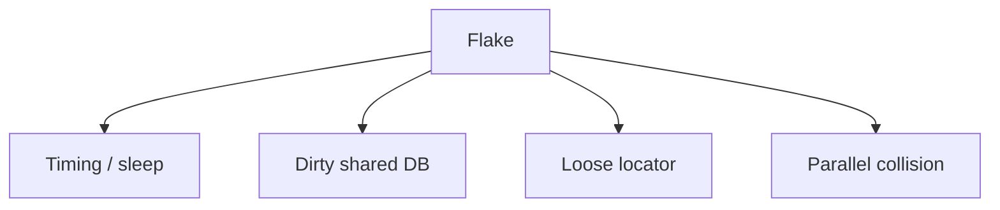

# Month 14 · Week 4 · Day 3
# From Memory: Flakes — Timing, Shared DB, Waits That Are Not Sleep

**Program:** Full-Stack Mastery · 18 months  
**Phase:** 4 — Full-stack application  
**Month index:** [../../README.md](../../README.md)  
**Week 4:** [1](day-01.md) · [2](day-02.md) · Day 3 (today) · [4](day-04.md) · [5](day-05.md) · [6](day-06.md) · [7](day-07.md)  
**Week rhythm today:** Implement from memory  
**Student state:** You have a critical-flow spec. Today you must **explain and repair flakes** without opening Days 1–2.  
**Study time:** 3–4 focused hours  
**Prereq:** Day 2 gate passed (or an honest `BLOCKED.md` if the flow is not green — still do the recap and paper drills).

Labs: `~\fullstack-lab\month-14\week-04\day-03\`. Do not paste Project 7.

---

## How Day 3 works

Days 1–2 closed during drills. This recap is the teacher.

Stuck > 25 minutes: open one section, close it, `lookups.txt`.

---

## How to read this chapter

A **flake** fails without a product change. E2E flakes destroy trust. The usual causes: **time**, **shared data**, **sleep**, **over-broad locators**, **animations**, **parallel workers**.



**Wrong belief:** “Retries in CI are the fix.”  
**Correct:** retries hide bugs. Fix waits and isolation. Retries are a last resort.

**Wrong belief:** “`waitForTimeout(2000)` is a wait.”  
**Correct:** it is a pause. The UI may still be late on CI. Assert the **condition**.

---

## Complete explanation (flakes you must still own)

**Web-first assertions.** `toBeVisible`, `toHaveURL`, `toBeEnabled` poll until timeout. That **is** the wait.

**Locator strictness.** Two “Save” buttons: Playwright throws. Tighten `name` or `within` a region (`getByRole("navigation")`).

**Navigation.** `click` then `expect(page).toHaveURL(/holds/)` or expect a heading. Do not sleep after click.

**networkidle.** Brittle. Prefer the element that matters.

**Shared DB.** Two tests create `code: "H1"` → 409. Unique titles (`Date.now()`). Dedicated test user. Do not point Playwright at a teammate’s dirty local DB without isolation. Week 2 isolation still applies: a **test** database for E2E if you can.

**Parallelism.** Default workers can collide. For one critical spec, `workers: 1` is honest. Document it.

**Animations.** `expect` still waits; if clicks miss, `reduced motion` or wait for `toBeEnabled`.

**Timezones / clocks.** E2E displaying “today” can flake at midnight. Prefer asserting the **title you typed**, not “Created today.”

**RTL vs Playwright.** jsdom tests flake from missing `await userEvent` and `getBy` instead of `findBy`. Same family: wait for the **right thing**.

**pytest.** Dirty dict / dirty DB is the backend twin. Not `time.sleep`.

**Wrong belief:** “Headed always passes, headless flakes, so I only run headed.”  
**Correct:** find the race. Headless is CI’s default.

---

## Today's contract

1. List five flake sources in `FLAKES.md`.  
2. Audit **your** critical spec for `waitForTimeout` / `sleep` — remove them.  
3. Ensure unique test data.  
4. Paper debug A–E.  
5. Optional: set `workers: 1` with a comment.

**Today's gate.** Closed-book:

> I wait by asserting visibility or URL. I do not sleep. Shared DB collisions are isolation bugs. Unique data and role locators reduce flakes.

---

## Time box

| Block | Minutes | Work |
|---|---|---|
| 1 | 25 | Speak; `exam-01.md` |
| 2 | 50 | Audit your spec; rewrite waits |
| 3 | 30 | Debug A–E |
| 4 | 25 | Tiny lab: assert heading instead of sleep |
| 5 | 20 | Run critical spec twice |
| 6 | 15 | Design: E2E database |
| 7 | 15 | Retro |

---

# Block 1 — Speak

Web-first vs sleep; shared DB; workers; strict locators; clocks. `exam-01.md`.

```powershell
cd ~\fullstack-lab
mkdir month-14\week-04\day-03 -Force
cd ~\fullstack-lab\month-14\week-04\day-03
```

---

# Block 2 — Audit (product spec)

Grep **your** e2e folder for `waitForTimeout`, `sleep`, `networkidle`, `.nth(`. Record hits in `AUDIT.md`. Replace sleeps with expects. Commit in the **web** repo.

If you have no spec (Day 2 blocked), write `BLOCKED.md` and still do Blocks 3–4.

---

# Block 3 — Debug

**A.** Test clicks Create immediately; button still disabled; flakes.  
**B.** Two specs use email `e2e@example.com` and mutate the same hold code.  
**C.** `waitForTimeout(5000)` after login; CI slower than 5s.  
**D.** Locator `text=Save` matches a heading and a button.  
**E.** pytest + Playwright both use the **dev** DB; a human deleted rows mid-run.

---

# Block 4 — Mini gym

Static page: button **Show** reveals heading **Ready** after 300ms (JS `setTimeout`). Playwright test: click Show, `expect heading Ready visible`. **Forbidden:** `waitForTimeout`. Prove you understood Day 1 assertions.

```powershell
npx playwright test
```

(Use Day 1’s install or a new mini.)

---

# Block 5 — Twice

Run the critical spec twice. If results differ, you have a flake — fix before Day 7. `TWICE.md`.

---

# Block 6 — Design

`design.md`: should E2E use the same `*_test` DB as pytest? Trade-off (realistic vs collisions). Ten lines.

---

# Block 7 — Retro

`lookups.txt`.

## Debug keys

**A.** `toBeEnabled` then click.  
**B.** unique codes; or separate users.  
**C.** expect app heading, increase timeout **on that expect** if the app is honestly slow — still no sleep.  
**D.** `getByRole("button", { name: /^save$/i })`.  
**E.** dedicated DB; don’t pytest against the E2E DB without isolation.

```powershell
cd ~\fullstack-lab
git add month-14
git commit -m "Month 14 Week 4 Day 3: flake audit notes and Ready heading gym."
```

---

## Office hours

**Timeout increased to 60s everywhere.** You are hiding slowness. Fix the app or the wait target.  
**Date.now() in title still collides.** Parallel workers + same millisecond — add worker index or uuid.

Windows: `npx playwright test`.

---

## Definition of done

- [ ] `FLAKES.md` five sources  
- [ ] No sleep in the critical spec (or BLOCKED)  
- [ ] Debug A–E  
- [ ] Mini Ready test without timeout sleep  
- [ ] Commit exists  

---

## Optional review links

Repair from this recap first.

- [Playwright assertions](https://playwright.dev/docs/test-assertions)  
- [Playwright timeouts](https://playwright.dev/docs/test-timeouts)  

---

## Tomorrow

**Lab:** lint (ruff / eslint) + format (ruff format / prettier) + **pre-commit as a concept**.
