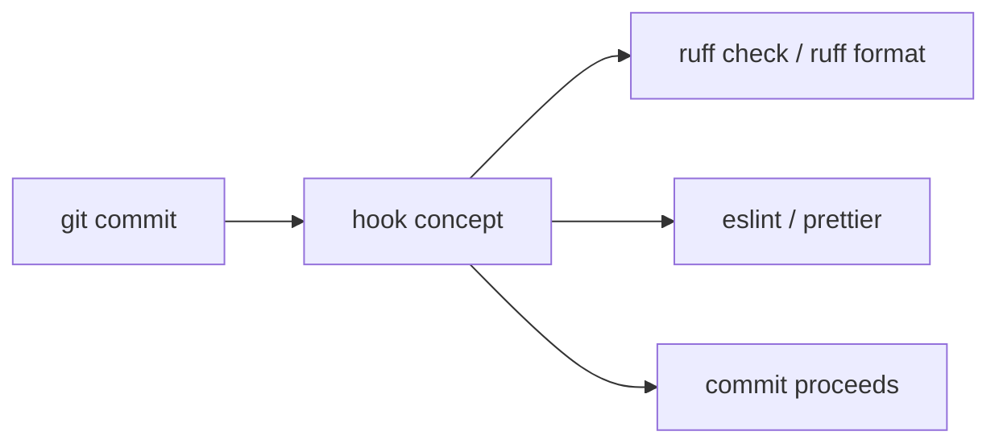

# Month 14 · Week 4 · Day 4
# Lab: Lint, Format, and the Pre-commit Concept

**Program:** Full-Stack Mastery · 18 months  
**Phase:** 4 — Full-stack application  
**Month index:** [../../README.md](../../README.md)  
**Week 4:** [1](day-01.md) · [2](day-02.md) · [3](day-03.md) · Day 4 (today) · [5](day-05.md) · [6](day-06.md) · [7](day-07.md)  
**Week rhythm today:** Lab (type-along + independent)  
**Student state:** Tests catch behavior. Today **machines** catch style and a class of bugs **before** the commit. You met Ruff in Month 8 and ESLint/Prettier in Month 5. Today they become a **habit** plus the **idea** of a pre-commit hook.  
**Study time:** 3–4 focused hours

Labs: `~\fullstack-lab\month-14\week-04\day-04\`. Product wiring belongs in **your** repos. Do not paste Project 7.

---

## How to use this textbook

1. Read hook **concept** before installing anything global.  
2. Run `uv run ruff` and `npx eslint` / `npx prettier` in labs or **your** repos.  
3. A hook is optional to **install**; you must still **explain** it.  
4. Optional review links are for later rechecking.

---

## How to read this chapter

**Lint** finds likely bugs and style violations (unused vars, `any`, bare except). **Format** rewrites whitespace so humans stop arguing. A **pre-commit hook** runs those tools on **staged** files so a dirty commit is harder.



**Wrong belief:** “Pre-commit means I do not need CI.”  
**Correct:** hooks run on laptops and can be `--no-verify` skipped. CI still runs tests. Month 16 will care more about CI. Today: local hygiene.

**Wrong belief:** “I’ll put `ruff` in a Playwright test.”  
**Correct:** different layer. Lint is not a user journey.

---

## Today's contract

1. Run **Ruff** check + format on a tiny Python file (or your API).  
2. Run **ESLint** and **Prettier** on a tiny TS file (or your web app).  
3. Write `HOOKS.md`: what a pre-commit hook **is**, what it should run, what it must **not** run (full Playwright suite).  
4. Optionally install `pre-commit` (Python) or a `package.json` `"prepare"` / simple script — **concept first**.  
5. Do not skip tests because lint is green.

**Today's gate.** Closed-book:

> Ruff lints and formats Python. ESLint lints TS; Prettier formats. A pre-commit hook is a git trigger on commit, not a substitute for pytest. I can explain it without installing a religion of 40 hooks.

---

## Time box

| Block | Minutes | Work |
|---|---|---|
| A | 40 | Theory |
| B | 70 | Type-along: dirty files made clean |
| C | 70 | Independent: document product commands + hook design |
| D | 15 | Git |
| E | 15 | Recall |

---

# Block A — Theory

## 1. Ruff (Python)

Month 8: `uv add --dev ruff`.

```powershell
uv run ruff check .
uv run ruff format .
```

`ruff check` is the linter. `ruff format` is the formatter (Black-compatible). Config lives in `pyproject.toml`.

**Wrong belief:** “format will fix unused imports.”  
**Correct:** format does not delete unused imports. `ruff check --fix` may.

## 2. ESLint and Prettier (TypeScript)

Month 5: ESLint + typescript-eslint + Prettier. In a Vite app:

```powershell
npx eslint src --ext .ts,.tsx
npx prettier --write src
```

Your scripts may be `npm run lint` / `npm run format`. Use **yours**.

ESLint can fail on `any`. That is a quality signal, not a coverage trophy.

## 3. What a git hook is

Git looks in `.git/hooks/` for scripts named `pre-commit`, `commit-msg`, etc. If `pre-commit` exits non-zero, the commit is **aborted**.

Problems with raw `.git/hooks`: they are **not** committed (`.git` is local). Teams use a **framework** that installs hooks from a **committed** config:

- Python: [pre-commit](https://pre-commit.com/) + `.pre-commit-config.yaml`  
- JS: husky + lint-staged (common in Vite repos)

**Concept you must own:** committed configuration + install step (`uv run pre-commit install` or `npm run prepare`) so teammates get the hook.

## 4. What belongs in pre-commit

**Yes:** ruff check/format on staged `.py`; eslint/prettier on staged `.ts/.tsx`; maybe `ruff` only on changed files (lint-staged).

**No:** `npx playwright test` (too slow; people will `--no-verify`).  
**No:** full `uv run pytest` on a huge suite (same). A **fast** unit subset is a maybe — often still CI.

**Wrong belief:** “If it is slow, developers will wait because they are professionals.”  
**Correct:** they will skip hooks. Keep hooks **seconds**.

## 5. `--no-verify`

Git allows skipping hooks. You cannot prevent a determined skip. CI is the backstop. Still install hooks so the default path is clean.

## 6. Windows notes

PowerShell runs `uv run` and `npx`. Line endings (`CRLF` vs `LF`) can fight Prettier and ruff. Pick `lf` in `.gitattributes` if the team agrees — do not fight it all day; note it in `HOOKS.md`.

`pre-commit` Python package needs to be installed in an environment. If install is painful on Windows, **write the YAML and the commands** and run them **manually** today. The gate is the **concept** plus **running lint/format**, not a battle with hook paths.

---

# Block B — Type-along

```powershell
cd ~\fullstack-lab
mkdir month-14\week-04\day-04 -Force
cd ~\fullstack-lab\month-14\week-04\day-04
uv init --name lab-hygiene
uv add --dev ruff pytest
```

`messy.py` — type it **messy** on purpose: unused import, extra spaces, `except:` if you want ruff to complain.

```powershell
uv run ruff check messy.py
uv run ruff format messy.py
uv run ruff check messy.py --fix
```

`notes.ts` — a tiny file with extra spaces and `any`. If you do not want a full Vite app, run prettier via:

```powershell
npx --yes prettier --write notes.ts
```

ESLint without a full project may be awkward — then run lint in **your** web repo instead and record the command in `COMMANDS.md`.

Write `BEFORE-AFTER.md`: one ruff finding you fixed.

Draft `.pre-commit-config.yaml` **as a sample** in the lab (even if you do not install):

- repo: ruff-pre-commit (or local hooks that call `uv run ruff`)  
- a comment: “Playwright not listed on purpose”

Write `HOOKS.md` (full sentences): hook vs CI; what you will run; what you refuse to run.

---

# Block C — Independent

1. In **your** API repo: `uv run ruff check` (and format if not already). Fix **a few** real issues; do not boil the ocean.  
2. In **your** web repo: `npm run lint` (or document if missing — add a minimal script if the Month 5 gate was true).  
3. `PRODUCT-HOOKS.md` in the lab: will you use pre-commit, husky, or **documented manual** commands until Month 16 CI? Choose.  
4. Stretch: `uv run pre-commit install` **or** husky — only if it takes < 30 minutes. If it fights Windows, stop and keep the concept doc.

Do not add 20 security scanners today.

```powershell
cd ~\fullstack-lab
git add month-14
git commit -m "Month 14 Week 4 Day 4: ruff/prettier lab and hook concept."
```

---

# Block E — Recall

1. ruff check vs ruff format.  
2. Why Playwright is not a pre-commit hook.  
3. Why `.git/hooks` alone does not help teammates.  
4. `--no-verify`.  
5. Lint green ≠ tests green.

## Office hours

**Ruff disagrees with your old black config.** Follow ruff; one formatter.  
**ESLint vs Prettier wars.** Let Prettier own formatting; ESLint own bugs.  
**Hook hung on npx.** Network; skip install, run locally.

Windows: if `pre-commit` is not found, `uv add --dev pre-commit` then `uv run pre-commit`.

## Minimum commands

```powershell
uv run ruff check .
uv run ruff format .
npx prettier --write src
npx playwright test
uv run pytest -q
```

Those last two are **not** required inside the hook.

---

## Definition of done

- [ ] Ruff ran on lab or API  
- [ ] Format ran on Python and/or TS  
- [ ] `HOOKS.md` explains pre-commit  
- [ ] Playwright not in the hook list  
- [ ] Commit exists  

---

## Optional review links

Hygiene is explained in this chapter.

- [Ruff](https://docs.astral.sh/ruff/)  
- [pre-commit](https://pre-commit.com/)  
- [Prettier](https://prettier.io/)  

---

## Tomorrow

**Code review checklist** and **useful coverage** vs chasing 100%.
