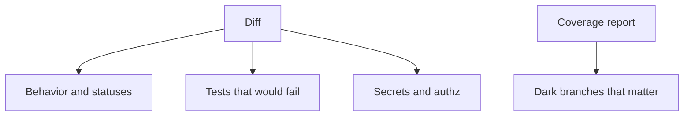

# Month 14 · Week 4 · Day 5
# Code Review Checklist and Useful Coverage (Not 100%)

**Program:** Full-Stack Mastery · 18 months  
**Phase:** 4 — Full-stack application  
**Month index:** [../../README.md](../../README.md)  
**Week 4:** [1](day-01.md) · [2](day-02.md) · [3](day-03.md) · [4](day-04.md) · Day 5 (today) · [6](day-06.md) · [7](day-07.md)  
**Week rhythm today:** Learn + type-along  
**Student state:** Tests, E2E, and lint exist. Today you learn to **review** like a teammate and to use coverage as a **flashlight** — the Week 1 promise, now with a checklist.  
**Study time:** 3–4 focused hours

Labs: `~\fullstack-lab\month-14\week-04\day-05\`. Do not paste Project 7. Review **your** diffs or a lab PR story.

---

## How to use this textbook

1. Read the checklist until you can review without looking.  
2. Generate a coverage report and **walk** permission/delete/money files.  
3. Write review comments about **behavior**, not taste.  
4. Optional review links are for later rechecking.

---

## How to read this chapter

A **code review** is a second human (or you tomorrow) asking: will this break users, security, or the test net? **Coverage** answers: which lines never ran? Neither is a trophy. Together they catch different laziness.



**Wrong belief:** “If coverage is 100%, the review can be a thumbs-up.”  
**Correct:** 100% can mean tautological tests and unused predicates. Review still asks whether the **router** calls `can_edit`.

**Wrong belief:** “Review is nits about commas; Ruff already formatted.”  
**Correct:** formatters ate the nits. Review is 403s, names, migrations, and whether a test exists.

---

## Today's contract

1. Use a **behavior-first** review checklist.  
2. Run coverage on a lab or the API; list three dark spots that **matter** and three that do **not**.  
3. Write two review comments on a real diff (your last week of work) in `REVIEW-COMMENTS.md`.  
4. Refuse a coverage gate of 100% as a month goal.  
5. Connect comments to tests: “this should go red if …”

**Today's gate.** Closed-book:

> I review behavior, authz, and tests — not commas. Coverage is a flashlight on dangerous dark branches. I will not chase 100% on getters. The Month 14 gate is a red test when a feature breaks, not a dashboard percent.

---

## Time box

| Block | Minutes | Work |
|---|---|---|
| A | 50 | Theory |
| B | 65 | Coverage report walk |
| C | 65 | Independent: review your own PR |
| D | 15 | Git |
| E | 15 | Recall |

---

# Block A — Theory

## 1. What reviewers owe the author

- Assume competence; ask questions.  
- Prefer “this 403 test is missing” over “you always forget auth.”  
- If you would not block merge, mark **nit**.  
- If authz is wrong, **block**.

You will review your own work today because you may not have a partner. Pretend you are hostile and fair.

## 2. Checklist (print this)

### Behavior

- [ ] Status codes match the contract (201, 204, 404, 403, 422, 409).  
- [ ] Errors are not `200 { ok: false }`.  
- [ ] Empty list is 200.  
- [ ] Names in the UI are real buttons/labels (review JSX like RTL would).

### Authorization (Month 13)

- [ ] Mutating routes check owner or role **on the server**.  
- [ ] Tests **deny** the wrong user.  
- [ ] UI hide is not the only control.

### Data

- [ ] Migrations exist for schema changes (Alembic).  
- [ ] No `create_all` in production.  
- [ ] Test DB, not prod URL.

### Tests

- [ ] New behavior has a test at the **cheapest** layer that could catch it.  
- [ ] No `waitForTimeout` / `time.sleep` in new tests.  
- [ ] Fakes at boundaries, not mocked routes.  
- [ ] Playwright still only the critical flow unless justified.

### Secrets and hygiene

- [ ] No tokens in the diff.  
- [ ] Ruff/ESLint not wildly worse.  
- [ ] Logs have no passwords.

### Coverage (flashlight)

- [ ] Open **new** files in the report.  
- [ ] If a permission `else` is dark, request a test — not 2% more on `schemas.py`.

## 3. Useful coverage vs chasing 100%

Useful:

- `if actor_id != owner_id: raise 403` both branches.  
- Expiry boundary.  
- Delete 404 second time.  
- Mail not sent on 422.

Not useful as a goal:

- `__init__.py`  
- Trivial getters  
- Generated client types  
- `if TYPE_CHECKING`  
- Defensive `assert never` you cannot reach

**Wrong belief:** “CI must fail under 90%.”  
**Correct:** a floor can lock in a mature suite. On a suite of snapshots, a floor produces more snapshots. This month’s gate is **break a feature; name the test**. If that test does not exist, 94% is theater.

## 4. Tools

Python:

```powershell
uv add --dev pytest-cov
uv run pytest --cov=YOUR_PACKAGE --cov-report=term-missing --cov-report=html
```

Open `htmlcov/index.html` in a browser. Walk **red** lines in authz modules.

Frontend: Vitest `coverage` in `vitest.config.ts`. Same walk: mutations, not CSS modules.

Do not commit huge HTML reports.

## 5. Review comments that help

**Useful:** “`PATCH /holds/{id}` as user B still 200. Add `test_member_cannot_patch_foreign_hold` next to the other TestClient tests.”

**Useless:** “Consider using a more functional style.” (No failing user.)

**Useless:** “Nit: rename `x` to `hold`.” (Unless `x` is in a public contract.)

**Wrong:** “Write more tests” with no name. Name the **claim**.

## 6. Dependency updates (hygiene cousin)

`uv lock` / `npm update` are not today’s rabbit hole. Review lockfile diffs: unexpected major versions, install scripts. Month 16 CI. One sentence in `DEPS.md`: you will not `npm install some-random-package` to fix a red test.

## 7. The exam tomorrow and next

Day 6: prepare a **break** (branch or documented revert). Day 7: break, show the red test, repair, self-mark the gate. Review comments you write today should already **name** tests.

---

# Block B — Type-along

```powershell
cd ~\fullstack-lab
mkdir month-14\week-04\day-05 -Force
cd ~\fullstack-lab\month-14\week-04\day-05
```

Use Week 1 Day 4’s permits lab **or** a tiny copy: `can_edit_permit` + TestClient. Add `pytest-cov`. Run `term-missing`.

Write `FLASHLIGHT.md`:

| File:line (approx) | Dark or lit | Would a user suffer if this were wrong? | Test to add? |
|---|---|---|---|
| | | | |

At least six rows. Include one **no** (getter) and one **yes** (deny branch).

Write `CHECKLIST.md`: copy the Block A checklist ticked against **your** last product PR (or last week’s commits). Honest unchecked boxes.

---

# Block C — Independent

1. `REVIEW-COMMENTS.md`: two comments you would leave on your own web or API diff. Each: observation, risk, **test name**.  
2. If a deny test is missing, **write it** in the product repo (TestClient). That is better than a comment.  
3. Coverage HTML locally; do not add a 100% fail-CI script.  
4. `WHY-NOT-100.md`: ten lines.

```powershell
cd ~\fullstack-lab
git add month-14
git commit -m "Month 14 Week 4 Day 5: coverage flashlight and review comments."
```

---

# Block E — Recall

1. Nit vs block.  
2. Flashlight vs trophy.  
3. A review comment that names a test.  
4. Why 100% on `can_edit` can still ship 200.  
5. Why Playwright is not the review for every line.

## Office hours

**Coverage 40% and panic.** Walk authz first; do not generate tests for `__repr__`.  
**Partnerless review.** Rubber-duck still counts if the comments are specific.  
**Ruff in the review.** “Please run format” is OK once; then hooks (yesterday).

Windows: `uv run pytest --cov --cov-report=term-missing`.

## Minimum coverage command

```powershell
uv run pytest --cov=. --cov-report=term-missing -q
```

Then **read** the missing column. That reading is the assignment.

---

## Definition of done

- [ ] Checklist applied to real work  
- [ ] Flashlight table six rows  
- [ ] Two review comments with test names  
- [ ] No 100% CI gate added  
- [ ] Commit exists  

---

## Optional review links

Review and coverage are explained in this chapter.

- [pytest-cov](https://pytest-cov.readthedocs.io/)  
- [Vitest coverage](https://vitest.dev/guide/coverage.html)  

---

## Tomorrow

**Independent:** prepare the **break-a-feature rehearsal** (a branch or a documented revert) so the exam is not a scramble.


<!-- length-pad -->
# Lecture: review and flashlight coverage

This section is still the lesson. Read it if a block felt thin. Say each claim aloud before you continue.

## Claims you must still own

1. Review behavior, authz, tests — not commas.

2. Block on authz holes; nit on names.

3. Name the test in the comment.

4. Coverage shows dark lines; it does not prove meaning.

5. Walk permission, delete, mail; ignore getters.

6. No 100% CI gate this month.

7. 100% on can_edit unused by the router still ships 200.

8. term-missing is the flashlight column.

9. Do not commit huge htmlcov.

10. The exam is a red test, not a badge.

11. Dependency majors in lockfiles are a review topic, not today's rabbit hole.

12. Day 6 rehearsal should already name a test.

## Wrong belief / Correct

**Wrong belief:** “100% coverage, thumbs up.”  
**Correct:** Router might not call the predicate.

**Wrong belief:** “Review is nits about commas.”  
**Correct:** Formatters ate nits.

**Wrong belief:** “Write more tests.”  
**Correct:** Name the claim.

## Drills (write answers in the lab folder)

1. FLASHLIGHT.md six rows

2. REVIEW-COMMENTS.md two comments

3. WHY-NOT-100.md

4. WALK.md

## Windows

- uv run pytest --cov=. --cov-report=term-missing -q

## Pitfalls

- Panic at 40% on __repr__.

- Coverage HTML committed.

## Say it in six sentences

Close the file. Speak the day's gate paragraph. Name the command you will run. Name the folder you will type in. Name what you will not paste. Name the test that would go red if you broke the matching product behavior. If you cannot, reread Block A.

## Git reminder

```powershell
cd ~\fullstack-lab
git add month-14
git status
```

Commit when the day's definition of done is true. Do not commit secrets. Product tests stay in product repos.

<!-- length-pad-2 -->
# Worked questions: review and coverage

Write answers in `Q.md` in the day's lab folder before you peek at the sentences under each question. Then compare.

**Q1.** Nit vs block?

Answer: Commas vs authz.

**Q2.** Comment shape?

Answer: Observation, risk, test name.

**Q3.** Flashlight?

Answer: term-missing on dangerous files.

**Q4.** Trophy?

Answer: 100% getters.

**Q5.** Unused can_edit?

Answer: 403 HTTP test and call it.

**Q6.** htmlcov commit?

Answer: No.

**Q7.** CI 90% floor?

Answer: Not this month's gate.

**Q8.** Walk order?

Answer: Authz, delete, mail, schemas last.

**Q9.** Playwright every line?

Answer: No.

**Q10.** Lockfile majors?

Answer: Notice; do not rabbit-hole.

**Q11.** Self review?

Answer: Hostile and fair.

**Q12.** Exam?

Answer: Named test in comments should exist.

## Quick table

| Idea | Honest use | Dishonest use |
|---|---|---|
| Review | Behavior | Commas |
| Coverage | Dark branches | Badge |
| Authz | Deny test | Hidden button |
| Comment | Test name | Write more tests |
| Gate | Red on break | 100% |

## Closing

Formatters ate nits. You review meaning. Coverage is a flashlight you actually walk.

If this page is the only thing you remember tomorrow, you still have the day's gate. Type the lab. Run the command. Do not paste Project 7.
