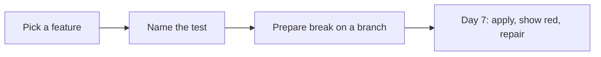

# Month 14 · Week 4 · Day 6
# Independent: Break-a-Feature Rehearsal

**Program:** Full-Stack Mastery · 18 months  
**Phase:** 4 — Full-stack application  
**Month index:** [../../README.md](../../README.md)  
**Week 4:** [1](day-01.md) · [2](day-02.md) · [3](day-03.md) · [4](day-04.md) · [5](day-05.md) · Day 6 (today) · [7](day-07.md)  
**Week rhythm today:** Independent implementation  
**Student state:** You have API tests, component tests, and one Playwright flow. Tomorrow you must **break a feature on purpose** and **name the test that goes red**. Today you **prepare** so the exam is a demonstration, not a discovery that no test exists.  
**Study time:** 3–4 focused hours

This textbook will **not** paste Project 7. Work in **your** repos plus notes in `~\fullstack-lab\month-14\week-04\day-06\`.

---

## How to use this textbook

1. Choose **one** break that a real user would feel.  
2. Confirm **today** that a named automated test is green, and predict it will go red.  
3. Put the break on a **branch** or write a **documented revert** (exact file + change). Do not leave `main` broken overnight.  
4. Optional review links are for later rechecking.

---

## How to read this chapter

The Month 14 gate is not “I wrote files named test.” It is: **if this feature dies, the suite speaks.**



**Wrong belief:** “I’ll change an assert from 404 to 200; that proves I can fail a test.”  
**Correct:** that breaks the **test**, not the **feature**. The exam wants a product change (skip authz, always empty list, create does not persist) that a **pre-existing** test catches.

**Wrong belief:** “I’ll break CSS padding; Playwright might flake.”  
**Correct:** pick a behavioral break. Authz, create, list, login.

---

## Today's contract

1. `REHEARSAL.md`: feature, exact change, **exact test name**, command to run that test.  
2. A git **branch** `m14-break-rehearsal` **or** a revert recipe that does not need memory.  
3. Run the named test **green** on current code.  
4. Optional dry-run of the break, then **undo** before you stop — so `main` stays green.  
5. Backup plan if the first test is weak.

**Today's gate.** Closed-book:

> I know which feature I will break tomorrow, which test must go red, and how I will restore. I will not discover on exam day that the only coverage is a snapshot.

---

## Time box

| Block | Minutes | Work |
|---|---|---|
| A | 25 | Pick the break (menu below) |
| B | 40 | Confirm the test exists and is green |
| C | 90 | Branch + dry-run + restore |
| D | 20 | Write the rehearsal doc |
| E | 15 | Recall |

---

# Block A — Choose from this menu

Pick **one** (adapt nouns). Prefer the highest row you can actually execute.

| # | Product break | Test that should catch it | Layer |
|---|---|---|---|
| 1 | Comment out authz on PATCH/DELETE | `test_..._403` or similar | TestClient |
| 2 | Create returns 200 and drops `id` | HTTP 201 test | TestClient |
| 3 | List handler always `[]` | RTL empty vs happy, **or** Playwright list | Component or E2E |
| 4 | Login always 401 / cookie not set | Playwright critical flow | E2E |
| 5 | Mail send removed | FakeMailer `sent` test | Integration |

If **none** of these tests exist, **write the missing test today** (red-green on a tiny plant, then keep it). Day 5 of Week 2 was this skill. The exam cannot invent a net.

**Forbidden breaks:** deleting `node_modules`, dropping the production database, committing secrets, disabling TLS, attacking anything you do not own.

---

# Block B — Prove green

Commands (yours):

```powershell
uv run pytest -q -k "the_test_name"
npx vitest run path/to/file
npx playwright test e2e/critical-flow.spec.ts
```

Paste **non-secret** output summaries into lab `GREEN.txt` (pass line only).

If the test is skipped or xfail, it is not a gate test. Unskip or pick another.

---

# Block C — Branch and dry-run

```powershell
git checkout -b m14-break-rehearsal
```

Apply the one-line (or few-line) break. Run the named test. Confirm **red**. Save `RED-DRY.txt` (assertion snippet).

```powershell
git checkout -- THEFILE
```

or `git restore` / revert the commit. Confirm **green** again.

Keep the branch **without** the break, **or** keep the break commit you can revert tomorrow with `git revert` / `git checkout main -- file`. Write the exact commands in `REHEARSAL.md`.

If you fear messing `main`, work only on the branch and merge nothing.

Windows: PowerShell; no force-push. Do not `--no-verify` to hide red.

---

# Block D — Document

`~\fullstack-lab\month-14\week-04\day-06\REHEARSAL.md` **and** a copy in the product repo if you want:

1. Feature in one sentence.  
2. File and change (describe; **no** huge paste of Project 7).  
3. Test **nodeid** or Playwright title.  
4. Commands.  
5. Restore commands.  
6. Backup break if #1 is too scary.

`TEST-STRATEGY.md`: update section 10 with this name.

---

# Block E — Recall

1. Feature break vs assert break.  
2. Why a dry-run today.  
3. Why production DB is forbidden.  
4. What if no test exists.  
5. Month 15 starts only if the gate is true.

```powershell
cd ~\fullstack-lab
git add month-14
git commit -m "Month 14 Week 4 Day 6: break-a-feature rehearsal notes."
```

---

## Office hours

**Only Playwright exists.** It can be the named test. Still prefer also a cheaper test; you may break list rendering and catch it in RTL **and** Playwright — name **one** for the exam script.

**Monorepo.** Branch on the repo that contains the file you will break.

**Cannot branch.** Documented revert: “comment lines 40–45 in `rules.py`; restore from git show HEAD:path”. Still better than improvising.

## Forbidden

Leaving the product broken overnight. Pasting full routers into fullstack-lab.

---

## Definition of done

- [ ] `REHEARSAL.md` complete  
- [ ] Named test green now  
- [ ] Dry-run red then restored  
- [ ] Restore commands written  
- [ ] Commits in the right repos  

---

## Optional review links

The gate is in [Month 14 README](../../README.md).

- [pytest node ids](https://docs.pytest.org/en/stable/how-to/usage.html)  
- [Playwright test](https://playwright.dev/docs/running-tests)  

---

## Tomorrow

**Month 14 exam + gate.** Break the feature on purpose; show which automated test fails; repair. Self-mark. **Month 15** (Linux, Docker, observability) is **forthcoming** — open it only if every gate row is true.


<!-- length-pad -->
# Lecture: rehearsal for the break

This section is still the lesson. Read it if a block felt thin. Say each claim aloud before you continue.

## Claims you must still own

1. Break a feature, not an assert.

2. Name the test today; prove it green.

3. Dry-run red; restore; do not leave main broken.

4. Branch m14-break-rehearsal or documented revert commands.

5. Forbidden: drop prod DB, secrets, attacking others.

6. If no test exists, write it today (Week 2 Day 5 loop).

7. Menu: skip authz, drop 201, list always empty, login cookie, mail not sent.

8. ONE-LINE.md the product change.

9. Update TEST-STRATEGY section 10.

10. Password never in REHEARSAL.md.

11. Do not force-push.

12. Tomorrow is the exam performance of this rehearsal.

## Wrong belief / Correct

**Wrong belief:** “Change assert 404 to 200.”  
**Correct:** That breaks the test, not the feature.

**Wrong belief:** “Break CSS padding.”  
**Correct:** Pick behavior.

**Wrong belief:** “I'll discover a test on exam morning.”  
**Correct:** That is why today exists.

## Drills (write answers in the lab folder)

1. REHEARSAL.md

2. GREEN.txt

3. RED-DRY.txt

4. ONE-LINE.md

## Windows

- git checkout -b m14-break-rehearsal

- uv run pytest -k name

- npx playwright test

## Pitfalls

- Leaving the break on main overnight.

- Dry-run on production.

## Say it in six sentences

Close the file. Speak the day's gate paragraph. Name the command you will run. Name the folder you will type in. Name what you will not paste. Name the test that would go red if you broke the matching product behavior. If you cannot, reread Block A.

## Git reminder

```powershell
cd ~\fullstack-lab
git add month-14
git status
```

Commit when the day's definition of done is true. Do not commit secrets. Product tests stay in product repos.

<!-- length-pad-2 -->
# Worked questions: rehearsal

Write answers in `Q.md` in the day's lab folder before you peek at the sentences under each question. Then compare.

**Q1.** Feature vs assert?

Answer: Change production code.

**Q2.** Dry-run?

Answer: Red then restore today.

**Q3.** Branch?

Answer: m14-break-rehearsal.

**Q4.** No test?

Answer: Write it today.

**Q5.** Menu?

Answer: Authz, 201, empty list, login, mail.

**Q6.** Forbidden?

Answer: Prod drop, secrets, attacking others.

**Q7.** ONE-LINE?

Answer: The product change.

**Q8.** main overnight?

Answer: Must stay green.

**Q9.** Playwright only net?

Answer: Allowed if it is the named test; cheaper is better too.

**Q10.** Cannot git branch?

Answer: Documented copy restore.

**Q11.** Section 10?

Answer: Update strategy.

**Q12.** Tomorrow?

Answer: Exam performance of this script.

## Quick table

| Idea | Honest use | Dishonest use |
|---|---|---|
| Break | Product | Assert |
| Proof | Named test | Coverage % |
| Restore | Written commands | Memory |
| Place | Branch | Broken main |
| Ethics | Test DB | Production |

## Closing

If you cannot name the test tonight, the gate is already in trouble. Write the test.

If this page is the only thing you remember tomorrow, you still have the day's gate. Type the lab. Run the command. Do not paste Project 7.
