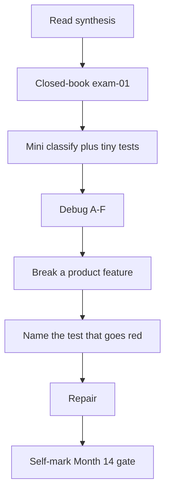
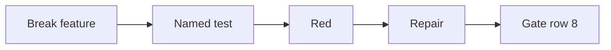

# Month 14 · Week 4 · Day 7
# Month 14 Exam + Gate

**Program:** Full-Stack Mastery · 18 months  
**Phase:** 4 — Full-stack application  
**Month index:** [../../README.md](../../README.md)  
**Week 4:** [1](day-01.md) · [2](day-02.md) · [3](day-03.md) · [4](day-04.md) · [5](day-05.md) · [6](day-06.md) · Day 7 (today)  
**Week rhythm today:** Monthly exam  
**Study time:** 3–4 focused hours (repair the net **after** if the gate is still false)

Textbook files stay **closed** except:

- **this file** (synthesis + exam blocks + self-mark table),
- [Month 14 README](../../README.md) **for the gate table wording**,
- your **own** `TEST-STRATEGY.md` and `REHEARSAL.md` only in the blocks that say so — not as a source to paste product code into the lab.

Repair forgotten facts from **this synthesis**, not from Weeks 1–4 day files and not from a random testing blog.

Work in `~\fullstack-lab\month-14-exam\` for exam evidence. Do **not** implement exam minis inside Project 7. Do **not** start Month 15 because the calendar moved.

**Month 15** (Linux, Docker, networking, observability) is in print. Open it when this gate is true — not because the calendar moved.

---

## How to read this chapter

This file is the **exam and the teacher**. The synthesis is written so a student whose Weeks 1–4 notes are foggy can still re-learn the month from **today’s pages**, then prove it with the blocks and the gate.



During Blocks 1–3, other day files stay closed. If you go blank, re-read **this synthesis**. AI may not write exam-01, the mini, the debug answers, or the break.

---

## Today's contract

By the end of this day you will be able to teach Month 14 aloud from this synthesis, classify layers, debug classic testing failures, **break a feature on purpose**, **show which automated test fails**, repair, and **honestly** mark the Month 14 gate.

**Today's gate** is the Month 14 Gate table below — not “I attended four weeks.” If any required row is false, **do not start Month 15**.

---

## Time box

| Block | Minutes | Work |
|---|---|---|
| 0 | 25 | Read the complete explanation; speak it |
| 1 | 35 | Closed-book `exam-01.md` |
| 2 | 40 | Mini-build (`mini/`) |
| 3 | 25 | Debug A–F |
| 4 | 15 | Review TEST-STRATEGY vs reality |
| 5 | 45 | **Break a feature; name the red test; repair** |
| 6 | 15 | Design: what Month 15 will not fix |
| 7 | 20 | Retro + self-mark |

---

## Month 14 synthesis (the lesson, in this book)

A **test** is a claim that can fail (Month 1). Month 14 organizes claims in a **pyramid**: many **unit** tests (pure rules, no I/O); fewer **integration** tests (TestClient HTTP, Postgres **test** database, adapters); **component** tests (React Testing Library + **MSW**); few **E2E** tests (**Playwright**, one critical journey).

**API tests are integration tests of the HTTP adapter.** `TestClient` is in-process ASGI. It is **not** E2E. It catches missing `status_code=201`, 404 vs 422, 403 deny. It does not catch a `div` used as a button.

**Coverage is a flashlight**, not a trophy. It shows lines that never ran. 100% on `can_edit` still ships a 200 if the router never calls it. The month gate is **not** a percent. It is: break a feature deliberately and **name the test** that turns red.

**Doubles.** A **fake** is a working stand-in with memory (`FakeMailer.sent`). A **stub** returns canned values. A **mock** fails unless expected calls happen. A **spy** records. Prefer **fakes at boundaries** (email, clock, outbound HTTP). Do not fake Postgres in every API test. Do not mock the route under test. Do not mock your 404.

**Fixtures.** pytest injects by name. `conftest.py` is discovered. `yield` teardown. Function scope default. Factories build data with overrides and must not swallow 409. Autouse is invisible.

**Determinism.** Inject a clock; do not `time.sleep`. Timezone-aware **UTC**. Do not assert unseeded UUIDs.

**DB isolation.** Dedicated test database. Rollback (fast; app `commit` can break it) or truncate. Safety: refuse prod-looking URLs. Empty-start tests detect leaks.

**Failing paths.** 422 schema (`detail` list, `loc`). 404 missing resource. 403 authenticated but forbidden. 401 unknown. `GET /x/abc` is 422 if `id: int`.

**Email.** `Depends(get_mailer)` + `dependency_overrides` + same FakeMailer instance. 422 must not send. No SMTP. Clear overrides.

**Regression.** Reproduce with a failing test first; then fix; keep the test.

**RTL.** Query by **role and name**. `getBy` / `queryBy` / `findBy`. `userEvent` awaited. No CSS selectors as the contract.

**MSW.** `http.get` + `HttpResponse.json` + `setupServer` (`msw/node`). `onUnhandledRequest: "error"`. `resetHandlers`. Empty vs error vs loading (`status` vs `alert`).

**a11y.** Light axe is a smoke alarm. Fix unlabeled inputs. Axe misses keyboard traps.

**Playwright.** `npx playwright test`. Locators by role and name. Web-first expects — **no sleep**. One flow: login + create + see in list, against **your** app. Flakes: timing, shared DB, parallel workers, vague locators.

**Hygiene.** `uv run ruff check` / `ruff format`; ESLint / Prettier. Pre-commit is a **git hook concept** — fast linters, not the Playwright suite. `--no-verify` exists; CI is the backstop (forthcoming months).

**Review.** Behavior, authz, tests named. Not commas.

**Product tests live in your repos.** Labs are gyms. This textbook does not paste Project 7.

**Wrong belief:** “Playwright for every endpoint.”  
**Correct:** TestClient for endpoints; one Playwright journey.

**Wrong belief:** “I failed a test by editing the assert; that is the gate.”  
**Correct:** you must break the **feature** and watch a test that was already supposed to guard it.

---

# Complete explanation — testing you must still own

## 1. Layers (Week 1)

Unit: functions. Integration: HTTP + DB. Component: jsdom + MSW. E2E: browser. Coverage is not a layer.

## 2. Backend (Week 2)

conftest, factories, test DB, 403/404/422, FakeMailer, red-green bugs.

## 3. Frontend (Week 3)

Role/name, MSW, loading/empty/error, light axe.

## 4. E2E and hygiene (Week 4)

Playwright critical flow; no sleep; lint/format/hooks concept; review; flashlight coverage; rehearsal; **this exam**.

---

# Block 0 — Speak the synthesis

Out loud, no other files: pyramid; TestClient ≠ E2E; flashlight; fakes at boundaries; isolation; role locators; one Playwright flow; the gate sentence. Then Block 1.

---

# Block 1 — Closed-book (35 min)

Create `~\fullstack-lab\month-14-exam\exam-01.md`.

Write **in your words** (25–40 lines):

1. Four layers with one example each from **your** product (names only).  
2. Fake vs mock.  
3. Why coverage 100% can still ship a 200.  
4. 422 vs 404 vs 403.  
5. Why `waitForTimeout` is not a wait.  
6. The exact test you plan to go red in Block 5 (name).  

If you cannot fill it, re-read the synthesis. Do not open Day 6 yet except the **test name** you already chose.

---

# Block 2 — Mini-build (40 min)

Textbook closed except this file’s spec.

```powershell
cd ~\fullstack-lab
mkdir month-14-exam\mini -Force
cd ~\fullstack-lab\month-14-exam\mini
uv init --name exam-mini
uv add fastapi
uv add --dev pytest httpx
```

**Domain (imposed so you cannot paste Project 7): reading-room desk holds.**

Must:

- Pure `can_release(role, owner_id, actor_id)` with unit tests including **stranger deny**  
- FastAPI: POST `/holds` 201 `{title, code}` unique 409; GET one 404; empty title 422  
- TestClient fixture isolates the dict  
- FakeMailer via Depends on successful create; 422 sends nothing  

Should if time: PATCH 403 with lab headers `X-User-Id` / `X-Role`.

Must not: SQLAlchemy required, Playwright required, product source, SMTP, `payload: dict` without Pydantic.

```powershell
uv run pytest -q
```

---

# Block 3 — Debug (25 min)

Write `exam-03-debug.md`. For each: **what fails or lies**, **root cause**, **fix in one or two sentences**.

**A.** “Our E2E suite is TestClient, so we skipped Playwright.”  
**B.** Session-scoped `FakeMailer`; random `sent` lengths.  
**C.** `page.waitForTimeout(3000)` after login; CI red.  
**D.** RTL `container.querySelector(".hold-title")`.  
**E.** Coverage 97%; members can PATCH foreign holds; `can_edit` is tested but unused.  
**F.** pytest `TEST_DATABASE_URL` points at the database you click in TablePlus with real names.

---

# Block 4 — Review strategy

Open **only** your `TEST-STRATEGY.md`. One mismatch vs reality: `exam-04-gap.md`. If the file is missing, the gate is already in trouble — say so.

---

# Block 5 — Break a feature on purpose (the month)

This is the **Month 14 exam performance**.

1. Follow **your** rehearsal (branch or documented change).  
2. Apply the **product** break (authz skipped, list always empty, create broken, login cookie dropped, mail not called — **one**).  
3. Run the **named** automated test:

```powershell
uv run pytest -q -k "your_test" --tb=short
npx vitest run --reporter=verbose
npx playwright test
```

Use the one command that applies.

4. Save evidence in `~\fullstack-lab\month-14-exam\exam-05-red.txt`:  
   - feature you broke (one sentence)  
   - **exact test name**  
   - snippet of the failure (assertion, not a secret)  
5. **Repair** the feature. Run the test green.  
6. `exam-05-green.txt`: pass line.

If **no test went red**, you did not meet the gate. Write that honestly. Spend remaining time adding the test (Week 2 Day 5 loop) and **repeat** Block 5. Do not mark the gate true.

Do not leave `main` broken. Do not force-push. Do not `--no-verify` to hide it.

**Wrong belief:** “Changing `assert status == 404` to `200` is breaking a feature.”  
**Correct:** restore that game. Break **production code**.

---

# Block 6 — Design

`exam-06-design.md` (10–15 lines): why Month 15 (Linux, Docker, observability) will **not** replace a missing 403 test. What a container that is “green to start” still will not catch.

---

# Block 7 — Retro + self-mark

`exam-07-retro.md`: weakest layer; whether Playwright was the only net; remaining OWED tests.

---

## Month 14 Gate (self-mark)

True **without a tutorial**. Evidence paths are yours.

| # | Claim | Evidence | Pass? |
|---|---|---|---|
| 1 | Explain unit / integration / component / E2E with examples from *your* Project 7 | exam-01 | |
| 2 | Pytest fixtures isolate the database (transaction or dedicated test DB) | API tests / conftest | |
| 3 | External I/O (email, Redis, clock) faked at a **boundary** | FakeMailer or equivalent | |
| 4 | RTL tests query by **role and name**, not CSS soup | web tests | |
| 5 | MSW (or equivalent) stands in for HTTP in component tests | handlers | |
| 6 | Playwright covers **one** critical flow (login + create/list) | e2e spec | |
| 7 | Lint + format automatic or documented; review comments about behavior | ruff/eslint, Day 5 comments | |
| 8 | **Broke a feature deliberately** and showed **which automated test** turned red | exam-05-red.txt + repair | |

If any **required** row is false, **do not start Month 15**. Stay on Month 14 until the net speaks.

```powershell
cd ~\fullstack-lab
git add month-14-exam
git commit -m "Complete Month 14 exam evidence."
```

---

## If you passed

**Month 15** is **forthcoming**: Linux, Docker, networking, observability. Open it only when this gate is true. Containers will not invent 403 tests. Logs will not replace Playwright on login.

## If you did not pass

Stay on Month 14. This synthesis remains the teacher. Repair the missing layer (often deny tests or the critical flow), then repeat Block 5.

---

If the gate table has a false row, the honest action is more tests on **your** product, not Docker.

---

## Optional review links

Repair from this synthesis first.

- [FastAPI testing](https://fastapi.tiangolo.com/tutorial/testing/)  
- [pytest fixtures](https://docs.pytest.org/en/stable/explanation/fixtures.html)  
- [Testing Library queries](https://testing-library.com/docs/queries/about/#priority)  
- [MSW](https://mswjs.io/docs/)  
- [Playwright locators](https://playwright.dev/docs/locators)  
- [Ruff](https://docs.astral.sh/ruff/)  

---

# Scoring Block 5 (you, not a grader bot)

| Piece | Honest pass |
|---|---|
| Break is in **product** code | Not an edited assert |
| Test name pre-existed or was added before the break in a documented red-green | exam-05-red.txt |
| Failure matches the break | 403 test red when authz removed, etc. |
| Repair restored green | exam-05-green.txt |
| main not left broken | git status |

If you broke Playwright by stopping the API, that is not a feature break — that is unplugging the lab. Restore and pick a code change.

---

## Worked answers you should not need — check after you write debug

**A.** TestClient is HTTP in-process, not a browser journey. You still need one Playwright flow.  
**B.** Function-scope a new FakeMailer; session-scoped mutable doubles leak.  
**C.** Assert a heading or URL; Playwright retries expects; sleep does not wait for the condition.  
**D.** Query by role and name; a class is a styling contract.  
**E.** Flashlight: the predicate is unused; add a 403 HTTP test and call `can_edit`.  
**F.** Dedicated `*_test` database; safety assert; never pytest on human data.

If your written answers disagree, fix them from this box **only after** you attempted A–F alone.



---

## Month 15 is not a reward for finishing the calendar

Linux and Docker will add processes, images, and logs. They will not teach you 201 vs 200 or `getByRole`. Students who skip a red test on a broken list deploy a beautiful container that serves an empty page.

Continue Project 7 tests until every gate row is true. Do not begin Month 15 on a false self-mark.

## Closed-book cards (write answers in exam-07-retro)

1. TestClient vs Playwright — one sentence.  
2. Fake vs mock — one sentence.  
3. Why coverage is a flashlight.  
4. 422 vs 404 for `/items/abc`.  
5. Why `lambda: FakeMailer()` in an override is wrong if you assert another instance.  
6. `findBy` vs `getBy` after fetch.  
7. Why empty is not `role="alert"`.  
8. A wait that is not sleep.  
9. What does **not** belong in a pre-commit hook.  
10. The Month 14 gate in one sentence.

If you miss more than two, re-read the synthesis, then the gate table. Missing these and starting Month 15 is how production ships untested authz.

**Mini pytest** after it is green:

```powershell
uv run pytest -q --tb=short
```

You want **422** with empty title and **no** mail, **404** on missing id, **deny** unit on `can_release`.

Do not put the mini inside the product repo. Do not start Month 15 tonight on a false self-mark.

## Definition of done (exam day)

- [ ] exam-01 teaches layers and names the Block 5 test  
- [ ] Mini pytest green (unit + HTTP + fake mail)  
- [ ] Debug A–C written, then checked against the worked box  
- [ ] exam-05-red.txt names the test that caught a **feature** break  
- [ ] Feature repaired; green evidence  
- [ ] Self-mark table is honest  
- [ ] Month 15 not started on a false row  

The gate table is the course’s definition of done for the month. Attendance is not.
