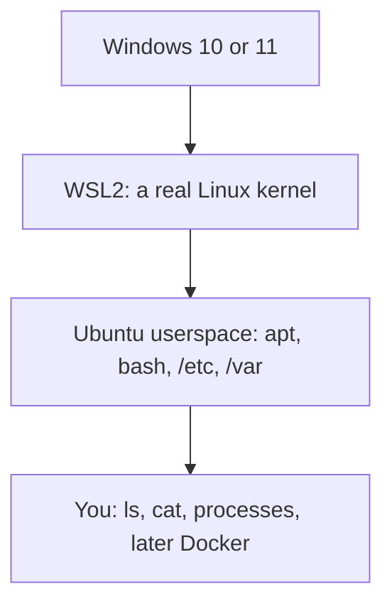
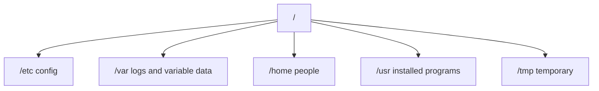

# Month 15 · Week 1 · Day 1
# Linux on a Windows Laptop: Kernel, Distro, FHS, and First Ubuntu

**Program:** Full-Stack Mastery · 18 months  
**Phase:** 5 — Production engineering  
**Month index:** [../../README.md](../../README.md)  
**Week 1:** Day 1 (today) · [2](day-02.md) · [3](day-03.md) · [4](day-04.md) · [5](day-05.md) · [6](day-06.md) · [7](day-07.md)  
**Week rhythm today:** Learn + type-along  
**Student state:** Month 14’s gate is true: you can break a feature and name the test that goes red. Project 7 stays in **your** repos. This month you learn the **machine shape** that will run that product: Linux.  
**Study time:** 3–4 focused hours

**This week covers:** kernel vs distro, FHS, users and permissions, processes and signals, systemd as a concept, SSH keys, apt, listening ports, logs.

Today: why production is Linux, how a **distro** sits on a **kernel**, the **Filesystem Hierarchy Standard**, and your first Ubuntu inside **WSL2**. Permissions are Day 2. Processes are Day 4. Do not skip either.

Labs: `~\fullstack-lab\month-15\week-01\day-01\` **inside Ubuntu**. PowerShell is not the production shell this month. One exception: the WSL installer, which Windows still launches from PowerShell.

This textbook will **not** paste Project 7.

---

## How to use this textbook

1. Read a section. Close it. Say the idea in a full sentence with an example from **this machine**, not from a cloud brochure.  
2. Type every command in **Ubuntu bash**. Do not paste a “Linux cheatsheet.”  
3. When a path fails, ask **where you are** (`pwd`) before you invent a new command.  
4. Optional review links are for later rechecking.

---

## How to read this chapter

You own a **Windows laptop**. Almost every server that will run your API is **Linux**. Month 15 does not ask you to throw Windows away. It asks you to run a real Linux **userspace** on a Linux **kernel** that Windows hosts through WSL2, then treat that Ubuntu as the machine you inspect.



**Wrong belief:** “Docker is a lighter virtual machine, so I do not need Linux.”  
**Correct:** a container shares a **Linux kernel**. Files, users, processes, ports, and logs are Linux ideas. Docker (Week 2) is packaging on top. Kubernetes is **not** this month.

**Wrong belief:** “Ubuntu *is* the kernel.”  
**Correct:** Ubuntu is a **distribution**: kernel + GNU userland + package repos + default layout. The kernel schedules CPU, owns memory, and talks to hardware. `ls` is not the kernel.

---

## Today's contract

By the end of this day you will be able to:

1. Distinguish **kernel**, **distribution**, and **shell**.  
2. Explain **why production is Linux** in engineering sentences, not fandom.  
3. Name what lives in `/etc`, `/var`, `/home`, `/usr`, `/tmp`, and `/opt`.  
4. Use **absolute** and **relative** paths; `ls`, `cd`, `pwd`, `cat`.  
5. Install **Ubuntu on WSL2** (if it is not already there) and create the lab folder on the **Linux** filesystem.

**Today's gate.** Closed-book:

> The kernel is the privileged core. Ubuntu is a distro on that kernel. `/etc` is configuration, `/var` is variable data including logs, `/home` is people, `/usr` is installed programs. I navigate with `pwd`, `ls`, `cd`, and `cat`. I type bash in Ubuntu, not PowerShell, for this month’s labs.

---

## Time box

| Block | Minutes | Work |
|---|---|---|
| A | 55 | Theory |
| B | 60 | Install Ubuntu; first navigation |
| C | 70 | Independent: FHS walk + notes |
| D | 15 | Git from bash |
| E | 15 | Recall |

---

# Block A — Theory

## 1. Why this month exists

You already shipped a full-stack product in earlier months: FastAPI, Postgres, a UI, tests that can go red. Those processes still ran on **your** laptop, often started from **PowerShell**, with paths like `C:\Users\...`.

Production does not look like that. A rented virtual machine, a container host, and almost every PaaS buildpack assume:

- paths with `/`
- users and permission bits
- a process table you inspect with `ps`
- logs under `/var/log` or on **stdout**
- packages from `apt` (or a sibling)

If you cannot walk a Linux tree, Docker will feel like magic, and magic is how you ship a container you cannot debug. Week 1 is the machine. Week 2 is the box you put a process in. Week 3 is several boxes wired together. Week 4 is how those boxes **speak** when they fail.

## 2. Kernel versus distribution

Three words students mash together: **Linux**, **Ubuntu**, **bash**.

| Word | What it is | What it is not |
|---|---|---|
| **Kernel** | The privileged program that owns CPU, memory, devices, processes, and the syscall interface | A desktop, a package manager, a shell |
| **Distribution (distro)** | A complete OS built *around* a kernel: Ubuntu, Debian, Fedora, Alpine | “The kernel with a wallpaper” |
| **Shell** | A program that reads commands and starts other programs: `bash`, `zsh` | The operating system |

**Linux** in casual speech often means “a Linux distro.” In precise speech, Linux is the **kernel** Linus Torvalds and others maintain. Ubuntu takes that kernel (or a packaged version of it), adds GNU tools (`ls`, `cp`, `coreutils`), a package index (`apt`), an init system (`systemd` on Ubuntu — Day 4), and a default filesystem layout.

**Wrong belief:** “I installed Linux when I installed Docker Desktop.”  
**Correct:** Docker Desktop on Windows uses a Linux VM (today, often the same WSL2 machinery). You still need a **distro you can log into**, with a home directory and `apt`, so you can think like the server.

WSL2 runs a **real Linux kernel** in a lightweight VM, then runs your Ubuntu **userspace** on it. Syscalls from `ls` go to that Linux kernel, not to `ntoskrnl.exe`. That is why Linux binaries work. WSL1 translated syscalls into Windows; WSL2 does not. This course assumes **WSL2**.

## 3. Why production is Linux

Not because Windows cannot run a web server. IIS exists. Not because you must dislike Microsoft. Because:

1. **The industry default is Linux images.** Official Postgres, Redis, Nginx, and Python images are Linux. Your future Compose file (Week 3) is a Linux story.  
2. **The permission and process model matches the docs** you will actually read: `chmod`, `PID`, `SIGTERM`, `journalctl`.  
3. **Cost and automation.** Cloud images, CI runners, and container hosts are overwhelmingly Linux. Learning two production OS families at once is a luxury; this program picks the one your containers share.  
4. **Reproducibility.** A Ubuntu box with `apt` and a known FHS is a sentence you can write in a runbook. “It works in my Start menu” is not.

Your Windows laptop remains the **editor and browser**. Ubuntu is the **server-shaped room** you walk into every lab this month.

**Wrong belief:** “I will learn Linux when I get a job with a bastion host.”  
**Correct:** you will get that job faster if you can already explain `/var/log` and a listening port. Today is that start.

## 4. The Filesystem Hierarchy Standard (FHS)

Windows grew up with drive letters: `C:\`, `D:\`. Linux grew up with **one tree**. The root is `/`. Everything hangs under it, including other disks when they are **mounted**.

You do not memorize every directory in the FHS. You memorize the ones that appear in every incident:

| Path | Job | Forget this and you will… |
|---|---|---|
| `/` | Root of the tree | Think “C:” still exists |
| `/etc` | **Host configuration** (text files the machine’s programs read) | Hunt settings inside `/home` forever |
| `/var` | **Variable** data: logs, caches, spool, often databases’ default data | Wonder where logs went |
| `/home` | Human users’ files (`/home/you`) | Put secrets in `/tmp` and lose them |
| `/usr` | Installed user-space programs and libraries (`/usr/bin`, `/usr/lib`) | Confuse “I compiled it” with “the OS shipped it” |
| `/bin`, `/sbin` | Essential binaries (on modern Ubuntu many are merged into `/usr`) | Panic when `ls -l /bin` shows a symlink |
| `/tmp` | Temporary files; may be wiped on reboot | Store the only copy of homework there |
| `/opt` | Optional add-on software (third-party trees) | Assume every app lives in `/opt` |
| `/root` | Home of the **root user**, not `/` | Confuse “root directory” with “root’s home” |
| `/proc`, `/sys` | Kernel-exported **interfaces** (not ordinary disk folders) | Try to “back up `/proc`” as if it were photos |

**`/etc`.** Nginx site files, `ssh` daemon config, `os-release`, `passwd` (account database, not “the password file” in the Hollywood sense — Day 2). If you change how a service behaves on this host, you are often in `/etc`.

**`/var`.** The name means *variable*. Logs: `/var/log`. Package caches. Mail spools on older mail hosts. When disk fills, `/var` is a usual suspect (Week 1 Day 7).

**`/home`.** Your projects, your `.ssh`, your `fullstack-lab`. Other users cannot casually read it if permissions are sane (Day 2).

**`/usr`.** Historically “user” programs as opposed to essential boot tools. Today Ubuntu’s `/usr/bin` is where `python3`, `curl`, and friends live after `apt install`.



**Wrong belief:** “`/usr` means ‘your files.’”  
**Correct:** your files are `/home/you`. `/usr` is the operating system’s installed userland.

**Wrong belief:** “Deleting `/var/log` is a cleanup trick.”  
**Correct:** you can free space and also destroy the only evidence of a crash. Learn `journalctl` on Day 7 before you delete anything.

## 5. Paths: the skill that saves the week

A **path** names a file through the directory tree.

**Absolute path** starts at `/`. It does not care where you currently are.

```text
/home/you/fullstack-lab/month-15/week-01/day-01/notes.md
```

**Relative path** starts at the **current working directory** (what `pwd` prints).

| Symbol | Meaning |
|---|---|
| `.` | this directory |
| `..` | parent directory |
| `~` | your home (`/home/you` for a normal user) |
| `/` | root of the tree |

Linux paths use `/`, never `\`. Names are **case-sensitive**: `Notes.md` and `notes.md` are different files. Windows often forgives case; Ubuntu will not.

WSL can see Windows files under `/mnt/c/Users/...`. That works. It is also **slow** for many small files (Node `node_modules`, Docker bind mounts). This month’s labs belong in **Ubuntu’s own filesystem**: `~/fullstack-lab/...`. Keep the textbook in `Downloads\2026` on Windows; keep typed labs in Linux home.

**Wrong belief:** “`~` is the same as `/`.”  
**Correct:** `~` is your home. `/` is the entire machine.

## 6. Four commands you will type until they are boring

**`pwd`** — print working directory. When anything fails, this is first.

**`ls`** — list names. `ls -l` is a **long** listing (permissions, owner, size — Day 2). `ls -a` shows names that start with `.` (hidden by convention, not by magic). `ls /etc` lists *that* directory even if you are elsewhere.

**`cd`** — change directory. `cd` with no argument goes home. `cd -` goes to the previous directory. `cd /etc` goes to an absolute path.

**`cat`** — concatenate files to stdout. `cat /etc/os-release` prints the distro identity. For long files you will later meet `less`. Today `cat` is enough for small files.

You will also need **`mkdir -p`**, **`echo`**, and **`nano` or a VS Code WSL window** to write notes. Creating files is not the theory; the tree is.

**Wrong belief:** “`ls` shows the whole computer.”  
**Correct:** `ls` with no path shows **here**. `pwd` tells you where here is.

## 7. Userspace versus kernel, again, with a command

When you type `cat /etc/os-release`, bash (userspace) asks the kernel to open a file. The kernel checks permissions (Day 2), reads bytes from the filesystem, and returns them. You are not talking to Ubuntu Marketing. You are talking to a kernel through a program.

That sentence is why **containers** later can share a kernel and still look like separate machines: each container has its own userspace tree (`/etc` inside the container), but syscalls still hit one kernel. You do not need Docker today. You need the split.

Kubernetes would sit *above* containers and schedule them across machines. **Not this month.** One honest sentence: Compose (Week 3) is the skill; orchestrators wait until a real need appears.

## 8. What you will not do today

- You will not become “good at Linux” in four hours. You will own the **map**.  
- You will not configure a cloud VM. WSL Ubuntu is the lab.  
- You will not install Kubernetes, minikube, or a production firewall dance.  
- You will not paste Project 7 into `/opt`.  
- You will not use PowerShell as the lab shell after the installer step.

## 9. Say it — closed-book drill (two minutes)

Without looking: kernel vs distro vs shell; why `/etc` is not `/home`; what `/var` is for; absolute vs relative; why labs live in Ubuntu home, not `/mnt/c`. If you stumble, re-read sections 2–6.

---

# Block B — Type-along: first Ubuntu

## B0 — One PowerShell step: install WSL Ubuntu

Open **Windows PowerShell** (this is the exception). Check:

```powershell
wsl --status
wsl -l -v
```

If Ubuntu is already listed and **VERSION** is **2**, skip install. If WSL is missing or Ubuntu is missing:

```powershell
wsl --install -d Ubuntu
```

Reboot if Windows asks. After reboot, Ubuntu will open and ask for a **UNIX username** and password. This password is for **`sudo`** (Day 2). It is not your Microsoft account. Remember it. Do not paste it into chat.

If `wsl -l -v` shows Ubuntu at VERSION 1:

```powershell
wsl --set-version Ubuntu 2
```

Then close PowerShell. All remaining commands today are **bash**.

Open **Ubuntu** from the Start menu, or from Windows Terminal choose the Ubuntu profile. You should see a prompt like `you@DESKTOP:...$`.

**Wrong belief:** “I can do Month 15 in PowerShell because `ls` is an alias there.”  
**Correct:** PowerShell `ls` is `Get-ChildItem`. It will not teach FHS, `chmod`, or `apt`. Type bash.

## B1 — Who, where, which Linux

```bash
whoami
hostname
pwd
uname -s -r
cat /etc/os-release
```

**Write in notes (you will create the file in B3):** username; hostname; kernel name and release (`uname`); `PRETTY_NAME` from `os-release`.

`uname -s` should print `Linux`. That is the kernel family. `os-release` is the **distro**. If those two disagree in your head, re-read Block A section 2.

## B2 — Look at the tree (do not delete anything)

```bash
ls /
ls /etc
ls /var
ls /home
ls /usr
ls /usr/bin | head
```

`head` shows the first lines so `/usr/bin` does not flood you. If `head` is missing (it will not be on Ubuntu), `ls /usr/bin` still works — scroll.

```bash
ls -l /bin
readlink -f /bin
```

On Ubuntu 22.04+ you will often see `/bin` → `/usr/bin`. Write one sentence: **merged usr** means essential binaries live under `/usr`, and `/bin` is a compatibility symlink. The FHS idea remains: binaries vs configuration vs variable data vs homes.

## B3 — Lab folder on the Linux filesystem

```bash
cd ~
pwd
mkdir -p ~/fullstack-lab/month-15/week-01/day-01
cd ~/fullstack-lab/month-15/week-01/day-01
pwd
echo "Month 15 Day 1" > notes.md
cat notes.md
ls -l
```

Confirm the path does **not** start with `/mnt/c`. If it does, you started Ubuntu but `cd`’d into Windows. Go back to `cd ~` and recreate.

If you already have `fullstack-lab` on Windows from earlier months, you may keep **that** repo on `/mnt/c` for git history — but **this month’s typed labs** should still be created under Ubuntu `~/fullstack-lab` unless you have already moved the whole lab tree into WSL. Write `WHERE.md` with one line: where *this* day’s files live, and whether that path is Linux-native.

## B4 — Paths on purpose

From `~/fullstack-lab/month-15/week-01/day-01`:

```bash
pwd
cat ./notes.md
cat ~/fullstack-lab/month-15/week-01/day-01/notes.md
cd ..
pwd
cat day-01/notes.md
cd /
pwd
cd ~/fullstack-lab/month-15/week-01/day-01
pwd
```

**Write:** which commands used an absolute path? Which used `~`? What did `cd ..` do?

## B5 — A command that should fail

```bash
cat this-file-does-not-exist.md
```

**Write:** the exact error; what it is telling you; how `ls` would confirm. Debugging starts with reading the error, not with a new Stack Overflow tab.

---

# Block C — Independent: FHS walk

No tutorial. This chapter only. Do not delete files you did not create. Do not run `rm -rf /`.

### Task 1 — Map five directories

Create `FHS.md` in the lab folder. For each of `/etc`, `/var`, `/home`, `/usr`, `/tmp`:

- `ls` the directory  
- name **two** entries you actually saw  
- one sentence: what *kind* of thing belongs here

Then `cat /etc/os-release` and paste **only** `NAME` and `VERSION` into `FHS.md` (those are not secrets).

### Task 2 — Hidden files in home

```bash
cd ~
ls
ls -a
```

**Write** in `FHS.md`: what extra names appeared with `-a`? `.` and `..` should be in the list. If `.bashrc` exists, `head -n 5 ~/.bashrc` — that is **your** shell config, which is why it lives in **home**, not in `/etc` (system-wide bash config can live in `/etc/bash.bashrc`; two layers).

### Task 3 — Windows versus Linux path (inspect only)

```bash
ls /mnt/c/Users 2>/dev/null | head
```

If this lists Windows user folders, write one paragraph: **why this month’s Docker bind mounts (Week 2) should prefer `~/fullstack-lab` in Ubuntu**. If `/mnt/c` is empty or missing, write that — some setups hide drives; you still work in `~`.

### Task 4 — Predict, then look

From `~/fullstack-lab/month-15/week-01/day-01`, predict what `ls ../` shows. Then run it. If you were wrong, explain in `FHS.md`.

### Task 5 — Distro identity without the internet

Using only `cat`, `ls`, and `uname`, answer in `IDENTITY.md`:

1. Kernel release  
2. Distro pretty name  
3. Your home path  
4. Whether `/bin` is a symlink  

If you cannot answer, Block A is not done.

---

# Block D — Git

Git theory was Month 1. Ritual this month is from **bash**.

```bash
cd ~/fullstack-lab
git status
```

If this folder is not a repo yet:

```bash
git init
```

If you already commit from the Windows copy of `fullstack-lab`, either add these files from Ubuntu in **this** repo, or note in `WHERE.md` that Month 15 labs are a second tree — then still commit **here**:

```bash
git add month-15
git commit -m "Month 15 Day 1: WSL Ubuntu, FHS notes, first bash navigation."
```

If `git` is missing:

```bash
sudo apt update
sudo apt install -y git
```

`sudo` will ask for the UNIX password from B0. Day 2 explains `sudo`. Today: it means “run this one command as root.” Do not install random extra packages.

---

# Block E — Recall

Close this file. Answer out loud:

1. Kernel vs distro vs shell — one sentence each.  
2. Why production is Linux for *this* program.  
3. `/etc` vs `/var` vs `/home` vs `/usr`.  
4. Absolute vs relative path.  
5. Why `ls` without arguments is not a picture of the whole disk.  
6. Why labs are not on `/mnt/c` if you can help it.  
7. Is Kubernetes this month?

Then reopen and mark misses. Re-study only those parts.

---

## Office hours — first-day Linux

**`wsl` is not recognized.** WSL is not installed. Use the PowerShell installer in B0. You need a recent Windows 10/11. Restart the machine after install.

**Ubuntu opens and immediately closes.** Run `wsl -d Ubuntu` from PowerShell and read the error. Often a reboot is pending, or virtualization is disabled in BIOS — that is a Windows/hardware issue, not a bash typo.

**I only have PowerShell.** You have not opened the Ubuntu distro. Start menu → Ubuntu. The prompt should not say `PS C:\`.

**`cat: permission denied` on some `/etc` file.** Normal. Day 2. Skip that file; `os-release` is readable.

**Everything is in `/mnt/c/Users/.../fullstack-lab`.** You opened VS Code on Windows and a terminal that is still PowerShell, or you `cd`’d into the mount. Open a WSL terminal: green Linux prompt, `pwd` starts with `/home`.

**I want kubectl today.** No. Kubernetes is not this month.

---

## Definition of done

- [ ] Ubuntu on WSL2 runs; `uname -s` is `Linux`  
- [ ] `FHS.md` and `IDENTITY.md` exist under Ubuntu `~/fullstack-lab/month-15/week-01/day-01/`  
- [ ] You typed `pwd`, `ls`, `cd`, `cat` until they felt ordinary  
- [ ] You can say the gate paragraph closed-book  
- [ ] Commit exists (or `WHERE.md` explains the repo layout honestly)  
- [ ] You did not paste commands; you typed them  

If any box is false, stay on Day 1.

---

## What we did *not* do today

On purpose: no `chmod`, no `ps`, no Docker, no SSH, no Project 7 source, no Kubernetes.

---

## Optional review links

The lesson is this chapter, not the pages below.

- [Microsoft: Install WSL](https://learn.microsoft.com/windows/wsl/install)  
- [Debian Policy: FHS](https://www.debian.org/doc/packaging-manuals/fhs/fhs-3.0.html)  
- [Ubuntu: wsl documentation hub](https://documentation.ubuntu.com/wsl/latest/)  

---

## Tomorrow

**Users, groups, UID/GID, permission bits, umask, chown, chmod, sudo** — typed labs. Bring a working Ubuntu prompt.
