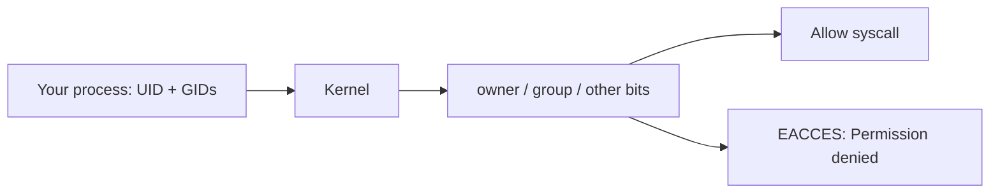

# Month 15 · Week 1 · Day 2
# Users, Groups, and Permission Bits: rwx, Octal, umask, chown, chmod, sudo

**Program:** Full-Stack Mastery · 18 months  
**Phase:** 5 — Production engineering  
**Month index:** [../../README.md](../../README.md)  
**Week 1:** [1](day-01.md) · Day 2 (today) · [3](day-03.md) · [4](day-04.md) · [5](day-05.md) · [6](day-06.md) · [7](day-07.md)  
**Week rhythm today:** Exercises + typed drills (still a teaching day)  
**Student state:** Yesterday you walked the FHS in Ubuntu. Today the tree has **owners**. A path that exists can still refuse you. That refusal is not rudeness. It is the kernel enforcing bits.  
**Study time:** 3–4 focused hours  
**Prereq:** Day 1 gate passed. Ubuntu on WSL2. Bash, not PowerShell.

Labs: `~\fullstack-lab\month-15\week-01\day-02\` inside Ubuntu (`~/fullstack-lab/month-15/week-01/day-02/`). Do not practice `chmod` on `/etc`. Do not paste Project 7.

---

## How to use this textbook

1. Read until you can decode `rwxr-xr-x` and `754` without a converter website.  
2. Type every drill on **files you created**.  
3. If `Permission denied` appears, explain it from owner/group/other **before** you `sudo`.  
4. Optional review links are for later rechecking.

---

## How to read this chapter

A Linux file has **content** and **metadata**. Metadata includes: who owns it, which **group** owns it, and nine **permission bits** (plus extras you will meet only as names today: setuid, sticky bit on `/tmp`). The kernel checks those bits on **open**, **execute**, and **directory search**.



**Wrong belief:** “If I created the file, I can always read it.”  
**Correct:** you can always *try*. If you then `chmod 000` it, your own user is denied until you chmod it back. Ownership and bits are separate knobs.

**Wrong belief:** “`sudo` is how Linux developers work all day.”  
**Correct:** `sudo` is a **controlled, audited promotion** to root for one command. Living as root is how you destroy the lab and, later, a server.

---

## Today's contract

By the end of this day you will be able to:

1. Explain **user**, **group**, **UID**, **GID**.  
2. Decode **symbolic** (`rwx`) and **octal** (`755`) modes for files **and** directories.  
3. Use **`umask`** to predict new-file modes.  
4. Run **`chown`** and **`chmod`** on lab files.  
5. Explain **`sudo`**: who may, what it changes (`EUID`), why a password prompt is not a failure.

**Today's gate.** Closed-book:

> A process has a UID and GIDs. The kernel matches owner, then group, then other. `r` on a file is read; `r` on a directory is list; `x` on a directory is traverse. `chmod 640` is `rw-r-----`. `sudo` runs one command as root. I do not chmod `/etc` to “fix” an app.

---

## Time box

| Block | Minutes | Work |
|---|---|---|
| A | 50 | Theory |
| B | 70 | Type-along: bits, umask, chmod, a denied read |
| C | 65 | Independent drills + written stories |
| D | 15 | Git |
| E | 15 | Recall |

---

# Block A — Theory

## 1. Users are numbers

Login names (`alice`) are for humans. The kernel cares about **UID** (user id) and **GID** (group id) — integers. `root` is UID **0**. Your Ubuntu user is typically UID **1000** on a fresh WSL distro.

```bash
id
id -u
id -g
getent passwd "$(whoami)"
```

`id` prints `uid=`, `gid=` (primary group), and `groups=` (supplementary groups). `getent passwd` reads the account database (usually `/etc/passwd` plus any name service). The passwd line is `name:x:UID:GID:gecos:home:shell`. The `x` means the **hash** lives in `/etc/shadow`, which you cannot read as a normal user — by design.

**Wrong belief:** “`/etc/passwd` holds everyone’s password in the clear.”  
**Correct:** it holds account **records**. Password hashes are in `shadow`, mode `640`, group `shadow`. You will not cat `shadow`. You do not need to.

A **group** is a named GID used to share access among several UIDs without making files world-readable. On a laptop you may barely notice groups. On a server, `www-data` or `postgres` is how a daemon owns its files without being you.

## 2. The nine bits, spoken as letters

`ls -l` shows a mode string like:

```text
-rw-r--r-- 1 you you 123 Aug 16 21:00 notes.md
drwxr-xr-x 2 you you 4096 Aug 16 21:00 scratch
```

First character: `-` file, `d` directory, `l` symlink (and others exist). Then **three triads**:

| Triad | Who |
|---|---|
| Characters 2–4 | **Owner** (UID match) |
| Characters 5–7 | **Group** (GID match, if not owner) |
| Characters 8–10 | **Other** (everyone else) |

Each triad is `r`, `w`, `x`, or `-`.

**On a regular file:**

| Bit | Meaning |
|---|---|
| `r` | open for reading |
| `w` | open for writing / truncate |
| `x` | execute as a program (binary or script with a shebang) |

**On a directory** (this is where juniors fail interviews):

| Bit | Meaning |
|---|---|
| `r` | list names (`ls`) |
| `w` | create, delete, rename entries **in this directory** |
| `x` | **traverse**: use this directory as a path component |

You can have a directory that is `--x` (execute only): you can `cd` through it if you know the child name, but you cannot `ls` it. You can have `r-x`: list and enter, but not create files. Deleting a file requires **write on the directory that contains it**, not write on the file. That surprise is the whole subject of “why can’t I remove this file I don’t own inside a shared folder.”

**Wrong belief:** “`x` on a folder means the folder is a program.”  
**Correct:** `x` on a directory means **search/traverse**. Without it, the kernel will not let you resolve paths through that directory.

The kernel checks **one triad**, not a blend: if you are the owner, **only** owner bits apply — even if group bits are wider. If you are not owner but in the group, **only** group bits apply.

## 3. Octal: the same bits as numbers

Each triad is three bits. In binary: `r=4`, `w=2`, `x=1`. Add them.

| Letters | Sum | Octal digit |
|---|---|---|
| `---` | 0 | 0 |
| `--x` | 1 | 1 |
| `-w-` | 2 | 2 |
| `-wx` | 3 | 3 |
| `r--` | 4 | 4 |
| `r-x` | 5 | 5 |
| `rw-` | 6 | 6 |
| `rwx` | 7 | 7 |

A mode is three digits: owner, group, other.

| Octal | Symbolic (file) | Typical use |
|---|---|---|
| `755` | `rwxr-xr-x` | executable or directory others may traverse |
| `644` | `rw-r--r--` | ordinary file, world-readable |
| `640` | `rw-r-----` | file group may read, others nothing |
| `600` | `rw-------` | only owner (SSH private keys — Day 5) |
| `700` | `rwx------` | only owner, directory |
| `777` | `rwxrwxrwx` | almost always a mistake on a server |

**Wrong belief:** “`chmod 777` is the Linux fix for Permission denied.”  
**Correct:** it is a confession that you did not find the owner. Containers that run as root with `777` volume mounts are how secrets leak. Week 2 will refuse that habit.

## 4. umask: the bits you take away

New files are not born as `777`. The process asks for a mode (often `666` for files, `777` for directories). The **umask** is subtracted (bitwise).

Common umask `022`: write bits for group and other are removed. Files become `644`. Directories become `755`.

Common umask `077`: group and other get nothing. Files `600`, directories `700`.

```bash
umask
umask -S
```

Numeric `0022` is the same idea as `022`. You will **set umask only in the lab directory’s experiments**, then put it back. Do not put `umask 000` in your `~/.bashrc` and walk away.

## 5. chmod and chown

**`chmod`** changes bits. Two spellings:

```bash
chmod 640 notes.md
chmod u=rw,g=r,o= notes.md
chmod u+x script.sh
chmod go-rwx private.env
```

Symbolic `u`/`g`/`o`/`a` with `+` `-` `=` is useful for “add execute for owner” without touching other bits.

**`chown`** changes owner and optionally group:

```bash
chown you:you notes.md
```

A normal user cannot steal a file by chowning it to themselves. Usually **root** runs `chown`. In the lab you will use `sudo chown` only on files inside the lab folder if a drill creates a root-owned file.

**`chgrp`** changes group only. Same caution.

## 6. sudo, root, and the habit

**root** (UID 0) bypasses most permission checks. That is power and a blast radius.

**`sudo`** (substitute user, default to root) reads `/etc/sudoers` (and `sudoers.d`). On Ubuntu Desktop/WSL, your user is typically in group `sudo` and may run commands after **your** password — not root’s password.

```bash
sudo -k
sudo id
```

`sudo id` should show `uid=0(root)`. Then you are back to yourself for the next command. `sudo -i` is a root shell; you do not need it today.

**Wrong belief:** “The password sudo asks for is the root password.”  
**Correct:** it is **your** password, proving it is still you at the keyboard. Root may have no password at all.

**Wrong belief:** “I’ll sudo cat the app logs every time.”  
**Correct:** better: add your user to the right group, or run the service so logs go to stdout (Week 4). `sudo` is a scalpel, not a personality.

Defense only: this chapter does not teach privilege-escalation exploits. If a file is not yours, you do not “bypass” it. You change **your** lab files, or you use sudo **on this WSL machine you own**.

## 7. Sticky bit (name only, so `/tmp` makes sense)

`/tmp` is often `drwxrwxrwt`. The `t` is the **sticky bit**: users can write, but you may only **delete your own** files there. You will not set sticky bits today. You will not chmod `/tmp`.

## 8. Say it — two minutes

Decode `rw-r-----`. What octal is a private SSH key. Directory `x` vs file `x`. Who sudo authenticates. If you stumble, re-read 2–6.

---

# Block B — Type-along

```bash
mkdir -p ~/fullstack-lab/month-15/week-01/day-02
cd ~/fullstack-lab/month-15/week-01/day-02
id
umask
```

Write `WHO.md`: full `id` line; umask; one sentence: UID vs login name.

### Drill 1 — Create and inspect

```bash
echo "readable" > a.txt
echo "secret-ish" > b.txt
mkdir box
ls -l
stat a.txt
```

`stat` prints mode in octal (look for `Access: (`). **Write** the octal for `a.txt` and whether it matches “umask applied to 666.”

### Drill 2 — chmod until ls agrees

```bash
chmod 640 a.txt
ls -l a.txt
chmod u=rw,g=r,o= b.txt
ls -l b.txt
chmod 755 box
ls -ld box
```

`ls -ld` lists the directory itself, not its children.

Create `MODES.md` with a table: filename, `ls -l` triad, octal, English.

### Drill 3 — Deny yourself, then recover

```bash
chmod 000 a.txt
cat a.txt
```

You should see `Permission denied`. You still **own** the file, so:

```bash
chmod 644 a.txt
cat a.txt
```

**Write:** why sudo was unnecessary. This is the antidote to 777.

### Drill 4 — Directory bits

```bash
echo "inside" > box/inside.txt
chmod 111 box
ls box
cat box/inside.txt
```

Predict each. Then run. Typical result: `ls` fails (`r` missing), `cat box/inside.txt` **succeeds** if you still have `x` on `box` and `r` on the file — you knew the name.

```bash
chmod 755 box
ls box
```

Write `DIRBITS.md`: two sentences on `r` vs `x` for directories.

### Drill 5 — umask experiment (restore after)

```bash
umask
umask 077
echo "private" > private.txt
ls -l private.txt
umask 022
echo "normal" > normal.txt
ls -l normal.txt
```

**Write** predicted vs actual modes. Put umask back to what you found at the start of Block B (`022` is common). Confirm:

```bash
umask
```

### Drill 6 — sudo once, on purpose

```bash
sudo id
sudo install -m 644 /dev/null rooty.txt
ls -l rooty.txt
```

`rooty.txt` may be owned by root. Try:

```bash
echo nope >> rooty.txt
```

Then:

```bash
sudo chown "$(whoami):$(whoami)" rooty.txt
echo yes >> rooty.txt
cat rooty.txt
```

**Write:** which operation needed sudo and why. Do not `sudo chmod 777`.

---

# Block C — Independent

### Task 1 — Eight conversions

In `OCTAL.md`, convert both ways (no website):

1. `rwxr-xr-x`  
2. `rw-rw-r--`  
3. `rwx------`  
4. `r-xr-xr-x`  
5. `755`  
6. `640`  
7. `600`  
8. `711`  

### Task 2 — Stories (permission, not exploits)

Write `STORIES.md`. For each, **who is denied**, **which triad**, **fix without 777**:

**S1.** `cat /home/other/notes.txt` → Permission denied. File is `rw-------`, owner `other`.  
**S2.** `ls /srv/app` works; `cat /srv/app/config` fails. File `rw-------`, directory `r-x` for other.  
**S3.** You cannot `cd work`. Directory `rw-r--r--`.  
**S4.** You cannot delete `junk.log` in a directory you do not own, even though the file is yours.  
**S5.** `./run.sh` says permission denied; `ls -l` shows `rw-r--r--`.  

### Task 3 — A group-readable secret file (lab only)

```bash
echo "lab-token-not-real" > lab.secret
chmod 640 lab.secret
ls -l lab.secret
```

Write `SECRET-POLICY.md` (eight lines): why `644` is wrong for secrets; why `777` is worse; what Day 5 will require for `~/.ssh/id_ed25519` (`600`). No real passwords.

### Task 4 — sudoers concept without editing sudoers

Read (no edit):

```bash
ls -l /etc/sudoers
sudo cat /etc/sudoers | head -n 20
```

Write `SUDO.md`: one sentence on `#includedir` / `@includedir` if you see it; one sentence on why you will **not** `chmod` this file. If `sudo cat` fails, write the error and stop — do not force it.

---

# Block D — Git

```bash
cd ~/fullstack-lab
git add month-15/week-01/day-02
git commit -m "Month 15 Day 2: permission drills, octal table, sudo notes."
```

---

# Block E — Recall

1. UID 0 is whom?  
2. Owner vs group vs other — which triad applies if you own the file?  
3. Directory `x`.  
4. `chmod 640` in letters.  
5. umask `022` on a new file (typical).  
6. Why `chmod 000` on your file does not require sudo to undo.  
7. What sudo authenticates.

---

## Office hours

**`chmod: changing permissions of '/etc/passwd': Operation not permitted`.** You typed the wrong path. Lab files only.

**`sudo: no tty` / password loop.** Type the Ubuntu user password; no echo is normal. After three failures, wait and check you are not using your Microsoft password.

**I used `chmod -R 777 ~`.** That is an emergency of your own making. Recursively fix `~/.ssh` later (Day 5: keys `600`, `~/.ssh` `700`). Do not “fix” the rest of the home with 777 either.

**Windows files under `/mnt/c` ignore chmod.** NTFS metadata is not POSIX bits. Another reason labs live in `~/fullstack-lab` on the Linux disk.

---

## Definition of done

- [ ] `MODES.md`, `OCTAL.md`, `STORIES.md`, `DIRBITS.md` exist  
- [ ] You produced `Permission denied` on purpose and recovered **without** 777  
- [ ] umask restored  
- [ ] Gate paragraph spoken closed-book  
- [ ] Commit exists  

---

## Optional review links

- [man chmod (die.net)](https://man7.org/linux/man-pages/man1/chmod.1.html)  
- [man sudo](https://man7.org/linux/man-pages/man8/sudo.8.html)  
- [Debian: File permissions](https://wiki.debian.org/Permissions)  

---

## Tomorrow

**Memory day:** permission stories and FHS from **this week’s recap file**, Days 1–2 closed during drills.
