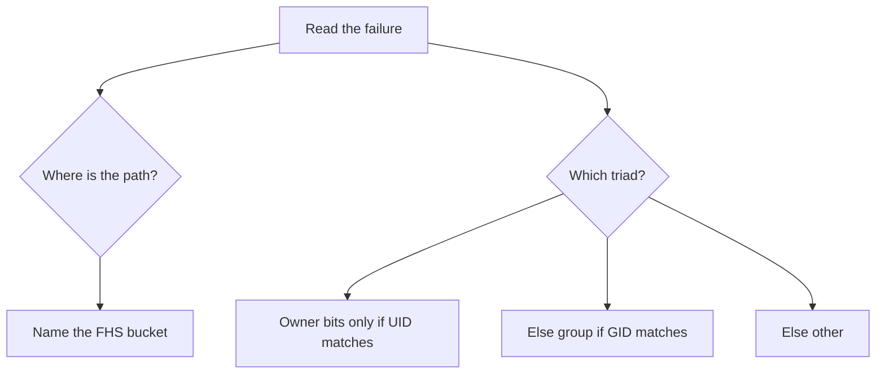

# Month 15 · Week 1 · Day 3
# From Memory: Permission Stories and the FHS

**Program:** Full-Stack Mastery · 18 months  
**Phase:** 5 — Production engineering  
**Month index:** [../../README.md](../../README.md)  
**Week 1:** [1](day-01.md) · [2](day-02.md) · Day 3 (today) · [4](day-04.md) · [5](day-05.md) · [6](day-06.md) · [7](day-07.md)  
**Week rhythm today:** Implement from memory  
**Student state:** Day 2 gate passed. You can walk `/etc` vs `/home` and decode `640`. Today those ideas must still live in your head — from **this file**.  
**Study time:** 3–4 focused hours  
**Prereq:** Day 2 gate passed.

Labs: `~/fullstack-lab/month-15/week-01/day-03/`. Do **not** copy Day 1 `FHS.md` or Day 2 `STORIES.md`. Days 1–2 textbook files stay **closed** during the drills. Bash in Ubuntu.

---

## How Day 3 works

Days 1 and 2 had type-along commands. During the drills they stay **closed**. This file contains a recap so you are not sent to another site to learn.

Allowed:

- The complete explanation in this file  
- Your own notes in `fullstack-lab` (not Day 1–2 textbook files)  
- Terminal output in front of you  

Not allowed:

- Pasting a finished classification from AI  
- Opening Day 1 or Day 2 during Blocks 1–4  
- Browsing FHS or chmod man pages as the teacher during the drill  

If you are stuck **more than 25 minutes** on one task, open **only** the matching Day 1 or Day 2 section **in this textbook**, read it, close it, continue from memory. Record what you had to look up in `lookups.txt`. That list is tomorrow’s repair list.

There is **no answer key in the first half** of this file. You write `STORIES.md` and `FHS-FROM-MEMORY.md` first. A worked box waits at the end for **after** you commit your attempt.

---

## How to read this chapter

A **path** is a name in one tree rooted at `/`. A **permission denial** is the kernel applying **one** triad of bits to **this** process’s UID/GIDs.



**Wrong belief:** “Memory day means I reread Day 1 with the file open.”  
**Correct:** the recap below is the teacher. Days 1–2 are the backup after 25 minutes.

---

## Complete explanation (Linux you must still own)

**Kernel.** Privileged core: CPU, memory, devices, processes, syscalls. **Distro** (Ubuntu): kernel + GNU userland + apt + default layout + systemd. **Shell** (`bash`): reads lines, starts programs. WSL2: a real Linux kernel; Ubuntu userspace on top. Production is Linux because images, docs, and hosts you will use are Linux. PowerShell is not this month’s lab shell. Kubernetes is **not** this month.

**FHS (minimum set).** `/` root of the tree. `/etc` host configuration. `/var` variable data (logs, caches). `/home` people. `/usr` installed programs and libraries (`/usr/bin`). `/tmp` temporary, often sticky. `/opt` optional third-party trees. `/root` root user’s home, not the root of the disk. `/proc` and `/sys` are kernel interfaces, not photo albums. On modern Ubuntu `/bin` may symlink into `/usr`.

**Paths.** Absolute starts with `/`. Relative starts at `pwd`. `.` this directory, `..` parent, `~` home. Case-sensitive. Labs live in Ubuntu `~/fullstack-lab`, not `/mnt/c`, because POSIX bits and Docker performance.

**Commands.** `pwd` where you are. `ls` names here (or a path you give). `ls -l` metadata. `ls -a` dotfiles. `ls -ld dir` the directory inode. `cd` change directory. `cat` print a small file.

**Users.** Names map to **UID**. **GID** is a group. `id` prints them. `root` is UID 0. `/etc/passwd` is account records; hashes live in `/etc/shadow` (you do not cat it).

**Nine bits.** After the type character (`-`/`d`/`l`): owner, group, other — each `rwx`. File `r` read, `w` write, `x` execute. Directory `r` list, `w` create/delete names, `x` **traverse**. The kernel uses **exactly one** triad: owner match wins even if group is wider.

**Octal.** `r=4,w=2,x=1`. `755` = `rwxr-xr-x`. `644` = `rw-r--r--`. `640` = `rw-r-----`. `600` = `rw-------`. `777` is not a fix.

**umask.** Bits removed from default `666` files / `777` dirs. `022` → files `644`. `077` → files `600`.

**chmod / chown.** `chmod 640 file` or symbolic `u+x`. `chown` usually needs root to give files away. Sticky bit on `/tmp`: `t`, delete only your own entries.

**sudo.** One command as root after **your** password. Not a lifestyle. Not an exploit tutorial. Do not chmod `/etc` to soothe an app.

**Wrong belief:** “TestClient taught me permissions.”  
**Correct:** HTTP 403 is application authz (Month 13). `EACCES` is the kernel. Both can say “denied.” They are not the same layer.

**Wrong belief:** “`x` on a directory means run the folder.”  
**Correct:** it means walk through it.

**Windows chmod on `/mnt/c`.** NTFS will lie. Stay on the Linux filesystem for drills.

---

## Today's contract

By the end of this day you will be able to:

1. Place six paths into FHS buckets from memory.  
2. Diagnose five permission stories: triad, directory vs file, fix without 777.  
3. Convert four modes both ways.  
4. Rebuild a tiny permission lab (create, deny, restore) without opening Day 2.

**Today's gate.** Closed-book:

> I can name `/etc` `/var` `/home` `/usr` without a cheatsheet. I can decode `640` and directory `x`. I do not reach for `chmod 777`. I type bash in Ubuntu.

---

## Time box

| Block | Minutes | Work |
|---|---|---|
| 1 | 25 | Speak the recap; write `exam-01.md` |
| 2 | 50 | `FHS-FROM-MEMORY.md` + octal |
| 3 | 45 | Permission stories in `STORIES.md` |
| 4 | 35 | Mini-build: deny and restore |
| 5 | 20 | Only now: compare to the worked box; `DIFF.md` |
| 6 | 20 | Design: app user vs your UID |
| 7 | 15 | Retro + `lookups.txt` |

---

# Block 1 — Speak

No Day 1–2 files. Cover: kernel vs distro; five FHS dirs; nine bits; directory `x`; sudo. Write `exam-01.md` in the lab folder — your words, not a paste of this recap.

```bash
mkdir -p ~/fullstack-lab/month-15/week-01/day-03
cd ~/fullstack-lab/month-15/week-01/day-03
```

---

# Block 2 — FHS and octal from memory

Write `FHS-FROM-MEMORY.md`. For each path: **bucket**, **one example of what belongs**, **one example of what does not**.

**P1.** `/etc/ssh/sshd_config`  
**P2.** `/home/you/fullstack-lab/notes.md`  
**P3.** `/var/log/syslog` (or `journal` — the *idea* of logs)  
**P4.** `/usr/bin/python3`  
**P5.** `/tmp/scratch.txt`  
**P6.** `/root/.bashrc`  

Then `OCTAL.md` — convert, no calculator site:

1. `rw-r-----`  
2. `rwxr-x---`  
3. `600`  
4. `755`  

Write one extra line: default **new file** mode with umask `022`.

---

# Block 3 — Stories (paper; do not attack a real box)

Write `STORIES.md`. For each: **FHS folder if a path is given**, **file vs directory bit**, **which triad**, **fix**.

**T1.** `cd /home/alice/project` fails. `ls -ld /home/alice` shows `drwx------` and you are not alice.  
**T2.** `ls /opt/tool` works. `cat /opt/tool/README` fails. README is `-rw-------` owner `root`.  
**T3.** `rm ./log.txt` fails. `ls -l log.txt` shows you own it `rw-r--r--`. `ls -ld .` shows `drwxr-xr-x` owner `root`.  
**T4.** `./deploy.sh` permission denied. File is `-rw-r--r--`.  
**T5.** Developer “fixes” a container bind mount with `chmod 777` on the host data directory that holds `.env`.  
**T6.** (Trap.) Browser shows 403 on `/admin`. Junior says “Linux permissions.” The API process **does** read the files; FastAPI returned 403 for a member role.

---

# Block 4 — Mini-build from memory

Days 1–2 closed. Recap is enough.

```bash
cd ~/fullstack-lab/month-15/week-01/day-03
mkdir -p mini/box
cd mini
echo "hold-slip" > slip.txt
echo "inside" > box/inside.txt
```

Required outcomes, recorded in `MINI.md` **as you go**:

1. `chmod` `slip.txt` to `640`. Show `ls -l`.  
2. `chmod 000 slip.txt`, show `cat` failing, restore `644` **without sudo**.  
3. `chmod 111 box`, show `ls box` failing, show `cat box/inside.txt` succeeding (you know the name), restore `755`.  
4. `umask 077`, create `quiet.txt`, `ls -l`, restore umask to `022`.  

```bash
umask 022
```

Do not chmod anything outside `mini/`.

---

# Block 5 — Worked box (only after STORIES.md and FHS-FROM-MEMORY.md exist)

Compare. Write `DIFF.md`: three lines you had wrong, or `MATCH.txt` if you nailed it. Then read the box below.

**P1** `/etc` — sshd config for the host. Not a user’s poem.  
**P2** `/home` — your files. Not package binaries.  
**P3** `/var` — logs grow. Not the python interpreter.  
**P4** `/usr` — installed program. Not host sshd config.  
**P5** `/tmp` — disposable. Not the only copy of a thesis.  
**P6** `/root` — root’s home. Not `/` and not `/home/root` on Ubuntu (root’s home is `/root`).

**Octal:** `640`; `750`; `rw-------`; `rwxr-xr-x`. umask `022` → new files typically `644`.

**T1** Directory `x` (and `r`) missing for **other**; you are not owner. Fix: alice must grant traverse (`x`) on `/home/alice` if you are allowed there — not 777 on her whole home. You do not sudo into other people’s homes on a shared box without policy.

**T2** File owner triad is `rw-------`; you are **other**. Directory listing does not imply file read. Fix: `chmod 644` if the README is public, or add your group; not 777.

**T3** Delete needs **write on the directory**, not write on the file. Directory owned by root with no `w` for you. Fix: sudo rm if policy allows, or change directory owner/mode **with care**.

**T4** Missing file `x`. `chmod u+x deploy.sh`.

**T5** World-writable secrets. Fix: owner `600` or `640` with a dedicated group; container user UID aligned (Week 2–3). 777 is the defect.

**T6** **Not** kernel `EACCES`. Application authz. Check logs and tests (Month 14), not `ls -l`.

**Mini keys:** deny-self without sudo; directory `r` vs `x`; umask restored.

---

# Block 6 — Design

`DESIGN.md` (10–15 lines): your FastAPI process in production will **not** run as your laptop UID. Name two files it must read (config, maybe TLS — names only) and one it must **not** read (SSH private key). Which octal would you pick for a `.env` that only the service user should read? Do not paste Project 7.

---

# Block 7 — Retro

`retro.md`: which story was hardest; whether you still wanted 777; FHS path you almost put in `/home`.

```bash
cd ~/fullstack-lab
git add month-15/week-01/day-03
git commit -m "Month 15 Day 3: FHS and permission stories from memory."
```

---

## Office hours

**`cat box/inside.txt` also failed at 111.** Then `inside.txt` itself may not be readable, or you lost `x`. `ls -l box/inside.txt` still needs traverse. Restore, inspect, retry.

**Copied Day 2 STORIES.md.** Delete it. Rewrite from this recap. Copying is not memory.

**Used PowerShell.** Stop. Ubuntu.

---

## Definition of done

- [ ] `FHS-FROM-MEMORY.md` and `STORIES.md` completed **before** the worked box  
- [ ] Mini deny/restore recorded  
- [ ] `DIFF.md` or `MATCH.txt` after the box  
- [ ] `DESIGN.md` uses service-user thinking, no product source  
- [ ] Commit exists  

---

## Optional review links

Repair from this recap first.

- [FHS 3.0](https://www.debian.org/doc/packaging-manuals/fhs/fhs-3.0.html)  
- [chmod(1)](https://man7.org/linux/man-pages/man1/chmod.1.html)  

---

# Lecture: how to read a permission error

When the shell says `Permission denied`, ask four questions in order:

1. **What path?** Type vs directory vs file.  
2. **Who am I?** `id`.  
3. **Who owns the path?** `ls -ld` on the file **and** every parent you traverse.  
4. **Which triad applies?** Owner / group / other — only one.

HTTP 403 is question zero: is this even the kernel? If `cat` works and the browser fails, you are in application land.

Write `HEURISTIC.md` (six lines): your rule. Then go to Block 5 if you have not.

---

## Tomorrow

**Lab:** processes, PID, parents, signals, `ps`, `top`, systemd as a concept, a **user** service. Still not Project 7.
